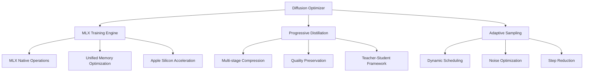

# Design Document

## Overview

The Adaptive Diffusion Model Optimizer with MLX Integration is an intelligent system that optimizes diffusion models during training using MLX for Apple Silicon. The system incorporates progressive distillation, efficient sampling, and hardware-aware optimization to address optimization challenges in latent diffusion models.

## Architecture

### High-Level Architecture



## Components and Interfaces

### MLX Diffusion Optimizer Interface

```python
from pathlib import Path
from typing import Dict, List, Optional, Any
import mlx.core as mx
import mlx.nn as nn
from dataclasses import dataclass

@dataclass
class DiffusionOptimizationConfig:
    model_path: Path
    optimization_stages: int = 3
    target_steps: int = 4  # Reduce from 50 to 4 steps
    quality_threshold: float = 0.95
    apple_silicon_optimization: bool = True

class AdaptiveDiffusionOptimizer:
    """MLX-native diffusion model optimizer."""
    
    def __init__(self, config: DiffusionOptimizationConfig):
        self.config = config
        self.base_model = self._load_base_model()
        self.distillation_manager = ProgressiveDistillation()
        self.sampling_scheduler = AdaptiveScheduler()
        
    def optimize_diffusion_model(self) -> Dict[str, Any]:
        """Execute complete diffusion optimization."""
        pass
        
    def progressive_distillation(self) -> nn.Module:
        """Apply progressive distillation for step reduction."""
        pass
```

### Progressive Distillation Interface

```python
import mlx.core as mx
import mlx.nn as nn

class ProgressiveDistillation:
    """Multi-stage diffusion model distillation."""
    
    def __init__(self):
        self.distillation_stages = []
        
    def create_distillation_stages(
        self,
        teacher_model: nn.Module,
        target_steps: int
    ) -> List[nn.Module]:
        """Create progressive distillation stages."""
        pass
        
    def distill_stage(
        self,
        teacher: nn.Module,
        student: nn.Module,
        stage_config: Dict[str, Any]
    ) -> nn.Module:
        """Distill single stage."""
        pass
```

## Data Models

```python
@dataclass
class OptimizationMetrics:
    original_steps: int
    optimized_steps: int
    quality_score: float
    inference_speedup: float
    memory_reduction: float
    
@dataclass
class DistillationStage:
    stage_number: int
    input_steps: int
    output_steps: int
    teacher_model: nn.Module
    student_model: nn.Module
```

## Testing Strategy

```python
class TestDiffusionOptimization:
    def test_progressive_distillation(self):
        """Test progressive distillation pipeline."""
        pass
        
    def test_sampling_optimization(self):
        """Test adaptive sampling scheduler."""
        pass
        
    def test_mlx_optimization(self):
        """Test MLX-specific optimizations."""
        pass
```
