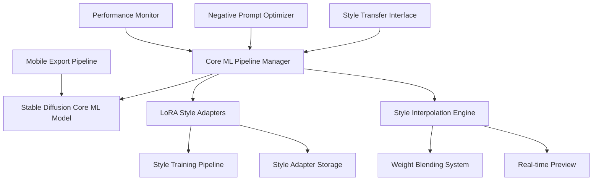

# Design Document

## Overview

The Core ML Stable Diffusion Style Transfer System is designed to leverage Apple's optimized Core ML Stable Diffusion implementation for artistic style transfer and domain-specific image generation. The system focuses on custom LoRA training for artistic styles, efficient inference on Apple Silicon, and mobile-ready deployment capabilities.

## Architecture

### High-Level Architecture



### Core Components

#### 1. Core ML Pipeline Manager

**Purpose**: Orchestrate Core ML Stable Diffusion operations with Apple Silicon optimizations

**Key Features**:

- Apple's pre-optimized Core ML model integration
- Compute unit optimization (CPU + GPU + ANE)
- Memory-efficient pipeline management
- Attention implementation selection (split_einsum vs original)

#### 2. LoRA Style Training System

**Purpose**: Train custom LoRA adapters for specific artistic styles

**Components**:

- Multi-style training pipeline
- Style dataset preprocessing
- Training progress monitoring
- Quality assessment metrics

#### 3. Style Interpolation Engine

**Purpose**: Blend multiple artistic styles with controllable weights

**Features**:

- Real-time style blending
- Weight interpolation algorithms
- Preview generation system
- Style combination persistence

## Components and Interfaces

### Core ML Pipeline Interface

```python
from pathlib import Path
from typing import Dict, List, Optional, Union, Tuple
import coremltools as ct
from python_coreml_stable_diffusion import pipeline
import numpy as np

class CoreMLStableDiffusionPipeline:
    """Apple Silicon optimized Stable Diffusion pipeline."""
    
    def __init__(
        self,
        model_path: Path,
        compute_unit: str = "ALL",
        attention_implementation: str = "SPLIT_EINSUM"
    ):
        self.model_path = model_path
        self.compute_unit = compute_unit
        self.attention_implementation = attention_implementation
        self.pipeline = self._initialize_pipeline()
        self.lora_adapters: Dict[str, Path] = {}
        
    def _initialize_pipeline(self) -> pipeline.StableDiffusionPipeline:
        """Initialize Core ML pipeline with Apple Silicon optimizations."""
        return pipeline.StableDiffusionPipeline(
            str(self.model_path),
            compute_unit=self.compute_unit,
            attention_implementation=self.attention_implementation
        )
        
    def generate_image(
        self,
        prompt: str,
        negative_prompt: Optional[str] = None,
        style_adapters: Optional[List[str]] = None,
        style_weights: Optional[List[float]] = None,
        num_inference_steps: int = 20,
        guidance_scale: float = 7.5
    ) -> np.ndarray:
        """Generate image with optional style adapters."""
        pass
        
    def load_style_adapter(self, style_name: str, adapter_path: Path):
        """Load LoRA style adapter."""
        pass
```

### LoRA Style Training Interface

```python
from dataclasses import dataclass
from typing import List, Dict, Any
import torch
from diffusers import StableDiffusionPipeline, UNet2DConditionModel

@dataclass
class StyleTrainingConfig:
    style_name: str
    dataset_path: Path
    output_path: Path
    base_model: str = "runwayml/stable-diffusion-v1-5"
    lora_rank: int = 4
    learning_rate: float = 1e-4
    num_train_epochs: int = 100
    train_batch_size: int = 1
    resolution: int = 512
    
class LoRAStyleTrainer:
    """LoRA adapter training for artistic styles."""
    
    def __init__(self, config: StyleTrainingConfig):
        self.config = config
        self.base_pipeline = self._load_base_model()
        self.training_dataset = self._prepare_dataset()
        
    def _load_base_model(self) -> StableDiffusionPipeline:
        """Load base Stable Diffusion model."""
        return StableDiffusionPipeline.from_pretrained(
            self.config.base_model,
            torch_dtype=torch.float16,
            use_safetensors=True
        )
        
    def _prepare_dataset(self) -> torch.utils.data.Dataset:
        """Prepare style training dataset."""
        pass
        
    def train_style_adapter(self) -> Dict[str, float]:
        """Train LoRA adapter for specific style."""
        pass
        
    def validate_style_quality(self, test_prompts: List[str]) -> Dict[str, float]:
        """Validate trained style quality."""
        pass
```

### Style Interpolation Interface

```python
from typing import Dict, List, Tuple
import numpy as np

class StyleInterpolationEngine:
    """Real-time style blending and interpolation."""
    
    def __init__(self, pipeline: CoreMLStableDiffusionPipeline):
        self.pipeline = pipeline
        self.loaded_styles: Dict[str, Any] = {}
        self.blend_cache: Dict[str, Any] = {}
        
    def blend_styles(
        self,
        style_names: List[str],
        weights: List[float],
        cache_key: Optional[str] = None
    ) -> Any:
        """Blend multiple styles with specified weights."""
        assert len(style_names) == len(weights)
        assert abs(sum(weights) - 1.0) < 1e-6, "Weights must sum to 1.0"
        
        if cache_key and cache_key in self.blend_cache:
            return self.blend_cache[cache_key]
            
        blended_adapter = self._interpolate_adapters(style_names, weights)
        
        if cache_key:
            self.blend_cache[cache_key] = blended_adapter
            
        return blended_adapter
        
    def _interpolate_adapters(
        self,
        style_names: List[str],
        weights: List[float]
    ) -> Any:
        """Interpolate LoRA adapter weights."""
        pass
        
    def generate_preview(
        self,
        prompt: str,
        style_blend: Any,
        quick_mode: bool = True
    ) -> np.ndarray:
        """Generate quick preview with style blend."""
        steps = 10 if quick_mode else 20
        return self.pipeline.generate_image(
            prompt=prompt,
            num_inference_steps=steps,
            style_adapters=[style_blend]
        )
```

## Data Models

### Style Configuration Models

```python
from dataclasses import dataclass
from pathlib import Path
from typing import List, Dict, Optional

@dataclass
class StyleMetadata:
    name: str
    description: str
    artist: Optional[str]
    training_images: int
    lora_rank: int
    training_steps: int
    quality_score: float
    created_at: str
    
@dataclass
class StyleBlendConfig:
    name: str
    styles: List[str]
    weights: List[float]
    description: Optional[str] = None
    preview_prompt: str = "a beautiful landscape"
    
@dataclass
class GenerationConfig:
    prompt: str
    negative_prompt: Optional[str] = None
    num_inference_steps: int = 20
    guidance_scale: float = 7.5
    width: int = 512
    height: int = 512
    seed: Optional[int] = None
```

### Performance Monitoring Models

```python
@dataclass
class GenerationMetrics:
    inference_time: float
    memory_usage: float
    compute_unit_utilization: Dict[str, float]  # CPU, GPU, ANE
    image_quality_score: Optional[float]
    
@dataclass
class TrainingMetrics:
    epoch: int
    loss: float
    learning_rate: float
    training_time: float
    validation_score: Optional[float]
    sample_images: List[Path]
```

## Error Handling

### Core ML Pipeline Errors

```python
class CoreMLPipelineError(Exception):
    """Base exception for Core ML pipeline errors."""
    pass

class ModelLoadingError(CoreMLPipelineError):
    """Raised when Core ML model loading fails."""
    pass

class ComputeUnitError(CoreMLPipelineError):
    """Raised when compute unit optimization fails."""
    pass

def handle_coreml_errors(func):
    """Decorator for Core ML error handling."""
    def wrapper(*args, **kwargs):
        try:
            return func(*args, **kwargs)
        except ModelLoadingError as e:
            logger.error(f"Model loading failed: {e}")
            # Try fallback model or compute unit
            return fallback_model_loading(*args, **kwargs)
        except ComputeUnitError as e:
            logger.warning(f"Compute unit optimization failed: {e}")
            # Fallback to CPU-only mode
            return cpu_fallback(*args, **kwargs)
    return wrapper
```

### Style Training Error Recovery

```python
class StyleTrainingError(Exception):
    """Base exception for style training errors."""
    pass

class DatasetError(StyleTrainingError):
    """Raised when dataset processing fails."""
    pass

class TrainingPipeline:
    def __init__(self, config: StyleTrainingConfig):
        self.config = config
        self.checkpoint_manager = CheckpointManager(config.output_path)
        
    def train_with_recovery(self):
        """Training with automatic error recovery and checkpointing."""
        try:
            return self._train_loop()
        except DatasetError as e:
            logger.error(f"Dataset error: {e}")
            # Try dataset repair or alternative preprocessing
            return self._repair_and_retry()
        except Exception as e:
            logger.error(f"Training failed: {e}")
            if self.checkpoint_manager.has_checkpoints():
                return self._resume_from_checkpoint()
            else:
                raise e
```

## Testing Strategy

### Unit Testing Framework

```python
import pytest
from unittest.mock import Mock, patch, MagicMock
import numpy as np
from pathlib import Path

class TestCoreMLPipeline:
    @pytest.fixture
    def mock_coreml_pipeline(self):
        """Mock Core ML pipeline for testing."""
        with patch('python_coreml_stable_diffusion.pipeline.StableDiffusionPipeline') as mock:
            mock_instance = MagicMock()
            mock.return_value = mock_instance
            yield mock_instance
            
    @pytest.fixture
    def sample_config(self, tmp_path):
        """Sample configuration for testing."""
        return StyleTrainingConfig(
            style_name="test_style",
            dataset_path=tmp_path / "dataset",
            output_path=tmp_path / "output"
        )
        
    def test_pipeline_initialization(self, mock_coreml_pipeline, tmp_path):
        """Test Core ML pipeline initialization."""
        pipeline = CoreMLStableDiffusionPipeline(
            model_path=tmp_path / "model",
            compute_unit="ALL"
        )
        assert pipeline.compute_unit == "ALL"
        assert pipeline.attention_implementation == "SPLIT_EINSUM"
        
    def test_style_adapter_loading(self, mock_coreml_pipeline, tmp_path):
        """Test LoRA style adapter loading."""
        pipeline = CoreMLStableDiffusionPipeline(tmp_path / "model")
        adapter_path = tmp_path / "style.safetensors"
        adapter_path.touch()  # Create dummy file
        
        pipeline.load_style_adapter("test_style", adapter_path)
        assert "test_style" in pipeline.lora_adapters
```

### Integration Testing

```python
class TestStyleTrainingIntegration:
    def test_end_to_end_style_training(self, sample_dataset, temp_output_dir):
        """Test complete style training pipeline."""
        config = StyleTrainingConfig(
            style_name="integration_test",
            dataset_path=sample_dataset,
            output_path=temp_output_dir,
            num_train_epochs=2  # Short training for testing
        )
        
        trainer = LoRAStyleTrainer(config)
        results = trainer.train_style_adapter()
        
        assert "loss" in results
        assert "training_time" in results
        assert (temp_output_dir / "integration_test.safetensors").exists()
        
    def test_style_interpolation_workflow(self, trained_styles, temp_output_dir):
        """Test style blending and interpolation."""
        pipeline = CoreMLStableDiffusionPipeline(Path("test_model"))
        interpolator = StyleInterpolationEngine(pipeline)
        
        # Load test styles
        for style_name, style_path in trained_styles.items():
            pipeline.load_style_adapter(style_name, style_path)
            
        # Test blending
        blend = interpolator.blend_styles(
            style_names=["style1", "style2"],
            weights=[0.7, 0.3]
        )
        
        # Test preview generation
        preview = interpolator.generate_preview(
            "a beautiful sunset",
            blend,
            quick_mode=True
        )
        
        assert isinstance(preview, np.ndarray)
        assert preview.shape[-1] == 3  # RGB channels
```

### Performance Testing

```python
class TestPerformanceBenchmarks:
    @pytest.mark.benchmark
    def test_inference_speed_benchmark(self, benchmark, coreml_pipeline):
        """Benchmark inference speed on Apple Silicon."""
        def generate_single_image():
            return coreml_pipeline.generate_image(
                "a beautiful landscape",
                num_inference_steps=20
            )
            
        result = benchmark(generate_single_image)
        
        # Assert performance targets for Apple Silicon
        assert result.stats.mean < 30.0  # Under 30 seconds
        
    @pytest.mark.memory
    def test_memory_usage_profiling(self, coreml_pipeline):
        """Profile memory usage during generation."""
        with MemoryProfiler() as profiler:
            for _ in range(5):
                coreml_pipeline.generate_image("test prompt")
                
        profile = profiler.get_profile()
        assert profile.peak_memory < 8 * 1024**3  # Under 8GB
        
    def test_compute_unit_utilization(self, coreml_pipeline):
        """Test compute unit utilization on Apple Silicon."""
        with ComputeUnitMonitor() as monitor:
            coreml_pipeline.generate_image("test prompt")
            
        utilization = monitor.get_utilization()
        assert utilization["ANE"] > 0.1  # ANE should be utilized
        assert utilization["GPU"] > 0.1  # GPU should be utilized
```
