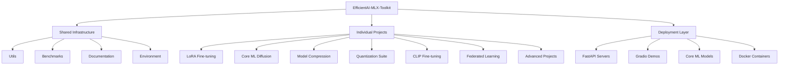

# Design Document

## Overview

The EfficientAI-MLX-Toolkit is designed as a modular, Apple Silicon-optimized machine learning framework that provides a comprehensive suite of tools for model optimization, training, and deployment. The architecture emphasizes modularity, performance optimization, and ease of use while leveraging Apple's hardware-specific optimizations.

## Architecture

### High-Level Architecture



### Package Management Strategy

The toolkit will use `uv` as the primary package manager, replacing all `pip` and `conda` references in the original documentation. This provides:

- Faster dependency resolution
- Better virtual environment management
- Improved reproducibility
- Native Python packaging support

### File Management Strategy

All file operations will use `pathlib` for:

- Cross-platform compatibility
- Object-oriented file handling
- Better path manipulation
- Type safety and IDE support

## Components and Interfaces

### Core Infrastructure Components

#### 1. Shared Utilities (`utils/`)

**Purpose**: Provide common functionality across all projects

**Key Modules**:

- `logging_utils.py`: Centralized logging configuration
- `config_manager.py`: Configuration management using pathlib
- `benchmark_runner.py`: Standardized benchmarking framework
- `global_plotting.py`: Common visualization utilities

**Interface**:

```python
from pathlib import Path
from utils.config_manager import ConfigManager
from utils.benchmark_runner import BenchmarkRunner

config = ConfigManager(Path("config.yaml"))
benchmark = BenchmarkRunner(config)
```

#### 2. Environment Management (`environment/`)

**Purpose**: Manage dependencies and environment setup

**Key Files**:

- `pyproject.toml`: Main project configuration using uv
- `requirements.txt`: Core dependencies
- `setup_scripts.sh`: Automated setup for Apple Silicon

#### 3. Benchmarking Framework (`benchmarks/`)

**Purpose**: Standardized performance evaluation

**Components**:

- Performance measurement utilities
- Memory usage tracking
- Hardware-specific benchmarks
- Comparative analysis tools

### Individual Project Architecture

Each project follows a standardized structure:

```bash
projects/XX_ProjectName/
├── README.md
├── pyproject.toml          # uv-based project config
├── src/
│   ├── __init__.py
│   ├── main.py            # Entry point
│   ├── models/            # Model definitions
│   ├── training/          # Training logic
│   ├── inference/         # Inference utilities
│   └── utils/             # Project-specific utilities
├── tests/
├── notebooks/
└── data/
```

### Deployment Architecture

#### 1. API Layer

**FastAPI Integration**:

- Standardized API templates
- Apple Silicon-optimized serving
- Automatic model loading and caching
- Health checks and monitoring

#### 2. Demo Applications

**Gradio/Streamlit Apps**:

- Interactive model demonstrations
- Real-time performance monitoring
- User-friendly interfaces for non-technical users

#### 3. Model Export

**Multi-format Support**:

- Core ML for iOS/macOS deployment
- ONNX for cross-platform compatibility
- TensorFlow Lite for mobile deployment

## Data Models

### Configuration Model

```python
from pathlib import Path
from dataclasses import dataclass
from typing import Dict, List, Optional

@dataclass
class ProjectConfig:
    name: str
    version: str
    dependencies: List[str]
    apple_silicon_optimized: bool
    benchmark_enabled: bool
    deployment_targets: List[str]

@dataclass
class BenchmarkConfig:
    metrics: List[str]
    hardware_profiles: List[str]
    output_formats: List[str]
    comparison_baselines: List[str]

@dataclass
class DeploymentConfig:
    api_enabled: bool
    demo_enabled: bool
    export_formats: List[str]
    docker_enabled: bool
```

### Model Metadata

```python
@dataclass
class ModelMetadata:
    name: str
    architecture: str
    parameters: int
    optimization_techniques: List[str]
    apple_silicon_optimized: bool
    memory_requirements: Dict[str, float]
    performance_metrics: Dict[str, float]
```

## Error Handling

### Centralized Error Management

**Error Categories**:

1. **Hardware Compatibility Errors**: Apple Silicon detection and optimization failures
2. **Dependency Errors**: Package installation and compatibility issues
3. **Model Loading Errors**: Model file corruption or incompatibility
4. **Training Errors**: Training pipeline failures and resource constraints
5. **Deployment Errors**: API serving and model export failures

**Error Handling Strategy**:

```python
from pathlib import Path
import logging
from typing import Optional

class ToolkitError(Exception):
    """Base exception for toolkit errors"""
    pass

class HardwareCompatibilityError(ToolkitError):
    """Raised when Apple Silicon optimizations fail"""
    pass

class ModelLoadingError(ToolkitError):
    """Raised when model loading fails"""
    pass

def handle_error(error: Exception, context: str) -> Optional[str]:
    """Centralized error handling with logging"""
    logger = logging.getLogger(__name__)
    
    if isinstance(error, HardwareCompatibilityError):
        logger.error(f"Hardware compatibility issue in {context}: {error}")
        return "fallback_cpu_mode"
    elif isinstance(error, ModelLoadingError):
        logger.error(f"Model loading failed in {context}: {error}")
        return "retry_with_backup"
    else:
        logger.error(f"Unexpected error in {context}: {error}")
        raise error
```

## Testing Strategy

### Multi-Level Testing Approach

#### 1. Unit Testing

- Individual component testing
- Mock Apple Silicon hardware when needed
- Pathlib-based file operation testing
- Configuration validation testing

#### 2. Integration Testing

- Cross-project compatibility testing
- Shared utility integration testing
- Benchmark framework validation
- API endpoint testing

#### 3. Performance Testing

- Apple Silicon optimization validation
- Memory usage profiling
- Training speed benchmarks
- Inference latency measurements

#### 4. End-to-End Testing

- Complete workflow validation
- Deployment pipeline testing
- Demo application functionality
- Cross-platform compatibility

### Testing Infrastructure

```python
import pytest
from pathlib import Path
from unittest.mock import Mock, patch

class TestInfrastructure:
    @pytest.fixture
    def temp_project_dir(self, tmp_path):
        """Create temporary project directory structure"""
        project_dir = tmp_path / "test_project"
        project_dir.mkdir()
        (project_dir / "src").mkdir()
        (project_dir / "tests").mkdir()
        return project_dir
    
    @pytest.fixture
    def mock_apple_silicon(self):
        """Mock Apple Silicon hardware detection"""
        with patch('platform.processor', return_value='arm'):
            with patch('platform.machine', return_value='arm64'):
                yield True

    def test_pathlib_usage(self, temp_project_dir):
        """Ensure all file operations use pathlib"""
        config_path = temp_project_dir / "config.yaml"
        assert isinstance(config_path, Path)
        assert config_path.exists() or not config_path.exists()  # Valid pathlib operation
```

### Continuous Integration

**GitHub Actions Workflow**:

- Apple Silicon runner support
- uv-based dependency installation
- Multi-project testing
- Performance regression detection
- Documentation generation and validation
