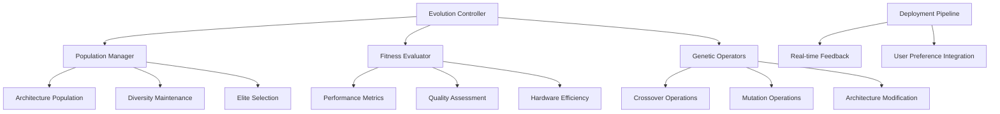

# Design Document

## Overview

The Self-Improving Diffusion Architecture with Evolutionary Search uses evolutionary algorithms and neural architecture search to continuously improve diffusion model architectures. The system focuses on automated architecture evolution, hardware-aware optimization, and real-time adaptation based on deployment performance metrics.

## Architecture

### High-Level Architecture



## Components and Interfaces

### Evolutionary Search Controller Interface

```python
from pathlib import Path
from typing import Dict, List, Optional, Any, Tuple
from dataclasses import dataclass
import torch
import torch.nn as nn
from enum import Enum

class ArchitectureComponent(Enum):
    ATTENTION_BLOCK = "attention"
    CONV_BLOCK = "conv"
    RESIDUAL_BLOCK = "residual"
    NORMALIZATION = "norm"
    ACTIVATION = "activation"

@dataclass
class ArchitectureGenome:
    layers: List[Dict[str, Any]]
    connections: List[Tuple[int, int]]
    parameters: Dict[str, Any]
    fitness_score: float = 0.0
    generation: int = 0

class EvolutionaryDiffusionSearch:
    """Evolutionary search for diffusion architectures."""
    
    def __init__(self, population_size: int = 50):
        self.population_size = population_size
        self.population = self._initialize_population()
        self.fitness_evaluator = PerformanceEvaluator()
        self.genetic_operators = GeneticOperators()
        self.deployment_manager = DeploymentManager()
        
    def evolve_generation(self) -> List[ArchitectureGenome]:
        """Evolve one generation of architectures."""
        pass
        
    def evaluate_fitness(
        self,
        genome: ArchitectureGenome
    ) -> Dict[str, float]:
        """Evaluate architecture fitness."""
        pass
```

### Genetic Operators Interface

```python
import random
from typing import List, Tuple

class GeneticOperators:
    """Genetic operators for architecture evolution."""
    
    def __init__(self, mutation_rate: float = 0.1, crossover_rate: float = 0.8):
        self.mutation_rate = mutation_rate
        self.crossover_rate = crossover_rate
        
    def crossover(
        self,
        parent1: ArchitectureGenome,
        parent2: ArchitectureGenome
    ) -> Tuple[ArchitectureGenome, ArchitectureGenome]:
        """Crossover two parent architectures."""
        pass
        
    def mutate(self, genome: ArchitectureGenome) -> ArchitectureGenome:
        """Mutate architecture genome."""
        pass
        
    def selection(
        self,
        population: List[ArchitectureGenome],
        fitness_scores: List[float],
        selection_size: int
    ) -> List[ArchitectureGenome]:
        """Select parents for next generation."""
        pass
```

## Data Models

```python
@dataclass
class EvolutionMetrics:
    generation: int
    best_fitness: float
    average_fitness: float
    diversity_score: float
    convergence_rate: float
    
@dataclass
class DeploymentFeedback:
    architecture_id: str
    user_ratings: List[float]
    performance_metrics: Dict[str, float]
    deployment_success: bool
    error_logs: List[str]
```

## Testing Strategy

```python
class TestEvolutionarySearch:
    def test_genetic_operators(self):
        """Test crossover and mutation operations."""
        pass
        
    def test_fitness_evaluation(self):
        """Test architecture fitness evaluation."""
        pass
        
    def test_evolution_convergence(self):
        """Test evolutionary algorithm convergence."""
        pass
```
