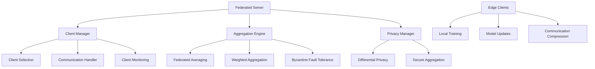

# Design Document

## Overview

The Federated Learning System for Lightweight Models coordinates multiple edge clients with efficient communication and model synchronization. The system emphasizes privacy-preserving learning, efficient communication protocols, and robust aggregation methods suitable for edge deployment scenarios.

## Architecture

### High-Level Architecture



## Components and Interfaces

### Federated Server Interface

```python
from pathlib import Path
from typing import Dict, List, Optional, Any
from dataclasses import dataclass
import torch
import torch.nn as nn

@dataclass
class FederatedConfig:
    num_clients: int = 10
    clients_per_round: int = 5
    num_rounds: int = 100
    local_epochs: int = 5
    learning_rate: float = 0.01
    privacy_budget: float = 1.0
    compression_ratio: float = 0.1

class FederatedServer:
    """Main federated learning server."""
    
    def __init__(self, config: FederatedConfig, model_factory: callable):
        self.config = config
        self.global_model = model_factory()
        self.client_manager = ClientManager(config)
        self.aggregator = FederatedAggregator()
        self.privacy_manager = PrivacyManager(config.privacy_budget)
        
    def train_federated(self) -> Dict[str, Any]:
        """Execute federated training rounds."""
        pass
        
    def aggregate_updates(self, client_updates: List[Dict]) -> Dict[str, torch.Tensor]:
        """Aggregate client model updates."""
        pass
```

### Privacy Manager Interface

```python
import torch
import numpy as np
from typing import Dict, List, Tuple

class PrivacyManager:
    """Differential privacy and secure aggregation."""
    
    def __init__(self, privacy_budget: float = 1.0):
        self.privacy_budget = privacy_budget
        self.noise_multiplier = self._calculate_noise_multiplier()
        
    def add_noise_to_gradients(
        self,
        gradients: Dict[str, torch.Tensor],
        sensitivity: float = 1.0
    ) -> Dict[str, torch.Tensor]:
        """Add calibrated noise for differential privacy."""
        noisy_gradients = {}
        for name, grad in gradients.items():
            noise = torch.normal(
                mean=0.0,
                std=self.noise_multiplier * sensitivity,
                size=grad.shape,
                device=grad.device
            )
            noisy_gradients[name] = grad + noise
        return noisy_gradients
        
    def secure_aggregation(
        self,
        client_updates: List[Dict[str, torch.Tensor]]
    ) -> Dict[str, torch.Tensor]:
        """Secure multi-party aggregation."""
        pass
```

## Data Models

```python
@dataclass
class ClientUpdate:
    client_id: str
    model_parameters: Dict[str, torch.Tensor]
    num_samples: int
    training_loss: float
    training_time: float
    
@dataclass
class FederatedMetrics:
    round_number: int
    global_accuracy: float
    communication_cost: float
    privacy_spent: float
    convergence_rate: float
```

## Testing Strategy

```python
class TestFederatedLearning:
    def test_federated_averaging(self):
        """Test federated averaging algorithm."""
        pass
        
    def test_privacy_preservation(self):
        """Test differential privacy mechanisms."""
        pass
        
    def test_byzantine_robustness(self):
        """Test robustness against malicious clients."""
        pass
```
