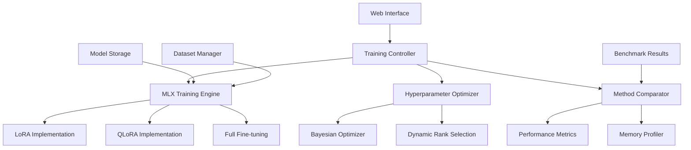

# Design Document

## Overview

The MLX-Native LoRA Fine-Tuning Framework is designed as a comprehensive Parameter-Efficient Fine-Tuning (PEFT) system that leverages Apple's MLX framework for optimal performance on Apple Silicon. The system provides automated hyperparameter optimization, multi-method comparison capabilities, and an interactive web interface, all optimized for Apple Silicon's unified memory architecture.

## Architecture

### High-Level Architecture



### Core Components

#### 1. MLX Training Engine

**Purpose**: Core training functionality optimized for Apple Silicon

**Key Features**:

- Native MLX operations for 3-5x performance improvement
- Unified memory optimization
- Dynamic batch sizing based on available memory
- Mixed precision training support

#### 2. PEFT Method Implementations

**Purpose**: Multiple PEFT method implementations for comparison

**Supported Methods**:

- LoRA (Low-Rank Adaptation)
- QLoRA (Quantized LoRA)
- Full fine-tuning baseline

#### 3. Hyperparameter Optimization System

**Purpose**: Automated optimization of training parameters

**Components**:

- Bayesian optimization for efficient search
- Dynamic LoRA rank selection
- Memory-aware batch size optimization
- Learning rate scheduling

## Components and Interfaces

### Training Controller Interface

```python
from pathlib import Path
from typing import Dict, List, Optional, Union
import mlx.core as mx
from dataclasses import dataclass

@dataclass
class TrainingConfig:
    model_name: str
    dataset_path: Path
    output_path: Path
    method: str  # "lora", "qlora", "full"
    max_iters: int = 1000
    batch_size: Optional[int] = None  # Auto-determined if None
    learning_rate: float = 1e-4
    lora_rank: Optional[int] = None  # Auto-optimized if None
    lora_alpha: float = 16.0
    optimization_level: int = 2

class MLXTrainingController:
    """Main controller for MLX-optimized fine-tuning."""
    
    def __init__(self, config: TrainingConfig):
        self.config = config
        self.device_info = self._detect_hardware()
        self.memory_manager = MemoryManager(self.device_info)
        
    def train(self) -> Dict[str, float]:
        """Execute training with Apple Silicon optimizations."""
        pass
        
    def compare_methods(self, methods: List[str]) -> Dict[str, Dict[str, float]]:
        """Compare multiple PEFT methods."""
        pass
```

### MLX Training Engine Interface

```python
import mlx.core as mx
import mlx.nn as nn
from mlx_lm import load, generate

class MLXLoRATrainer:
    """MLX-native LoRA implementation."""
    
    def __init__(self, model_path: str, lora_config: Dict):
        self.model, self.tokenizer = load(model_path)
        self.lora_config = lora_config
        self._setup_lora_layers()
        
    def _setup_lora_layers(self):
        """Initialize LoRA layers with MLX operations."""
        for name, module in self.model.named_modules():
            if isinstance(module, nn.Linear) and self._should_adapt(name):
                self._add_lora_layer(name, module)
                
    def forward_with_lora(self, x: mx.array) -> mx.array:
        """Forward pass with LoRA adaptations."""
        pass
        
    def train_step(self, batch: Dict[str, mx.array]) -> Dict[str, float]:
        """Single training step with MLX optimizations."""
        pass
```

### Hyperparameter Optimizer Interface

```python
from sklearn.gaussian_process import GaussianProcessRegressor
from sklearn.gaussian_process.kernels import Matern

class BayesianHyperparameterOptimizer:
    """Bayesian optimization for hyperparameter tuning."""
    
    def __init__(self, search_space: Dict[str, tuple]):
        self.search_space = search_space
        self.gp = GaussianProcessRegressor(kernel=Matern(nu=2.5))
        self.history = []
        
    def suggest_parameters(self) -> Dict[str, Union[int, float]]:
        """Suggest next hyperparameter configuration."""
        pass
        
    def update_results(self, params: Dict, performance: float):
        """Update optimizer with training results."""
        pass
        
    def optimize_lora_rank(self, dataset_complexity: float) -> int:
        """Automatically determine optimal LoRA rank."""
        pass
```

## Data Models

### Training Configuration Model

```python
from dataclasses import dataclass
from pathlib import Path
from typing import Optional, Dict, Any

@dataclass
class LoRAConfig:
    rank: int = 8
    alpha: float = 16.0
    dropout: float = 0.1
    target_modules: List[str] = None
    
@dataclass
class TrainingMetrics:
    loss: float
    perplexity: float
    training_time: float
    memory_usage: float
    tokens_per_second: float
    
@dataclass
class ModelCheckpoint:
    path: Path
    iteration: int
    metrics: TrainingMetrics
    config: TrainingConfig
    timestamp: str
```

### Hardware Configuration Model

```python
@dataclass
class HardwareInfo:
    device_type: str  # "m1", "m2", "cpu"
    total_memory: int  # in GB
    available_memory: int  # in GB
    metal_available: bool
    mps_available: bool
    optimization_level: int
    
@dataclass
class MemoryProfile:
    peak_memory: float
    average_memory: float
    memory_efficiency: float
    batch_size_recommendation: int
```

## Error Handling

### Hardware Compatibility Errors

```python
class MLXCompatibilityError(Exception):
    """Raised when MLX optimizations are not available."""
    pass

class MemoryConstraintError(Exception):
    """Raised when memory requirements exceed available resources."""
    pass

def handle_training_errors(func):
    """Decorator for graceful error handling in training."""
    def wrapper(*args, **kwargs):
        try:
            return func(*args, **kwargs)
        except MLXCompatibilityError:
            logger.warning("MLX not available, falling back to PyTorch MPS")
            return fallback_to_mps(*args, **kwargs)
        except MemoryConstraintError as e:
            logger.warning(f"Memory constraint: {e}, reducing batch size")
            return retry_with_smaller_batch(*args, **kwargs)
    return wrapper
```

### Training Pipeline Error Recovery

```python
class TrainingPipeline:
    def __init__(self, config: TrainingConfig):
        self.config = config
        self.checkpoint_manager = CheckpointManager(config.output_path)
        
    def train_with_recovery(self):
        """Training with automatic error recovery."""
        try:
            return self._train_loop()
        except Exception as e:
            logger.error(f"Training failed: {e}")
            if self.checkpoint_manager.has_checkpoints():
                logger.info("Attempting recovery from checkpoint")
                return self._recover_from_checkpoint()
            else:
                raise e
```

## Testing Strategy

### Unit Testing Framework

```python
import pytest
from unittest.mock import Mock, patch
from pathlib import Path

class TestMLXLoRATrainer:
    @pytest.fixture
    def mock_mlx_model(self):
        """Mock MLX model for testing."""
        with patch('mlx_lm.load') as mock_load:
            mock_model = Mock()
            mock_tokenizer = Mock()
            mock_load.return_value = (mock_model, mock_tokenizer)
            yield mock_model, mock_tokenizer
            
    @pytest.fixture
    def temp_config(self, tmp_path):
        """Temporary configuration for testing."""
        return TrainingConfig(
            model_name="test-model",
            dataset_path=tmp_path / "data",
            output_path=tmp_path / "output",
            method="lora"
        )
        
    def test_lora_layer_initialization(self, mock_mlx_model, temp_config):
        """Test LoRA layer setup."""
        trainer = MLXLoRATrainer("test-model", {"rank": 8})
        assert trainer.lora_config["rank"] == 8
        
    @patch('mlx.metal.is_available', return_value=True)
    def test_apple_silicon_optimization(self, mock_metal, temp_config):
        """Test Apple Silicon optimization detection."""
        controller = MLXTrainingController(temp_config)
        assert controller.device_info.metal_available == True
```

### Integration Testing

```python
class TestTrainingIntegration:
    def test_end_to_end_training(self, sample_dataset, temp_output_dir):
        """Test complete training pipeline."""
        config = TrainingConfig(
            model_name="microsoft/DialoGPT-small",
            dataset_path=sample_dataset,
            output_path=temp_output_dir,
            method="lora",
            max_iters=10  # Short training for testing
        )
        
        controller = MLXTrainingController(config)
        results = controller.train()
        
        assert "loss" in results
        assert "training_time" in results
        assert results["loss"] > 0
        
    def test_method_comparison(self, sample_dataset, temp_output_dir):
        """Test PEFT method comparison."""
        config = TrainingConfig(
            model_name="microsoft/DialoGPT-small",
            dataset_path=sample_dataset,
            output_path=temp_output_dir,
            method="lora",
            max_iters=5
        )
        
        controller = MLXTrainingController(config)
        results = controller.compare_methods(["lora", "qlora"])
        
        assert "lora" in results
        assert "qlora" in results
        assert all("loss" in method_results for method_results in results.values())
```

### Performance Testing

```python
class TestPerformanceBenchmarks:
    @pytest.mark.benchmark
    def test_training_speed_benchmark(self, benchmark, sample_config):
        """Benchmark training speed on Apple Silicon."""
        controller = MLXTrainingController(sample_config)
        
        def train_single_epoch():
            return controller.train_single_epoch()
            
        result = benchmark(train_single_epoch)
        
        # Assert performance targets
        assert result["tokens_per_second"] > 100  # Minimum performance
        
    @pytest.mark.memory
    def test_memory_usage_profiling(self, sample_config):
        """Profile memory usage during training."""
        controller = MLXTrainingController(sample_config)
        
        with MemoryProfiler() as profiler:
            controller.train()
            
        profile = profiler.get_profile()
        assert profile.peak_memory < 14 * 1024**3  # Under 14GB for 7B model
```
