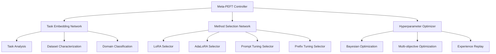

# Design Document

## Overview

The Meta-Learning PEFT System with MLX is a framework that automatically selects and configures the best Parameter-Efficient Fine-Tuning method for any given task. The system uses meta-learning to learn from previous fine-tuning experiences and provides intelligent method selection, automated hyperparameter optimization, and cross-task knowledge transfer.

## Architecture

### High-Level Architecture



## Components and Interfaces

### Meta-Learning Controller Interface

```python
from pathlib import Path
from typing import Dict, List, Optional, Any, Tuple
from dataclasses import dataclass
from enum import Enum
import torch
import torch.nn as nn

class PEFTMethod(Enum):
    LORA = "lora"
    ADALORA = "adalora"
    PROMPT_TUNING = "prompt_tuning"
    PREFIX_TUNING = "prefix_tuning"
    P_TUNING = "p_tuning"

@dataclass
class TaskCharacteristics:
    dataset_size: int
    sequence_length: int
    vocabulary_size: int
    domain: str
    task_type: str
    complexity_score: float

class MetaPEFTSystem:
    """Meta-learning system for PEFT method selection."""
    
    def __init__(self):
        self.task_embedder = TaskEmbeddingNetwork()
        self.method_selector = MethodSelectionNetwork()
        self.hyperparameter_optimizer = MetaHyperparameterOptimizer()
        self.experience_buffer = ExperienceBuffer()
        
    def predict_optimal_method(
        self,
        task_characteristics: TaskCharacteristics
    ) -> Tuple[PEFTMethod, Dict[str, Any]]:
        """Predict optimal PEFT method and hyperparameters."""
        pass
        
    def learn_from_experience(
        self,
        task_characteristics: TaskCharacteristics,
        method_used: PEFTMethod,
        hyperparameters: Dict[str, Any],
        performance_metrics: Dict[str, float]
    ):
        """Learn from fine-tuning experience."""
        pass
```

### Task Embedding Network Interface

```python
import torch
import torch.nn as nn
from typing import Dict, Any

class TaskEmbeddingNetwork(nn.Module):
    """Neural network for task embedding."""
    
    def __init__(self, embedding_dim: int = 128):
        super().__init__()
        self.embedding_dim = embedding_dim
        self.feature_encoder = self._build_encoder()
        
    def _build_encoder(self) -> nn.Module:
        """Build task feature encoder."""
        return nn.Sequential(
            nn.Linear(10, 64),  # 10 task features
            nn.ReLU(),
            nn.Linear(64, 128),
            nn.ReLU(),
            nn.Linear(128, self.embedding_dim)
        )
        
    def forward(self, task_features: torch.Tensor) -> torch.Tensor:
        """Encode task into embedding vector."""
        return self.feature_encoder(task_features)
        
    def extract_task_features(
        self,
        task_characteristics: TaskCharacteristics
    ) -> torch.Tensor:
        """Extract numerical features from task characteristics."""
        features = torch.tensor([
            task_characteristics.dataset_size,
            task_characteristics.sequence_length,
            task_characteristics.vocabulary_size,
            task_characteristics.complexity_score,
            # Add more features as needed
        ], dtype=torch.float32)
        return features
```

## Data Models

```python
@dataclass
class PEFTExperience:
    task_embedding: torch.Tensor
    method_used: PEFTMethod
    hyperparameters: Dict[str, Any]
    performance_metrics: Dict[str, float]
    training_time: float
    memory_usage: float
    
@dataclass
class MethodRecommendation:
    method: PEFTMethod
    confidence: float
    hyperparameters: Dict[str, Any]
    expected_performance: Dict[str, float]
    reasoning: str
```

## Testing Strategy

```python
class TestMetaPEFTSystem:
    def test_task_embedding(self):
        """Test task embedding generation."""
        pass
        
    def test_method_selection(self):
        """Test PEFT method selection."""
        pass
        
    def test_hyperparameter_optimization(self):
        """Test meta-learned hyperparameter optimization."""
        pass
```
