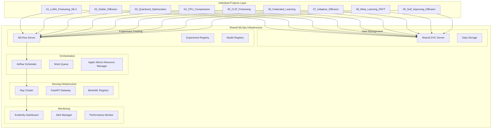

# MLOps Integration Design Document

## Overview

This design outlines the integration of modern MLOps tools (DVC, MLFlow, Airflow, FastAPI/Ray/BentoML, and Evidently) as shared infrastructure components within the EfficientAI-MLX-Toolkit. The integration creates a centralized, production-ready MLOps platform that serves all 9 individual projects while leveraging Apple Silicon optimizations throughout.

The design follows a shared infrastructure approach where MLOps tools are deployed once and serve all individual projects, ensuring consistency, reducing resource overhead, and providing unified management. Each individual project connects to and utilizes the shared MLOps services while maintaining project-specific configurations and data isolation.

## Architecture

### High-Level Architecture



### Component Integration Flow

1. **Shared Data Pipeline**: Individual projects → Shared DVC → Centralized data storage → MLX processing
2. **Unified Experiment Tracking**: All projects → Shared MLFlow server → Centralized experiment registry
3. **Centralized Orchestration**: Shared Airflow → Multi-project workflows → Apple Silicon resource management
4. **Unified Serving**: All project models → Shared Ray cluster → Centralized API gateway → Load balancing
5. **Consolidated Monitoring**: All deployments → Shared Evidently → Unified dashboard → Cross-project alerts

### Shared Infrastructure Benefits

- **Resource Efficiency**: Single MLFlow server, Airflow instance, and Ray cluster serve all projects
- **Unified Management**: One dashboard to monitor all 9 projects
- **Consistent Configuration**: Standardized MLOps setup across all projects
- **Cross-Project Analytics**: Compare performance and experiments across different project types
- **Simplified Maintenance**: Update MLOps tools once for all projects

## Components and Interfaces

### 1. Shared Data Versioning Layer (DVC)

**Purpose**: Centralized version control for datasets, model artifacts, and experiment configurations across all individual projects.

**Apple Silicon Optimizations**:

- Unified memory-aware data loading for all projects
- Optimized file I/O for Apple Silicon storage with shared caching
- Integration with MLX data loaders across project boundaries

**Key Components**:

```python
# shared/mlops/data_versioning/dvc_manager.py
class SharedDVCManager:
    def __init__(self, shared_storage_path: Path, remote_storage: Optional[str] = None):
        self.shared_storage_path = shared_storage_path
        self.dvc_repo = dvc.Repo(shared_storage_path)
        self.remote_storage = remote_storage
        self.project_registry = {}

    def register_project(self, project_name: str, project_path: Path):
        """Register an individual project with the shared DVC system"""

    def track_dataset(self, project_name: str, data_path: Path) -> str:
        """Track dataset for a specific project with shared storage"""

    def track_model(self, project_name: str, model_path: Path, metadata: Dict) -> str:
        """Track model artifacts with project isolation and Apple Silicon metadata"""

    def load_data_version(self, project_name: str, version_hash: str) -> Path:
        """Load specific data version for a project, optimized for MLX"""

    def get_cross_project_datasets(self) -> Dict[str, List[str]]:
        """Get datasets that can be shared across projects"""
```

**Shared Configuration**:

```yaml
# shared/mlops/config/dvc.yaml
core:
    remote: shared-apple-silicon-storage

remotes:
    shared-apple-silicon-storage:
        url: s3://mlx-toolkit-shared-data

cache:
    type: symlink
    shared: true  # Enable cross-project cache sharing

projects:
    lora-finetuning:
        path: projects/01_LoRA_Finetuning_MLX
    stable-diffusion:
        path: projects/02_Stable_Diffusion
    # ... other projects
```

### 2. Shared Experiment Tracking Layer (MLFlow)

**Purpose**: Centralized experiment tracking and model registry serving all individual projects with unified analytics.

**Apple Silicon Optimizations**:

- Custom metrics for MLX performance across all projects
- Hardware utilization tracking with cross-project comparison
- Unified model registry with Apple Silicon compatibility metadata

**Key Components**:

```python
# shared/mlops/experiment_tracking/mlflow_manager.py
class SharedMLFlowManager:
    def __init__(self, tracking_uri: str, shared_registry_uri: str):
        self.tracking_uri = tracking_uri
        self.registry_uri = shared_registry_uri
        self.client = mlflow.tracking.MlflowClient(tracking_uri)
        self.hardware_info = self._detect_apple_silicon()

    def create_project_experiment(self, project_name: str) -> str:
        """Create experiment namespace for an individual project"""

    def start_run(self, project_name: str, run_name: str) -> mlflow.ActiveRun:
        """Start MLFlow run with project context and Apple Silicon info"""

    def log_cross_project_comparison(self, baseline_project: str,
                                   comparison_project: str, metrics: Dict):
        """Log comparison metrics between different projects"""

    def register_model_with_project_context(self, project_name: str,
                                          model_name: str, model_uri: str):
        """Register model in shared registry with project tagging"""

    def get_project_leaderboard(self, project_name: str) -> pd.DataFrame:
        """Get performance leaderboard for a specific project"""

    def get_cross_project_analytics(self) -> Dict[str, Any]:
        """Get analytics comparing performance across all projects"""
```

**Shared MLFlow Configuration**:

```python
# shared/mlops/config/mlflow_config.py
SHARED_MLFLOW_CONFIG = {
    "tracking_uri": "http://localhost:5000",
    "registry_uri": "sqlite:///shared/mlops/mlflow/registry.db",
    "artifact_root": "shared/mlops/mlflow/artifacts",
    "experiments": {
        "lora-finetuning": "01_LoRA_Finetuning_MLX",
        "stable-diffusion": "02_Stable_Diffusion",
        "quantized-optimization": "03_Quantized_Optimization",
        # ... other projects
    },
    "apple_silicon_metrics": [
        "mlx_training_speed_ratio",
        "unified_memory_efficiency",
        "mps_gpu_utilization",
        "thermal_impact_score"
    ]
}
```

### 3. Shared Workflow Orchestration Layer (Airflow)

**Purpose**: Centralized workflow orchestration with Apple Silicon-aware scheduling across all projects.

**Apple Silicon Optimizations**:

- Thermal-aware task scheduling across all projects
- Memory-conscious parallel execution with resource sharing
- MLX-optimized Docker containers for all project workflows

**Key Components**:

```python
# shared/mlops/orchestration/airflow_manager.py
class SharedAirflowManager:
    def __init__(self, airflow_home: Path):
        self.airflow_home = airflow_home
        self.thermal_monitor = SharedThermalMonitor()
        self.resource_manager = AppleSiliconResourceManager()

    def create_project_dag(self, project_name: str, dag_config: Dict) -> DAG:
        """Create DAG for a specific project with shared resource management"""

    def schedule_cross_project_workflow(self, projects: List[str],
                                      workflow_type: str) -> DAG:
        """Create workflow that spans multiple projects"""

    def manage_thermal_scheduling(self, active_tasks: List[BaseOperator]):
        """Adjust scheduling based on thermal conditions across all projects"""

    def allocate_apple_silicon_resources(self, project_name: str,
                                       resource_requirements: Dict) -> Dict:
        """Allocate Apple Silicon resources fairly across projects"""
```

**Shared DAG Templates**:

```python
# shared/mlops/orchestration/dag_templates.py
def create_shared_training_pipeline(projects: List[str]) -> DAG:
    """Create training pipeline that can handle multiple projects"""

def create_federated_learning_dag(participating_projects: List[str]) -> DAG:
    """Create federated learning workflow across multiple projects"""

def create_model_comparison_dag(baseline_project: str,
                               comparison_projects: List[str]) -> DAG:
    """Create workflow to compare models across projects"""
```

### 4. Shared Model Serving Layer (FastAPI + Ray + BentoML)

**Purpose**: Unified model serving infrastructure that can serve models from all individual projects.

**Apple Silicon Optimizations**:

- MLX-native inference endpoints for all project models
- MPS-accelerated batch processing with resource sharing
- Unified memory-aware request handling across all models

**Key Components**:

#### Shared BentoML Service Registry

```python
# shared/mlops/serving/bento_registry.py
class SharedBentoRegistry:
    def __init__(self, registry_path: Path):
        self.registry_path = registry_path
        self.model_registry = {}
        self.hardware_optimizer = AppleSiliconOptimizer()

    def register_project_model(self, project_name: str, model_name: str,
                             model_service: bentoml.Service):
        """Register a model from an individual project"""

    def create_unified_service(self) -> bentoml.Service:
        """Create unified service that can serve all project models"""

    def route_request_to_project_model(self, project_name: str,
                                     model_name: str, input_data: Any):
        """Route inference request to specific project model"""
```

#### Shared FastAPI Gateway

```python
# shared/mlops/serving/fastapi_gateway.py
class SharedFastAPIGateway:
    def __init__(self, bento_registry: SharedBentoRegistry):
        self.app = FastAPI(title="EfficientAI-MLX-Toolkit API Gateway")
        self.bento_registry = bento_registry
        self.setup_routes()

    def setup_routes(self):
        """Setup routes for all project models"""

    @app.middleware("http")
    async def apple_silicon_middleware(self, request: Request, call_next):
        """Middleware for Apple Silicon performance optimization"""

    @app.post("/predict/{project_name}/{model_name}")
    async def predict(self, project_name: str, model_name: str,
                     input_data: Dict[str, Any]):
        """Unified prediction endpoint for all project models"""
```

#### Shared Ray Cluster

```python
# shared/mlops/serving/ray_cluster.py
class SharedRayCluster:
    def __init__(self, cluster_config: Dict):
        self.cluster_config = cluster_config
        self.model_deployments = {}

    def deploy_project_model(self, project_name: str, model_name: str,
                           model_service: Any):
        """Deploy model from individual project to shared Ray cluster"""

    def scale_deployment(self, project_name: str, model_name: str,
                        num_replicas: int):
        """Scale specific project model deployment"""

    def get_cluster_resource_usage(self) -> Dict[str, Any]:
        """Get resource usage across all deployed models"""
```

### 5. Shared Monitoring Layer (Evidently)

**Purpose**: Unified monitoring dashboard for all project models with cross-project analytics.

**Apple Silicon Optimizations**:

- Hardware performance monitoring across all projects
- MLX-specific metric collection with project comparison
- Thermal impact tracking during inference across all models

**Key Components**:

```python
# shared/mlops/monitoring/evidently_manager.py
class SharedEvidentlyManager:
    def __init__(self, monitoring_config: Dict):
        self.monitoring_config = monitoring_config
        self.project_monitors = {}
        self.hardware_monitor = SharedAppleSiliconMonitor()

    def create_project_monitor(self, project_name: str, model_name: str):
        """Create monitoring suite for a specific project model"""

    def create_cross_project_dashboard(self) -> Dashboard:
        """Create unified dashboard showing all project metrics"""

    def monitor_cross_project_drift(self, reference_project: str,
                                  comparison_projects: List[str]) -> Report:
        """Monitor data drift across multiple projects"""

    def generate_toolkit_performance_report(self) -> Report:
        """Generate comprehensive performance report for entire toolkit"""
```

## Data Models

### 1. Shared Project Registry

```python
@dataclass
class ProjectRegistration:
    project_name: str
    project_path: Path
    project_type: str  # "easy", "intermediate", "advanced"
    mlops_config: Dict[str, Any]
    registered_at: datetime
    active: bool
```

### 2. Cross-Project Experiment Metadata

```python
@dataclass
class SharedExperimentMetadata:
    experiment_id: str
    project_name: str
    model_type: str
    dataset_version: str
    apple_silicon_config: AppleSiliconConfig
    mlx_version: str
    optimization_techniques: List[str]
    performance_metrics: Dict[str, float]
    cross_project_comparisons: Dict[str, float]
    created_at: datetime
```

### 3. Shared Resource Configuration

```python
@dataclass
class SharedResourceConfig:
    total_memory_gb: int
    available_gpu_cores: int
    thermal_threshold: float
    project_allocations: Dict[str, ResourceAllocation]
    current_usage: ResourceUsage

@dataclass
class ResourceAllocation:
    project_name: str
    memory_limit_gb: float
    gpu_core_limit: int
    priority: int  # 1-10, higher is more priority
```

## Error Handling

### 1. Shared Infrastructure Errors

```python
class SharedInfrastructureError(Exception):
    """Base class for shared infrastructure errors"""

class ProjectRegistrationError(SharedInfrastructureError):
    """Raised when project registration fails"""

class ResourceAllocationError(SharedInfrastructureError):
    """Raised when resource allocation fails"""

class CrossProjectConflictError(SharedInfrastructureError):
    """Raised when projects have conflicting requirements"""
```

### 2. Graceful Degradation for Shared Services

```python
class SharedMLOpsManager:
    def __init__(self):
        self.available_services = self._detect_available_services()
        self.project_registry = {}

    def _detect_available_services(self) -> Dict[str, bool]:
        """Detect which shared MLOps services are available"""
        return {
            "shared_dvc": self._check_shared_dvc_available(),
            "shared_mlflow": self._check_shared_mlflow_available(),
            "shared_airflow": self._check_shared_airflow_available(),
            "shared_serving": self._check_shared_serving_available(),
            "shared_monitoring": self._check_shared_monitoring_available(),
        }

    def execute_with_project_isolation(self, project_name: str,
                                     operation: Callable, fallback: Callable):
        """Execute operation with project isolation and fallback"""
```

## Testing Strategy

### 1. Shared Infrastructure Testing

- Test shared service initialization and configuration
- Test project registration and isolation
- Test resource allocation and management
- Test cross-project interactions

### 2. Multi-Project Integration Testing

```python
class SharedInfrastructureTests:
    def test_multi_project_experiment_tracking(self):
        """Test MLFlow tracking across multiple projects"""

    def test_shared_resource_allocation(self):
        """Test fair resource allocation across projects"""

    def test_cross_project_model_serving(self):
        """Test serving models from different projects"""

    def test_unified_monitoring_dashboard(self):
        """Test monitoring dashboard with all project data"""
```

### 3. Apple Silicon Shared Resource Testing

```python
class SharedAppleSiliconTests:
    def test_thermal_aware_multi_project_scheduling(self):
        """Test thermal management across multiple projects"""

    def test_unified_memory_sharing(self):
        """Test memory sharing between projects"""

    def test_cross_project_performance_comparison(self):
        """Test performance comparison across projects"""
```

This shared infrastructure design provides a centralized MLOps platform that serves all individual projects while maintaining Apple Silicon optimization and ensuring efficient resource utilization across the entire toolkit.
