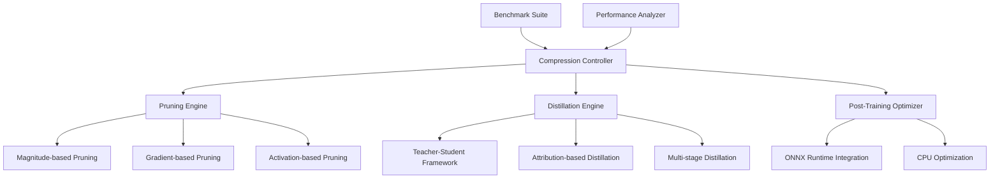

# Design Document

## Overview

The CPU-Optimized Model Compression Pipeline is designed as an intelligent system specializing in CPU-efficient model optimization techniques. The system focuses on structured pruning, knowledge distillation, and architecture optimization specifically for CPU deployment, providing competitive advantages in edge deployment scenarios where GPU resources are unavailable.

## Architecture

### High-Level Architecture



### Core Components

#### 1. Structured Pruning Engine

**Purpose**: Remove entire neurons or channels for better CPU performance

**Key Features**:

- Magnitude-based structured pruning
- Gradient-based importance scoring
- Activation-based pruning strategies
- CPU-optimized sparse operations

#### 2. Knowledge Distillation Framework

**Purpose**: Transfer knowledge from large teacher models to smaller student models

**Components**:

- Teacher-student architecture setup
- Attribution-based knowledge transfer
- Multi-stage progressive distillation
- Reverse KLD optimization for generative models

#### 3. Post-Training Optimization System

**Purpose**: Apply compression techniques to pre-trained models

**Features**:

- Model analysis and optimization recommendations
- ONNX Runtime integration for CPU deployment
- Performance benchmarking and validation
- Automated optimization pipeline

## Components and Interfaces

### Compression Controller Interface

```python
from pathlib import Path
from typing import Dict, List, Optional, Union, Any
from dataclasses import dataclass
import torch
import torch.nn as nn
from enum import Enum

class CompressionMethod(Enum):
    MAGNITUDE_PRUNING = "magnitude"
    GRADIENT_PRUNING = "gradient"
    ACTIVATION_PRUNING = "activation"
    KNOWLEDGE_DISTILLATION = "distillation"
    COMBINED = "combined"

@dataclass
class CompressionConfig:
    method: CompressionMethod
    target_sparsity: float = 0.5
    target_compression_ratio: float = 0.3
    preserve_accuracy_threshold: float = 0.95
    cpu_optimization: bool = True
    benchmark_baseline: bool = True

class ModelCompressionController:
    """Main controller for CPU-optimized model compression."""
    
    def __init__(self, config: CompressionConfig):
        self.config = config
        self.pruning_engine = StructuredPruningEngine()
        self.distillation_engine = KnowledgeDistillationEngine()
        self.post_optimizer = PostTrainingOptimizer()
        self.benchmarker = CPUBenchmarkSuite()
        
    def compress_model(
        self,
        model: nn.Module,
        dataset: torch.utils.data.DataLoader,
        output_path: Path
    ) -> Dict[str, Any]:
        """Execute model compression with specified method."""
        pass
        
    def compare_methods(
        self,
        model: nn.Module,
        dataset: torch.utils.data.DataLoader,
        methods: List[CompressionMethod]
    ) -> Dict[str, Dict[str, float]]:
        """Compare different compression methods."""
        pass
```

### Structured Pruning Engine Interface

```python
import torch
import torch.nn as nn
from typing import Dict, List, Tuple, Callable

class StructuredPruningEngine:
    """CPU-optimized structured pruning implementation."""
    
    def __init__(self):
        self.pruning_strategies = {
            "magnitude": self._magnitude_based_pruning,
            "gradient": self._gradient_based_pruning,
            "activation": self._activation_based_pruning
        }
        
    def prune_model(
        self,
        model: nn.Module,
        sparsity: float,
        strategy: str = "magnitude",
        structured: bool = True
    ) -> Tuple[nn.Module, Dict[str, float]]:
        """Apply structured pruning to model."""
        if strategy not in self.pruning_strategies:
            raise ValueError(f"Unknown pruning strategy: {strategy}")
            
        return self.pruning_strategies[strategy](model, sparsity, structured)
        
    def _magnitude_based_pruning(
        self,
        model: nn.Module,
        sparsity: float,
        structured: bool
    ) -> Tuple[nn.Module, Dict[str, float]]:
        """Magnitude-based structured pruning for CPU efficiency."""
        pruned_model = model.clone()
        pruning_stats = {}
        
        for name, module in pruned_model.named_modules():
            if isinstance(module, nn.Linear):
                # Remove entire neurons based on L2 norm
                importance = torch.norm(module.weight, dim=1)
                mask = importance > torch.quantile(importance, sparsity)
                
                # Restructure layer for CPU efficiency
                module.weight.data = module.weight.data[mask]
                if module.bias is not None:
                    module.bias.data = module.bias.data[mask]
                    
                pruning_stats[name] = {
                    "original_neurons": len(importance),
                    "pruned_neurons": mask.sum().item(),
                    "sparsity_achieved": 1 - (mask.sum().item() / len(importance))
                }
                
        return pruned_model, pruning_stats
        
    def _gradient_based_pruning(
        self,
        model: nn.Module,
        sparsity: float,
        structured: bool
    ) -> Tuple[nn.Module, Dict[str, float]]:
        """Gradient-based importance scoring for pruning."""
        pass
        
    def _activation_based_pruning(
        self,
        model: nn.Module,
        sparsity: float,
        structured: bool
    ) -> Tuple[nn.Module, Dict[str, float]]:
        """Activation-based pruning using runtime statistics."""
        pass
```

### Knowledge Distillation Engine Interface

```python
from typing import Optional, Dict, Any, List
import torch
import torch.nn as nn
import torch.nn.functional as F

class KnowledgeDistillationEngine:
    """Knowledge distillation for model compression."""
    
    def __init__(self):
        self.distillation_strategies = {
            "standard": self._standard_distillation,
            "attribution": self._attribution_based_distillation,
            "multi_stage": self._multi_stage_distillation,
            "reverse_kld": self._reverse_kld_distillation
        }
        
    def distill_model(
        self,
        teacher_model: nn.Module,
        student_model: nn.Module,
        train_loader: torch.utils.data.DataLoader,
        strategy: str = "standard",
        temperature: float = 4.0,
        alpha: float = 0.7
    ) -> Tuple[nn.Module, Dict[str, float]]:
        """Perform knowledge distillation."""
        if strategy not in self.distillation_strategies:
            raise ValueError(f"Unknown distillation strategy: {strategy}")
            
        return self.distillation_strategies[strategy](
            teacher_model, student_model, train_loader, temperature, alpha
        )
        
    def _standard_distillation(
        self,
        teacher: nn.Module,
        student: nn.Module,
        train_loader: torch.utils.data.DataLoader,
        temperature: float,
        alpha: float
    ) -> Tuple[nn.Module, Dict[str, float]]:
        """Standard knowledge distillation with temperature scaling."""
        teacher.eval()
        student.train()
        
        optimizer = torch.optim.Adam(student.parameters(), lr=1e-4)
        distillation_loss = nn.KLDivLoss(reduction='batchmean')
        
        training_stats = {"epochs": [], "distillation_loss": [], "student_accuracy": []}
        
        for epoch in range(100):  # Configurable
            epoch_loss = 0.0
            for batch_idx, (data, target) in enumerate(train_loader):
                optimizer.zero_grad()
                
                with torch.no_grad():
                    teacher_outputs = teacher(data)
                    
                student_outputs = student(data)
                
                # Distillation loss
                teacher_probs = F.softmax(teacher_outputs / temperature, dim=1)
                student_log_probs = F.log_softmax(student_outputs / temperature, dim=1)
                
                kd_loss = distillation_loss(student_log_probs, teacher_probs) * (temperature ** 2)
                
                # Student task loss
                task_loss = F.cross_entropy(student_outputs, target)
                
                # Combined loss
                total_loss = alpha * kd_loss + (1 - alpha) * task_loss
                
                total_loss.backward()
                optimizer.step()
                
                epoch_loss += total_loss.item()
                
            training_stats["epochs"].append(epoch)
            training_stats["distillation_loss"].append(epoch_loss / len(train_loader))
            
        return student, training_stats
        
    def _attribution_based_distillation(
        self,
        teacher: nn.Module,
        student: nn.Module,
        train_loader: torch.utils.data.DataLoader,
        temperature: float,
        alpha: float
    ) -> Tuple[nn.Module, Dict[str, float]]:
        """Attribution-based distillation focusing on important features."""
        pass
        
    def _multi_stage_distillation(
        self,
        teacher: nn.Module,
        student: nn.Module,
        train_loader: torch.utils.data.DataLoader,
        temperature: float,
        alpha: float
    ) -> Tuple[nn.Module, Dict[str, float]]:
        """Multi-stage progressive distillation."""
        pass
```

## Data Models

### Compression Configuration Models

```python
from dataclasses import dataclass
from pathlib import Path
from typing import Dict, List, Optional, Any
from enum import Enum

@dataclass
class ModelMetrics:
    accuracy: float
    inference_time: float
    memory_usage: float
    model_size: float
    cpu_utilization: float
    
@dataclass
class CompressionResults:
    original_metrics: ModelMetrics
    compressed_metrics: ModelMetrics
    compression_ratio: float
    accuracy_retention: float
    speedup_factor: float
    method_used: str
    
@dataclass
class PruningConfig:
    strategy: str = "magnitude"
    sparsity: float = 0.5
    structured: bool = True
    layer_wise: bool = False
    gradual: bool = True
    
@dataclass
class DistillationConfig:
    temperature: float = 4.0
    alpha: float = 0.7
    strategy: str = "standard"
    num_epochs: int = 100
    intermediate_layers: bool = False
```

## Error Handling

### Compression Pipeline Errors

```python
class CompressionError(Exception):
    """Base exception for compression pipeline errors."""
    pass

class PruningError(CompressionError):
    """Raised when pruning operations fail."""
    pass

class DistillationError(CompressionError):
    """Raised when knowledge distillation fails."""
    pass

class CPUOptimizationError(CompressionError):
    """Raised when CPU optimization fails."""
    pass

def handle_compression_errors(func):
    """Decorator for compression error handling."""
    def wrapper(*args, **kwargs):
        try:
            return func(*args, **kwargs)
        except PruningError as e:
            logger.error(f"Pruning failed: {e}")
            # Try alternative pruning strategy
            return fallback_pruning(*args, **kwargs)
        except DistillationError as e:
            logger.error(f"Distillation failed: {e}")
            # Try simpler distillation approach
            return simple_distillation(*args, **kwargs)
        except CPUOptimizationError as e:
            logger.warning(f"CPU optimization failed: {e}")
            # Continue without CPU-specific optimizations
            return generic_optimization(*args, **kwargs)
    return wrapper
```

## Testing Strategy

### Unit Testing Framework

```python
import pytest
from unittest.mock import Mock, patch, MagicMock
import torch
import torch.nn as nn
from pathlib import Path

class TestStructuredPruning:
    @pytest.fixture
    def sample_model(self):
        """Create sample model for testing."""
        model = nn.Sequential(
            nn.Linear(100, 50),
            nn.ReLU(),
            nn.Linear(50, 10)
        )
        return model
        
    @pytest.fixture
    def pruning_engine(self):
        """Create pruning engine for testing."""
        return StructuredPruningEngine()
        
    def test_magnitude_based_pruning(self, sample_model, pruning_engine):
        """Test magnitude-based structured pruning."""
        original_params = sum(p.numel() for p in sample_model.parameters())
        
        pruned_model, stats = pruning_engine.prune_model(
            sample_model,
            sparsity=0.3,
            strategy="magnitude"
        )
        
        pruned_params = sum(p.numel() for p in pruned_model.parameters())
        
        assert pruned_params < original_params
        assert "Linear" in str(stats)  # Should have pruning stats
        
    def test_cpu_optimization_validation(self, sample_model, pruning_engine):
        """Test that pruned model is optimized for CPU."""
        pruned_model, _ = pruning_engine.prune_model(
            sample_model,
            sparsity=0.5,
            strategy="magnitude"
        )
        
        # Test inference on CPU
        test_input = torch.randn(1, 100)
        with torch.no_grad():
            output = pruned_model(test_input)
            
        assert output.shape == (1, 10)
        assert not output.requires_grad
```

### Integration Testing

```python
class TestCompressionPipeline:
    def test_end_to_end_compression(self, sample_model, sample_dataset):
        """Test complete compression pipeline."""
        config = CompressionConfig(
            method=CompressionMethod.MAGNITUDE_PRUNING,
            target_sparsity=0.3,
            cpu_optimization=True
        )
        
        controller = ModelCompressionController(config)
        results = controller.compress_model(
            sample_model,
            sample_dataset,
            Path("test_output")
        )
        
        assert "compression_ratio" in results
        assert "accuracy_retention" in results
        assert results["compression_ratio"] > 0.2
        
    def test_method_comparison(self, sample_model, sample_dataset):
        """Test comparison of different compression methods."""
        config = CompressionConfig(cpu_optimization=True)
        controller = ModelCompressionController(config)
        
        methods = [
            CompressionMethod.MAGNITUDE_PRUNING,
            CompressionMethod.GRADIENT_PRUNING
        ]
        
        results = controller.compare_methods(
            sample_model,
            sample_dataset,
            methods
        )
        
        assert len(results) == len(methods)
        for method_name, metrics in results.items():
            assert "accuracy" in metrics
            assert "inference_time" in metrics
            assert "model_size" in metrics
```

### Performance Testing

```python
class TestCPUPerformanceBenchmarks:
    @pytest.mark.benchmark
    def test_cpu_inference_speed(self, benchmark, compressed_model):
        """Benchmark CPU inference speed."""
        test_input = torch.randn(1, 100)
        
        def cpu_inference():
            with torch.no_grad():
                return compressed_model(test_input)
                
        result = benchmark(cpu_inference)
        
        # Assert CPU performance targets
        assert result.stats.mean < 0.01  # Under 10ms per inference
        
    @pytest.mark.memory
    def test_memory_efficiency(self, original_model, compressed_model):
        """Test memory efficiency of compressed model."""
        original_size = sum(p.numel() * p.element_size() for p in original_model.parameters())
        compressed_size = sum(p.numel() * p.element_size() for p in compressed_model.parameters())
        
        compression_ratio = compressed_size / original_size
        assert compression_ratio < 0.5  # At least 50% compression
        
    def test_cpu_vs_gpu_comparison(self, compressed_model):
        """Compare CPU performance against GPU baseline."""
        test_input = torch.randn(100, 100)  # Larger batch for meaningful comparison
        
        # CPU timing
        start_time = time.time()
        with torch.no_grad():
            cpu_output = compressed_model(test_input)
        cpu_time = time.time() - start_time
        
        # GPU timing (if available)
        if torch.cuda.is_available():
            gpu_model = compressed_model.cuda()
            gpu_input = test_input.cuda()
            
            start_time = time.time()
            with torch.no_grad():
                gpu_output = gpu_model(gpu_input)
            gpu_time = time.time() - start_time
            
            # For edge deployment, CPU should be competitive
            assert cpu_time < gpu_time * 3  # CPU within 3x of GPU time
```
