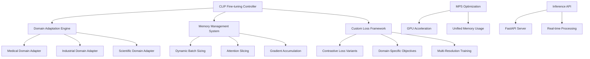

# Design Document

## Overview

The Multi-Modal CLIP Fine-Tuning system is designed to fine-tune CLIP models for domain-specific image-text understanding using PyTorch MPS backend for GPU acceleration. The system provides specialized training for various domains, memory-efficient training strategies, and real-time inference capabilities optimized for Apple Silicon.

## Architecture

### High-Level Architecture



### Core Components

#### 1. Domain-Specific Fine-tuning Engine

**Purpose**: Adapt CLIP models for specialized domains

**Supported Domains**:

- Medical imaging and clinical text
- Industrial inspection and technical documentation
- Scientific research and academic papers
- Custom domain adaptation framework

#### 2. Memory-Efficient Training System

**Purpose**: Optimize training for Apple Silicon memory constraints

**Features**:

- Dynamic batch sizing based on available memory
- Attention slicing for large sequence processing
- Gradient accumulation for effective large batch training
- Mixed precision training with automatic scaling

#### 3. Custom Contrastive Learning Framework

**Purpose**: Implement specialized loss functions for domain adaptation

**Components**:

- Modified contrastive loss for domain-specific similarity
- Hard negative mining for improved learning
- Multi-scale contrastive learning
- Temperature scaling optimization

## Components and Interfaces

### CLIP Fine-tuning Controller Interface

```python
from pathlib import Path
from typing import Dict, List, Optional, Union, Any, Tuple
from dataclasses import dataclass
import torch
import torch.nn as nn
from transformers import CLIPModel, CLIPProcessor
from PIL import Image

@dataclass
class CLIPFinetuningConfig:
    model_name: str = "openai/clip-vit-base-patch32"
    domain: str = "general"
    learning_rate: float = 5e-5
    batch_size: Optional[int] = None  # Auto-determined
    num_epochs: int = 10
    max_sequence_length: int = 77
    image_resolution: int = 224
    use_mps: bool = True
    mixed_precision: bool = True
    gradient_accumulation_steps: int = 1

class CLIPFinetuningController:
    """Main controller for CLIP domain-specific fine-tuning."""

    def __init__(self, config: CLIPFinetuningConfig):
        self.config = config
        self.device = self._setup_device()
        self.model = self._load_model()
        self.processor = self._load_processor()
        self.memory_manager = MemoryManager(self.device)
        self.loss_framework = CustomContrastiveLoss()

    def _setup_device(self) -> torch.device:
        """Setup device with MPS optimization."""
        if self.config.use_mps and torch.backends.mps.is_available():
            return torch.device("mps")
        else:
            return torch.device("cpu")

    def _load_model(self) -> CLIPModel:
        """Load CLIP model with MPS optimization."""
        model = CLIPModel.from_pretrained(self.config.model_name)
        model = model.to(self.device)

        # Enable attention slicing for memory efficiency
        if hasattr(model.text_model, 'enable_attention_slicing'):
            model.text_model.enable_attention_slicing()
        if hasattr(model.vision_model, 'enable_attention_slicing'):
            model.vision_model.enable_attention_slicing()

        return model

    def fine_tune(
        self,
        train_dataset: torch.utils.data.Dataset,
        val_dataset: Optional[torch.utils.data.Dataset] = None,
        output_path: Path = Path("./clip_finetuned")
    ) -> Dict[str, Any]:
        """Execute domain-specific fine-tuning."""
        pass

    def evaluate_on_domain(
        self,
        test_dataset: torch.utils.data.Dataset,
        domain_metrics: List[str] = None
    ) -> Dict[str, float]:
        """Evaluate model on domain-specific tasks."""
        pass
```

### Memory Management System Interface

```python
import psutil
import torch
from typing import Dict, Any, Optional

class MemoryManager:
    """Memory management for Apple Silicon optimization."""

    def __init__(self, device: torch.device):
        self.device = device
        self.memory_info = self._get_memory_info()
        self.optimal_batch_size = self._calculate_optimal_batch_size()

    def _get_memory_info(self) -> Dict[str, float]:
        """Get system memory information."""
        memory = psutil.virtual_memory()

        memory_info = {
            "total_gb": memory.total / (1024**3),
            "available_gb": memory.available / (1024**3),
            "used_gb": memory.used / (1024**3),
            "percent_used": memory.percent
        }

        # Add MPS-specific memory info if available
        if self.device.type == "mps":
            try:
                # MPS memory tracking (if available in future PyTorch versions)
                memory_info["mps_allocated"] = torch.mps.current_allocated_memory() / (1024**3)
                memory_info["mps_cached"] = torch.mps.driver_allocated_memory() / (1024**3)
            except AttributeError:
                # Fallback for current PyTorch versions
                memory_info["mps_allocated"] = 0.0
                memory_info["mps_cached"] = 0.0

        return memory_info

    def _calculate_optimal_batch_size(self) -> int:
        """Calculate optimal batch size based on available memory."""
        available_memory_gb = self.memory_info["available_gb"]

        # Conservative estimates for CLIP model memory usage
        if available_memory_gb > 16:
            return 32
        elif available_memory_gb > 8:
            return 16
        elif available_memory_gb > 4:
            return 8
        else:
            return 4

    def dynamic_batch_sizing(
        self,
        current_batch_size: int,
        memory_usage: float,
        target_memory_usage: float = 0.8
    ) -> int:
        """Dynamically adjust batch size based on memory usage."""
        if memory_usage > target_memory_usage:
            # Reduce batch size
            new_batch_size = max(1, int(current_batch_size * 0.8))
        elif memory_usage < target_memory_usage * 0.6:
            # Increase batch size
            new_batch_size = min(64, int(current_batch_size * 1.2))
        else:
            new_batch_size = current_batch_size

        return new_batch_size

    def enable_gradient_checkpointing(self, model: nn.Module):
        """Enable gradient checkpointing for memory efficiency."""
        if hasattr(model, 'gradient_checkpointing_enable'):
            model.gradient_checkpointing_enable()
        elif hasattr(model, 'enable_gradient_checkpointing'):
            model.enable_gradient_checkpointing()

    def setup_mixed_precision(self) -> torch.cuda.amp.GradScaler:
        """Setup mixed precision training."""
        # Note: MPS doesn't support GradScaler yet, so we use a dummy scaler
        if self.device.type == "mps":
            return DummyGradScaler()
        else:
            return torch.cuda.amp.GradScaler()
```

### Custom Contrastive Loss Framework Interface

```python
import torch
import torch.nn as nn
import torch.nn.functional as F
from typing import Dict, Any, Optional, Tuple

class CustomContrastiveLoss(nn.Module):
    """Custom contrastive loss for domain-specific CLIP fine-tuning."""

    def __init__(
        self,
        temperature: float = 0.07,
        use_hard_negatives: bool = True,
        domain_weight: float = 1.0
    ):
        super().__init__()
        self.temperature = temperature
        self.use_hard_negatives = use_hard_negatives
        self.domain_weight = domain_weight
        self.cross_entropy = nn.CrossEntropyLoss()

    def forward(
        self,
        image_features: torch.Tensor,
        text_features: torch.Tensor,
        domain_labels: Optional[torch.Tensor] = None
    ) -> Dict[str, torch.Tensor]:
        """Compute custom contrastive loss."""
        # Normalize features
        image_features = F.normalize(image_features, dim=-1)
        text_features = F.normalize(text_features, dim=-1)

        # Compute similarity matrix
        logits_per_image = torch.matmul(image_features, text_features.t()) / self.temperature
        logits_per_text = logits_per_image.t()

        # Create labels for contrastive learning
        batch_size = image_features.shape[0]
        labels = torch.arange(batch_size, device=image_features.device)

        # Standard contrastive loss
        loss_i2t = self.cross_entropy(logits_per_image, labels)
        loss_t2i = self.cross_entropy(logits_per_text, labels)
        contrastive_loss = (loss_i2t + loss_t2i) / 2

        losses = {"contrastive_loss": contrastive_loss}

        # Add hard negative mining if enabled
        if self.use_hard_negatives:
            hard_negative_loss = self._compute_hard_negative_loss(
                logits_per_image, logits_per_text, labels
            )
            losses["hard_negative_loss"] = hard_negative_loss

        # Add domain-specific loss if domain labels provided
        if domain_labels is not None:
            domain_loss = self._compute_domain_loss(
                image_features, text_features, domain_labels
            )
            losses["domain_loss"] = domain_loss * self.domain_weight

        # Compute total loss
        total_loss = sum(losses.values())
        losses["total_loss"] = total_loss

        return losses

    def _compute_hard_negative_loss(
        self,
        logits_per_image: torch.Tensor,
        logits_per_text: torch.Tensor,
        labels: torch.Tensor
    ) -> torch.Tensor:
        """Compute hard negative mining loss."""
        # Find hard negatives (highest similarity with wrong pairs)
        batch_size = logits_per_image.shape[0]

        # Mask out positive pairs
        mask = torch.eye(batch_size, device=logits_per_image.device).bool()

        # Get hard negatives for image-to-text
        masked_logits_i2t = logits_per_image.masked_fill(mask, float('-inf'))
        hard_negatives_i2t = torch.max(masked_logits_i2t, dim=1)[0]

        # Get hard negatives for text-to-image
        masked_logits_t2i = logits_per_text.masked_fill(mask, float('-inf'))
        hard_negatives_t2i = torch.max(masked_logits_t2i, dim=1)[0]

        # Compute hard negative loss
        positive_logits_i2t = logits_per_image[torch.arange(batch_size), labels]
        positive_logits_t2i = logits_per_text[torch.arange(batch_size), labels]

        hard_loss_i2t = F.relu(hard_negatives_i2t - positive_logits_i2t + 0.1)
        hard_loss_t2i = F.relu(hard_negatives_t2i - positive_logits_t2i + 0.1)

        return (hard_loss_i2t.mean() + hard_loss_t2i.mean()) / 2

    def _compute_domain_loss(
        self,
        image_features: torch.Tensor,
        text_features: torch.Tensor,
        domain_labels: torch.Tensor
    ) -> torch.Tensor:
        """Compute domain-specific contrastive loss."""
        # Group by domain and compute intra-domain similarity
        unique_domains = torch.unique(domain_labels)
        domain_loss = 0.0

        for domain in unique_domains:
            domain_mask = domain_labels == domain
            if domain_mask.sum() > 1:  # Need at least 2 samples
                domain_image_features = image_features[domain_mask]
                domain_text_features = text_features[domain_mask]

                # Compute intra-domain similarity
                domain_similarity = torch.matmul(
                    domain_image_features, domain_text_features.t()
                ) / self.temperature

                # Encourage higher similarity within domain
                domain_labels_local = torch.arange(
                    domain_similarity.shape[0],
                    device=domain_similarity.device
                )
                domain_loss += self.cross_entropy(domain_similarity, domain_labels_local)

        return domain_loss / len(unique_domains) if len(unique_domains) > 0 else torch.tensor(0.0)
```

## Data Models

### Training Configuration Models

```python
from dataclasses import dataclass
from pathlib import Path
from typing import Dict, List, Optional, Any

@dataclass
class DomainConfig:
    name: str
    description: str
    image_preprocessing: Dict[str, Any]
    text_preprocessing: Dict[str, Any]
    evaluation_metrics: List[str]

@dataclass
class TrainingMetrics:
    epoch: int
    train_loss: float
    val_loss: Optional[float]
    contrastive_accuracy: float
    domain_accuracy: Optional[float]
    memory_usage: float
    training_time: float

@dataclass
class MultiResolutionConfig:
    resolutions: List[int] = None  # [224, 336, 448]
    progressive_training: bool = True
    resolution_schedule: Optional[Dict[int, int]] = None  # epoch -> resolution
```

## Error Handling

### CLIP Fine-tuning Errors

```python
class CLIPFinetuningError(Exception):
    """Base exception for CLIP fine-tuning errors."""
    pass

class MPSCompatibilityError(CLIPFinetuningError):
    """Raised when MPS optimization fails."""
    pass

class MemoryConstraintError(CLIPFinetuningError):
    """Raised when memory constraints are exceeded."""
    pass

def handle_finetuning_errors(func):
    """Decorator for CLIP fine-tuning error handling."""
    def wrapper(*args, **kwargs):
        try:
            return func(*args, **kwargs)
        except MPSCompatibilityError as e:
            logger.warning(f"MPS optimization failed: {e}")
            # Fallback to CPU training
            return cpu_fallback_training(*args, **kwargs)
        except MemoryConstraintError as e:
            logger.warning(f"Memory constraint exceeded: {e}")
            # Reduce batch size and retry
            return reduce_batch_size_and_retry(*args, **kwargs)
    return wrapper
```

## Testing Strategy

### Unit Testing Framework

```python
import pytest
from unittest.mock import Mock, patch, MagicMock
import torch
from PIL import Image
import numpy as np

class TestCLIPFinetuning:
    @pytest.fixture
    def sample_config(self):
        """Sample configuration for testing."""
        return CLIPFinetuningConfig(
            model_name="openai/clip-vit-base-patch32",
            domain="medical",
            batch_size=4,
            num_epochs=2
        )

    @pytest.fixture
    def mock_dataset(self):
        """Mock dataset for testing."""
        images = [Image.fromarray(np.random.randint(0, 255, (224, 224, 3), dtype=np.uint8)) for _ in range(10)]
        texts = [f"Sample text {i}" for i in range(10)]
        return list(zip(images, texts))

    def test_memory_manager_initialization(self):
        """Test memory manager setup."""
        device = torch.device("cpu")
        memory_manager = MemoryManager(device)

        assert memory_manager.device == device
        assert "total_gb" in memory_manager.memory_info
        assert memory_manager.optimal_batch_size > 0

    @patch('torch.backends.mps.is_available', return_value=True)
    def test_mps_optimization_setup(self, mock_mps, sample_config):
        """Test MPS optimization setup."""
        controller = CLIPFinetuningController(sample_config)

        assert controller.device.type == "mps"
        assert controller.config.use_mps == True
```

### Integration Testing

```python
class TestCLIPIntegration:
    def test_end_to_end_finetuning(self, sample_config, mock_dataset):
        """Test complete fine-tuning pipeline."""
        controller = CLIPFinetuningController(sample_config)

        # Create simple dataset
        dataset = torch.utils.data.Dataset()  # Simplified for testing

        results = controller.fine_tune(
            train_dataset=dataset,
            output_path=Path("test_output")
        )

        assert "train_loss" in results
        assert "training_time" in results
        assert results["train_loss"] > 0

    def test_domain_specific_evaluation(self, sample_config, mock_dataset):
        """Test domain-specific evaluation."""
        controller = CLIPFinetuningController(sample_config)

        # Mock evaluation dataset
        eval_dataset = torch.utils.data.Dataset()  # Simplified

        metrics = controller.evaluate_on_domain(
            test_dataset=eval_dataset,
            domain_metrics=["accuracy", "f1_score"]
        )

        assert "accuracy" in metrics
        assert "f1_score" in metrics
```

### Performance Testing

```python
class TestCLIPPerformance:
    @pytest.mark.benchmark
    def test_training_speed_benchmark(self, benchmark, sample_config):
        """Benchmark training speed on Apple Silicon."""
        controller = CLIPFinetuningController(sample_config)

        def train_single_batch():
            # Mock single batch training
            return controller._train_single_batch(mock_batch)

        result = benchmark(train_single_batch)

        # Assert reasonable training speed
        assert result.stats.mean < 5.0  # Under 5 seconds per batch

    @pytest.mark.memory
    def test_memory_efficiency(self, sample_config):
        """Test memory efficiency during training."""
        controller = CLIPFinetuningController(sample_config)

        with MemoryProfiler() as profiler:
            # Simulate training steps
            for _ in range(10):
                controller._simulate_training_step()

        profile = profiler.get_profile()
        assert profile.peak_memory < 12 * 1024**3  # Under 12GB
```
