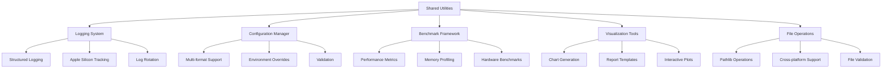

# Design Document

## Overview

The Shared Utilities component provides common functionality across all projects in the EfficientAI-MLX-Toolkit. This includes centralized logging, configuration management, benchmarking frameworks, and visualization utilities. The shared utilities ensure consistency, reduce code duplication, and provide standardized interfaces for common operations across all individual projects.

## Architecture

### High-Level Architecture



## Components and Interfaces

### Logging Utilities Interface

```python
from pathlib import Path
from typing import Dict, Any, Optional
import logging
import json
from datetime import datetime

class StructuredLogger:
    """Centralized logging with Apple Silicon optimization tracking."""
    
    def __init__(self, name: str, log_dir: Path = Path("logs")):
        self.name = name
        self.log_dir = log_dir
        self.log_dir.mkdir(parents=True, exist_ok=True)
        self.logger = self._setup_logger()
        
    def _setup_logger(self) -> logging.Logger:
        """Setup structured logger with pathlib-based file handling."""
        logger = logging.getLogger(self.name)
        logger.setLevel(logging.INFO)
        
        # File handler with pathlib
        log_file = self.log_dir / f"{self.name}_{datetime.now().strftime('%Y%m%d')}.log"
        file_handler = logging.FileHandler(log_file)
        
        # Structured formatter
        formatter = StructuredFormatter()
        file_handler.setFormatter(formatter)
        
        logger.addHandler(file_handler)
        return logger
        
    def log_apple_silicon_optimization(
        self,
        operation: str,
        metrics: Dict[str, Any],
        level: str = "info"
    ):
        """Log Apple Silicon-specific optimization metrics."""
        structured_data = {
            "timestamp": datetime.now().isoformat(),
            "operation": operation,
            "apple_silicon_metrics": metrics,
            "hardware_type": self._detect_hardware_type()
        }
        
        getattr(self.logger, level)(json.dumps(structured_data))
        
    def _detect_hardware_type(self) -> str:
        """Detect Apple Silicon hardware type."""
        import platform
        if platform.machine() == "arm64" and platform.system() == "Darwin":
            return "apple_silicon"
        else:
            return "other"
```

### Configuration Manager Interface

```python
from pathlib import Path
from typing import Dict, Any, Optional, Union
import yaml
import json
import toml
from dataclasses import dataclass

@dataclass
class ConfigValidationError(Exception):
    """Configuration validation error."""
    message: str
    config_path: Path

class ConfigManager:
    """Unified configuration management with pathlib support."""
    
    def __init__(self, config_path: Path):
        self.config_path = config_path
        self.config_data = self._load_config()
        self.validators = {}
        
    def _load_config(self) -> Dict[str, Any]:
        """Load configuration from file using pathlib."""
        if not self.config_path.exists():
            raise FileNotFoundError(f"Configuration file not found: {self.config_path}")
            
        suffix = self.config_path.suffix.lower()
        
        with self.config_path.open('r', encoding='utf-8') as f:
            if suffix == '.yaml' or suffix == '.yml':
                return yaml.safe_load(f)
            elif suffix == '.json':
                return json.load(f)
            elif suffix == '.toml':
                return toml.load(f)
            else:
                raise ValueError(f"Unsupported configuration format: {suffix}")
                
    def get(self, key: str, default: Any = None) -> Any:
        """Get configuration value with dot notation support."""
        keys = key.split('.')
        value = self.config_data
        
        for k in keys:
            if isinstance(value, dict) and k in value:
                value = value[k]
            else:
                return default
                
        return value
        
    def set(self, key: str, value: Any):
        """Set configuration value with dot notation support."""
        keys = key.split('.')
        config = self.config_data
        
        for k in keys[:-1]:
            if k not in config:
                config[k] = {}
            config = config[k]
            
        config[keys[-1]] = value
        
    def save(self, output_path: Optional[Path] = None):
        """Save configuration to file using pathlib."""
        save_path = output_path or self.config_path
        suffix = save_path.suffix.lower()
        
        with save_path.open('w', encoding='utf-8') as f:
            if suffix == '.yaml' or suffix == '.yml':
                yaml.dump(self.config_data, f, default_flow_style=False)
            elif suffix == '.json':
                json.dump(self.config_data, f, indent=2)
            elif suffix == '.toml':
                toml.dump(self.config_data, f)
                
    def validate(self) -> bool:
        """Validate configuration against registered validators."""
        for key, validator in self.validators.items():
            value = self.get(key)
            if not validator(value):
                raise ConfigValidationError(
                    f"Validation failed for key '{key}' with value '{value}'",
                    self.config_path
                )
        return True
```

### Benchmark Framework Interface

```python
from pathlib import Path
from typing import Dict, List, Any, Optional, Callable
import time
import psutil
import torch
from dataclasses import dataclass
from contextlib import contextmanager

@dataclass
class BenchmarkResult:
    name: str
    execution_time: float
    memory_usage: float
    apple_silicon_metrics: Dict[str, Any]
    custom_metrics: Dict[str, Any]
    timestamp: str

class BenchmarkRunner:
    """Standardized benchmarking framework for all projects."""
    
    def __init__(self, output_dir: Path = Path("benchmarks")):
        self.output_dir = output_dir
        self.output_dir.mkdir(parents=True, exist_ok=True)
        self.results: List[BenchmarkResult] = []
        
    @contextmanager
    def benchmark(self, name: str, custom_metrics: Optional[Dict[str, Any]] = None):
        """Context manager for benchmarking operations."""
        # Pre-benchmark setup
        start_time = time.time()
        start_memory = psutil.Process().memory_info().rss / 1024**3  # GB
        
        # Apple Silicon specific metrics
        apple_silicon_metrics = self._collect_apple_silicon_metrics()
        
        try:
            yield
        finally:
            # Post-benchmark collection
            end_time = time.time()
            end_memory = psutil.Process().memory_info().rss / 1024**3  # GB
            
            result = BenchmarkResult(
                name=name,
                execution_time=end_time - start_time,
                memory_usage=end_memory - start_memory,
                apple_silicon_metrics=apple_silicon_metrics,
                custom_metrics=custom_metrics or {},
                timestamp=time.strftime("%Y-%m-%d %H:%M:%S")
            )
            
            self.results.append(result)
            
    def _collect_apple_silicon_metrics(self) -> Dict[str, Any]:
        """Collect Apple Silicon-specific performance metrics."""
        metrics = {}
        
        # Check if MLX is available and collect metrics
        try:
            import mlx.core as mx
            if mx.metal.is_available():
                metrics["mlx_metal_available"] = True
                metrics["mlx_memory_limit"] = mx.metal.get_memory_limit()
            else:
                metrics["mlx_metal_available"] = False
        except ImportError:
            metrics["mlx_available"] = False
            
        # Check MPS availability
        if torch.backends.mps.is_available():
            metrics["mps_available"] = True
        else:
            metrics["mps_available"] = False
            
        return metrics
        
    def save_results(self, filename: Optional[str] = None):
        """Save benchmark results using pathlib."""
        if not filename:
            filename = f"benchmark_results_{time.strftime('%Y%m%d_%H%M%S')}.json"
            
        output_file = self.output_dir / filename
        
        results_data = [
            {
                "name": result.name,
                "execution_time": result.execution_time,
                "memory_usage": result.memory_usage,
                "apple_silicon_metrics": result.apple_silicon_metrics,
                "custom_metrics": result.custom_metrics,
                "timestamp": result.timestamp
            }
            for result in self.results
        ]
        
        with output_file.open('w') as f:
            json.dump(results_data, f, indent=2)
```

### Visualization Tools Interface

```python
from pathlib import Path
from typing import Dict, List, Any, Optional
import matplotlib.pyplot as plt
import seaborn as sns
import pandas as pd
from dataclasses import dataclass

@dataclass
class PlotConfig:
    title: str
    xlabel: str
    ylabel: str
    style: str = "whitegrid"
    figsize: tuple = (10, 6)
    save_format: str = "png"

class GlobalPlotting:
    """Common visualization utilities for all projects."""
    
    def __init__(self, output_dir: Path = Path("plots")):
        self.output_dir = output_dir
        self.output_dir.mkdir(parents=True, exist_ok=True)
        self._setup_style()
        
    def _setup_style(self):
        """Setup consistent plotting style."""
        plt.style.use('seaborn-v0_8')
        sns.set_palette("husl")
        
    def plot_benchmark_results(
        self,
        results: List[BenchmarkResult],
        config: PlotConfig,
        save_path: Optional[Path] = None
    ) -> Path:
        """Plot benchmark results with consistent styling."""
        fig, (ax1, ax2) = plt.subplots(1, 2, figsize=config.figsize)
        
        # Execution time plot
        names = [r.name for r in results]
        times = [r.execution_time for r in results]
        memory = [r.memory_usage for r in results]
        
        ax1.bar(names, times)
        ax1.set_title("Execution Time")
        ax1.set_ylabel("Time (seconds)")
        ax1.tick_params(axis='x', rotation=45)
        
        # Memory usage plot
        ax2.bar(names, memory)
        ax2.set_title("Memory Usage")
        ax2.set_ylabel("Memory (GB)")
        ax2.tick_params(axis='x', rotation=45)
        
        plt.suptitle(config.title)
        plt.tight_layout()
        
        # Save plot using pathlib
        if not save_path:
            save_path = self.output_dir / f"{config.title.lower().replace(' ', '_')}.{config.save_format}"
            
        plt.savefig(save_path, dpi=300, bbox_inches='tight')
        plt.close()
        
        return save_path
        
    def plot_training_metrics(
        self,
        metrics_data: Dict[str, List[float]],
        config: PlotConfig,
        save_path: Optional[Path] = None
    ) -> Path:
        """Plot training metrics with consistent styling."""
        fig, axes = plt.subplots(len(metrics_data), 1, figsize=(config.figsize[0], config.figsize[1] * len(metrics_data)))
        
        if len(metrics_data) == 1:
            axes = [axes]
            
        for idx, (metric_name, values) in enumerate(metrics_data.items()):
            axes[idx].plot(values)
            axes[idx].set_title(f"{metric_name.replace('_', ' ').title()}")
            axes[idx].set_xlabel("Epoch")
            axes[idx].set_ylabel(metric_name)
            axes[idx].grid(True)
            
        plt.suptitle(config.title)
        plt.tight_layout()
        
        if not save_path:
            save_path = self.output_dir / f"training_metrics.{config.save_format}"
            
        plt.savefig(save_path, dpi=300, bbox_inches='tight')
        plt.close()
        
        return save_path
```

## Data Models

```python
from dataclasses import dataclass
from pathlib import Path
from typing import Dict, List, Optional, Any

@dataclass
class ProjectMetadata:
    name: str
    version: str
    description: str
    dependencies: List[str]
    apple_silicon_optimized: bool
    
@dataclass
class SystemInfo:
    platform: str
    architecture: str
    python_version: str
    apple_silicon_available: bool
    mlx_available: bool
    mps_available: bool
    memory_gb: float
```

## Testing Strategy

```python
import pytest
from pathlib import Path
import tempfile
import json

class TestSharedUtilities:
    @pytest.fixture
    def temp_dir(self):
        """Create temporary directory for testing."""
        with tempfile.TemporaryDirectory() as temp_dir:
            yield Path(temp_dir)
            
    def test_config_manager_yaml(self, temp_dir):
        """Test YAML configuration loading."""
        config_file = temp_dir / "test_config.yaml"
        config_data = {"test": {"value": 42}}
        
        with config_file.open('w') as f:
            yaml.dump(config_data, f)
            
        config_manager = ConfigManager(config_file)
        assert config_manager.get("test.value") == 42
        
    def test_benchmark_runner(self, temp_dir):
        """Test benchmark runner functionality."""
        runner = BenchmarkRunner(temp_dir)
        
        with runner.benchmark("test_operation"):
            time.sleep(0.1)  # Simulate work
            
        assert len(runner.results) == 1
        assert runner.results[0].name == "test_operation"
        assert runner.results[0].execution_time >= 0.1
        
    def test_structured_logger(self, temp_dir):
        """Test structured logging functionality."""
        logger = StructuredLogger("test_logger", temp_dir)
        
        logger.log_apple_silicon_optimization(
            "test_operation",
            {"memory_usage": 1.5, "execution_time": 0.5}
        )
        
        log_files = list(temp_dir.glob("*.log"))
        assert len(log_files) == 1
```
