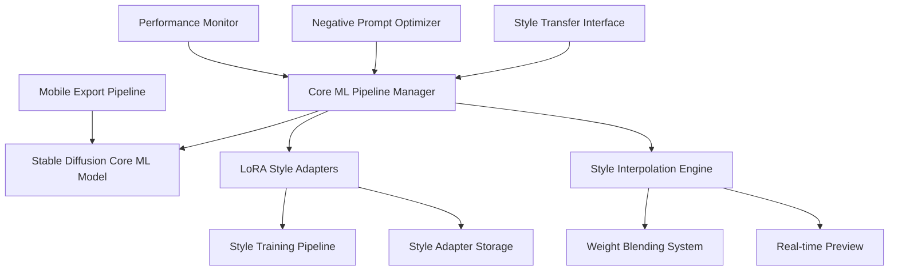

# core-ml-diffusion

**Created:** 2025-10-14
**Status:** Migrated from .kiro
**Type:** Feature Request
**Source:** .kiro/specs/core-ml-diffusion/

---

## Feature Description

# Requirements Document

## Introduction

The Core ML Stable Diffusion Style Transfer System is a comprehensive framework for creating artistic style transfer and domain-specific image generation using Apple's Core ML Stable Diffusion implementation. The system focuses on custom LoRA training for artistic styles, efficient inference on Apple Silicon, and mobile-ready deployment capabilities.

## Requirements & User Stories

# Requirements Document

## Introduction

The Core ML Stable Diffusion Style Transfer System is a comprehensive framework for creating artistic style transfer and domain-specific image generation using Apple's Core ML Stable Diffusion implementation. The system focuses on custom LoRA training for artistic styles, efficient inference on Apple Silicon, and mobile-ready deployment capabilities.

## Requirements

### Requirement 1

**User Story:** As an artist, I want to create custom style transfer models, so that I can generate images in specific artistic styles efficiently on Apple hardware.

#### Acceptance Criteria

1. WHEN using Core ML models THEN the system SHALL leverage Apple's pre-optimized implementations
2. WHEN performing inference THEN the system SHALL complete generation in under 30 seconds on Apple Silicon
3. WHEN optimizing for hardware THEN the system SHALL support both split_einsum (ANE optimized) and original attention variants
4. WHEN memory is managed THEN the system SHALL efficiently use unified memory architecture

### Requirement 2

**User Story:** As a developer, I want to train custom LoRA adapters for different styles, so that I can create specialized models for specific artistic domains.

#### Acceptance Criteria

1. WHEN training LoRA adapters THEN the system SHALL support multiple artistic styles simultaneously
2. WHEN styles are managed THEN the system SHALL allow independent training and storage of style adapters
3. WHEN training data is processed THEN the system SHALL automatically preprocess and validate artistic datasets
4. WHEN training completes THEN the system SHALL provide quality metrics and sample generations

### Requirement 3

**User Story:** As a user, I want to blend multiple artistic styles, so that I can create unique combinations and control the artistic output.

#### Acceptance Criteria

1. WHEN styles are combined THEN the system SHALL support style interpolation with controllable weights
2. WHEN blending is performed THEN the system SHALL provide real-time preview of style combinations
3. WHEN weights are adjusted THEN the system SHALL update generated images dynamically
4. WHEN combinations are saved THEN the system SHALL store custom style blend configurations

### Requirement 4

**User Story:** As a developer, I want optimized negative prompting, so that I can improve generation quality automatically.

#### Acceptance Criteria

1. WHEN negative prompts are generated THEN the system SHALL automatically optimize for quality improvement
2. WHEN prompts are processed THEN the system SHALL analyze input prompts and suggest negative prompts
3. WHEN quality is measured THEN the system SHALL use automated quality assessment metrics
4. WHEN optimization completes THEN the system SHALL provide before/after quality comparisons

### Requirement 5

**User Story:** As a mobile developer, I want to deploy models to iOS devices, so that I can create native mobile applications with style transfer capabilities.

#### Acceptance Criteria

1. WHEN models are exported THEN the system SHALL create iOS-compatible Core ML models
2. WHEN optimization is performed THEN the system SHALL compress models for mobile deployment
3. WHEN Swift integration is needed THEN the system SHALL provide Swift UI application templates
4. WHEN performance is tested THEN the system SHALL benchmark mobile vs desktop performance

### Requirement 6

**User Story:** As a researcher, I want integrated experiment tracking for style transfer, so that I can track style training experiments and compare artistic quality across different approaches.

#### Acceptance Criteria

1. WHEN training style adapters THEN the system SHALL automatically log experiments to the shared MLFlow infrastructure
2. WHEN styles are generated THEN the system SHALL track generation parameters and artistic quality metrics
3. WHEN models are trained THEN they SHALL be automatically registered in the shared model registry with style metadata
4. WHEN comparing styles THEN the system SHALL provide cross-experiment comparison using shared analytics utilities

### Requirement 7

**User Story:** As an artist, I want automated dataset management and model deployment, so that I can focus on creativity while the system handles technical operations.

#### Acceptance Criteria

1. WHEN artistic datasets are used THEN they SHALL be automatically tracked and versioned using the shared DVC system
2. WHEN style models are trained THEN they SHALL be automatically deployed to the shared serving infrastructure
3. WHEN generation quality degrades THEN the shared monitoring system SHALL alert and suggest retraining
4. WHEN complex workflows are needed THEN they SHALL be orchestrated using the shared Airflow infrastructure

## Architecture & Design

# Design Document

## Overview

The Core ML Stable Diffusion Style Transfer System is designed to leverage Apple's optimized Core ML Stable Diffusion implementation for artistic style transfer and domain-specific image generation. The system focuses on custom LoRA training for artistic styles, efficient inference on Apple Silicon, and mobile-ready deployment capabilities.

## Architecture

### High-Level Architecture



### Core Components

#### 1. Core ML Pipeline Manager

**Purpose**: Orchestrate Core ML Stable Diffusion operations with Apple Silicon optimizations

**Key Features**:

- Apple's pre-optimized Core ML model integration
- Compute unit optimization (CPU + GPU + ANE)
- Memory-efficient pipeline management
- Attention implementation selection (split_einsum vs original)

#### 2. LoRA Style Training System

**Purpose**: Train custom LoRA adapters for specific artistic styles

**Components**:

- Multi-style training pipeline
- Style dataset preprocessing
- Training progress monitoring
- Quality assessment metrics

#### 3. Style Interpolation Engine

**Purpose**: Blend multiple artistic styles with controllable weights

**Features**:

- Real-time style blending
- Weight interpolation algorithms
- Preview generation system
- Style combination persistence

## Components and Interfaces

### Core ML Pipeline Interface

```python
from pathlib import Path
import coremltools as ct
from python_coreml_stable_diffusion import pipeline
import numpy as np

class CoreMLStableDiffusionPipeline:
    """Apple Silicon optimized Stable Diffusion pipeline."""

    def __init__(
        self,
        model_path: Path,
        compute_unit: str = "ALL",
        attention_implementation: str = "SPLIT_EINSUM"
    ):
        self.model_path = model_path
        self.compute_unit = compute_unit
        self.attention_implementation = attention_implementation
        self.pipeline = self._initialize_pipeline()
        self.lora_adapters: dict[str, Path] = {}

    def _initialize_pipeline(self) -> pipeline.StableDiffusionPipeline:
        """Initialize Core ML pipeline with Apple Silicon optimizations."""
        return pipeline.StableDiffusionPipeline(
            str(self.model_path),
            compute_unit=self.compute_unit,
            attention_implementation=self.attention_implementation
        )

    def generate_image(
        self,
        prompt: str,
        negative_prompt: str] = None,
        style_adapters: list[str] | None = None,
        style_weights: list[float] | None = None,
        num_inference_steps: int = 20,
        guidance_scale: float = 7.5
    ) -> np.ndarray:
        """Generate image with optional style adapters."""
        pass

    def load_style_adapter(self, style_name: str, adapter_path: Path):
        """Load LoRA style adapter."""
        pass
```

### LoRA Style Training Interface

```python
from dataclasses import dataclass
from typing import Any
import torch
from diffusers import StableDiffusionPipeline, UNet2DConditionModel

@dataclass
class StyleTrainingConfig:
    style_name: str
    dataset_path: Path
    output_path: Path
    base_model: str = "runwayml/stable-diffusion-v1-5"
    lora_rank: int = 4
    learning_rate: float = 1e-4
    num_train_epochs: int = 100
    train_batch_size: int = 1
    resolution: int = 512

class LoRAStyleTrainer:
    """LoRA adapter training for artistic styles."""

    def __init__(self, config: StyleTrainingConfig):
        self.config = config
        self.base_pipeline = self._load_base_model()
        self.training_dataset = self._prepare_dataset()

    def _load_base_model(self) -> StableDiffusionPipeline:
        """Load base Stable Diffusion model."""
        return StableDiffusionPipeline.from_pretrained(
            self.config.base_model,
            torch_dtype=torch.float16,
            use_safetensors=True
        )

    def _prepare_dataset(self) -> torch.utils.data.Dataset:
        """Prepare style training dataset."""
        pass

    def train_style_adapter(self) -> dict[str, float]:
        """Train LoRA adapter for specific style."""
        pass

    def validate_style_quality(self, test_prompts: list[str]) -> dict[str, float]:
        """Validate trained style quality."""
        pass
```

### Style Interpolation Interface

```python
import numpy as np

class StyleInterpolationEngine:
    """Real-time style blending and interpolation."""

    def __init__(self, pipeline: CoreMLStableDiffusionPipeline):
        self.pipeline = pipeline
        self.loaded_styles: dict[str, Any] = {}
        self.blend_cache: dict[str, Any] = {}

    def blend_styles(
        self,
        style_names: list[str],
        weights: list[float],
        cache_key: Optional[str] = None
    ) -> Any:
        """Blend multiple styles with specified weights."""
        assert len(style_names) == len(weights)
        assert abs(sum(weights) - 1.0) < 1e-6, "Weights must sum to 1.0"

        if cache_key and cache_key in self.blend_cache:
            return self.blend_cache[cache_key]

        blended_adapter = self._interpolate_adapters(style_names, weights)

        if cache_key:
            self.blend_cache[cache_key] = blended_adapter

        return blended_adapter

    def _interpolate_adapters(
        self,
        style_names: list[str],
        weights: list[float]
    ) -> Any:
        """Interpolate LoRA adapter weights."""
        pass

    def generate_preview(
        self,
        prompt: str,
        style_blend: Any,
        quick_mode: bool = True
    ) -> np.ndarray:
        """Generate quick preview with style blend."""
        steps = 10 if quick_mode else 20
        return self.pipeline.generate_image(
            prompt=prompt,
            num_inference_steps=steps,
            style_adapters=[style_blend]
        )
```

## Data Models

### Style Configuration Models

```python
from dataclasses import dataclass
from pathlib import Path
from typing import list, dict, Optional

@dataclass
class StyleMetadata:
    name: str
    description: str
    artist: Optional[str]
    training_images: int
    lora_rank: int
    training_steps: int
    quality_score: float
    created_at: str

@dataclass
class StyleBlendConfig:
    name: str
    styles: list[str]
    weights: list[float]
    description: Optional[str] = None
    preview_prompt: str = "a beautiful landscape"

@dataclass
class GenerationConfig:
    prompt: str
    negative_prompt: Optional[str] = None
    num_inference_steps: int = 20
    guidance_scale: float = 7.5
    width: int = 512
    height: int = 512
    seed: Optional[int] = None
```

### Performance Monitoring Models

```python
@dataclass
class GenerationMetrics:
    inference_time: float
    memory_usage: float
    compute_unit_utilization: dict[str, float]  # CPU, GPU, ANE
    image_quality_score: Optional[float]

@dataclass
class TrainingMetrics:
    epoch: int
    loss: float
    learning_rate: float
    training_time: float
    validation_score: Optional[float]
    sample_images: list[Path]
```

## Error Handling

### Core ML Pipeline Errors

```python
class CoreMLPipelineError(Exception):
    """Base exception for Core ML pipeline errors."""
    pass

class ModelLoadingError(CoreMLPipelineError):
    """Raised when Core ML model loading fails."""
    pass

class ComputeUnitError(CoreMLPipelineError):
    """Raised when compute unit optimization fails."""
    pass

def handle_coreml_errors(func):
    """Decorator for Core ML error handling."""
    def wrapper(*args, **kwargs):
        try:
            return func(*args, **kwargs)
        except ModelLoadingError as e:
            logger.error(f"Model loading failed: {e}")
            # Try fallback model or compute unit
            return fallback_model_loading(*args, **kwargs)
        except ComputeUnitError as e:
            logger.warning(f"Compute unit optimization failed: {e}")
            # Fallback to CPU-only mode
            return cpu_fallback(*args, **kwargs)
    return wrapper
```

### Style Training Error Recovery

```python
class StyleTrainingError(Exception):
    """Base exception for style training errors."""
    pass

class DatasetError(StyleTrainingError):
    """Raised when dataset processing fails."""
    pass

class TrainingPipeline:
    def __init__(self, config: StyleTrainingConfig):
        self.config = config
        self.checkpoint_manager = CheckpointManager(config.output_path)

    def train_with_recovery(self):
        """Training with automatic error recovery and checkpointing."""
        try:
            return self._train_loop()
        except DatasetError as e:
            logger.error(f"Dataset error: {e}")
            # Try dataset repair or alternative preprocessing
            return self._repair_and_retry()
        except Exception as e:
            logger.error(f"Training failed: {e}")
            if self.checkpoint_manager.has_checkpoints():
                return self._resume_from_checkpoint()
            else:
                raise e
```

## Testing Strategy

### Unit Testing Framework

```python
import pytest
from unittest.mock import Mock, patch, MagicMock
import numpy as np
from pathlib import Path

class TestCoreMLPipeline:
    @pytest.fixture
    def mock_coreml_pipeline(self):
        """Mock Core ML pipeline for testing."""
        with patch('python_coreml_stable_diffusion.pipeline.StableDiffusionPipeline') as mock:
            mock_instance = MagicMock()
            mock.return_value = mock_instance
            yield mock_instance

    @pytest.fixture
    def sample_config(self, tmp_path):
        """Sample configuration for testing."""
        return StyleTrainingConfig(
            style_name="test_style",
            dataset_path=tmp_path / "dataset",
            output_path=tmp_path / "output"
        )

    def test_pipeline_initialization(self, mock_coreml_pipeline, tmp_path):
        """Test Core ML pipeline initialization."""
        pipeline = CoreMLStableDiffusionPipeline(
            model_path=tmp_path / "model",
            compute_unit="ALL"
        )
        assert pipeline.compute_unit == "ALL"
        assert pipeline.attention_implementation == "SPLIT_EINSUM"

    def test_style_adapter_loading(self, mock_coreml_pipeline, tmp_path):
        """Test LoRA style adapter loading."""
        pipeline = CoreMLStableDiffusionPipeline(tmp_path / "model")
        adapter_path = tmp_path / "style.safetensors"
        adapter_path.touch()  # Create dummy file

        pipeline.load_style_adapter("test_style", adapter_path)
        assert "test_style" in pipeline.lora_adapters
```

### Integration Testing

```python
class TestStyleTrainingIntegration:
    def test_end_to_end_style_training(self, sample_dataset, temp_output_dir):
        """Test complete style training pipeline."""
        config = StyleTrainingConfig(
            style_name="integration_test",
            dataset_path=sample_dataset,
            output_path=temp_output_dir,
            num_train_epochs=2  # Short training for testing
        )

        trainer = LoRAStyleTrainer(config)
        results = trainer.train_style_adapter()

        assert "loss" in results
        assert "training_time" in results
        assert (temp_output_dir / "integration_test.safetensors").exists()

    def test_style_interpolation_workflow(self, trained_styles, temp_output_dir):
        """Test style blending and interpolation."""
        pipeline = CoreMLStableDiffusionPipeline(Path("test_model"))
        interpolator = StyleInterpolationEngine(pipeline)

        # Load test styles
        for style_name, style_path in trained_styles.items():
            pipeline.load_style_adapter(style_name, style_path)

        # Test blending
        blend = interpolator.blend_styles(
            style_names=["style1", "style2"],
            weights=[0.7, 0.3]
        )

        # Test preview generation
        preview = interpolator.generate_preview(
            "a beautiful sunset",
            blend,
            quick_mode=True
        )

        assert isinstance(preview, np.ndarray)
        assert preview.shape[-1] == 3  # RGB channels
```

### Performance Testing

```python
class TestPerformanceBenchmarks:
    @pytest.mark.benchmark
    def test_inference_speed_benchmark(self, benchmark, coreml_pipeline):
        """Benchmark inference speed on Apple Silicon."""
        def generate_single_image():
            return coreml_pipeline.generate_image(
                "a beautiful landscape",
                num_inference_steps=20
            )

        result = benchmark(generate_single_image)

        # Assert performance targets for Apple Silicon
        assert result.stats.mean < 30.0  # Under 30 seconds

    @pytest.mark.memory
    def test_memory_usage_profiling(self, coreml_pipeline):
        """Profile memory usage during generation."""
        with MemoryProfiler() as profiler:
            for _ in range(5):
                coreml_pipeline.generate_image("test prompt")

        profile = profiler.get_profile()
        assert profile.peak_memory < 8 * 1024**3  # Under 8GB

    def test_compute_unit_utilization(self, coreml_pipeline):
        """Test compute unit utilization on Apple Silicon."""
        with ComputeUnitMonitor() as monitor:
            coreml_pipeline.generate_image("test prompt")

        utilization = monitor.get_utilization()
        assert utilization["ANE"] > 0.1  # ANE should be utilized
        assert utilization["GPU"] > 0.1  # GPU should be utilized
```

## Implementation Tasks & Acceptance Criteria

# Implementation Plan

- [ ] 1. Set up Core ML Stable Diffusion environment
  - Create project structure with uv-based dependency management
  - Install Core ML Stable Diffusion and related dependencies using uv
  - Set up pathlib-based file management for models and outputs
  - _Requirements: 1.1, 1.4_

- [ ] 2. Implement Core ML pipeline integration
  - [ ] 2.1 Create Core ML pipeline wrapper with Apple Silicon optimization
    - Write CoreMLStableDiffusionPipeline class with compute unit selection
    - Implement attention implementation switching (split_einsum vs original)
    - Add memory management for unified memory architecture
    - Write unit tests for pipeline initialization
    - _Requirements: 1.1, 1.2, 1.4_

  - [ ] 2.2 Implement model loading and caching system
    - Write model loading utilities with pathlib-based path management
    - Implement model caching to avoid repeated downloads
    - Add model validation and integrity checking
    - Write integration tests for model loading
    - _Requirements: 1.1, 1.4_

  - [ ] 2.3 Create inference optimization for Apple Silicon
    - Implement inference pipeline with memory optimization
    - Add batch processing capabilities for multiple images
    - Create performance monitoring and benchmarking
    - Write performance tests for inference speed
    - _Requirements: 1.2, 1.3_

- [ ] 3. Implement LoRA style adapter training system
  - [ ] 3.1 Create style dataset preprocessing pipeline
    - Write dataset loading and validation using pathlib
    - Implement image preprocessing and augmentation
    - Add dataset statistics and quality assessment
    - Write unit tests for dataset processing
    - _Requirements: 2.3_

  - [ ] 3.2 Implement LoRA training pipeline for artistic styles
    - Write LoRA adapter training using diffusers library
    - Implement multi-style training with separate adapters
    - Add training progress monitoring and logging
    - Write integration tests for style training
    - _Requirements: 2.1, 2.2_

  - [ ] 3.3 Create style quality assessment system
    - Implement automated quality metrics for trained styles
    - Add sample generation for style validation
    - Create quality scoring and comparison tools
    - Write unit tests for quality assessment
    - _Requirements: 2.4_

- [ ] 4. Implement style interpolation and blending system
  - [ ] 4.1 Create style adapter loading and management
    - Write style adapter loading utilities with pathlib
    - Implement adapter metadata management and storage
    - Add adapter validation and compatibility checking
    - Write unit tests for adapter management
    - _Requirements: 3.1_

  - [ ] 4.2 Implement real-time style blending engine
    - Write style interpolation algorithms with controllable weights
    - Implement weight validation and normalization
    - Add caching system for frequently used blends
    - Write integration tests for style blending
    - _Requirements: 3.1, 3.2_

  - [ ] 4.3 Create real-time preview generation system
    - Implement quick preview generation with reduced steps
    - Add preview caching and optimization
    - Create dynamic preview updates as weights change
    - Write performance tests for preview generation
    - _Requirements: 3.2_

- [ ] 5. Implement negative prompt optimization
  - [ ] 5.1 Create automatic negative prompt generation
    - Write prompt analysis system to identify potential issues
    - Implement negative prompt suggestion algorithms
    - Add quality-based negative prompt optimization
    - Write unit tests for prompt optimization
    - _Requirements: 4.1, 4.2_

  - [ ] 5.2 Implement quality assessment integration
    - Write automated quality scoring for generated images
    - Implement before/after comparison tools
    - Add quality-based optimization feedback loop
    - Write integration tests for quality assessment
    - _Requirements: 4.3, 4.4_

  - [ ] 5.3 Create prompt optimization interface
    - Write interactive prompt optimization tools
    - Implement suggestion system for prompt improvements
    - Add batch optimization for multiple prompts
    - Write end-to-end tests for prompt optimization
    - _Requirements: 4.2, 4.4_

- [ ] 6. Implement mobile deployment pipeline
  - [ ] 6.1 Create Core ML model optimization for iOS
    - Write model compression and optimization for mobile deployment
    - Implement Core ML model export with size optimization
    - Add mobile-specific performance benchmarking
    - Write unit tests for mobile optimization
    - _Requirements: 5.1, 5.2_

  - [ ] 6.2 Implement Swift UI application templates
    - Write Swift UI application template for iOS deployment
    - Implement Core ML integration in Swift
    - Add user interface for style selection and generation
    - Write integration tests for Swift application
    - _Requirements: 5.3_

  - [ ] 6.3 Create mobile performance benchmarking
    - Implement mobile vs desktop performance comparison
    - Add memory usage profiling for mobile devices
    - Create performance optimization recommendations
    - Write performance tests for mobile deployment
    - _Requirements: 5.4_

- [ ] 7. Implement web interface and API
  - [ ] 7.1 Create Gradio-based style transfer interface
    - Write interactive web interface for style transfer
    - Implement style selection and weight adjustment controls
    - Add real-time preview and generation capabilities
    - Write integration tests for web interface
    - _Requirements: 4.1, 4.2, 4.3, 4.4_

  - [ ] 7.2 Implement FastAPI server for style transfer
    - Write REST API endpoints for image generation
    - Implement batch processing and queue management
    - Add API authentication and rate limiting
    - Write unit tests for API endpoints
    - _Requirements: 5.3_

  - [ ] 7.3 Create style management interface
    - Write web interface for style adapter management
    - Implement style upload, training, and organization
    - Add style gallery and sharing capabilities
    - Write end-to-end tests for style management
    - _Requirements: 2.1, 2.2, 3.1_

- [ ] 8. Implement performance monitoring and optimization
  - [ ] 8.1 Create compute unit utilization monitoring
    - Write monitoring system for CPU, GPU, and ANE utilization
    - Implement performance metrics collection and analysis
    - Add optimization recommendations based on utilization
    - Write unit tests for performance monitoring
    - _Requirements: 1.2, 1.3_

  - [ ] 8.2 Implement memory usage optimization
    - Write memory profiling and optimization tools
    - Implement dynamic memory management for large models
    - Add memory usage alerts and optimization suggestions
    - Write performance tests for memory optimization
    - _Requirements: 1.4_

  - [ ] 8.3 Create benchmarking and comparison framework
    - Write comprehensive benchmarking suite for different configurations
    - Implement comparison with other diffusion implementations
    - Add performance regression testing
    - Write automated benchmark reporting
    - _Requirements: 1.1, 1.2, 1.3_

- [ ] 9. Implement comprehensive testing and validation
  - [ ] 9.1 Create end-to-end workflow testing
    - Write tests for complete style transfer workflows
    - Implement cross-platform compatibility testing
    - Add error handling and recovery testing
    - Create continuous integration test configuration
    - _Requirements: 1.1, 1.2, 1.3, 1.4_

  - [ ] 9.2 Implement style quality validation framework
    - Write automated style quality assessment tests
    - Implement style consistency validation across generations
    - Add artistic style preservation testing
    - Write comprehensive validation test suite
    - _Requirements: 2.1, 2.2, 2.4_

  - [ ] 9.3 Create deployment validation testing
    - Write tests for mobile deployment workflows
    - Implement API endpoint validation and load testing
    - Add performance benchmark validation
    - Create deployment pipeline testing
    - _Requirements: 5.1, 5.2, 5.3, 5.4_

---

**Migration Notes:**
- Consolidated from .kiro/specs/core-ml-diffusion/
- Original files: requirements.md, design.md, tasks.md
- Ready for sage workflow processing
