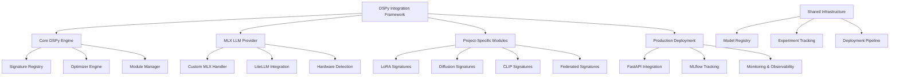

# dspy-toolkit-framework

**Created:** 2025-10-14
**Status:** Migrated from .kiro
**Type:** Feature Request
**Source:** .kiro/specs/dspy-toolkit-framework/

---

## Feature Description

# Requirements Document

## Introduction

The DSPy Integration Framework provides a unified intelligent prompt optimization and workflow automation system for all EfficientAI-MLX-Toolkit projects. This framework integrates DSPy's signature-based programming model with Apple Silicon optimizations, enabling automated prompt engineering, workflow optimization, and production deployment across all toolkit components.

## Requirements & User Stories

# Requirements Document

## Introduction

The DSPy Integration Framework provides a unified intelligent prompt optimization and workflow automation system for all EfficientAI-MLX-Toolkit projects. This framework integrates DSPy's signature-based programming model with Apple Silicon optimizations, enabling automated prompt engineering, workflow optimization, and production deployment across all toolkit components.

## Requirements

### Requirement 1

**User Story:** As a toolkit developer, I want a unified DSPy integration framework, so that all projects can leverage intelligent prompt optimization and automated workflow management.

#### Acceptance Criteria

1. WHEN DSPy is integrated THEN the system SHALL provide a unified configuration system for all toolkit projects
2. WHEN MLX models are used THEN the system SHALL integrate DSPy with custom MLX LLM providers through LiteLLM
3. WHEN signatures are defined THEN the system SHALL provide standardized signature templates for common ML workflows
4. WHEN modules are created THEN the system SHALL support modular DSPy components that can be shared across projects

### Requirement 2

**User Story:** As a machine learning engineer, I want automated prompt optimization, so that I can achieve optimal performance without manual prompt engineering.

#### Acceptance Criteria

1. WHEN optimizers are used THEN the system SHALL support MIPROv2, BootstrapFewShot, and GEPA optimizers
2. WHEN optimization is performed THEN the system SHALL automatically tune prompts based on task-specific metrics
3. WHEN examples are selected THEN the system SHALL use few-shot learning for improved performance
4. WHEN optimization completes THEN the system SHALL persist optimized programs for reproducibility

### Requirement 3

**User Story:** As a researcher, I want project-specific DSPy patterns, so that I can leverage domain-specific optimizations for different ML tasks.

#### Acceptance Criteria

1. WHEN LoRA fine-tuning is performed THEN the system SHALL provide specialized signatures for hyperparameter optimization
2. WHEN diffusion models are optimized THEN the system SHALL support adaptive sampling and architecture search signatures
3. WHEN CLIP models are fine-tuned THEN the system SHALL provide multi-modal optimization signatures
4. WHEN federated learning is used THEN the system SHALL support distributed optimization signatures

### Requirement 4

**User Story:** As a deployment engineer, I want production-ready DSPy integration, so that I can deploy optimized workflows with monitoring and observability.

#### Acceptance Criteria

1. WHEN APIs are deployed THEN the system SHALL provide FastAPI integration with async DSPy modules
2. WHEN monitoring is needed THEN the system SHALL integrate with MLflow for experiment tracking and tracing
3. WHEN debugging is required THEN the system SHALL provide comprehensive debugging utilities and observability
4. WHEN scaling is needed THEN the system SHALL support streaming endpoints and ensemble methods

### Requirement 5

**User Story:** As a system architect, I want Apple Silicon optimization, so that DSPy workflows can leverage the full potential of M1/M2 hardware.

#### Acceptance Criteria

1. WHEN Apple Silicon is detected THEN the system SHALL automatically configure MLX-optimized LLM providers
2. WHEN memory is managed THEN the system SHALL optimize for unified memory architecture
3. WHEN performance is measured THEN the system SHALL provide Apple Silicon-specific benchmarking
4. WHEN fallbacks are needed THEN the system SHALL gracefully degrade to MPS or CPU backends

### Requirement 6

**User Story:** As a developer, I want comprehensive testing and validation, so that DSPy integrations are reliable and maintainable across all projects.

#### Acceptance Criteria

1. WHEN signatures are tested THEN the system SHALL provide automated signature validation
2. WHEN modules are tested THEN the system SHALL support unit testing for DSPy components
3. WHEN optimization is tested THEN the system SHALL validate optimizer performance across different tasks
4. WHEN integration is tested THEN the system SHALL provide end-to-end testing for all project integrations

### Requirement 7

**User Story:** As a toolkit maintainer, I want centralized DSPy management, so that I can maintain consistency and share optimizations across all projects.

#### Acceptance Criteria

1. WHEN configurations are managed THEN the system SHALL provide centralized DSPy configuration management
2. WHEN optimizations are shared THEN the system SHALL enable sharing of optimized programs across projects
3. WHEN updates are made THEN the system SHALL support versioning and migration of DSPy components
4. WHEN documentation is needed THEN the system SHALL auto-generate documentation for all DSPy signatures and modules

## Architecture & Design

# Design Document

## Overview

The DSPy Integration Framework serves as the intelligent orchestration layer for the EfficientAI-MLX-Toolkit, providing automated prompt optimization, workflow management, and production deployment capabilities. The framework integrates DSPy's signature-based programming model with Apple Silicon optimizations, creating a unified system that enhances all toolkit projects with intelligent automation.

## Architecture

### High-Level Architecture



### Core Components

#### 1. DSPy Core Engine

**Purpose**: Central orchestration and management of DSPy components

**Key Features**:

- Unified signature registry for all project types
- Automated optimizer selection and configuration
- Module lifecycle management
- Cross-project optimization sharing

#### 2. MLX LLM Provider

**Purpose**: Apple Silicon-optimized LLM integration for DSPy

**Key Features**:

- Custom MLX model integration through LiteLLM
- Automatic hardware detection and optimization
- Unified memory management
- Fallback to MPS/CPU when needed

#### 3. Project-Specific Module Library

**Purpose**: Domain-specific DSPy signatures and modules

**Key Features**:

- Specialized signatures for each toolkit project
- Reusable optimization patterns
- Cross-project module sharing
- Template-based module generation

## Components and Interfaces

### Core DSPy Engine Interface

```python
from pathlib import Path
from typing import Dict, List, Optional, Union, Any
import dspy
from dataclasses import dataclass
from abc import ABC, abstractmethod

@dataclass
class DSPyConfig:
    """Configuration for DSPy integration."""
    model_provider: str = "mlx"
    model_name: str = "mlx/mlx-7b"
    optimization_level: int = 2
    cache_dir: Path = Path(".dspy_cache")
    enable_tracing: bool = True
    max_retries: int = 3

class DSPyFramework:
    """Central DSPy framework manager."""

    def __init__(self, config: DSPyConfig):
        self.config = config
        self.signature_registry = SignatureRegistry()
        self.optimizer_engine = OptimizerEngine()
        self.module_manager = ModuleManager()
        self._setup_llm_provider()

    def _setup_llm_provider(self):
        """Configure MLX LLM provider for Apple Silicon."""
        if self.config.model_provider == "mlx":
            self.llm_provider = MLXLLMProvider(self.config)
        else:
            self.llm_provider = DefaultLLMProvider(self.config)

    def register_project_signatures(self, project_name: str, signatures: Dict[str, dspy.Signature]):
        """Register project-specific signatures."""
        self.signature_registry.register_project(project_name, signatures)

    def optimize_module(self, module: dspy.Module, dataset: List[Dict], metrics: List[str]) -> dspy.Module:
        """Optimize a DSPy module using appropriate optimizer."""
        return self.optimizer_engine.optimize(module, dataset, metrics)
```

### MLX LLM Provider Interface

```python
import mlx.core as mx
import mlx.nn as nn
from mlx_lm import load, generate
import litellm
from litellm import CustomLLM

class MLXLLMProvider(CustomLLM):
    """Custom LiteLLM provider for MLX models."""

    def __init__(self, config: DSPyConfig):
        super().__init__()
        self.config = config
        self.model, self.tokenizer = self._load_mlx_model()
        self.hardware_info = self._detect_hardware()

    def _load_mlx_model(self):
        """Load MLX model with Apple Silicon optimizations."""
        model_path = self.config.model_name.replace("mlx/", "")
        return load(model_path)

    def _detect_hardware(self) -> Dict[str, Any]:
        """Detect Apple Silicon capabilities."""
        return {
            "metal_available": mx.metal.is_available(),
            "memory_limit": mx.metal.get_memory_limit() if mx.metal.is_available() else 0,
            "device_type": "apple_silicon" if mx.metal.is_available() else "cpu"
        }

    def completion(self, *args, **kwargs):
        """Generate completion using MLX model."""
        prompt = kwargs.get("messages", [])[-1]["content"]

        # MLX-optimized generation
        with mx.stream(generate(
            self.model,
            self.tokenizer,
            prompt=prompt,
            max_tokens=kwargs.get("max_tokens", 512),
            temp=kwargs.get("temperature", 0.7)
        )) as stream:
            response = "".join(stream)

        return self._format_response(response)

    def _format_response(self, response: str):
        """Format response for LiteLLM compatibility."""
        from litellm import ModelResponse, Choices, Message

        return ModelResponse(
            id="mlx-completion",
            choices=[Choices(
                message=Message(content=response, role="assistant"),
                finish_reason="stop"
            )],
            model=self.config.model_name,
            usage={"total_tokens": len(response.split())}
        )
```

### Project-Specific Signature Library

```python
# LoRA Fine-tuning Signatures
class LoRAOptimizationSignature(dspy.Signature):
    """Optimize LoRA hyperparameters for given dataset."""
    model_name = dspy.InputField(desc="Base model name")
    dataset_info = dspy.InputField(desc="Dataset characteristics and complexity")
    hardware_constraints = dspy.InputField(desc="Available memory and compute")
    performance_targets = dspy.InputField(desc="Target metrics and constraints")
    optimal_config = dspy.OutputField(desc="Optimized LoRA configuration with rank, alpha, and training params")

class LoRATrainingSignature(dspy.Signature):
    """Generate training strategy for LoRA fine-tuning."""
    model_config = dspy.InputField(desc="Model and LoRA configuration")
    dataset_path = dspy.InputField(desc="Training dataset location")
    training_objectives = dspy.InputField(desc="Training goals and metrics")
    training_plan = dspy.OutputField(desc="Detailed training strategy with steps and monitoring")

# Diffusion Model Signatures
class DiffusionOptimizationSignature(dspy.Signature):
    """Optimize diffusion model architecture and sampling."""
    base_architecture = dspy.InputField(desc="Base diffusion model architecture")
    target_domain = dspy.InputField(desc="Target domain and use case")
    quality_requirements = dspy.InputField(desc="Quality and performance requirements")
    optimized_config = dspy.OutputField(desc="Optimized architecture and sampling configuration")

class SamplingScheduleSignature(dspy.Signature):
    """Generate adaptive sampling schedule for diffusion models."""
    model_complexity = dspy.InputField(desc="Model architecture complexity")
    content_type = dspy.InputField(desc="Type of content being generated")
    quality_speed_tradeoff = dspy.InputField(desc="Quality vs speed preferences")
    sampling_schedule = dspy.OutputField(desc="Optimized denoising schedule")

# CLIP Fine-tuning Signatures
class CLIPDomainAdaptationSignature(dspy.Signature):
    """Adapt CLIP model for specific domain."""
    source_domain = dspy.InputField(desc="Original CLIP training domain")
    target_domain = dspy.InputField(desc="Target domain for adaptation")
    available_data = dspy.InputField(desc="Available domain-specific data")
    adaptation_strategy = dspy.OutputField(desc="Domain adaptation strategy and loss functions")

class ContrastiveLossSignature(dspy.Signature):
    """Design contrastive loss for CLIP fine-tuning."""
    domain_characteristics = dspy.InputField(desc="Domain-specific characteristics")
    similarity_requirements = dspy.InputField(desc="Required similarity metrics")
    training_objectives = dspy.InputField(desc="Training objectives and constraints")
    loss_configuration = dspy.OutputField(desc="Optimized contrastive loss configuration")
```

### Optimizer Engine Interface

```python
from typing import List, Dict, Any, Optional
import dspy
from sklearn.metrics import accuracy_score, f1_score

class OptimizerEngine:
    """Intelligent optimizer selection and configuration."""

    def __init__(self):
        self.optimizers = {
            "bootstrap": dspy.BootstrapFewShot,
            "mipro": dspy.MIPROv2,
            "gepa": dspy.GEPA
        }
        self.optimization_history = []

    def select_optimizer(self, task_type: str, dataset_size: int, complexity: str) -> str:
        """Intelligently select optimizer based on task characteristics."""
        if dataset_size < 100:
            return "bootstrap"
        elif complexity == "high" or task_type in ["diffusion", "multimodal"]:
            return "mipro"
        else:
            return "gepa"

    def optimize(self,
                module: dspy.Module,
                dataset: List[Dict],
                metrics: List[str],
                task_type: str = "general") -> dspy.Module:
        """Optimize module with best optimizer for task."""

        optimizer_name = self.select_optimizer(
            task_type,
            len(dataset),
            self._assess_complexity(dataset)
        )

        optimizer_class = self.optimizers[optimizer_name]
        optimizer = optimizer_class(
            metric=self._create_metric_function(metrics),
            max_bootstrapped_demos=min(8, len(dataset) // 4),
            max_labeled_demos=min(16, len(dataset) // 2)
        )

        # Perform optimization
        optimized_module = optimizer.compile(module, trainset=dataset)

        # Track optimization results
        self._track_optimization(optimizer_name, module, optimized_module, dataset, metrics)

        return optimized_module

    def _create_metric_function(self, metrics: List[str]):
        """Create composite metric function."""
        def composite_metric(gold, pred, trace=None):
            scores = {}
            for metric in metrics:
                if metric == "accuracy":
                    scores[metric] = accuracy_score([gold], [pred])
                elif metric == "f1":
                    scores[metric] = f1_score([gold], [pred], average='weighted')
            return sum(scores.values()) / len(scores)
        return composite_metric
```

## Data Models

### DSPy Configuration Models

```python
from dataclasses import dataclass
from pathlib import Path
from typing import Dict, List, Optional, Any
from enum import Enum

class OptimizerType(Enum):
    BOOTSTRAP = "bootstrap"
    MIPRO = "mipro"
    GEPA = "gepa"
    AUTO = "auto"

@dataclass
class ProjectSignatureConfig:
    """Configuration for project-specific signatures."""
    project_name: str
    signature_classes: Dict[str, type]
    default_optimizer: OptimizerType
    optimization_metrics: List[str]

@dataclass
class OptimizationResult:
    """Results from DSPy optimization."""
    optimizer_used: str
    original_performance: Dict[str, float]
    optimized_performance: Dict[str, float]
    optimization_time: float
    num_examples_used: int

@dataclass
class ModuleRegistry:
    """Registry of optimized DSPy modules."""
    modules: Dict[str, dspy.Module]
    optimization_results: Dict[str, OptimizationResult]
    creation_timestamps: Dict[str, str]
    version_info: Dict[str, str]
```

### Hardware Configuration Models

```python
@dataclass
class AppleSiliconConfig:
    """Apple Silicon specific configuration."""
    chip_type: str  # "m1", "m2", "m3"
    total_memory: int  # in GB
    metal_available: bool
    mps_available: bool
    unified_memory: bool
    optimization_level: int

@dataclass
class LLMProviderConfig:
    """LLM provider configuration."""
    provider_type: str  # "mlx", "openai", "anthropic"
    model_name: str
    api_key: Optional[str]
    base_url: Optional[str]
    hardware_config: Optional[AppleSiliconConfig]
```

## Error Handling

### DSPy Integration Error Handling

```python
class DSPyIntegrationError(Exception):
    """Base exception for DSPy integration issues."""
    pass

class OptimizerFailureError(DSPyIntegrationError):
    """Raised when DSPy optimization fails."""
    pass

class SignatureValidationError(DSPyIntegrationError):
    """Raised when signature validation fails."""
    pass

class MLXProviderError(DSPyIntegrationError):
    """Raised when MLX LLM provider encounters issues."""
    pass

def handle_dspy_errors(func):
    """Decorator for graceful DSPy error handling."""
    def wrapper(*args, **kwargs):
        try:
            return func(*args, **kwargs)
        except OptimizerFailureError as e:
            logger.warning(f"Optimization failed: {e}, using unoptimized module")
            return args[0]  # Return original module
        except MLXProviderError as e:
            logger.warning(f"MLX provider failed: {e}, falling back to OpenAI")
            return fallback_to_openai(*args, **kwargs)
        except Exception as e:
            logger.error(f"Unexpected DSPy error: {e}")
            raise DSPyIntegrationError(f"DSPy integration failed: {e}")
    return wrapper
```

### Production Deployment Error Recovery

```python
class ProductionDSPyHandler:
    """Production-ready DSPy module handler with error recovery."""

    def __init__(self, module: dspy.Module, fallback_module: Optional[dspy.Module] = None):
        self.primary_module = module
        self.fallback_module = fallback_module
        self.error_count = 0
        self.max_errors = 5

    async def execute_with_fallback(self, **kwargs):
        """Execute DSPy module with automatic fallback."""
        try:
            result = await self.primary_module(**kwargs)
            self.error_count = 0  # Reset on success
            return result
        except Exception as e:
            self.error_count += 1
            logger.warning(f"Primary module failed: {e}")

            if self.fallback_module and self.error_count < self.max_errors:
                logger.info("Using fallback module")
                return await self.fallback_module(**kwargs)
            else:
                raise DSPyIntegrationError(f"Both primary and fallback modules failed: {e}")
```

## Testing Strategy

### DSPy Integration Testing Framework

```python
import pytest
from unittest.mock import Mock, patch, AsyncMock
import dspy
from pathlib import Path

class TestDSPyFramework:
    @pytest.fixture
    def mock_mlx_model(self):
        """Mock MLX model for testing."""
        with patch('mlx_lm.load') as mock_load:
            mock_model = Mock()
            mock_tokenizer = Mock()
            mock_load.return_value = (mock_model, mock_tokenizer)
            yield mock_model, mock_tokenizer

    @pytest.fixture
    def dspy_config(self, tmp_path):
        """Test DSPy configuration."""
        return DSPyConfig(
            model_provider="mlx",
            model_name="test-model",
            cache_dir=tmp_path / "cache"
        )

    def test_framework_initialization(self, dspy_config, mock_mlx_model):
        """Test DSPy framework initialization."""
        framework = DSPyFramework(dspy_config)
        assert framework.config == dspy_config
        assert framework.signature_registry is not None
        assert framework.optimizer_engine is not None

    @patch('mlx.metal.is_available', return_value=True)
    def test_mlx_provider_setup(self, mock_metal, dspy_config):
        """Test MLX LLM provider setup."""
        provider = MLXLLMProvider(dspy_config)
        assert provider.hardware_info["metal_available"] == True

    def test_signature_registration(self, dspy_config, mock_mlx_model):
        """Test project signature registration."""
        framework = DSPyFramework(dspy_config)
        signatures = {"lora_opt": LoRAOptimizationSignature}

        framework.register_project_signatures("lora-project", signatures)

        registered = framework.signature_registry.get_project_signatures("lora-project")
        assert "lora_opt" in registered
```

### Integration Testing

```python
class TestDSPyIntegration:
    @pytest.mark.asyncio
    async def test_end_to_end_optimization(self, sample_dataset, dspy_config):
        """Test complete DSPy optimization pipeline."""
        framework = DSPyFramework(dspy_config)

        # Create test module
        class TestModule(dspy.Module):
            def __init__(self):
                super().__init__()
                self.generate = dspy.ChainOfThought("question -> answer")

            def forward(self, question):
                return self.generate(question=question)

        module = TestModule()
        optimized = framework.optimize_module(
            module,
            sample_dataset,
            ["accuracy"],
            task_type="qa"
        )

        assert optimized is not None
        assert hasattr(optimized, 'generate')

    def test_cross_project_signature_sharing(self, dspy_config):
        """Test sharing signatures across projects."""
        framework = DSPyFramework(dspy_config)

        # Register signatures for multiple projects
        lora_sigs = {"optimization": LoRAOptimizationSignature}
        clip_sigs = {"adaptation": CLIPDomainAdaptationSignature}

        framework.register_project_signatures("lora", lora_sigs)
        framework.register_project_signatures("clip", clip_sigs)

        # Verify cross-project access
        all_sigs = framework.signature_registry.get_all_signatures()
        assert "lora" in all_sigs
        assert "clip" in all_sigs
```

### Performance Testing

```python
class TestDSPyPerformance:
    @pytest.mark.benchmark
    def test_optimization_speed(self, benchmark, sample_module, sample_dataset):
        """Benchmark DSPy optimization speed."""
        framework = DSPyFramework(DSPyConfig())

        def optimize_module():
            return framework.optimize_module(
                sample_module,
                sample_dataset[:10],  # Small dataset for speed
                ["accuracy"]
            )

        result = benchmark(optimize_module)
        assert result is not None

    @pytest.mark.memory
    def test_memory_usage_during_optimization(self, sample_module, sample_dataset):
        """Test memory usage during DSPy optimization."""
        framework = DSPyFramework(DSPyConfig())

        with MemoryProfiler() as profiler:
            framework.optimize_module(sample_module, sample_dataset, ["accuracy"])

        profile = profiler.get_profile()
        # Ensure reasonable memory usage
        assert profile.peak_memory < 8 * 1024**3  # Under 8GB
```

## Implementation Tasks & Acceptance Criteria

# Implementation Plan

- [x] 1. Set up DSPy integration project structure and core interfaces
  - Create directory structure for DSPy framework components
  - Define base interfaces for DSPy integration, signature registry, and optimizer engine
  - Set up project configuration with pyproject.toml using uv package management
  - _Requirements: 1.1, 1.3, 1.4_

- [x] 2. Implement MLX LLM Provider for Apple Silicon optimization
  - Create custom LiteLLM handler for MLX model integration
  - Implement hardware detection and Apple Silicon optimization logic
  - Add automatic fallback to MPS/CPU when MLX is unavailable
  - Write unit tests for MLX provider functionality
  - _Requirements: 1.2, 5.1, 5.3, 5.4_

- [x] 3. Build core DSPy framework manager
  - Implement DSPyFramework class with configuration management
  - Create signature registry for project-specific signatures
  - Implement module manager for DSPy component lifecycle
  - Add LLM provider setup and configuration logic
  - _Requirements: 1.1, 1.3, 1.4, 7.1_

- [x] 4. Create intelligent optimizer engine
  - Implement OptimizerEngine with automatic optimizer selection
  - Add support for MIPROv2, BootstrapFewShot, and GEPA optimizers
  - Create composite metric functions for multi-objective optimization
  - Implement optimization history tracking and result persistence
  - _Requirements: 2.1, 2.2, 2.4, 6.2_

- [x] 5. Develop project-specific signature library
  - Create LoRA fine-tuning signatures for hyperparameter optimization
  - Implement diffusion model signatures for architecture and sampling optimization
  - Add CLIP fine-tuning signatures for domain adaptation and contrastive learning
  - Create federated learning signatures for distributed optimization
  - _Requirements: 3.1, 3.2, 3.3, 3.4_

- [x] 6. Build production deployment integration
  - Create FastAPI integration with async DSPy modules
  - Implement MLflow tracking for experiment management and tracing
  - Add comprehensive monitoring and observability features
  - Create streaming endpoints and ensemble method support
  - _Requirements: 4.1, 4.2, 4.3, 4.4_

- [x] 7. Implement error handling and recovery systems
  - Create comprehensive error handling for DSPy integration failures
  - Add graceful fallback mechanisms for optimizer and provider failures
  - Implement production-ready error recovery with automatic retries
  - Create debugging utilities and diagnostic tools
  - _Requirements: 5.4, 6.3, 4.3_

- [x] 8. Create testing framework for DSPy integration
  - Write unit tests for all DSPy framework components
  - Implement integration tests for cross-project signature sharing
  - Add performance benchmarks for optimization speed and memory usage
  - Create end-to-end tests for complete optimization pipelines
  - _Requirements: 6.1, 6.2, 6.3, 6.4_

- [x] 9. Build centralized management and configuration system
  - Implement centralized DSPy configuration management
  - Create system for sharing optimized programs across projects
  - Add versioning and migration support for DSPy components
  - Implement auto-documentation generation for signatures and modules
  - _Requirements: 7.1, 7.2, 7.3, 7.4_

- [x] 10. Create project integration templates and examples
  - Build integration templates for each toolkit project type
  - Create example implementations showing DSPy integration patterns
  - Add documentation and tutorials for DSPy framework usage
  - Implement validation tools for project-specific integrations
  - _Requirements: 1.4, 3.1, 3.2, 3.3, 3.4_

- [x] 11. Implement Apple Silicon performance optimization
  - Add Apple Silicon-specific benchmarking and performance metrics
  - Optimize memory management for unified memory architecture
  - Create hardware-aware optimization strategies
  - Implement performance monitoring and alerting for Apple Silicon deployments
  - _Requirements: 5.1, 5.2, 5.3_

- [x] 12. Build comprehensive monitoring and observability
  - Integrate with shared MLflow infrastructure for experiment tracking
  - Create custom metrics and dashboards for DSPy optimization performance
  - Add distributed tracing for complex DSPy workflows
  - Implement alerting and notification systems for optimization failures
  - _Requirements: 4.2, 4.3, 7.1_

---

**Migration Notes:**
- Consolidated from .kiro/specs/dspy-toolkit-framework/
- Original files: requirements.md, design.md, tasks.md
- Ready for sage workflow processing
