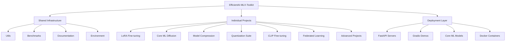

# efficientai-mlx-toolkit

**Created:** 2025-10-14
**Status:** Migrated from .kiro
**Type:** Feature Request
**Source:** .kiro/specs/efficientai-mlx-toolkit/

---

## Feature Description

# Requirements Document

## Introduction

The EfficientAI-MLX-Toolkit is a comprehensive AI/ML optimization framework designed specifically for Apple Silicon (M1/M2) hardware. The project aims to provide a collection of optimized machine learning tools, frameworks, and utilities that leverage Apple's MLX framework, Core ML, and other Apple Silicon-specific optimizations. The toolkit includes multiple individual projects ranging from LoRA fine-tuning to advanced diffusion model optimization, all designed to maximize performance on Apple hardware while maintaining ease of use and deployment readiness.

## Requirements & User Stories

# Requirements Document

## Introduction

The EfficientAI-MLX-Toolkit is a comprehensive AI/ML optimization framework designed specifically for Apple Silicon (M1/M2) hardware. The project aims to provide a collection of optimized machine learning tools, frameworks, and utilities that leverage Apple's MLX framework, Core ML, and other Apple Silicon-specific optimizations. The toolkit includes multiple individual projects ranging from LoRA fine-tuning to advanced diffusion model optimization, all designed to maximize performance on Apple hardware while maintaining ease of use and deployment readiness.

## Requirements

### Requirement 1

**User Story:** As a machine learning developer, I want a unified toolkit that leverages Apple Silicon optimizations, so that I can efficiently develop and deploy ML models on M1/M2 hardware.

#### Acceptance Criteria

1. WHEN the toolkit is installed THEN the system SHALL use `uv` as the primary package manager instead of pip or conda
2. WHEN file operations are performed THEN the system SHALL use `pathlib` for all file management operations
3. WHEN the toolkit is initialized THEN the system SHALL automatically detect and configure Apple Silicon optimizations
4. WHEN dependencies are managed THEN the system SHALL maintain compatibility across all individual projects

### Requirement 2

**User Story:** As a developer, I want modular project organization, so that I can work on individual components without affecting the entire toolkit.

#### Acceptance Criteria

1. WHEN accessing individual projects THEN each project SHALL have its own isolated environment and dependencies
2. WHEN shared utilities are needed THEN the system SHALL provide common utilities in a centralized location
3. WHEN documentation is accessed THEN each project SHALL have comprehensive documentation and examples
4. WHEN benchmarking is performed THEN the system SHALL provide standardized benchmarking across all projects

### Requirement 3

**User Story:** As a researcher, I want comprehensive benchmarking capabilities, so that I can compare performance across different optimization techniques and hardware configurations.

#### Acceptance Criteria

1. WHEN benchmarks are executed THEN the system SHALL measure performance, memory usage, and accuracy metrics
2. WHEN comparing techniques THEN the system SHALL provide standardized comparison frameworks
3. WHEN results are generated THEN the system SHALL export results in multiple formats (JSON, CSV, visualizations)
4. WHEN hardware is evaluated THEN the system SHALL provide Apple Silicon-specific performance insights

### Requirement 4

**User Story:** As a developer, I want easy deployment options, so that I can quickly deploy optimized models to production environments.

#### Acceptance Criteria

1. WHEN models are deployed THEN the system SHALL support multiple deployment formats (Core ML, ONNX, FastAPI)
2. WHEN APIs are created THEN the system SHALL provide pre-configured API templates
3. WHEN containerization is needed THEN the system SHALL provide Docker configurations optimized for Apple Silicon
4. WHEN demos are required THEN the system SHALL include interactive demo applications

### Requirement 5

**User Story:** As a machine learning engineer, I want automated optimization pipelines, so that I can efficiently optimize models without manual intervention.

#### Acceptance Criteria

1. WHEN optimization is initiated THEN the system SHALL automatically select appropriate optimization techniques
2. WHEN hyperparameters are tuned THEN the system SHALL use automated hyperparameter optimization
3. WHEN models are compressed THEN the system SHALL apply multiple compression techniques and compare results
4. WHEN training is performed THEN the system SHALL monitor and log all relevant metrics

### Requirement 6

**User Story:** As a developer, I want comprehensive development tooling, so that I can efficiently develop, test, and maintain the toolkit.

#### Acceptance Criteria

1. WHEN code is written THEN the system SHALL provide steering rules for consistent development practices
2. WHEN tasks are automated THEN the system SHALL include hooks for common development workflows
3. WHEN testing is performed THEN the system SHALL provide automated testing frameworks
4. WHEN documentation is updated THEN the system SHALL maintain synchronized documentation across all projects

### Requirement 7

**User Story:** As a team lead, I want shared MLOps infrastructure, so that I can manage experiments, deployments, and monitoring across all toolkit projects from a unified platform.

#### Acceptance Criteria

1. WHEN the toolkit is initialized THEN the system SHALL provide shared MLOps infrastructure serving all individual projects
2. WHEN projects are developed THEN they SHALL automatically connect to centralized experiment tracking, data versioning, and model serving
3. WHEN experiments are run THEN the system SHALL aggregate results in a unified dashboard for cross-project comparison
4. WHEN models are deployed THEN they SHALL use shared serving infrastructure with unified monitoring and alerting

### Requirement 8

**User Story:** As a data scientist, I want cross-project analytics and insights, so that I can learn from optimization techniques across different project types and identify the most effective approaches.

#### Acceptance Criteria

1. WHEN analyzing performance THEN the system SHALL provide cross-project comparison of optimization techniques and results
2. WHEN tracking progress THEN the system SHALL show toolkit-wide trends and improvements over time
3. WHEN making decisions THEN the system SHALL recommend optimal techniques based on historical performance across projects
4. WHEN reporting results THEN the system SHALL generate comprehensive toolkit analytics and insights

## Architecture & Design

# Design Document

## Overview

The EfficientAI-MLX-Toolkit is designed as a modular, Apple Silicon-optimized machine learning framework that provides a comprehensive suite of tools for model optimization, training, and deployment. The architecture emphasizes modularity, performance optimization, and ease of use while leveraging Apple's hardware-specific optimizations.

## Architecture

### High-Level Architecture



### Package Management Strategy

The toolkit will use `uv` as the primary package manager, replacing all `pip` and `conda` references in the original documentation. This provides:

- Faster dependency resolution
- Better virtual environment management
- Improved reproducibility
- Native Python packaging support

### File Management Strategy

All file operations will use `pathlib` for:

- Cross-platform compatibility
- Object-oriented file handling
- Better path manipulation
- Type safety and IDE support

## Components and Interfaces

### Core Infrastructure Components

#### 1. Shared Utilities (`utils/`)

**Purpose**: Provide common functionality across all projects

**Key Modules**:

- `logging_utils.py`: Centralized logging configuration
- `config_manager.py`: Configuration management using pathlib
- `benchmark_runner.py`: Standardized benchmarking framework
- `global_plotting.py`: Common visualization utilities

**Interface**:

```python
from pathlib import Path
from utils.config_manager import ConfigManager
from utils.benchmark_runner import BenchmarkRunner

config = ConfigManager(Path("config.yaml"))
benchmark = BenchmarkRunner(config)
```

#### 2. Environment Management (`environment/`)

**Purpose**: Manage dependencies and environment setup

**Key Files**:

- `pyproject.toml`: Main project configuration using uv
- `requirements.txt`: Core dependencies
- `setup_scripts.sh`: Automated setup for Apple Silicon

#### 3. Benchmarking Framework (`benchmarks/`)

**Purpose**: Standardized performance evaluation

**Components**:

- Performance measurement utilities
- Memory usage tracking
- Hardware-specific benchmarks
- Comparative analysis tools

### Individual Project Architecture

Each project follows a standardized structure:

```bash
projects/XX_ProjectName/
├── README.md
├── pyproject.toml          # uv-based project config
├── src/
│   ├── __init__.py
│   ├── main.py            # Entry point
│   ├── models/            # Model definitions
│   ├── training/          # Training logic
│   ├── inference/         # Inference utilities
│   └── utils/             # Project-specific utilities
├── tests/
├── notebooks/
└── data/
```

### Deployment Architecture

#### 1. API Layer

**FastAPI Integration**:

- Standardized API templates
- Apple Silicon-optimized serving
- Automatic model loading and caching
- Health checks and monitoring

#### 2. Demo Applications

**Gradio/Streamlit Apps**:

- Interactive model demonstrations
- Real-time performance monitoring
- User-friendly interfaces for non-technical users

#### 3. Model Export

**Multi-format Support**:

- Core ML for iOS/macOS deployment
- ONNX for cross-platform compatibility
- TensorFlow Lite for mobile deployment

## Data Models

### Configuration Model

```python
from pathlib import Path
from dataclasses import dataclass
from typing import Dict, List, Optional

@dataclass
class ProjectConfig:
    name: str
    version: str
    dependencies: List[str]
    apple_silicon_optimized: bool
    benchmark_enabled: bool
    deployment_targets: List[str]

@dataclass
class BenchmarkConfig:
    metrics: List[str]
    hardware_profiles: List[str]
    output_formats: List[str]
    comparison_baselines: List[str]

@dataclass
class DeploymentConfig:
    api_enabled: bool
    demo_enabled: bool
    export_formats: List[str]
    docker_enabled: bool
```

### Model Metadata

```python
@dataclass
class ModelMetadata:
    name: str
    architecture: str
    parameters: int
    optimization_techniques: List[str]
    apple_silicon_optimized: bool
    memory_requirements: Dict[str, float]
    performance_metrics: Dict[str, float]
```

## Error Handling

### Centralized Error Management

**Error Categories**:

1. **Hardware Compatibility Errors**: Apple Silicon detection and optimization failures
2. **Dependency Errors**: Package installation and compatibility issues
3. **Model Loading Errors**: Model file corruption or incompatibility
4. **Training Errors**: Training pipeline failures and resource constraints
5. **Deployment Errors**: API serving and model export failures

**Error Handling Strategy**:

```python
from pathlib import Path
import logging
from typing import Optional

class ToolkitError(Exception):
    """Base exception for toolkit errors"""
    pass

class HardwareCompatibilityError(ToolkitError):
    """Raised when Apple Silicon optimizations fail"""
    pass

class ModelLoadingError(ToolkitError):
    """Raised when model loading fails"""
    pass

def handle_error(error: Exception, context: str) -> Optional[str]:
    """Centralized error handling with logging"""
    logger = logging.getLogger(__name__)

    if isinstance(error, HardwareCompatibilityError):
        logger.error(f"Hardware compatibility issue in {context}: {error}")
        return "fallback_cpu_mode"
    elif isinstance(error, ModelLoadingError):
        logger.error(f"Model loading failed in {context}: {error}")
        return "retry_with_backup"
    else:
        logger.error(f"Unexpected error in {context}: {error}")
        raise error
```

## Testing Strategy

### Multi-Level Testing Approach

#### 1. Unit Testing

- Individual component testing
- Mock Apple Silicon hardware when needed
- Pathlib-based file operation testing
- Configuration validation testing

#### 2. Integration Testing

- Cross-project compatibility testing
- Shared utility integration testing
- Benchmark framework validation
- API endpoint testing

#### 3. Performance Testing

- Apple Silicon optimization validation
- Memory usage profiling
- Training speed benchmarks
- Inference latency measurements

#### 4. End-to-End Testing

- Complete workflow validation
- Deployment pipeline testing
- Demo application functionality
- Cross-platform compatibility

### Testing Infrastructure

```python
import pytest
from pathlib import Path
from unittest.mock import Mock, patch

class TestInfrastructure:
    @pytest.fixture
    def temp_project_dir(self, tmp_path):
        """Create temporary project directory structure"""
        project_dir = tmp_path / "test_project"
        project_dir.mkdir()
        (project_dir / "src").mkdir()
        (project_dir / "tests").mkdir()
        return project_dir

    @pytest.fixture
    def mock_apple_silicon(self):
        """Mock Apple Silicon hardware detection"""
        with patch('platform.processor', return_value='arm'):
            with patch('platform.machine', return_value='arm64'):
                yield True

    def test_pathlib_usage(self, temp_project_dir):
        """Ensure all file operations use pathlib"""
        config_path = temp_project_dir / "config.yaml"
        assert isinstance(config_path, Path)
        assert config_path.exists() or not config_path.exists()  # Valid pathlib operation
```

### Continuous Integration

**GitHub Actions Workflow**:

- Apple Silicon runner support
- uv-based dependency installation
- Multi-project testing
- Performance regression detection
- Documentation generation and validation

## Implementation Tasks & Acceptance Criteria

# Implementation Plan

- [x] 1. Set up project structure and core infrastructure
  - Create the main project directory structure with proper organization
  - Initialize uv-based package management configuration
  - Set up pathlib-based file management utilities
  - _Requirements: 1.1, 1.2, 2.1_

- [ ] 2. Implement shared utilities and configuration management
  - [ ] 2.1 Create centralized logging utilities using pathlib
    - Write logging configuration module with pathlib-based log file handling
    - Implement structured logging for Apple Silicon optimization tracking
    - Create unit tests for logging functionality
    - _Requirements: 6.1, 1.2_

  - [ ] 2.2 Implement configuration management system
    - Write ConfigManager class using pathlib for configuration file handling
    - Support YAML, JSON, and TOML configuration formats
    - Create configuration validation and error handling
    - Write unit tests for configuration management
    - _Requirements: 1.4, 6.1_

  - [ ] 2.3 Create global plotting and visualization utilities
    - Implement common plotting functions for benchmarking results
    - Create visualization templates for performance metrics
    - Add support for exporting plots in multiple formats using pathlib
    - Write unit tests for plotting utilities
    - _Requirements: 3.3, 2.3_

- [ ] 3. Implement benchmarking framework
  - [ ] 3.1 Create standardized benchmark runner
    - Write BenchmarkRunner class with Apple Silicon detection
    - Implement performance, memory, and accuracy measurement utilities
    - Create benchmark result storage using pathlib-based file operations
    - Write unit tests for benchmark runner
    - _Requirements: 3.1, 3.2, 1.3_

  - [ ] 3.2 Implement hardware-specific benchmarking
    - Create Apple Silicon optimization detection and measurement
    - Implement CPU vs MPS GPU performance comparison utilities
    - Add memory usage profiling for unified memory architecture
    - Write integration tests for hardware benchmarking
    - _Requirements: 3.1, 3.4, 1.3_

  - [ ] 3.3 Create benchmark result export and visualization
    - Implement result export in JSON, CSV, and visualization formats
    - Create comparative analysis tools for different optimization techniques
    - Add automated report generation using pathlib for file management
    - Write end-to-end tests for benchmark reporting
    - _Requirements: 3.3, 2.3_

- [ ] 4. Set up environment and dependency management
  - [ ] 4.1 Create uv-based project configuration
    - Write main pyproject.toml with uv configuration
    - Replace all pip/conda references with uv equivalents
    - Create environment setup scripts for Apple Silicon
    - Test uv installation and dependency resolution
    - _Requirements: 1.1, 1.4_

  - [ ] 4.2 Implement automated environment setup
    - Write setup scripts that detect Apple Silicon and configure optimizations
    - Create virtual environment management using uv
    - Implement dependency compatibility checking across projects
    - Write integration tests for environment setup
    - _Requirements: 1.3, 1.4, 2.1_

- [ ] 5. Create individual project templates and structure
  - [ ] 5.1 Implement standardized project template
    - Create project template with standardized directory structure
    - Write template generation script using pathlib
    - Implement project-specific uv configuration templates
    - Create template validation and testing framework
    - _Requirements: 2.1, 2.2, 6.1_

  - [ ] 5.2 Create project isolation and dependency management
    - Implement isolated environment creation for each project
    - Write dependency conflict detection and resolution
    - Create shared utility import system across projects
    - Write integration tests for project isolation
    - _Requirements: 2.1, 1.4_

- [ ] 6. Implement deployment infrastructure
  - [ ] 6.1 Create FastAPI server templates
    - Write standardized FastAPI server template with Apple Silicon optimizations
    - Implement automatic model loading and caching using pathlib
    - Create health check and monitoring endpoints
    - Write unit tests for API server functionality
    - _Requirements: 4.1, 4.2, 1.3_

  - [ ] 6.2 Implement demo application framework
    - Create Gradio application templates for interactive demos
    - Write Streamlit templates for dashboard-style applications
    - Implement real-time performance monitoring in demos
    - Create demo deployment scripts using pathlib
    - Write integration tests for demo applications
    - _Requirements: 4.4, 2.3_

  - [ ] 6.3 Create model export and containerization
    - Implement multi-format model export (Core ML, ONNX, TensorFlow Lite)
    - Write Docker configuration optimized for Apple Silicon
    - Create automated deployment pipeline scripts
    - Write end-to-end tests for deployment workflows
    - _Requirements: 4.1, 4.3_

- [ ] 7. Implement automated optimization pipelines
  - [ ] 7.1 Create optimization technique selection system
    - Write automatic optimization technique selection based on model characteristics
    - Implement hyperparameter optimization framework
    - Create optimization pipeline orchestration using pathlib for configuration
    - Write unit tests for optimization selection logic
    - _Requirements: 5.1, 5.2_

  - [ ] 7.2 Implement model compression automation
    - Write automated model compression pipeline with multiple techniques
    - Create compression result comparison and selection system
    - Implement automated compression quality validation
    - Write integration tests for compression pipelines
    - _Requirements: 5.3, 3.2_

  - [ ] 7.3 Create training monitoring and logging
    - Implement comprehensive training metrics collection
    - Write automated training progress monitoring with pathlib-based logging
    - Create training failure detection and recovery mechanisms
    - Write end-to-end tests for training monitoring
    - _Requirements: 5.4, 6.1_

- [ ] 8. Implement development tooling and automation
  - [ ] 8.1 Create steering rules for consistent development
    - Write steering configuration for code style and best practices
    - Implement Apple Silicon optimization guidelines
    - Create pathlib usage enforcement rules
    - Write validation tests for steering rules
    - _Requirements: 6.1, 1.2_

  - [ ] 8.2 Implement development workflow hooks
    - Create hooks for automated testing on code changes
    - Write hooks for benchmark execution on model updates
    - Implement documentation synchronization hooks
    - Create hook testing and validation framework
    - _Requirements: 6.2, 6.4_

  - [ ] 8.3 Create automated testing framework
    - Write comprehensive test suite covering all components
    - Implement Apple Silicon-specific testing scenarios
    - Create performance regression testing
    - Write continuous integration configuration
    - _Requirements: 6.3, 1.3_

- [ ] 9. Create comprehensive documentation and examples
  - [ ] 9.1 Write project documentation
    - Create comprehensive README with uv-based setup instructions
    - Write individual project documentation with pathlib examples
    - Create API documentation for all shared utilities
    - Write troubleshooting guides for Apple Silicon issues
    - _Requirements: 2.3, 1.1, 1.2_

  - [ ] 9.2 Implement example notebooks and tutorials
    - Create Jupyter notebooks demonstrating each project
    - Write step-by-step tutorials for common workflows
    - Create benchmarking examples and result interpretation guides
    - Write deployment examples for different target platforms
    - _Requirements: 2.3, 4.4_

- [ ] 10. Integration testing and validation
  - [ ] 10.1 Create end-to-end workflow testing
    - Write tests that validate complete workflows from training to deployment
    - Test cross-project compatibility and shared utility usage
    - Validate Apple Silicon optimizations across all components
    - Create performance baseline validation tests
    - _Requirements: 1.3, 2.1, 3.1_

  - [ ] 10.2 Implement system integration validation
    - Test uv-based dependency management across all projects
    - Validate pathlib usage consistency throughout the codebase
    - Test deployment pipeline integration with all project types
    - Write comprehensive integration test suite
    - _Requirements: 1.1, 1.2, 4.1_

---

**Migration Notes:**
- Consolidated from .kiro/specs/efficientai-mlx-toolkit/
- Original files: requirements.md, design.md, tasks.md
- Ready for sage workflow processing
