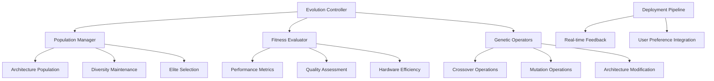

# evolutionary-diffusion-search

**Created:** 2025-10-14
**Status:** Migrated from .kiro
**Type:** Feature Request
**Source:** .kiro/specs/evolutionary-diffusion-search/

---

## Feature Description

# Requirements Document

## Introduction

The Self-Improving Diffusion Architecture with Evolutionary Search is a system that uses evolutionary algorithms and neural architecture search to continuously improve diffusion model architectures. The system focuses on automated architecture evolution, hardware-aware optimization, and real-time adaptation based on deployment performance metrics.

## Requirements & User Stories

# Requirements Document

## Introduction

The Self-Improving Diffusion Architecture with Evolutionary Search is a system that uses evolutionary algorithms and neural architecture search to continuously improve diffusion model architectures. The system focuses on automated architecture evolution, hardware-aware optimization, and real-time adaptation based on deployment performance metrics.

## Requirements

### Requirement 1

**User Story:** As an AI architecture researcher, I want evolutionary architecture search, so that I can automatically discover improved diffusion model architectures.

#### Acceptance Criteria

1. WHEN evolution is performed THEN the system SHALL use evolutionary algorithms to evolve diffusion model architectures
2. WHEN populations are managed THEN the system SHALL maintain diverse populations of architecture candidates
3. WHEN fitness is evaluated THEN the system SHALL assess architectures based on generation quality and efficiency
4. WHEN generations evolve THEN the system SHALL apply selection, crossover, and mutation operators

### Requirement 2

**User Story:** As a performance engineer, I want hardware-aware evolution, so that I can optimize architectures specifically for Apple Silicon constraints and capabilities.

#### Acceptance Criteria

1. WHEN hardware is considered THEN the system SHALL incorporate M1/M2-specific constraints in architecture search
2. WHEN optimization is performed THEN the system SHALL consider unified memory architecture in fitness evaluation
3. WHEN efficiency is measured THEN the system SHALL optimize for Apple Silicon's specific compute capabilities
4. WHEN architectures are evaluated THEN the system SHALL benchmark performance on actual Apple Silicon hardware

### Requirement 3

**User Story:** As a model architect, I want architecture mutation operators, so that I can systematically explore different architectural variations.

#### Acceptance Criteria

1. WHEN mutations are applied THEN the system SHALL modify layer types, connections, and attention mechanisms
2. WHEN complexity is managed THEN the system SHALL gradually increase model complexity during evolution
3. WHEN operators are used THEN the system SHALL apply intelligent mutation strategies based on architecture analysis
4. WHEN diversity is maintained THEN the system SHALL ensure population diversity through varied mutation operators

### Requirement 4

**User Story:** As a deployment engineer, I want automated deployment pipeline, so that I can continuously deploy and test evolved architectures in production.

#### Acceptance Criteria

1. WHEN architectures are evolved THEN the system SHALL automatically deploy promising candidates for testing
2. WHEN performance is monitored THEN the system SHALL track real-world deployment performance metrics
3. WHEN feedback is collected THEN the system SHALL incorporate user feedback into fitness evaluation
4. WHEN deployment is managed THEN the system SHALL handle rollback and version management automatically

### Requirement 5

**User Story:** As a researcher, I want real-time adaptation, so that I can continuously improve architectures based on actual usage patterns and performance data.

#### Acceptance Criteria

1. WHEN adaptation is performed THEN the system SHALL continuously evolve based on deployment performance metrics
2. WHEN feedback is integrated THEN the system SHALL incorporate human preferences into fitness evaluation
3. WHEN learning is transferred THEN the system SHALL apply architectural improvements across different domains
4. WHEN evolution continues THEN the system SHALL maintain long-term evolutionary progress tracking

### Requirement 6

**User Story:** As a researcher, I want integrated experiment tracking for evolutionary architecture search, so that I can track evolutionary experiments and compare architecture search strategies across different generations and fitness criteria.

#### Acceptance Criteria

1. WHEN evolutionary experiments are run THEN the system SHALL automatically log experiments to the shared MLFlow infrastructure
2. WHEN architectures are evolved THEN the system SHALL track evolutionary parameters, fitness scores, and architectural innovations
3. WHEN models are evolved THEN they SHALL be automatically registered in the shared model registry with evolutionary metadata
4. WHEN comparing strategies THEN the system SHALL provide cross-experiment comparison using shared analytics utilities

### Requirement 7

**User Story:** As an AI architect, I want automated evolutionary workflow management and deployment, so that I can efficiently orchestrate evolutionary processes while maintaining architecture performance monitoring.

#### Acceptance Criteria

1. WHEN evolutionary datasets are used THEN they SHALL be automatically tracked and versioned using the shared DVC system
2. WHEN evolved architectures are ready THEN they SHALL be automatically deployed to the shared serving infrastructure with performance monitoring
3. WHEN architecture performance degrades THEN the shared monitoring system SHALL alert and trigger evolutionary re-optimization
4. WHEN complex evolutionary workflows are needed THEN they SHALL be orchestrated using the shared Airflow infrastructure

## Architecture & Design

# Design Document

## Overview

The Self-Improving Diffusion Architecture with Evolutionary Search uses evolutionary algorithms and neural architecture search to continuously improve diffusion model architectures. The system focuses on automated architecture evolution, hardware-aware optimization, and real-time adaptation based on deployment performance metrics.

## Architecture

### High-Level Architecture



## Components and Interfaces

### Evolutionary Search Controller Interface

```python
from pathlib import Path
from typing import Dict, List, Optional, Any, Tuple
from dataclasses import dataclass
import torch
import torch.nn as nn
from enum import Enum

class ArchitectureComponent(Enum):
    ATTENTION_BLOCK = "attention"
    CONV_BLOCK = "conv"
    RESIDUAL_BLOCK = "residual"
    NORMALIZATION = "norm"
    ACTIVATION = "activation"

@dataclass
class ArchitectureGenome:
    layers: List[Dict[str, Any]]
    connections: List[Tuple[int, int]]
    parameters: Dict[str, Any]
    fitness_score: float = 0.0
    generation: int = 0

class EvolutionaryDiffusionSearch:
    """Evolutionary search for diffusion architectures."""

    def __init__(self, population_size: int = 50):
        self.population_size = population_size
        self.population = self._initialize_population()
        self.fitness_evaluator = PerformanceEvaluator()
        self.genetic_operators = GeneticOperators()
        self.deployment_manager = DeploymentManager()

    def evolve_generation(self) -> List[ArchitectureGenome]:
        """Evolve one generation of architectures."""
        pass

    def evaluate_fitness(
        self,
        genome: ArchitectureGenome
    ) -> Dict[str, float]:
        """Evaluate architecture fitness."""
        pass
```

### Genetic Operators Interface

```python
import random
from typing import List, Tuple

class GeneticOperators:
    """Genetic operators for architecture evolution."""

    def __init__(self, mutation_rate: float = 0.1, crossover_rate: float = 0.8):
        self.mutation_rate = mutation_rate
        self.crossover_rate = crossover_rate

    def crossover(
        self,
        parent1: ArchitectureGenome,
        parent2: ArchitectureGenome
    ) -> Tuple[ArchitectureGenome, ArchitectureGenome]:
        """Crossover two parent architectures."""
        pass

    def mutate(self, genome: ArchitectureGenome) -> ArchitectureGenome:
        """Mutate architecture genome."""
        pass

    def selection(
        self,
        population: List[ArchitectureGenome],
        fitness_scores: List[float],
        selection_size: int
    ) -> List[ArchitectureGenome]:
        """Select parents for next generation."""
        pass
```

## Data Models

```python
@dataclass
class EvolutionMetrics:
    generation: int
    best_fitness: float
    average_fitness: float
    diversity_score: float
    convergence_rate: float

@dataclass
class DeploymentFeedback:
    architecture_id: str
    user_ratings: List[float]
    performance_metrics: Dict[str, float]
    deployment_success: bool
    error_logs: List[str]
```

## Testing Strategy

```python
class TestEvolutionarySearch:
    def test_genetic_operators(self):
        """Test crossover and mutation operations."""
        pass

    def test_fitness_evaluation(self):
        """Test architecture fitness evaluation."""
        pass

    def test_evolution_convergence(self):
        """Test evolutionary algorithm convergence."""
        pass
```

## Implementation Tasks & Acceptance Criteria

# Implementation Plan

- [ ] 1. Set up evolutionary search environment
  - Create project structure with uv-based dependency management
  - Install evolutionary algorithms and neural architecture search libraries using uv
  - Set up pathlib-based file management for architectures and evolution results
  - _Requirements: 1.1, 1.2_

- [ ] 2. Implement evolutionary algorithm framework
  - [ ] 2.1 Create population management system
    - Write population initialization with diverse diffusion architectures
    - Implement population diversity maintenance and monitoring
    - Add elite preservation and generation management
    - Write unit tests for population management
    - _Requirements: 1.1, 1.4_

  - [ ] 2.2 Implement genetic operators
    - Write crossover operations for combining parent architectures
    - Implement mutation operations for architecture modification
    - Add selection algorithms for parent and survivor selection
    - Write integration tests for genetic operators
    - _Requirements: 3.1, 3.3_

- [ ] 3. Implement architecture representation and modification
  - [ ] 3.1 Create architecture genome representation
    - Write genome encoding for diffusion model architectures
    - Implement layer types, connections, and parameter representation
    - Add genome validation and constraint checking
    - Write unit tests for genome representation
    - _Requirements: 3.1, 3.2_

  - [ ] 3.2 Implement architecture mutation operators
    - Write layer modification mutations (add, remove, modify layers)
    - Implement connection mutations for changing architecture topology
    - Add parameter mutations for hyperparameter optimization
    - Write performance tests for mutation operations
    - _Requirements: 3.1, 3.3_

- [ ] 4. Implement fitness evaluation system
  - [ ] 4.1 Create multi-objective fitness evaluation
    - Write fitness evaluation combining generation quality, speed, and memory usage
    - Implement Pareto frontier analysis for multi-objective optimization
    - Add hardware-specific fitness components for Apple Silicon
    - Write unit tests for fitness evaluation
    - _Requirements: 2.1, 2.3_

  - [ ] 4.2 Implement hardware-aware fitness assessment
    - Write Apple Silicon-specific performance evaluation
    - Implement memory usage and efficiency scoring for M1/M2 hardware
    - Add hardware constraint validation and penalty functions
    - Write integration tests for hardware-aware evaluation
    - _Requirements: 2.1, 2.3_

- [ ] 5. Implement automated deployment and feedback system
  - [ ] 5.1 Create automated deployment pipeline
    - Write automatic deployment of evolved architectures for testing
    - Implement deployment validation and rollback mechanisms
    - Add deployment performance monitoring and logging
    - Write unit tests for deployment pipeline
    - _Requirements: 4.1, 4.3_

  - [ ] 5.2 Implement real-time feedback integration
    - Write real-time performance monitoring and feedback collection
    - Implement user preference integration into fitness evaluation
    - Add feedback-based fitness adjustment and learning
    - Write integration tests for feedback system
    - _Requirements: 4.2, 4.4_

- [ ] 6. Implement continuous evolution and adaptation
  - [ ] 6.1 Create long-term evolution tracking
    - Write evolution history tracking and analysis
    - Implement convergence detection and diversity maintenance
    - Add evolutionary progress visualization and reporting
    - Write unit tests for evolution tracking
    - _Requirements: 5.1, 5.4_

  - [ ] 6.2 Implement cross-domain knowledge transfer
    - Write knowledge transfer mechanisms between different domains
    - Implement architecture pattern recognition and reuse
    - Add domain adaptation for evolved architectures
    - Write end-to-end tests for knowledge transfer
    - _Requirements: 5.2, 5.3_

- [ ] 7. Implement comprehensive testing and validation
  - [ ] 7.1 Create evolutionary algorithm validation framework
    - Write comprehensive testing for evolutionary search algorithms
    - Implement convergence and performance validation
    - Add statistical analysis of evolutionary progress
    - Create continuous integration test configuration
    - _Requirements: 1.1, 1.2, 1.4_

  - [ ] 7.2 Implement architecture quality validation
    - Write automated quality assessment for evolved architectures
    - Implement comparison with baseline and state-of-the-art architectures
    - Add architecture stability and robustness testing
    - Write comprehensive architecture validation test suite
    - _Requirements: 2.1, 2.3, 4.1, 4.2_

---

**Migration Notes:**
- Consolidated from .kiro/specs/evolutionary-diffusion-search/
- Original files: requirements.md, design.md, tasks.md
- Ready for sage workflow processing
