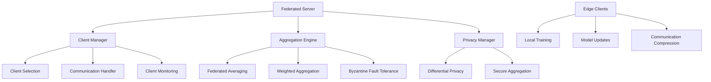

# federated-learning-system

**Created:** 2025-10-14
**Status:** Migrated from .kiro
**Type:** Feature Request
**Source:** .kiro/specs/federated-learning-system/

---

## Feature Description

# Requirements Document

## Introduction

The Federated Learning System for Lightweight Models is designed to coordinate multiple edge clients, focusing on efficient communication and model synchronization. The system emphasizes privacy-preserving learning, efficient communication protocols, and robust aggregation methods suitable for edge deployment scenarios.

## Requirements & User Stories

# Requirements Document

## Introduction

The Federated Learning System for Lightweight Models is designed to coordinate multiple edge clients, focusing on efficient communication and model synchronization. The system emphasizes privacy-preserving learning, efficient communication protocols, and robust aggregation methods suitable for edge deployment scenarios.

## Requirements

### Requirement 1

**User Story:** As a distributed systems engineer, I want a federated learning coordinator, so that I can train models across multiple edge clients while preserving data privacy.

#### Acceptance Criteria

1. WHEN clients are coordinated THEN the system SHALL implement federated averaging for model aggregation
2. WHEN updates are processed THEN the system SHALL use weighted averaging based on client data sizes
3. WHEN communication is managed THEN the system SHALL minimize communication overhead between clients and server
4. WHEN synchronization is performed THEN the system SHALL handle asynchronous client updates efficiently

### Requirement 2

**User Story:** As a privacy engineer, I want differential privacy protection, so that I can ensure client data privacy during model aggregation.

#### Acceptance Criteria

1. WHEN privacy is protected THEN the system SHALL add calibrated noise for privacy protection during aggregation
2. WHEN privacy budgets are managed THEN the system SHALL track and limit privacy budget consumption
3. WHEN noise is added THEN the system SHALL balance privacy protection with model utility
4. WHEN privacy guarantees are provided THEN the system SHALL offer configurable privacy levels

### Requirement 3

**User Story:** As a network engineer, I want efficient communication protocols, so that I can minimize bandwidth usage in federated learning scenarios.

#### Acceptance Criteria

1. WHEN gradients are transmitted THEN the system SHALL quantize gradients for efficient transmission
2. WHEN compression is applied THEN the system SHALL use gradient compression techniques to reduce communication costs
3. WHEN updates are sparse THEN the system SHALL support sparse gradient updates
4. WHEN bandwidth is limited THEN the system SHALL adapt communication frequency based on network conditions

### Requirement 4

**User Story:** As a system administrator, I want robust client management, so that I can handle unreliable clients and varying participation patterns.

#### Acceptance Criteria

1. WHEN clients are selected THEN the system SHALL implement adaptive client selection based on data quality and availability
2. WHEN clients are unreliable THEN the system SHALL handle clients with different training speeds and availability
3. WHEN malicious clients exist THEN the system SHALL provide Byzantine fault tolerance for robust aggregation
4. WHEN participation varies THEN the system SHALL adapt to changing client participation patterns

### Requirement 5

**User Story:** As a machine learning researcher, I want lightweight model optimization, so that I can deploy federated learning on resource-constrained edge devices.

#### Acceptance Criteria

1. WHEN models are optimized THEN the system SHALL focus on lightweight models suitable for edge deployment
2. WHEN resources are constrained THEN the system SHALL optimize for minimal computational and memory requirements
3. WHEN training is performed THEN the system SHALL support efficient local training on edge devices
4. WHEN convergence is monitored THEN the system SHALL provide convergence tracking with minimal overhead

### Requirement 6

**User Story:** As a researcher, I want integrated experiment tracking for federated learning, so that I can track distributed experiments and compare aggregation methods across different federated scenarios.

#### Acceptance Criteria

1. WHEN federated experiments are run THEN the system SHALL automatically log experiments to the shared MLFlow infrastructure
2. WHEN models are aggregated THEN the system SHALL track federated parameters, convergence metrics, and privacy-preserving statistics
3. WHEN models are trained THEN they SHALL be automatically registered in the shared model registry with federated learning metadata
4. WHEN comparing methods THEN the system SHALL provide cross-experiment comparison using shared analytics utilities

### Requirement 7

**User Story:** As a distributed systems engineer, I want automated federated workflow management and deployment, so that I can efficiently orchestrate federated learning while maintaining privacy and performance monitoring.

#### Acceptance Criteria

1. WHEN federated datasets are used THEN they SHALL be automatically tracked and versioned using the shared DVC system with privacy preservation
2. WHEN federated models are ready THEN they SHALL be automatically deployed to the shared serving infrastructure with edge optimization
3. WHEN model performance degrades THEN the shared monitoring system SHALL alert and suggest federated re-training
4. WHEN complex federated workflows are needed THEN they SHALL be orchestrated using the shared Airflow infrastructure

## Architecture & Design

# Design Document

## Overview

The Federated Learning System for Lightweight Models coordinates multiple edge clients with efficient communication and model synchronization. The system emphasizes privacy-preserving learning, efficient communication protocols, and robust aggregation methods suitable for edge deployment scenarios.

## Architecture

### High-Level Architecture



## Components and Interfaces

### Federated Server Interface

```python
from pathlib import Path
from typing import Dict, List, Optional, Any
from dataclasses import dataclass
import torch
import torch.nn as nn

@dataclass
class FederatedConfig:
    num_clients: int = 10
    clients_per_round: int = 5
    num_rounds: int = 100
    local_epochs: int = 5
    learning_rate: float = 0.01
    privacy_budget: float = 1.0
    compression_ratio: float = 0.1

class FederatedServer:
    """Main federated learning server."""

    def __init__(self, config: FederatedConfig, model_factory: callable):
        self.config = config
        self.global_model = model_factory()
        self.client_manager = ClientManager(config)
        self.aggregator = FederatedAggregator()
        self.privacy_manager = PrivacyManager(config.privacy_budget)

    def train_federated(self) -> Dict[str, Any]:
        """Execute federated training rounds."""
        pass

    def aggregate_updates(self, client_updates: List[Dict]) -> Dict[str, torch.Tensor]:
        """Aggregate client model updates."""
        pass
```

### Privacy Manager Interface

```python
import torch
import numpy as np
from typing import Dict, List, Tuple

class PrivacyManager:
    """Differential privacy and secure aggregation."""

    def __init__(self, privacy_budget: float = 1.0):
        self.privacy_budget = privacy_budget
        self.noise_multiplier = self._calculate_noise_multiplier()

    def add_noise_to_gradients(
        self,
        gradients: Dict[str, torch.Tensor],
        sensitivity: float = 1.0
    ) -> Dict[str, torch.Tensor]:
        """Add calibrated noise for differential privacy."""
        noisy_gradients = {}
        for name, grad in gradients.items():
            noise = torch.normal(
                mean=0.0,
                std=self.noise_multiplier * sensitivity,
                size=grad.shape,
                device=grad.device
            )
            noisy_gradients[name] = grad + noise
        return noisy_gradients

    def secure_aggregation(
        self,
        client_updates: List[Dict[str, torch.Tensor]]
    ) -> Dict[str, torch.Tensor]:
        """Secure multi-party aggregation."""
        pass
```

## Data Models

```python
@dataclass
class ClientUpdate:
    client_id: str
    model_parameters: Dict[str, torch.Tensor]
    num_samples: int
    training_loss: float
    training_time: float

@dataclass
class FederatedMetrics:
    round_number: int
    global_accuracy: float
    communication_cost: float
    privacy_spent: float
    convergence_rate: float
```

## Testing Strategy

```python
class TestFederatedLearning:
    def test_federated_averaging(self):
        """Test federated averaging algorithm."""
        pass

    def test_privacy_preservation(self):
        """Test differential privacy mechanisms."""
        pass

    def test_byzantine_robustness(self):
        """Test robustness against malicious clients."""
        pass
```

## Implementation Tasks & Acceptance Criteria

# Implementation Plan

- [ ] 1. Set up federated learning infrastructure
  - Create project structure with uv-based dependency management
  - Install federated learning libraries and communication frameworks using uv
  - Set up pathlib-based file management for client data and models
  - _Requirements: 1.1, 1.2_

- [ ] 2. Implement federated server architecture
  - [ ] 2.1 Create federated averaging implementation
    - Write federated averaging algorithm with weighted aggregation based on client data sizes
    - Implement global model parameter aggregation and distribution
    - Add convergence monitoring and early stopping
    - Write unit tests for federated averaging
    - _Requirements: 1.1, 1.2_

  - [ ] 2.2 Implement client selection and management
    - Write adaptive client selection based on data quality and availability
    - Implement client availability tracking and scheduling
    - Add client performance monitoring and evaluation
    - Write integration tests for client management
    - _Requirements: 4.1, 4.3_

- [ ] 3. Implement privacy-preserving mechanisms
  - [ ] 3.1 Create differential privacy system
    - Write differential privacy implementation with calibrated noise addition
    - Implement privacy budget tracking and management
    - Add privacy-utility trade-off analysis and optimization
    - Write unit tests for differential privacy
    - _Requirements: 2.1, 2.2, 2.3_

  - [ ] 3.2 Implement secure aggregation protocols
    - Write secure multi-party computation for model aggregation
    - Implement cryptographic protocols for privacy-preserving aggregation
    - Add secure communication channels between clients and server
    - Write integration tests for secure aggregation
    - _Requirements: 2.1, 2.4_

- [ ] 4. Implement communication optimization
  - [ ] 4.1 Create gradient compression system
    - Write gradient quantization and compression for efficient transmission
    - Implement sparse gradient updates and communication
    - Add adaptive compression based on network conditions
    - Write unit tests for communication compression
    - _Requirements: 3.1, 3.2, 3.4_

  - [ ] 4.2 Implement asynchronous communication handling
    - Write asynchronous client update handling with different training speeds
    - Implement communication scheduling and bandwidth management
    - Add network failure recovery and retry mechanisms
    - Write integration tests for asynchronous communication
    - _Requirements: 4.2, 4.4_

- [ ] 5. Implement lightweight model optimization
  - [ ] 5.1 Create edge-optimized model architectures
    - Write lightweight model designs suitable for edge deployment
    - Implement model compression and quantization for edge devices
    - Add hardware-specific optimizations for different edge platforms
    - Write unit tests for lightweight models
    - _Requirements: 5.1, 5.2, 5.3_

  - [ ] 5.2 Implement efficient local training
    - Write efficient local training algorithms with minimal computational requirements
    - Implement adaptive local training based on device capabilities
    - Add training progress monitoring with minimal overhead
    - Write performance tests for local training efficiency
    - _Requirements: 5.3, 5.4_

- [ ] 6. Implement robustness and fault tolerance
  - [ ] 6.1 Create Byzantine fault tolerance system
    - Write robust aggregation algorithms that handle malicious clients
    - Implement client validation and anomaly detection
    - Add Byzantine-robust federated averaging variants
    - Write unit tests for Byzantine fault tolerance
    - _Requirements: 4.3_

  - [ ] 6.2 Implement client dropout handling
    - Write algorithms that handle clients dropping out during training
    - Implement adaptive training that continues with available clients
    - Add client reliability scoring and selection
    - Write integration tests for dropout handling
    - _Requirements: 4.2, 4.4_

- [ ] 7. Implement comprehensive testing and validation
  - [ ] 7.1 Create federated learning simulation framework
    - Write simulation environment for testing federated algorithms
    - Implement realistic network conditions and client behavior simulation
    - Add scalability testing with varying numbers of clients
    - Write end-to-end tests for federated learning workflows
    - _Requirements: 1.1, 1.2, 4.1, 4.2_

  - [ ] 7.2 Implement privacy and security validation
    - Write privacy preservation validation and testing
    - Implement security audit tools for federated protocols
    - Add privacy budget tracking and validation
    - Write comprehensive security test suite
    - _Requirements: 2.1, 2.2, 2.3, 2.4_

---

**Migration Notes:**
- Consolidated from .kiro/specs/federated-learning-system/
- Original files: requirements.md, design.md, tasks.md
- Ready for sage workflow processing
