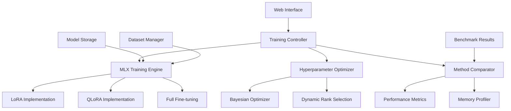

# lora-finetuning-mlx

**Created:** 2025-10-14
**Status:** Migrated from .kiro
**Type:** Feature Request
**Source:** .kiro/specs/lora-finetuning-mlx/

---

## Feature Description

# Requirements Document

## Introduction

The MLX-Native LoRA Fine-Tuning Framework is a comprehensive system for Parameter-Efficient Fine-Tuning (PEFT) using Apple's MLX framework. This project focuses on building an optimized LoRA fine-tuning system that leverages Apple Silicon's unified memory architecture and provides automated hyperparameter optimization, model comparison capabilities, and an interactive web interface for easy use.

## Requirements & User Stories

# Requirements Document

## Introduction

The MLX-Native LoRA Fine-Tuning Framework is a comprehensive system for Parameter-Efficient Fine-Tuning (PEFT) using Apple's MLX framework. This project focuses on building an optimized LoRA fine-tuning system that leverages Apple Silicon's unified memory architecture and provides automated hyperparameter optimization, model comparison capabilities, and an interactive web interface for easy use.

## Requirements

### Requirement 1

**User Story:** As a machine learning researcher, I want to fine-tune large language models efficiently on Apple Silicon, so that I can achieve good performance with limited computational resources.

#### Acceptance Criteria

1. WHEN a model is loaded THEN the system SHALL use MLX framework for 3-5x better performance than PyTorch
2. WHEN fine-tuning 7B models THEN the system SHALL use only 10-14GB RAM through memory optimization
3. WHEN training on small datasets THEN the system SHALL complete training in 15-20 minutes
4. WHEN using Apple Silicon THEN the system SHALL automatically detect and optimize for M1/M2 hardware

### Requirement 2

**User Story:** As a developer, I want automated hyperparameter optimization, so that I can achieve optimal results without manual tuning.

#### Acceptance Criteria

1. WHEN LoRA rank is selected THEN the system SHALL automatically optimize rank based on dataset complexity
2. WHEN hyperparameters are tuned THEN the system SHALL use Bayesian optimization for efficient search
3. WHEN training parameters are set THEN the system SHALL automatically adjust batch size based on available memory
4. WHEN optimization completes THEN the system SHALL provide detailed performance comparisons

### Requirement 3

**User Story:** As a researcher, I want to compare different PEFT methods, so that I can choose the best approach for my specific use case.

#### Acceptance Criteria

1. WHEN comparing methods THEN the system SHALL support LoRA, QLoRA, and full fine-tuning comparison
2. WHEN benchmarking is performed THEN the system SHALL measure training time, memory usage, and model quality
3. WHEN results are generated THEN the system SHALL provide comprehensive performance metrics and visualizations
4. WHEN methods are evaluated THEN the system SHALL recommend the optimal approach based on constraints

### Requirement 4

**User Story:** As a user, I want an interactive web interface, so that I can easily upload datasets and monitor training progress.

#### Acceptance Criteria

1. WHEN accessing the interface THEN the system SHALL provide a Gradio-based web frontend
2. WHEN datasets are uploaded THEN the system SHALL validate and preprocess data automatically
3. WHEN training is initiated THEN the system SHALL provide real-time progress monitoring
4. WHEN training completes THEN the system SHALL allow model download and inference testing

### Requirement 5

**User Story:** As a developer, I want efficient memory management, so that I can train larger models on limited hardware.

#### Acceptance Criteria

1. WHEN training is performed THEN the system SHALL use gradient checkpointing for memory efficiency
2. WHEN precision is configured THEN the system SHALL support mixed precision training
3. WHEN memory is constrained THEN the system SHALL automatically adjust batch sizes and sequence lengths
4. WHEN unified memory is available THEN the system SHALL optimize for Apple Silicon's memory architecture

### Requirement 6

**User Story:** As a researcher, I want integrated experiment tracking and model management, so that I can track my fine-tuning experiments and compare results across different configurations.

#### Acceptance Criteria

1. WHEN training starts THEN the system SHALL automatically log experiments to the shared MLFlow infrastructure
2. WHEN hyperparameters are optimized THEN the system SHALL track all optimization attempts and results
3. WHEN models are trained THEN they SHALL be automatically registered in the shared model registry with Apple Silicon metadata
4. WHEN comparing methods THEN the system SHALL provide cross-experiment comparison using shared analytics utilities

### Requirement 7

**User Story:** As a data scientist, I want automated data versioning and model deployment, so that I can reproduce experiments and deploy models efficiently.

#### Acceptance Criteria

1. WHEN datasets are used THEN they SHALL be automatically tracked and versioned using the shared DVC system
2. WHEN models are trained THEN they SHALL be automatically deployed to the shared serving infrastructure
3. WHEN model performance degrades THEN the shared monitoring system SHALL alert and trigger retraining
4. WHEN workflows are complex THEN they SHALL be orchestrated using the shared Airflow infrastructure

## Architecture & Design

# Design Document

## Overview

The MLX-Native LoRA Fine-Tuning Framework is designed as a comprehensive Parameter-Efficient Fine-Tuning (PEFT) system that leverages Apple's MLX framework for optimal performance on Apple Silicon. The system provides automated hyperparameter optimization, multi-method comparison capabilities, and an interactive web interface, all optimized for Apple Silicon's unified memory architecture.

## Architecture

### High-Level Architecture



### Core Components

#### 1. MLX Training Engine

**Purpose**: Core training functionality optimized for Apple Silicon

**Key Features**:

- Native MLX operations for 3-5x performance improvement
- Unified memory optimization
- Dynamic batch sizing based on available memory
- Mixed precision training support

#### 2. PEFT Method Implementations

**Purpose**: Multiple PEFT method implementations for comparison

**Supported Methods**:

- LoRA (Low-Rank Adaptation)
- QLoRA (Quantized LoRA)
- Full fine-tuning baseline

#### 3. Hyperparameter Optimization System

**Purpose**: Automated optimization of training parameters

**Components**:

- Bayesian optimization for efficient search
- Dynamic LoRA rank selection
- Memory-aware batch size optimization
- Learning rate scheduling

## Components and Interfaces

### Training Controller Interface

```python
from pathlib import Path
from typing import Dict, List, Optional, Union
import mlx.core as mx
from dataclasses import dataclass

@dataclass
class TrainingConfig:
    model_name: str
    dataset_path: Path
    output_path: Path
    method: str  # "lora", "qlora", "full"
    max_iters: int = 1000
    batch_size: Optional[int] = None  # Auto-determined if None
    learning_rate: float = 1e-4
    lora_rank: Optional[int] = None  # Auto-optimized if None
    lora_alpha: float = 16.0
    optimization_level: int = 2

class MLXTrainingController:
    """Main controller for MLX-optimized fine-tuning."""

    def __init__(self, config: TrainingConfig):
        self.config = config
        self.device_info = self._detect_hardware()
        self.memory_manager = MemoryManager(self.device_info)

    def train(self) -> Dict[str, float]:
        """Execute training with Apple Silicon optimizations."""
        pass

    def compare_methods(self, methods: List[str]) -> Dict[str, Dict[str, float]]:
        """Compare multiple PEFT methods."""
        pass
```

### MLX Training Engine Interface

```python
import mlx.core as mx
import mlx.nn as nn
from mlx_lm import load, generate

class MLXLoRATrainer:
    """MLX-native LoRA implementation."""

    def __init__(self, model_path: str, lora_config: Dict):
        self.model, self.tokenizer = load(model_path)
        self.lora_config = lora_config
        self._setup_lora_layers()

    def _setup_lora_layers(self):
        """Initialize LoRA layers with MLX operations."""
        for name, module in self.model.named_modules():
            if isinstance(module, nn.Linear) and self._should_adapt(name):
                self._add_lora_layer(name, module)

    def forward_with_lora(self, x: mx.array) -> mx.array:
        """Forward pass with LoRA adaptations."""
        pass

    def train_step(self, batch: Dict[str, mx.array]) -> Dict[str, float]:
        """Single training step with MLX optimizations."""
        pass
```

### Hyperparameter Optimizer Interface

```python
from sklearn.gaussian_process import GaussianProcessRegressor
from sklearn.gaussian_process.kernels import Matern

class BayesianHyperparameterOptimizer:
    """Bayesian optimization for hyperparameter tuning."""

    def __init__(self, search_space: Dict[str, tuple]):
        self.search_space = search_space
        self.gp = GaussianProcessRegressor(kernel=Matern(nu=2.5))
        self.history = []

    def suggest_parameters(self) -> Dict[str, Union[int, float]]:
        """Suggest next hyperparameter configuration."""
        pass

    def update_results(self, params: Dict, performance: float):
        """Update optimizer with training results."""
        pass

    def optimize_lora_rank(self, dataset_complexity: float) -> int:
        """Automatically determine optimal LoRA rank."""
        pass
```

## Data Models

### Training Configuration Model

```python
from dataclasses import dataclass
from pathlib import Path
from typing import Optional, Dict, Any

@dataclass
class LoRAConfig:
    rank: int = 8
    alpha: float = 16.0
    dropout: float = 0.1
    target_modules: List[str] = None

@dataclass
class TrainingMetrics:
    loss: float
    perplexity: float
    training_time: float
    memory_usage: float
    tokens_per_second: float

@dataclass
class ModelCheckpoint:
    path: Path
    iteration: int
    metrics: TrainingMetrics
    config: TrainingConfig
    timestamp: str
```

### Hardware Configuration Model

```python
@dataclass
class HardwareInfo:
    device_type: str  # "m1", "m2", "cpu"
    total_memory: int  # in GB
    available_memory: int  # in GB
    metal_available: bool
    mps_available: bool
    optimization_level: int

@dataclass
class MemoryProfile:
    peak_memory: float
    average_memory: float
    memory_efficiency: float
    batch_size_recommendation: int
```

## Error Handling

### Hardware Compatibility Errors

```python
class MLXCompatibilityError(Exception):
    """Raised when MLX optimizations are not available."""
    pass

class MemoryConstraintError(Exception):
    """Raised when memory requirements exceed available resources."""
    pass

def handle_training_errors(func):
    """Decorator for graceful error handling in training."""
    def wrapper(*args, **kwargs):
        try:
            return func(*args, **kwargs)
        except MLXCompatibilityError:
            logger.warning("MLX not available, falling back to PyTorch MPS")
            return fallback_to_mps(*args, **kwargs)
        except MemoryConstraintError as e:
            logger.warning(f"Memory constraint: {e}, reducing batch size")
            return retry_with_smaller_batch(*args, **kwargs)
    return wrapper
```

### Training Pipeline Error Recovery

```python
class TrainingPipeline:
    def __init__(self, config: TrainingConfig):
        self.config = config
        self.checkpoint_manager = CheckpointManager(config.output_path)

    def train_with_recovery(self):
        """Training with automatic error recovery."""
        try:
            return self._train_loop()
        except Exception as e:
            logger.error(f"Training failed: {e}")
            if self.checkpoint_manager.has_checkpoints():
                logger.info("Attempting recovery from checkpoint")
                return self._recover_from_checkpoint()
            else:
                raise e
```

## Testing Strategy

### Unit Testing Framework

```python
import pytest
from unittest.mock import Mock, patch
from pathlib import Path

class TestMLXLoRATrainer:
    @pytest.fixture
    def mock_mlx_model(self):
        """Mock MLX model for testing."""
        with patch('mlx_lm.load') as mock_load:
            mock_model = Mock()
            mock_tokenizer = Mock()
            mock_load.return_value = (mock_model, mock_tokenizer)
            yield mock_model, mock_tokenizer

    @pytest.fixture
    def temp_config(self, tmp_path):
        """Temporary configuration for testing."""
        return TrainingConfig(
            model_name="test-model",
            dataset_path=tmp_path / "data",
            output_path=tmp_path / "output",
            method="lora"
        )

    def test_lora_layer_initialization(self, mock_mlx_model, temp_config):
        """Test LoRA layer setup."""
        trainer = MLXLoRATrainer("test-model", {"rank": 8})
        assert trainer.lora_config["rank"] == 8

    @patch('mlx.metal.is_available', return_value=True)
    def test_apple_silicon_optimization(self, mock_metal, temp_config):
        """Test Apple Silicon optimization detection."""
        controller = MLXTrainingController(temp_config)
        assert controller.device_info.metal_available == True
```

### Integration Testing

```python
class TestTrainingIntegration:
    def test_end_to_end_training(self, sample_dataset, temp_output_dir):
        """Test complete training pipeline."""
        config = TrainingConfig(
            model_name="microsoft/DialoGPT-small",
            dataset_path=sample_dataset,
            output_path=temp_output_dir,
            method="lora",
            max_iters=10  # Short training for testing
        )

        controller = MLXTrainingController(config)
        results = controller.train()

        assert "loss" in results
        assert "training_time" in results
        assert results["loss"] > 0

    def test_method_comparison(self, sample_dataset, temp_output_dir):
        """Test PEFT method comparison."""
        config = TrainingConfig(
            model_name="microsoft/DialoGPT-small",
            dataset_path=sample_dataset,
            output_path=temp_output_dir,
            method="lora",
            max_iters=5
        )

        controller = MLXTrainingController(config)
        results = controller.compare_methods(["lora", "qlora"])

        assert "lora" in results
        assert "qlora" in results
        assert all("loss" in method_results for method_results in results.values())
```

### Performance Testing

```python
class TestPerformanceBenchmarks:
    @pytest.mark.benchmark
    def test_training_speed_benchmark(self, benchmark, sample_config):
        """Benchmark training speed on Apple Silicon."""
        controller = MLXTrainingController(sample_config)

        def train_single_epoch():
            return controller.train_single_epoch()

        result = benchmark(train_single_epoch)

        # Assert performance targets
        assert result["tokens_per_second"] > 100  # Minimum performance

    @pytest.mark.memory
    def test_memory_usage_profiling(self, sample_config):
        """Profile memory usage during training."""
        controller = MLXTrainingController(sample_config)

        with MemoryProfiler() as profiler:
            controller.train()

        profile = profiler.get_profile()
        assert profile.peak_memory < 14 * 1024**3  # Under 14GB for 7B model
```

## Implementation Tasks & Acceptance Criteria

# Implementation Plan

- [ ] 1. Set up project structure and MLX environment
  - Create standardized project directory structure with src, tests, and notebooks
  - Initialize uv-based pyproject.toml with MLX and related dependencies
  - Set up pathlib-based configuration management
  - _Requirements: 1.1, 1.4_

- [ ] 2. Implement core MLX training infrastructure
  - [ ] 2.1 Create MLX hardware detection and optimization setup
    - Write hardware detection module to identify Apple Silicon capabilities
    - Implement automatic MLX configuration with memory limits
    - Create fallback mechanisms for non-Apple Silicon hardware
    - Write unit tests for hardware detection
    - _Requirements: 1.1, 1.4_

  - [ ] 2.2 Implement MLX-native LoRA layer implementation
    - Write LoRA layer classes using MLX operations
    - Implement forward pass with LoRA adaptations
    - Create parameter initialization and management
    - Write unit tests for LoRA layer functionality
    - _Requirements: 1.1, 1.2_

  - [ ] 2.3 Create MLX training loop with memory optimization
    - Implement training loop with gradient computation using MLX
    - Add dynamic batch sizing based on available memory
    - Implement gradient checkpointing for memory efficiency
    - Write integration tests for training loop
    - _Requirements: 1.2, 5.1, 5.3_

- [ ] 3. Implement PEFT method variations
  - [ ] 3.1 Create QLoRA implementation with MLX
    - Write quantized LoRA implementation using MLX quantization
    - Implement 4-bit and 8-bit quantization options
    - Add memory usage comparison with standard LoRA
    - Write unit tests for QLoRA functionality
    - _Requirements: 3.1, 3.2_

  - [ ] 3.2 Implement full fine-tuning baseline
    - Write full parameter fine-tuning implementation
    - Add memory management for full fine-tuning
    - Create performance comparison utilities
    - Write integration tests for full fine-tuning
    - _Requirements: 3.1, 3.3_

  - [ ] 3.3 Create method comparison framework
    - Implement automated comparison between LoRA, QLoRA, and full fine-tuning
    - Add performance metrics collection (speed, memory, accuracy)
    - Create visualization tools for method comparison
    - Write end-to-end tests for method comparison
    - _Requirements: 3.1, 3.2, 3.3, 3.4_

- [ ] 4. Implement automated hyperparameter optimization
  - [ ] 4.1 Create Bayesian optimization framework
    - Write Bayesian optimizer using scikit-learn Gaussian processes
    - Implement hyperparameter search space definition
    - Add optimization history tracking and visualization
    - Write unit tests for optimization framework
    - _Requirements: 2.1, 2.2_

  - [ ] 4.2 Implement dynamic LoRA rank selection
    - Write dataset complexity analysis for rank determination
    - Implement automatic rank optimization based on dataset characteristics
    - Add rank performance validation and adjustment
    - Write integration tests for rank selection
    - _Requirements: 2.1, 2.4_

  - [ ] 4.3 Create memory-aware batch size optimization
    - Implement automatic batch size determination based on available memory
    - Add batch size scaling with gradient accumulation
    - Create memory usage monitoring and adjustment
    - Write performance tests for batch size optimization
    - _Requirements: 2.3, 5.3, 5.4_

- [ ] 5. Implement interactive web interface
  - [ ] 5.1 Create Gradio-based training interface
    - Write Gradio application for dataset upload and configuration
    - Implement real-time training progress monitoring
    - Add model configuration and hyperparameter adjustment interface
    - Write integration tests for web interface
    - _Requirements: 4.1, 4.3_

  - [ ] 5.2 Implement dataset validation and preprocessing
    - Write dataset format validation and error handling
    - Implement automatic data preprocessing and tokenization
    - Add dataset statistics and visualization
    - Write unit tests for data processing
    - _Requirements: 4.2_

  - [ ] 5.3 Create real-time monitoring dashboard
    - Implement live training metrics display
    - Add memory usage and performance monitoring
    - Create training progress visualization with charts
    - Write end-to-end tests for monitoring functionality
    - _Requirements: 4.3_

- [ ] 6. Implement memory management and optimization
  - [ ] 6.1 Create gradient checkpointing system
    - Implement gradient checkpointing for memory efficiency
    - Add configurable checkpointing strategies
    - Create memory usage profiling and reporting
    - Write performance tests for memory optimization
    - _Requirements: 5.1, 5.4_

  - [ ] 6.2 Implement mixed precision training
    - Write mixed precision training support using MLX
    - Add automatic loss scaling and gradient clipping
    - Create precision configuration and validation
    - Write unit tests for mixed precision functionality
    - _Requirements: 5.2_

  - [ ] 6.3 Create unified memory architecture optimization
    - Implement Apple Silicon unified memory optimizations
    - Add memory sharing between CPU and GPU operations
    - Create memory pool management for efficient allocation
    - Write integration tests for unified memory usage
    - _Requirements: 5.4, 1.4_

- [ ] 7. Implement model inference and deployment
  - [ ] 7.1 Create optimized inference pipeline
    - Write MLX-optimized inference implementation
    - Implement batch inference for multiple inputs
    - Add inference speed benchmarking and optimization
    - Write unit tests for inference functionality
    - _Requirements: 4.4_

  - [ ] 7.2 Implement model export and serialization
    - Write model checkpoint saving and loading using pathlib
    - Implement LoRA adapter export for deployment
    - Add model format conversion utilities
    - Write integration tests for model serialization
    - _Requirements: 4.4_

  - [ ] 7.3 Create deployment templates
    - Write FastAPI server template for model serving
    - Implement Core ML export for iOS deployment
    - Add Docker configuration for containerized deployment
    - Write end-to-end tests for deployment workflows
    - _Requirements: 4.4_

- [ ] 8. Implement comprehensive testing and benchmarking
  - [ ] 8.1 Create performance benchmarking suite
    - Write benchmarking framework for training speed measurement
    - Implement memory usage profiling and analysis
    - Add comparison with PyTorch baseline implementations
    - Create automated benchmark reporting
    - _Requirements: 1.1, 1.2, 1.3_

  - [ ] 8.2 Implement accuracy validation framework
    - Write model quality assessment utilities
    - Implement perplexity and other language model metrics
    - Add downstream task evaluation capabilities
    - Write comprehensive validation test suite
    - _Requirements: 3.3, 3.4_

  - [ ] 8.3 Create integration and end-to-end testing
    - Write complete workflow testing from data loading to model deployment
    - Implement cross-platform compatibility testing
    - Add error handling and recovery testing
    - Create continuous integration test configuration
    - _Requirements: 1.4, 4.1, 4.2, 4.3, 4.4_

---

**Migration Notes:**
- Consolidated from .kiro/specs/lora-finetuning-mlx/
- Original files: requirements.md, design.md, tasks.md
- Ready for sage workflow processing
