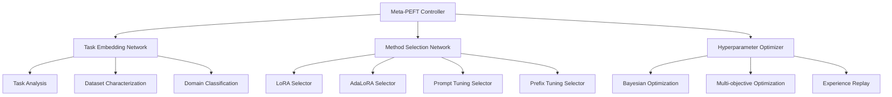

# meta-learning-peft-system

**Created:** 2025-10-14
**Status:** Migrated from .kiro
**Type:** Feature Request
**Source:** .kiro/specs/meta-learning-peft-system/

---

## Feature Description

# Requirements Document

## Introduction

The Meta-Learning PEFT System with MLX is a framework that automatically selects and configures the best Parameter-Efficient Fine-Tuning method for any given task. The system uses meta-learning to learn from previous fine-tuning experiences and provides intelligent method selection, automated hyperparameter optimization, and cross-task knowledge transfer.

## Requirements & User Stories

# Requirements Document

## Introduction

The Meta-Learning PEFT System with MLX is a framework that automatically selects and configures the best Parameter-Efficient Fine-Tuning method for any given task. The system uses meta-learning to learn from previous fine-tuning experiences and provides intelligent method selection, automated hyperparameter optimization, and cross-task knowledge transfer.

## Requirements

### Requirement 1

**User Story:** As a machine learning researcher, I want automatic PEFT method selection, so that I can choose the optimal fine-tuning approach without manual experimentation.

#### Acceptance Criteria

1. WHEN tasks are analyzed THEN the system SHALL automatically select from LoRA, AdaLoRA, prompt tuning, prefix tuning, and P-tuning methods
2. WHEN method selection is performed THEN the system SHALL use task embeddings to predict optimal PEFT methods
3. WHEN recommendations are made THEN the system SHALL provide confidence scores for method selection
4. WHEN multiple methods are suitable THEN the system SHALL rank methods by expected performance

### Requirement 2

**User Story:** As a developer, I want task embedding capabilities, so that I can convert tasks to vector representations for intelligent method selection.

#### Acceptance Criteria

1. WHEN tasks are embedded THEN the system SHALL convert task characteristics to vector representations
2. WHEN embeddings are created THEN the system SHALL capture dataset size, complexity, and domain information
3. WHEN similarity is measured THEN the system SHALL identify similar tasks for knowledge transfer
4. WHEN embeddings are updated THEN the system SHALL continuously improve task representations

### Requirement 3

**User Story:** As a researcher, I want few-shot learning capabilities, so that I can quickly adapt to new tasks with minimal training data.

#### Acceptance Criteria

1. WHEN few-shot learning is performed THEN the system SHALL adapt quickly to new tasks with minimal data
2. WHEN adaptation is done THEN the system SHALL leverage meta-learning for rapid task adaptation
3. WHEN knowledge is transferred THEN the system SHALL use previous task experience for new task learning
4. WHEN performance is measured THEN the system SHALL achieve good performance with limited examples

### Requirement 4

**User Story:** As an optimization engineer, I want automated hyperparameter optimization, so that I can achieve optimal PEFT configuration without manual tuning.

#### Acceptance Criteria

1. WHEN hyperparameters are optimized THEN the system SHALL use Bayesian optimization for efficient search
2. WHEN configurations are tested THEN the system SHALL automatically tune learning rates, ranks, and other PEFT parameters
3. WHEN optimization is performed THEN the system SHALL balance accuracy, training time, and memory usage
4. WHEN results are provided THEN the system SHALL offer multiple Pareto-optimal configurations

### Requirement 5

**User Story:** As a continual learning researcher, I want dynamic method switching, so that I can change PEFT methods during training based on performance feedback.

#### Acceptance Criteria

1. WHEN performance is monitored THEN the system SHALL track training progress and method effectiveness
2. WHEN switching is needed THEN the system SHALL change PEFT methods during training based on performance
3. WHEN knowledge is preserved THEN the system SHALL avoid catastrophic forgetting when switching methods
4. WHEN uncertainty is quantified THEN the system SHALL provide confidence estimates for method performance

### Requirement 6

**User Story:** As a researcher, I want integrated experiment tracking for meta-learning PEFT, so that I can track meta-learning experiments and compare method selection strategies across different tasks and domains.

#### Acceptance Criteria

1. WHEN meta-learning experiments are run THEN the system SHALL automatically log experiments to the shared MLFlow infrastructure
2. WHEN PEFT methods are selected THEN the system SHALL track method selection decisions, task embeddings, and performance outcomes
3. WHEN models are trained THEN they SHALL be automatically registered in the shared model registry with meta-learning metadata
4. WHEN comparing strategies THEN the system SHALL provide cross-experiment comparison using shared analytics utilities

### Requirement 7

**User Story:** As a machine learning engineer, I want automated meta-learning workflow management and deployment, so that I can efficiently orchestrate meta-learning processes while maintaining knowledge transfer monitoring.

#### Acceptance Criteria

1. WHEN meta-learning datasets are used THEN they SHALL be automatically tracked and versioned using the shared DVC system
2. WHEN meta-learned models are ready THEN they SHALL be automatically deployed to the shared serving infrastructure with method selection capabilities
3. WHEN method selection performance degrades THEN the shared monitoring system SHALL alert and suggest meta-model retraining
4. WHEN complex meta-learning workflows are needed THEN they SHALL be orchestrated using the shared Airflow infrastructure

## Architecture & Design

# Design Document

## Overview

The Meta-Learning PEFT System with MLX is a framework that automatically selects and configures the best Parameter-Efficient Fine-Tuning method for any given task. The system uses meta-learning to learn from previous fine-tuning experiences and provides intelligent method selection, automated hyperparameter optimization, and cross-task knowledge transfer.

## Architecture

### High-Level Architecture



## Components and Interfaces

### Meta-Learning Controller Interface

```python
from pathlib import Path
from typing import Dict, List, Optional, Any, Tuple
from dataclasses import dataclass
from enum import Enum
import torch
import torch.nn as nn

class PEFTMethod(Enum):
    LORA = "lora"
    ADALORA = "adalora"
    PROMPT_TUNING = "prompt_tuning"
    PREFIX_TUNING = "prefix_tuning"
    P_TUNING = "p_tuning"

@dataclass
class TaskCharacteristics:
    dataset_size: int
    sequence_length: int
    vocabulary_size: int
    domain: str
    task_type: str
    complexity_score: float

class MetaPEFTSystem:
    """Meta-learning system for PEFT method selection."""

    def __init__(self):
        self.task_embedder = TaskEmbeddingNetwork()
        self.method_selector = MethodSelectionNetwork()
        self.hyperparameter_optimizer = MetaHyperparameterOptimizer()
        self.experience_buffer = ExperienceBuffer()

    def predict_optimal_method(
        self,
        task_characteristics: TaskCharacteristics
    ) -> Tuple[PEFTMethod, Dict[str, Any]]:
        """Predict optimal PEFT method and hyperparameters."""
        pass

    def learn_from_experience(
        self,
        task_characteristics: TaskCharacteristics,
        method_used: PEFTMethod,
        hyperparameters: Dict[str, Any],
        performance_metrics: Dict[str, float]
    ):
        """Learn from fine-tuning experience."""
        pass
```

### Task Embedding Network Interface

```python
import torch
import torch.nn as nn
from typing import Dict, Any

class TaskEmbeddingNetwork(nn.Module):
    """Neural network for task embedding."""

    def __init__(self, embedding_dim: int = 128):
        super().__init__()
        self.embedding_dim = embedding_dim
        self.feature_encoder = self._build_encoder()

    def _build_encoder(self) -> nn.Module:
        """Build task feature encoder."""
        return nn.Sequential(
            nn.Linear(10, 64),  # 10 task features
            nn.ReLU(),
            nn.Linear(64, 128),
            nn.ReLU(),
            nn.Linear(128, self.embedding_dim)
        )

    def forward(self, task_features: torch.Tensor) -> torch.Tensor:
        """Encode task into embedding vector."""
        return self.feature_encoder(task_features)

    def extract_task_features(
        self,
        task_characteristics: TaskCharacteristics
    ) -> torch.Tensor:
        """Extract numerical features from task characteristics."""
        features = torch.tensor([
            task_characteristics.dataset_size,
            task_characteristics.sequence_length,
            task_characteristics.vocabulary_size,
            task_characteristics.complexity_score,
            # Add more features as needed
        ], dtype=torch.float32)
        return features
```

## Data Models

```python
@dataclass
class PEFTExperience:
    task_embedding: torch.Tensor
    method_used: PEFTMethod
    hyperparameters: Dict[str, Any]
    performance_metrics: Dict[str, float]
    training_time: float
    memory_usage: float

@dataclass
class MethodRecommendation:
    method: PEFTMethod
    confidence: float
    hyperparameters: Dict[str, Any]
    expected_performance: Dict[str, float]
    reasoning: str
```

## Testing Strategy

```python
class TestMetaPEFTSystem:
    def test_task_embedding(self):
        """Test task embedding generation."""
        pass

    def test_method_selection(self):
        """Test PEFT method selection."""
        pass

    def test_hyperparameter_optimization(self):
        """Test meta-learned hyperparameter optimization."""
        pass
```

## Implementation Tasks & Acceptance Criteria

# Implementation Plan

- [ ] 1. Set up meta-learning PEFT environment
  - Create project structure with uv-based dependency management
  - Install meta-learning and PEFT libraries using uv
  - Set up pathlib-based file management for experiments and models
  - _Requirements: 1.1, 1.2_

- [ ] 2. Implement task embedding system
  - [ ] 2.1 Create task characterization framework
    - Write task analysis system to extract dataset and domain characteristics
    - Implement automatic task complexity scoring and classification
    - Add task similarity measurement and clustering
    - Write unit tests for task characterization
    - _Requirements: 2.1, 2.2_

  - [ ] 2.2 Implement neural task embedding network
    - Write neural network for converting task characteristics to embeddings
    - Implement embedding space optimization for task similarity
    - Add embedding visualization and analysis tools
    - Write integration tests for task embedding
    - _Requirements: 2.1, 2.4_

- [ ] 3. Implement PEFT method selection system
  - [ ] 3.1 Create method selection neural network
    - Write neural network for predicting optimal PEFT methods
    - Implement confidence scoring for method recommendations
    - Add method ranking and comparison capabilities
    - Write unit tests for method selection
    - _Requirements: 1.1, 1.4_

  - [ ] 3.2 Implement method zoo and configuration
    - Write comprehensive PEFT method implementations (LoRA, AdaLoRA, prompt tuning, etc.)
    - Implement method-specific configuration and parameter management
    - Add method compatibility checking and validation
    - Write integration tests for method zoo
    - _Requirements: 1.1, 1.4_

- [ ] 4. Implement meta-learning framework
  - [ ] 4.1 Create few-shot learning system
    - Write few-shot adaptation algorithms for new tasks
    - Implement rapid task adaptation with minimal examples
    - Add meta-learning optimization and gradient-based adaptation
    - Write unit tests for few-shot learning
    - _Requirements: 3.1, 3.2_

  - [ ] 4.2 Implement experience replay and learning
    - Write experience buffer for storing and replaying past experiments
    - Implement continual learning to avoid catastrophic forgetting
    - Add experience-based method and hyperparameter recommendation
    - Write integration tests for experience replay
    - _Requirements: 3.3, 3.4_

- [ ] 5. Implement automated hyperparameter optimization
  - [ ] 5.1 Create meta-learned hyperparameter optimization
    - Write Bayesian optimization enhanced with meta-learning
    - Implement multi-objective optimization for accuracy, time, and memory
    - Add hyperparameter transfer learning across similar tasks
    - Write unit tests for hyperparameter optimization
    - _Requirements: 4.1, 4.3_

  - [ ] 5.2 Implement dynamic method switching
    - Write system for changing PEFT methods during training based on performance
    - Implement performance monitoring and method switching triggers
    - Add method transition handling and state preservation
    - Write performance tests for dynamic switching
    - _Requirements: 5.1, 5.3_

- [ ] 6. Implement uncertainty quantification and validation
  - [ ] 6.1 Create confidence estimation system
    - Write uncertainty quantification for method selection and performance prediction
    - Implement confidence intervals and prediction reliability scoring
    - Add uncertainty-aware decision making and recommendation
    - Write unit tests for uncertainty quantification
    - _Requirements: 5.4_

  - [ ] 6.2 Implement cross-task knowledge transfer
    - Write knowledge transfer mechanisms between related tasks
    - Implement task similarity-based knowledge sharing
    - Add transfer learning validation and effectiveness measurement
    - Write end-to-end tests for knowledge transfer
    - _Requirements: 3.3, 3.4_

- [ ] 7. Implement comprehensive testing and validation
  - [ ] 7.1 Create meta-learning validation framework
    - Write comprehensive testing for meta-learning algorithms
    - Implement cross-validation for meta-learning performance
    - Add meta-learning convergence and stability testing
    - Create continuous integration test configuration
    - _Requirements: 1.1, 1.2, 1.4_

  - [ ] 7.2 Implement PEFT method comparison and validation
    - Write automated comparison of different PEFT methods across tasks
    - Implement statistical significance testing for method performance
    - Add method recommendation accuracy validation
    - Write comprehensive method validation test suite
    - _Requirements: 3.1, 3.2, 4.1, 4.3_

---

**Migration Notes:**
- Consolidated from .kiro/specs/meta-learning-peft-system/
- Original files: requirements.md, design.md, tasks.md
- Ready for sage workflow processing
