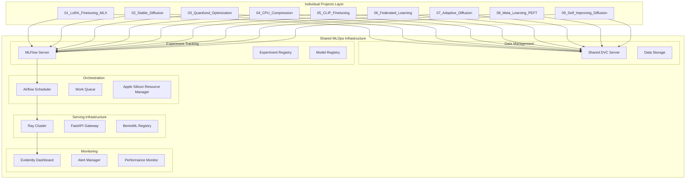

# mlops-integration

**Created:** 2025-10-14
**Status:** Migrated from .kiro
**Type:** Feature Request
**Source:** .kiro/specs/mlops-integration/

---

## Feature Description

# MLOps Integration Requirements Document

## Introduction

This feature integrates modern MLOps tools (DVC, MLFlow, Airflow, FastAPI/Ray/BentoML, and Evidently) into the EfficientAI-MLX-Toolkit as shared infrastructure components. The integration creates a centralized, production-ready MLOps platform that serves all individual projects in the toolkit while maintaining Apple Silicon optimization throughout. This shared approach ensures consistency, reduces resource overhead, and provides unified management across all 9 individual projects.

## Requirements & User Stories

# MLOps Integration Requirements Document

## Introduction

This feature integrates modern MLOps tools (DVC, MLFlow, Airflow, FastAPI/Ray/BentoML, and Evidently) into the EfficientAI-MLX-Toolkit as shared infrastructure components. The integration creates a centralized, production-ready MLOps platform that serves all individual projects in the toolkit while maintaining Apple Silicon optimization throughout. This shared approach ensures consistency, reduces resource overhead, and provides unified management across all 9 individual projects.

## Requirements

### Requirement 1: Data Versioning and Management

**User Story:** As an ML engineer, I want to version control my datasets and model artifacts so that I can reproduce experiments and collaborate effectively with my team.

#### Acceptance Criteria

1. WHEN a user initializes a project THEN the system SHALL automatically configure DVC for data versioning
2. WHEN training data is added to a project THEN DVC SHALL track the data files and create version hashes
3. WHEN model artifacts are generated THEN the system SHALL automatically version them with DVC
4. IF remote storage is configured THEN DVC SHALL sync data to cloud storage (S3, GCS, Azure)
5. WHEN a user switches between data versions THEN the system SHALL update local files accordingly

### Requirement 2: Experiment Tracking and Comparison

**User Story:** As a researcher, I want to track and compare different training experiments so that I can identify the best performing models and optimization techniques.

#### Acceptance Criteria

1. WHEN a training run starts THEN MLFlow SHALL automatically log system information including Apple Silicon hardware details
2. WHEN training progresses THEN the system SHALL log MLX-specific metrics (memory usage, MPS utilization, training speed)
3. WHEN comparing experiments THEN MLFlow SHALL display Apple Silicon performance comparisons alongside standard metrics
4. IF multiple optimization techniques are tested THEN the system SHALL track which techniques provide the best Apple Silicon performance
5. WHEN a model is registered THEN MLFlow SHALL store model metadata including Apple Silicon compatibility information

### Requirement 3: Workflow Orchestration

**User Story:** As a DevOps engineer, I want to orchestrate complex ML workflows so that I can automate training, evaluation, and deployment processes.

#### Acceptance Criteria

1. WHEN a workflow is defined THEN Airflow SHALL support Apple Silicon-specific task scheduling
2. WHEN training tasks are executed THEN the system SHALL monitor thermal conditions and adjust scheduling accordingly
3. WHEN federated learning workflows run THEN Airflow SHALL coordinate multiple Apple Silicon nodes
4. IF a workflow fails THEN the system SHALL provide Apple Silicon-specific debugging information
5. WHEN workflows complete THEN the system SHALL trigger downstream tasks like model serving updates

### Requirement 4: Model Serving and Deployment

**User Story:** As a product manager, I want to deploy trained models as scalable APIs so that applications can consume ML predictions in real-time.

#### Acceptance Criteria

1. WHEN a model is ready for deployment THEN the system SHALL package it using BentoML with Apple Silicon optimizations
2. WHEN serving requests arrive THEN FastAPI SHALL route them to MLX-optimized inference endpoints
3. WHEN high load is detected THEN Ray SHALL scale serving instances while respecting Apple Silicon memory constraints
4. IF MPS acceleration is available THEN the serving system SHALL automatically utilize it for inference
5. WHEN models are updated THEN the serving system SHALL perform zero-downtime deployments

### Requirement 5: Model and Data Monitoring

**User Story:** As an ML engineer, I want to monitor model performance and data drift so that I can maintain model quality in production.

#### Acceptance Criteria

1. WHEN predictions are made THEN Evidently SHALL collect prediction data for drift analysis
2. WHEN data drift is detected THEN the system SHALL alert stakeholders and suggest retraining
3. WHEN Apple Silicon performance degrades THEN the monitoring system SHALL identify potential causes
4. IF model accuracy drops below thresholds THEN the system SHALL trigger automated retraining workflows
5. WHEN monitoring reports are generated THEN they SHALL include Apple Silicon-specific performance metrics

### Requirement 6: Shared Infrastructure Setup and Management

**User Story:** As a developer, I want a centralized MLOps infrastructure that automatically serves all individual projects so that I can focus on model development without managing separate MLOps instances.

#### Acceptance Criteria

1. WHEN the shared infrastructure is initialized THEN all MLOps tools SHALL be configured once and serve all individual projects
2. WHEN a new individual project is created THEN it SHALL automatically connect to the shared MLOps infrastructure
3. WHEN shared dependencies are installed THEN UV SHALL manage all MLOps packages in the shared layer efficiently
4. IF individual projects have conflicting requirements THEN the shared infrastructure SHALL handle them gracefully
5. WHEN accessing MLOps tools THEN all projects SHALL use the same centralized instances (MLFlow server, Airflow scheduler, etc.)

### Requirement 7: Centralized Cross-Project Management

**User Story:** As a team lead, I want a unified MLOps dashboard that aggregates data from all toolkit projects so that I can manage the entire toolkit from a single interface.

#### Acceptance Criteria

1. WHEN accessing MLFlow UI THEN it SHALL display experiments from all 9 individual projects in organized workspaces
2. WHEN viewing model registry THEN models from all projects SHALL be accessible in a unified registry with project tags
3. WHEN monitoring models THEN the dashboard SHALL show performance metrics across all deployed project models
4. IF projects use different model types THEN the shared infrastructure SHALL handle heterogeneous models appropriately
5. WHEN generating reports THEN they SHALL provide both project-specific and toolkit-wide analytics

### Requirement 8: Shared Apple Silicon Performance Optimization

**User Story:** As a performance engineer, I want the shared MLOps infrastructure to leverage Apple Silicon capabilities across all projects so that the entire toolkit runs efficiently.

#### Acceptance Criteria

1. WHEN the shared infrastructure runs THEN it SHALL detect and utilize Apple Silicon hardware features for all connected projects
2. WHEN any project processes data THEN the shared DVC system SHALL optimize for unified memory architecture
3. WHEN serving models from any project THEN the shared serving infrastructure SHALL prefer MLX over PyTorch when available
4. IF thermal throttling occurs THEN the shared Airflow scheduler SHALL adjust task scheduling across all projects
5. WHEN monitoring performance THEN the shared monitoring system SHALL track Apple Silicon-specific metrics for all projects

### Requirement 9: Shared Resource Management

**User Story:** As a system administrator, I want efficient resource sharing across all projects so that hardware utilization is optimized and costs are minimized.

#### Acceptance Criteria

1. WHEN multiple projects run simultaneously THEN the shared infrastructure SHALL manage Apple Silicon resources efficiently
2. WHEN projects compete for resources THEN the system SHALL implement fair scheduling and priority management
3. WHEN serving multiple models THEN the shared Ray cluster SHALL optimize memory usage across all project models
4. IF resource limits are reached THEN the system SHALL provide clear feedback and queuing mechanisms
5. WHEN scaling infrastructure THEN it SHALL scale based on aggregate demand from all projects

## Architecture & Design

# MLOps Integration Design Document

## Overview

This design outlines the integration of modern MLOps tools (DVC, MLFlow, Airflow, FastAPI/Ray/BentoML, and Evidently) as shared infrastructure components within the EfficientAI-MLX-Toolkit. The integration creates a centralized, production-ready MLOps platform that serves all 9 individual projects while leveraging Apple Silicon optimizations throughout.

The design follows a shared infrastructure approach where MLOps tools are deployed once and serve all individual projects, ensuring consistency, reducing resource overhead, and providing unified management. Each individual project connects to and utilizes the shared MLOps services while maintaining project-specific configurations and data isolation.

## Architecture

### High-Level Architecture



### Component Integration Flow

1. **Shared Data Pipeline**: Individual projects → Shared DVC → Centralized data storage → MLX processing
2. **Unified Experiment Tracking**: All projects → Shared MLFlow server → Centralized experiment registry
3. **Centralized Orchestration**: Shared Airflow → Multi-project workflows → Apple Silicon resource management
4. **Unified Serving**: All project models → Shared Ray cluster → Centralized API gateway → Load balancing
5. **Consolidated Monitoring**: All deployments → Shared Evidently → Unified dashboard → Cross-project alerts

### Shared Infrastructure Benefits

- **Resource Efficiency**: Single MLFlow server, Airflow instance, and Ray cluster serve all projects
- **Unified Management**: One dashboard to monitor all 9 projects
- **Consistent Configuration**: Standardized MLOps setup across all projects
- **Cross-Project Analytics**: Compare performance and experiments across different project types
- **Simplified Maintenance**: Update MLOps tools once for all projects

## Components and Interfaces

### 1. Shared Data Versioning Layer (DVC)

**Purpose**: Centralized version control for datasets, model artifacts, and experiment configurations across all individual projects.

**Apple Silicon Optimizations**:

- Unified memory-aware data loading for all projects
- Optimized file I/O for Apple Silicon storage with shared caching
- Integration with MLX data loaders across project boundaries

**Key Components**:

```python
# shared/mlops/data_versioning/dvc_manager.py
class SharedDVCManager:
    def __init__(self, shared_storage_path: Path, remote_storage: Optional[str] = None):
        self.shared_storage_path = shared_storage_path
        self.dvc_repo = dvc.Repo(shared_storage_path)
        self.remote_storage = remote_storage
        self.project_registry = {}

    def register_project(self, project_name: str, project_path: Path):
        """Register an individual project with the shared DVC system"""

    def track_dataset(self, project_name: str, data_path: Path) -> str:
        """Track dataset for a specific project with shared storage"""

    def track_model(self, project_name: str, model_path: Path, metadata: Dict) -> str:
        """Track model artifacts with project isolation and Apple Silicon metadata"""

    def load_data_version(self, project_name: str, version_hash: str) -> Path:
        """Load specific data version for a project, optimized for MLX"""

    def get_cross_project_datasets(self) -> Dict[str, List[str]]:
        """Get datasets that can be shared across projects"""
```

**Shared Configuration**:

```yaml
# shared/mlops/config/dvc.yaml
core:
    remote: shared-apple-silicon-storage

remotes:
    shared-apple-silicon-storage:
        url: s3://mlx-toolkit-shared-data

cache:
    type: symlink
    shared: true  # Enable cross-project cache sharing

projects:
    lora-finetuning:
        path: projects/01_LoRA_Finetuning_MLX
    stable-diffusion:
        path: projects/02_Stable_Diffusion
    # ... other projects
```

### 2. Shared Experiment Tracking Layer (MLFlow)

**Purpose**: Centralized experiment tracking and model registry serving all individual projects with unified analytics.

**Apple Silicon Optimizations**:

- Custom metrics for MLX performance across all projects
- Hardware utilization tracking with cross-project comparison
- Unified model registry with Apple Silicon compatibility metadata

**Key Components**:

```python
# shared/mlops/experiment_tracking/mlflow_manager.py
class SharedMLFlowManager:
    def __init__(self, tracking_uri: str, shared_registry_uri: str):
        self.tracking_uri = tracking_uri
        self.registry_uri = shared_registry_uri
        self.client = mlflow.tracking.MlflowClient(tracking_uri)
        self.hardware_info = self._detect_apple_silicon()

    def create_project_experiment(self, project_name: str) -> str:
        """Create experiment namespace for an individual project"""

    def start_run(self, project_name: str, run_name: str) -> mlflow.ActiveRun:
        """Start MLFlow run with project context and Apple Silicon info"""

    def log_cross_project_comparison(self, baseline_project: str,
                                   comparison_project: str, metrics: Dict):
        """Log comparison metrics between different projects"""

    def register_model_with_project_context(self, project_name: str,
                                          model_name: str, model_uri: str):
        """Register model in shared registry with project tagging"""

    def get_project_leaderboard(self, project_name: str) -> pd.DataFrame:
        """Get performance leaderboard for a specific project"""

    def get_cross_project_analytics(self) -> Dict[str, Any]:
        """Get analytics comparing performance across all projects"""
```

**Shared MLFlow Configuration**:

```python
# shared/mlops/config/mlflow_config.py
SHARED_MLFLOW_CONFIG = {
    "tracking_uri": "http://localhost:5000",
    "registry_uri": "sqlite:///shared/mlops/mlflow/registry.db",
    "artifact_root": "shared/mlops/mlflow/artifacts",
    "experiments": {
        "lora-finetuning": "01_LoRA_Finetuning_MLX",
        "stable-diffusion": "02_Stable_Diffusion",
        "quantized-optimization": "03_Quantized_Optimization",
        # ... other projects
    },
    "apple_silicon_metrics": [
        "mlx_training_speed_ratio",
        "unified_memory_efficiency",
        "mps_gpu_utilization",
        "thermal_impact_score"
    ]
}
```

### 3. Shared Workflow Orchestration Layer (Airflow)

**Purpose**: Centralized workflow orchestration with Apple Silicon-aware scheduling across all projects.

**Apple Silicon Optimizations**:

- Thermal-aware task scheduling across all projects
- Memory-conscious parallel execution with resource sharing
- MLX-optimized Docker containers for all project workflows

**Key Components**:

```python
# shared/mlops/orchestration/airflow_manager.py
class SharedAirflowManager:
    def __init__(self, airflow_home: Path):
        self.airflow_home = airflow_home
        self.thermal_monitor = SharedThermalMonitor()
        self.resource_manager = AppleSiliconResourceManager()

    def create_project_dag(self, project_name: str, dag_config: Dict) -> DAG:
        """Create DAG for a specific project with shared resource management"""

    def schedule_cross_project_workflow(self, projects: List[str],
                                      workflow_type: str) -> DAG:
        """Create workflow that spans multiple projects"""

    def manage_thermal_scheduling(self, active_tasks: List[BaseOperator]):
        """Adjust scheduling based on thermal conditions across all projects"""

    def allocate_apple_silicon_resources(self, project_name: str,
                                       resource_requirements: Dict) -> Dict:
        """Allocate Apple Silicon resources fairly across projects"""
```

**Shared DAG Templates**:

```python
# shared/mlops/orchestration/dag_templates.py
def create_shared_training_pipeline(projects: List[str]) -> DAG:
    """Create training pipeline that can handle multiple projects"""

def create_federated_learning_dag(participating_projects: List[str]) -> DAG:
    """Create federated learning workflow across multiple projects"""

def create_model_comparison_dag(baseline_project: str,
                               comparison_projects: List[str]) -> DAG:
    """Create workflow to compare models across projects"""
```

### 4. Shared Model Serving Layer (FastAPI + Ray + BentoML)

**Purpose**: Unified model serving infrastructure that can serve models from all individual projects.

**Apple Silicon Optimizations**:

- MLX-native inference endpoints for all project models
- MPS-accelerated batch processing with resource sharing
- Unified memory-aware request handling across all models

**Key Components**:

#### Shared BentoML Service Registry

```python
# shared/mlops/serving/bento_registry.py
class SharedBentoRegistry:
    def __init__(self, registry_path: Path):
        self.registry_path = registry_path
        self.model_registry = {}
        self.hardware_optimizer = AppleSiliconOptimizer()

    def register_project_model(self, project_name: str, model_name: str,
                             model_service: bentoml.Service):
        """Register a model from an individual project"""

    def create_unified_service(self) -> bentoml.Service:
        """Create unified service that can serve all project models"""

    def route_request_to_project_model(self, project_name: str,
                                     model_name: str, input_data: Any):
        """Route inference request to specific project model"""
```

#### Shared FastAPI Gateway

```python
# shared/mlops/serving/fastapi_gateway.py
class SharedFastAPIGateway:
    def __init__(self, bento_registry: SharedBentoRegistry):
        self.app = FastAPI(title="EfficientAI-MLX-Toolkit API Gateway")
        self.bento_registry = bento_registry
        self.setup_routes()

    def setup_routes(self):
        """Setup routes for all project models"""

    @app.middleware("http")
    async def apple_silicon_middleware(self, request: Request, call_next):
        """Middleware for Apple Silicon performance optimization"""

    @app.post("/predict/{project_name}/{model_name}")
    async def predict(self, project_name: str, model_name: str,
                     input_data: Dict[str, Any]):
        """Unified prediction endpoint for all project models"""
```

#### Shared Ray Cluster

```python
# shared/mlops/serving/ray_cluster.py
class SharedRayCluster:
    def __init__(self, cluster_config: Dict):
        self.cluster_config = cluster_config
        self.model_deployments = {}

    def deploy_project_model(self, project_name: str, model_name: str,
                           model_service: Any):
        """Deploy model from individual project to shared Ray cluster"""

    def scale_deployment(self, project_name: str, model_name: str,
                        num_replicas: int):
        """Scale specific project model deployment"""

    def get_cluster_resource_usage(self) -> Dict[str, Any]:
        """Get resource usage across all deployed models"""
```

### 5. Shared Monitoring Layer (Evidently)

**Purpose**: Unified monitoring dashboard for all project models with cross-project analytics.

**Apple Silicon Optimizations**:

- Hardware performance monitoring across all projects
- MLX-specific metric collection with project comparison
- Thermal impact tracking during inference across all models

**Key Components**:

```python
# shared/mlops/monitoring/evidently_manager.py
class SharedEvidentlyManager:
    def __init__(self, monitoring_config: Dict):
        self.monitoring_config = monitoring_config
        self.project_monitors = {}
        self.hardware_monitor = SharedAppleSiliconMonitor()

    def create_project_monitor(self, project_name: str, model_name: str):
        """Create monitoring suite for a specific project model"""

    def create_cross_project_dashboard(self) -> Dashboard:
        """Create unified dashboard showing all project metrics"""

    def monitor_cross_project_drift(self, reference_project: str,
                                  comparison_projects: List[str]) -> Report:
        """Monitor data drift across multiple projects"""

    def generate_toolkit_performance_report(self) -> Report:
        """Generate comprehensive performance report for entire toolkit"""
```

## Data Models

### 1. Shared Project Registry

```python
@dataclass
class ProjectRegistration:
    project_name: str
    project_path: Path
    project_type: str  # "easy", "intermediate", "advanced"
    mlops_config: Dict[str, Any]
    registered_at: datetime
    active: bool
```

### 2. Cross-Project Experiment Metadata

```python
@dataclass
class SharedExperimentMetadata:
    experiment_id: str
    project_name: str
    model_type: str
    dataset_version: str
    apple_silicon_config: AppleSiliconConfig
    mlx_version: str
    optimization_techniques: List[str]
    performance_metrics: Dict[str, float]
    cross_project_comparisons: Dict[str, float]
    created_at: datetime
```

### 3. Shared Resource Configuration

```python
@dataclass
class SharedResourceConfig:
    total_memory_gb: int
    available_gpu_cores: int
    thermal_threshold: float
    project_allocations: Dict[str, ResourceAllocation]
    current_usage: ResourceUsage

@dataclass
class ResourceAllocation:
    project_name: str
    memory_limit_gb: float
    gpu_core_limit: int
    priority: int  # 1-10, higher is more priority
```

## Error Handling

### 1. Shared Infrastructure Errors

```python
class SharedInfrastructureError(Exception):
    """Base class for shared infrastructure errors"""

class ProjectRegistrationError(SharedInfrastructureError):
    """Raised when project registration fails"""

class ResourceAllocationError(SharedInfrastructureError):
    """Raised when resource allocation fails"""

class CrossProjectConflictError(SharedInfrastructureError):
    """Raised when projects have conflicting requirements"""
```

### 2. Graceful Degradation for Shared Services

```python
class SharedMLOpsManager:
    def __init__(self):
        self.available_services = self._detect_available_services()
        self.project_registry = {}

    def _detect_available_services(self) -> Dict[str, bool]:
        """Detect which shared MLOps services are available"""
        return {
            "shared_dvc": self._check_shared_dvc_available(),
            "shared_mlflow": self._check_shared_mlflow_available(),
            "shared_airflow": self._check_shared_airflow_available(),
            "shared_serving": self._check_shared_serving_available(),
            "shared_monitoring": self._check_shared_monitoring_available(),
        }

    def execute_with_project_isolation(self, project_name: str,
                                     operation: Callable, fallback: Callable):
        """Execute operation with project isolation and fallback"""
```

## Testing Strategy

### 1. Shared Infrastructure Testing

- Test shared service initialization and configuration
- Test project registration and isolation
- Test resource allocation and management
- Test cross-project interactions

### 2. Multi-Project Integration Testing

```python
class SharedInfrastructureTests:
    def test_multi_project_experiment_tracking(self):
        """Test MLFlow tracking across multiple projects"""

    def test_shared_resource_allocation(self):
        """Test fair resource allocation across projects"""

    def test_cross_project_model_serving(self):
        """Test serving models from different projects"""

    def test_unified_monitoring_dashboard(self):
        """Test monitoring dashboard with all project data"""
```

### 3. Apple Silicon Shared Resource Testing

```python
class SharedAppleSiliconTests:
    def test_thermal_aware_multi_project_scheduling(self):
        """Test thermal management across multiple projects"""

    def test_unified_memory_sharing(self):
        """Test memory sharing between projects"""

    def test_cross_project_performance_comparison(self):
        """Test performance comparison across projects"""
```

This shared infrastructure design provides a centralized MLOps platform that serves all individual projects while maintaining Apple Silicon optimization and ensuring efficient resource utilization across the entire toolkit.

## Implementation Tasks & Acceptance Criteria

# Implementation Plan

- [ ] 1. Set up shared MLOps infrastructure and project structure
  - Create shared/mlops directory structure for all MLOps components
  - Define base interfaces and abstract classes for shared MLOps services
  - Implement project registration system for individual projects
  - Create shared configuration management system
  - _Requirements: 6.1, 6.2, 7.1_

- [ ] 2. Implement shared Apple Silicon hardware detection and optimization utilities
  - [ ] 2.1 Create shared hardware detection module
    - Write SharedAppleSiliconDetector class to identify M1/M2/M3 chips
    - Implement memory, GPU cores, and Neural Engine detection for shared use
    - Create hardware capability registry for all projects
    - Write unit tests for hardware detection across different systems
    - _Requirements: 8.1, 9.1_

  - [ ] 2.2 Implement shared thermal monitoring utilities
    - Write SharedThermalMonitor class for cross-project temperature tracking
    - Create thermal state detection with project-aware scheduling
    - Implement thermal-aware resource allocation across projects
    - Write unit tests with mocked thermal data for multiple projects
    - _Requirements: 8.4, 9.2_

  - [ ] 2.3 Create shared unified memory optimization utilities
    - Write SharedUnifiedMemoryManager for cross-project memory management
    - Implement memory-aware resource allocation algorithms
    - Create memory usage monitoring and reporting across all projects
    - Write unit tests for shared memory optimization strategies
    - _Requirements: 8.2, 9.3_

- [ ] 3. Implement shared DVC integration for centralized data versioning
  - [ ] 3.1 Create shared DVC manager class
    - Write SharedDVCManager class with centralized data storage
    - Implement project registration and data isolation
    - Create cross-project dataset sharing capabilities
    - Write unit tests for shared DVC operations
    - _Requirements: 1.1, 1.2, 7.1_

  - [ ] 3.2 Implement shared data loading optimizations
    - Create MLX-optimized data loaders that work across all projects
    - Implement unified memory-aware data loading with caching
    - Write shared data pipeline integration with version control
    - Create integration tests with multiple project datasets
    - _Requirements: 1.4, 1.5, 8.2_

  - [ ] 3.3 Create shared DVC configuration and project templates
    - Write shared configuration generators for all storage backends
    - Implement project-specific DVC configurations with shared storage
    - Create project initialization scripts with shared DVC setup
    - Write tests for shared configuration generation
    - _Requirements: 1.3, 6.2_

- [ ] 4. Implement shared MLFlow experiment tracking infrastructure
  - [ ] 4.1 Create shared MLFlow manager class
    - Write SharedMLFlowManager class with centralized tracking server
    - Implement project-specific experiment namespaces
    - Create shared model registry with project tagging
    - Write unit tests for shared tracking functionality
    - _Requirements: 2.1, 2.5, 7.1_

  - [ ] 4.2 Implement cross-project MLX metrics collection
    - Create shared metrics collectors for MLX performance across projects
    - Implement cross-project performance comparison utilities
    - Write shared Apple Silicon hardware metrics logging
    - Create project leaderboards and analytics dashboards
    - Write unit tests for cross-project metrics collection
    - _Requirements: 2.2, 2.3, 7.5_

  - [ ] 4.3 Create shared experiment comparison and analytics
    - Write cross-project experiment comparison functions
    - Implement toolkit-wide performance analytics
    - Create visualization helpers for multi-project metrics
    - Write integration tests with experiments from multiple projects
    - _Requirements: 2.4, 7.5_

- [ ] 5. Implement shared Airflow workflow orchestration infrastructure
  - [ ] 5.1 Create shared Airflow manager and DAG templates
    - Write SharedAirflowManager class for centralized workflow management
    - Implement project-specific DAG creation with shared resources
    - Create shared DAG templates for common multi-project workflows
    - Write unit tests for shared DAG generation
    - _Requirements: 3.1, 3.2, 7.2_

  - [ ] 5.2 Implement shared resource management and scheduling
    - Create AppleSiliconResourceManager for fair resource allocation
    - Implement thermal-aware scheduling across all projects
    - Write cross-project workflow coordination logic
    - Create integration tests with multiple project workflows
    - _Requirements: 3.3, 9.2, 9.4_

  - [ ] 5.3 Create shared workflow monitoring and error handling
    - Implement shared workflow failure detection and recovery
    - Create cross-project debugging and logging infrastructure
    - Write automated retraining triggers with project prioritization
    - Create unit tests for shared error handling scenarios
    - _Requirements: 3.4, 3.5, 9.5_

- [ ] 6. Implement shared model serving infrastructure
  - [ ] 6.1 Create shared BentoML service registry
    - Write SharedBentoRegistry class for centralized model management
    - Implement project model registration and isolation
    - Create unified service that can serve all project models
    - Write unit tests for shared service functionality
    - _Requirements: 4.1, 7.3_

  - [ ] 6.2 Implement shared FastAPI gateway
    - Write SharedFastAPIGateway class with unified API endpoints
    - Create project-aware request routing and load balancing
    - Implement shared Apple Silicon performance middleware
    - Write API endpoint tests with requests for multiple projects
    - _Requirements: 4.2, 4.5_

  - [ ] 6.3 Create shared Ray cluster deployment
    - Write SharedRayCluster class for centralized distributed serving
    - Implement cross-project resource management and scaling
    - Create auto-scaling logic based on aggregate demand
    - Write integration tests for multi-project distributed serving
    - _Requirements: 4.3, 9.3_

  - [ ] 6.4 Implement shared serving configuration management
    - Create shared serving configuration templates
    - Write project-specific configuration inheritance system
    - Implement dynamic configuration updates across all projects
    - Create tests for shared configuration management
    - _Requirements: 4.5, 6.3_

- [ ] 7. Implement shared monitoring and alerting infrastructure
  - [ ] 7.1 Create shared Evidently monitoring system
    - Write SharedEvidentlyManager class for centralized monitoring
    - Implement project-specific monitoring with unified dashboard
    - Create cross-project drift detection and comparison
    - Write unit tests for shared monitoring functionality
    - _Requirements: 5.1, 5.2, 7.4_

  - [ ] 7.2 Implement shared Apple Silicon performance monitoring
    - Create shared hardware performance metric collectors
    - Implement cross-project MLX performance tracking
    - Write shared thermal impact monitoring during inference
    - Create toolkit-wide performance degradation detection
    - Write unit tests for shared performance monitoring
    - _Requirements: 5.3, 8.5, 9.5_

  - [ ] 7.3 Create shared alerting and notification system
    - Implement shared alert generation for all project models
    - Create unified notification channels with project context
    - Write cross-project automated retraining trigger logic
    - Create integration tests for shared alerting system
    - _Requirements: 5.4, 5.5_

- [ ] 8. Create shared configuration and project management system
  - [ ] 8.1 Implement shared project initialization system
    - Write SharedMLOpsInitializer class for new project onboarding
    - Create project registration and configuration templates
    - Implement shared MLOps service connection for new projects
    - Write initialization tests with multiple sample projects
    - _Requirements: 6.1, 6.2, 7.1_

  - [ ] 8.2 Create shared dependency management integration
    - Update main pyproject.toml with shared MLOps dependencies
    - Implement UV package management for shared MLOps infrastructure
    - Create optional dependency groups for different shared services
    - Write dependency resolution tests for shared infrastructure
    - _Requirements: 6.2, 6.4_

  - [ ] 8.3 Implement cross-project configuration inheritance
    - Create shared configuration management with project overrides
    - Implement configuration validation and conflict resolution
    - Write configuration synchronization across all projects
    - Create tests for cross-project configuration scenarios
    - _Requirements: 7.2, 7.3, 6.5_

- [ ] 9. Create shared integration examples and documentation
  - [ ] 9.1 Implement shared MLOps examples for all project types
    - Create shared MLOps integration examples for LoRA fine-tuning project
    - Write examples for diffusion model optimization with shared infrastructure
    - Implement federated learning examples using shared orchestration
    - Create comprehensive shared integration tests
    - _Requirements: 7.4, 7.5_

  - [ ] 9.2 Create shared performance benchmarking suite
    - Write benchmarking utilities for shared MLOps overhead measurement
    - Implement cross-project Apple Silicon performance comparison tools
    - Create automated benchmark reporting for entire toolkit
    - Write benchmark validation tests for shared infrastructure
    - _Requirements: 8.3, 8.5_

  - [ ] 9.3 Implement shared error handling and graceful degradation
    - Create SharedMLOpsManager class for service availability detection
    - Implement fallback strategies when shared services are unavailable
    - Write comprehensive error handling for all shared integrations
    - Create error handling tests with various shared service failure scenarios
    - _Requirements: 6.4, 6.5_

- [ ] 10. Create comprehensive testing suite for shared infrastructure
  - [ ] 10.1 Implement unit tests for all shared components
    - Write unit tests for shared hardware detection utilities
    - Create unit tests for each shared MLOps integration component
    - Implement mock testing for shared Apple Silicon features
    - Create test coverage reporting for shared infrastructure
    - _Requirements: All requirements_

  - [ ] 10.2 Create integration tests for shared end-to-end workflows
    - Write integration tests for complete shared MLOps pipelines
    - Create tests for cross-project interactions and resource sharing
    - Implement shared Apple Silicon hardware-specific tests
    - Create performance regression tests for shared infrastructure
    - _Requirements: 7.1, 7.2, 7.3, 9.1_

  - [ ] 10.3 Implement CI/CD pipeline for shared infrastructure
    - Create GitHub Actions workflows for shared infrastructure deployment
    - Implement automated testing on shared Apple Silicon runners
    - Write deployment automation for shared MLOps services
    - Create continuous benchmarking and monitoring for shared infrastructure
    - _Requirements: 6.5, 8.1, 9.5_

---

**Migration Notes:**
- Consolidated from .kiro/specs/mlops-integration/
- Original files: requirements.md, design.md, tasks.md
- Ready for sage workflow processing
