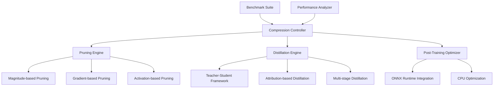

# model-compression-pipeline

**Created:** 2025-10-14
**Status:** Migrated from .kiro
**Type:** Feature Request
**Source:** .kiro/specs/model-compression-pipeline/

---

## Feature Description

# Requirements Document

## Introduction

The CPU-Optimized Model Compression Pipeline is an intelligent system that specializes in CPU-efficient model optimization techniques. This project focuses on structured pruning, knowledge distillation, and architecture optimization specifically designed for CPU deployment, providing a competitive advantage in edge deployment scenarios where GPU resources are not available.

## Requirements & User Stories

# Requirements Document

## Introduction

The CPU-Optimized Model Compression Pipeline is an intelligent system that specializes in CPU-efficient model optimization techniques. This project focuses on structured pruning, knowledge distillation, and architecture optimization specifically designed for CPU deployment, providing a competitive advantage in edge deployment scenarios where GPU resources are not available.

## Requirements

### Requirement 1

**User Story:** As a deployment engineer, I want CPU-optimized model compression, so that I can deploy efficient models in edge environments without GPU dependencies.

#### Acceptance Criteria

1. WHEN models are compressed THEN the system SHALL specialize in CPU-efficient optimization techniques
2. WHEN pruning is applied THEN the system SHALL use structured pruning for better CPU performance
3. WHEN optimization is performed THEN the system SHALL focus on edge deployment scenarios
4. WHEN benchmarking is done THEN the system SHALL compare against GPU-optimized baselines

### Requirement 2

**User Story:** As a researcher, I want automated pruning strategies, so that I can apply multiple pruning techniques and find the optimal compression approach.

#### Acceptance Criteria

1. WHEN pruning is initiated THEN the system SHALL combine magnitude, gradient, and activation-based pruning
2. WHEN strategies are selected THEN the system SHALL automatically choose optimal pruning methods
3. WHEN neurons are removed THEN the system SHALL use structured pruning to remove entire neurons or channels
4. WHEN pruning completes THEN the system SHALL validate model performance and accuracy retention

### Requirement 3

**User Story:** As a machine learning engineer, I want knowledge distillation capabilities, so that I can create smaller student models that retain the performance of larger teacher models.

#### Acceptance Criteria

1. WHEN distillation is performed THEN the system SHALL support teacher-student architecture with 3B to 500M parameter reduction
2. WHEN knowledge is transferred THEN the system SHALL use attribution-based distillation for efficient transfer
3. WHEN training is staged THEN the system SHALL support multi-stage distillation through intermediate models
4. WHEN generative models are used THEN the system SHALL apply reverse KLD optimization

### Requirement 4

**User Story:** As a developer, I want post-training optimization, so that I can apply compression techniques to already-trained models without retraining.

#### Acceptance Criteria

1. WHEN optimization is applied THEN the system SHALL work with pre-trained models without requiring retraining
2. WHEN techniques are combined THEN the system SHALL apply multiple post-training optimization methods
3. WHEN ONNX integration is used THEN the system SHALL provide CPU-optimized inference deployment
4. WHEN performance is measured THEN the system SHALL benchmark inference speed and accuracy trade-offs

### Requirement 5

**User Story:** As a performance engineer, I want comprehensive benchmarking, so that I can compare CPU-optimized models against GPU-optimized alternatives.

#### Acceptance Criteria

1. WHEN benchmarks are run THEN the system SHALL provide detailed CPU performance metrics
2. WHEN comparisons are made THEN the system SHALL compare against GPU-optimized model baselines
3. WHEN edge scenarios are tested THEN the system SHALL simulate real-world edge deployment conditions
4. WHEN results are reported THEN the system SHALL highlight CPU efficiency advantages and use cases

### Requirement 6

**User Story:** As a researcher, I want integrated experiment tracking for model compression, so that I can track compression experiments and compare optimization results across different techniques and architectures.

#### Acceptance Criteria

1. WHEN compression experiments are run THEN the system SHALL automatically log experiments to the shared MLFlow infrastructure
2. WHEN models are compressed THEN the system SHALL track compression parameters, accuracy retention, and performance improvements
3. WHEN models are optimized THEN they SHALL be automatically registered in the shared model registry with compression metadata
4. WHEN comparing techniques THEN the system SHALL provide cross-experiment comparison using shared analytics utilities

### Requirement 7

**User Story:** As a deployment engineer, I want automated model management and edge deployment, so that I can efficiently deploy compressed models while maintaining quality monitoring.

#### Acceptance Criteria

1. WHEN model datasets are used THEN they SHALL be automatically tracked and versioned using the shared DVC system
2. WHEN compressed models are ready THEN they SHALL be automatically deployed to the shared serving infrastructure with CPU optimization
3. WHEN model performance degrades THEN the shared monitoring system SHALL alert and suggest re-compression
4. WHEN complex compression workflows are needed THEN they SHALL be orchestrated using the shared Airflow infrastructure

## Architecture & Design

# Design Document

## Overview

The CPU-Optimized Model Compression Pipeline is designed as an intelligent system specializing in CPU-efficient model optimization techniques. The system focuses on structured pruning, knowledge distillation, and architecture optimization specifically for CPU deployment, providing competitive advantages in edge deployment scenarios where GPU resources are unavailable.

## Architecture

### High-Level Architecture



### Core Components

#### 1. Structured Pruning Engine

**Purpose**: Remove entire neurons or channels for better CPU performance

**Key Features**:

- Magnitude-based structured pruning
- Gradient-based importance scoring
- Activation-based pruning strategies
- CPU-optimized sparse operations

#### 2. Knowledge Distillation Framework

**Purpose**: Transfer knowledge from large teacher models to smaller student models

**Components**:

- Teacher-student architecture setup
- Attribution-based knowledge transfer
- Multi-stage progressive distillation
- Reverse KLD optimization for generative models

#### 3. Post-Training Optimization System

**Purpose**: Apply compression techniques to pre-trained models

**Features**:

- Model analysis and optimization recommendations
- ONNX Runtime integration for CPU deployment
- Performance benchmarking and validation
- Automated optimization pipeline

## Components and Interfaces

### Compression Controller Interface

```python
from pathlib import Path
from typing import Dict, List, Optional, Union, Any
from dataclasses import dataclass
import torch
import torch.nn as nn
from enum import Enum

class CompressionMethod(Enum):
    MAGNITUDE_PRUNING = "magnitude"
    GRADIENT_PRUNING = "gradient"
    ACTIVATION_PRUNING = "activation"
    KNOWLEDGE_DISTILLATION = "distillation"
    COMBINED = "combined"

@dataclass
class CompressionConfig:
    method: CompressionMethod
    target_sparsity: float = 0.5
    target_compression_ratio: float = 0.3
    preserve_accuracy_threshold: float = 0.95
    cpu_optimization: bool = True
    benchmark_baseline: bool = True

class ModelCompressionController:
    """Main controller for CPU-optimized model compression."""

    def __init__(self, config: CompressionConfig):
        self.config = config
        self.pruning_engine = StructuredPruningEngine()
        self.distillation_engine = KnowledgeDistillationEngine()
        self.post_optimizer = PostTrainingOptimizer()
        self.benchmarker = CPUBenchmarkSuite()

    def compress_model(
        self,
        model: nn.Module,
        dataset: torch.utils.data.DataLoader,
        output_path: Path
    ) -> Dict[str, Any]:
        """Execute model compression with specified method."""
        pass

    def compare_methods(
        self,
        model: nn.Module,
        dataset: torch.utils.data.DataLoader,
        methods: List[CompressionMethod]
    ) -> Dict[str, Dict[str, float]]:
        """Compare different compression methods."""
        pass
```

### Structured Pruning Engine Interface

```python
import torch
import torch.nn as nn
from typing import Dict, List, Tuple, Callable

class StructuredPruningEngine:
    """CPU-optimized structured pruning implementation."""

    def __init__(self):
        self.pruning_strategies = {
            "magnitude": self._magnitude_based_pruning,
            "gradient": self._gradient_based_pruning,
            "activation": self._activation_based_pruning
        }

    def prune_model(
        self,
        model: nn.Module,
        sparsity: float,
        strategy: str = "magnitude",
        structured: bool = True
    ) -> Tuple[nn.Module, Dict[str, float]]:
        """Apply structured pruning to model."""
        if strategy not in self.pruning_strategies:
            raise ValueError(f"Unknown pruning strategy: {strategy}")

        return self.pruning_strategies[strategy](model, sparsity, structured)

    def _magnitude_based_pruning(
        self,
        model: nn.Module,
        sparsity: float,
        structured: bool
    ) -> Tuple[nn.Module, Dict[str, float]]:
        """Magnitude-based structured pruning for CPU efficiency."""
        pruned_model = model.clone()
        pruning_stats = {}

        for name, module in pruned_model.named_modules():
            if isinstance(module, nn.Linear):
                # Remove entire neurons based on L2 norm
                importance = torch.norm(module.weight, dim=1)
                mask = importance > torch.quantile(importance, sparsity)

                # Restructure layer for CPU efficiency
                module.weight.data = module.weight.data[mask]
                if module.bias is not None:
                    module.bias.data = module.bias.data[mask]

                pruning_stats[name] = {
                    "original_neurons": len(importance),
                    "pruned_neurons": mask.sum().item(),
                    "sparsity_achieved": 1 - (mask.sum().item() / len(importance))
                }

        return pruned_model, pruning_stats

    def _gradient_based_pruning(
        self,
        model: nn.Module,
        sparsity: float,
        structured: bool
    ) -> Tuple[nn.Module, Dict[str, float]]:
        """Gradient-based importance scoring for pruning."""
        pass

    def _activation_based_pruning(
        self,
        model: nn.Module,
        sparsity: float,
        structured: bool
    ) -> Tuple[nn.Module, Dict[str, float]]:
        """Activation-based pruning using runtime statistics."""
        pass
```

### Knowledge Distillation Engine Interface

```python
from typing import Optional, Dict, Any, List
import torch
import torch.nn as nn
import torch.nn.functional as F

class KnowledgeDistillationEngine:
    """Knowledge distillation for model compression."""

    def __init__(self):
        self.distillation_strategies = {
            "standard": self._standard_distillation,
            "attribution": self._attribution_based_distillation,
            "multi_stage": self._multi_stage_distillation,
            "reverse_kld": self._reverse_kld_distillation
        }

    def distill_model(
        self,
        teacher_model: nn.Module,
        student_model: nn.Module,
        train_loader: torch.utils.data.DataLoader,
        strategy: str = "standard",
        temperature: float = 4.0,
        alpha: float = 0.7
    ) -> Tuple[nn.Module, Dict[str, float]]:
        """Perform knowledge distillation."""
        if strategy not in self.distillation_strategies:
            raise ValueError(f"Unknown distillation strategy: {strategy}")

        return self.distillation_strategies[strategy](
            teacher_model, student_model, train_loader, temperature, alpha
        )

    def _standard_distillation(
        self,
        teacher: nn.Module,
        student: nn.Module,
        train_loader: torch.utils.data.DataLoader,
        temperature: float,
        alpha: float
    ) -> Tuple[nn.Module, Dict[str, float]]:
        """Standard knowledge distillation with temperature scaling."""
        teacher.eval()
        student.train()

        optimizer = torch.optim.Adam(student.parameters(), lr=1e-4)
        distillation_loss = nn.KLDivLoss(reduction='batchmean')

        training_stats = {"epochs": [], "distillation_loss": [], "student_accuracy": []}

        for epoch in range(100):  # Configurable
            epoch_loss = 0.0
            for batch_idx, (data, target) in enumerate(train_loader):
                optimizer.zero_grad()

                with torch.no_grad():
                    teacher_outputs = teacher(data)

                student_outputs = student(data)

                # Distillation loss
                teacher_probs = F.softmax(teacher_outputs / temperature, dim=1)
                student_log_probs = F.log_softmax(student_outputs / temperature, dim=1)

                kd_loss = distillation_loss(student_log_probs, teacher_probs) * (temperature ** 2)

                # Student task loss
                task_loss = F.cross_entropy(student_outputs, target)

                # Combined loss
                total_loss = alpha * kd_loss + (1 - alpha) * task_loss

                total_loss.backward()
                optimizer.step()

                epoch_loss += total_loss.item()

            training_stats["epochs"].append(epoch)
            training_stats["distillation_loss"].append(epoch_loss / len(train_loader))

        return student, training_stats

    def _attribution_based_distillation(
        self,
        teacher: nn.Module,
        student: nn.Module,
        train_loader: torch.utils.data.DataLoader,
        temperature: float,
        alpha: float
    ) -> Tuple[nn.Module, Dict[str, float]]:
        """Attribution-based distillation focusing on important features."""
        pass

    def _multi_stage_distillation(
        self,
        teacher: nn.Module,
        student: nn.Module,
        train_loader: torch.utils.data.DataLoader,
        temperature: float,
        alpha: float
    ) -> Tuple[nn.Module, Dict[str, float]]:
        """Multi-stage progressive distillation."""
        pass
```

## Data Models

### Compression Configuration Models

```python
from dataclasses import dataclass
from pathlib import Path
from typing import Dict, List, Optional, Any
from enum import Enum

@dataclass
class ModelMetrics:
    accuracy: float
    inference_time: float
    memory_usage: float
    model_size: float
    cpu_utilization: float

@dataclass
class CompressionResults:
    original_metrics: ModelMetrics
    compressed_metrics: ModelMetrics
    compression_ratio: float
    accuracy_retention: float
    speedup_factor: float
    method_used: str

@dataclass
class PruningConfig:
    strategy: str = "magnitude"
    sparsity: float = 0.5
    structured: bool = True
    layer_wise: bool = False
    gradual: bool = True

@dataclass
class DistillationConfig:
    temperature: float = 4.0
    alpha: float = 0.7
    strategy: str = "standard"
    num_epochs: int = 100
    intermediate_layers: bool = False
```

## Error Handling

### Compression Pipeline Errors

```python
class CompressionError(Exception):
    """Base exception for compression pipeline errors."""
    pass

class PruningError(CompressionError):
    """Raised when pruning operations fail."""
    pass

class DistillationError(CompressionError):
    """Raised when knowledge distillation fails."""
    pass

class CPUOptimizationError(CompressionError):
    """Raised when CPU optimization fails."""
    pass

def handle_compression_errors(func):
    """Decorator for compression error handling."""
    def wrapper(*args, **kwargs):
        try:
            return func(*args, **kwargs)
        except PruningError as e:
            logger.error(f"Pruning failed: {e}")
            # Try alternative pruning strategy
            return fallback_pruning(*args, **kwargs)
        except DistillationError as e:
            logger.error(f"Distillation failed: {e}")
            # Try simpler distillation approach
            return simple_distillation(*args, **kwargs)
        except CPUOptimizationError as e:
            logger.warning(f"CPU optimization failed: {e}")
            # Continue without CPU-specific optimizations
            return generic_optimization(*args, **kwargs)
    return wrapper
```

## Testing Strategy

### Unit Testing Framework

```python
import pytest
from unittest.mock import Mock, patch, MagicMock
import torch
import torch.nn as nn
from pathlib import Path

class TestStructuredPruning:
    @pytest.fixture
    def sample_model(self):
        """Create sample model for testing."""
        model = nn.Sequential(
            nn.Linear(100, 50),
            nn.ReLU(),
            nn.Linear(50, 10)
        )
        return model

    @pytest.fixture
    def pruning_engine(self):
        """Create pruning engine for testing."""
        return StructuredPruningEngine()

    def test_magnitude_based_pruning(self, sample_model, pruning_engine):
        """Test magnitude-based structured pruning."""
        original_params = sum(p.numel() for p in sample_model.parameters())

        pruned_model, stats = pruning_engine.prune_model(
            sample_model,
            sparsity=0.3,
            strategy="magnitude"
        )

        pruned_params = sum(p.numel() for p in pruned_model.parameters())

        assert pruned_params < original_params
        assert "Linear" in str(stats)  # Should have pruning stats

    def test_cpu_optimization_validation(self, sample_model, pruning_engine):
        """Test that pruned model is optimized for CPU."""
        pruned_model, _ = pruning_engine.prune_model(
            sample_model,
            sparsity=0.5,
            strategy="magnitude"
        )

        # Test inference on CPU
        test_input = torch.randn(1, 100)
        with torch.no_grad():
            output = pruned_model(test_input)

        assert output.shape == (1, 10)
        assert not output.requires_grad
```

### Integration Testing

```python
class TestCompressionPipeline:
    def test_end_to_end_compression(self, sample_model, sample_dataset):
        """Test complete compression pipeline."""
        config = CompressionConfig(
            method=CompressionMethod.MAGNITUDE_PRUNING,
            target_sparsity=0.3,
            cpu_optimization=True
        )

        controller = ModelCompressionController(config)
        results = controller.compress_model(
            sample_model,
            sample_dataset,
            Path("test_output")
        )

        assert "compression_ratio" in results
        assert "accuracy_retention" in results
        assert results["compression_ratio"] > 0.2

    def test_method_comparison(self, sample_model, sample_dataset):
        """Test comparison of different compression methods."""
        config = CompressionConfig(cpu_optimization=True)
        controller = ModelCompressionController(config)

        methods = [
            CompressionMethod.MAGNITUDE_PRUNING,
            CompressionMethod.GRADIENT_PRUNING
        ]

        results = controller.compare_methods(
            sample_model,
            sample_dataset,
            methods
        )

        assert len(results) == len(methods)
        for method_name, metrics in results.items():
            assert "accuracy" in metrics
            assert "inference_time" in metrics
            assert "model_size" in metrics
```

### Performance Testing

```python
class TestCPUPerformanceBenchmarks:
    @pytest.mark.benchmark
    def test_cpu_inference_speed(self, benchmark, compressed_model):
        """Benchmark CPU inference speed."""
        test_input = torch.randn(1, 100)

        def cpu_inference():
            with torch.no_grad():
                return compressed_model(test_input)

        result = benchmark(cpu_inference)

        # Assert CPU performance targets
        assert result.stats.mean < 0.01  # Under 10ms per inference

    @pytest.mark.memory
    def test_memory_efficiency(self, original_model, compressed_model):
        """Test memory efficiency of compressed model."""
        original_size = sum(p.numel() * p.element_size() for p in original_model.parameters())
        compressed_size = sum(p.numel() * p.element_size() for p in compressed_model.parameters())

        compression_ratio = compressed_size / original_size
        assert compression_ratio < 0.5  # At least 50% compression

    def test_cpu_vs_gpu_comparison(self, compressed_model):
        """Compare CPU performance against GPU baseline."""
        test_input = torch.randn(100, 100)  # Larger batch for meaningful comparison

        # CPU timing
        start_time = time.time()
        with torch.no_grad():
            cpu_output = compressed_model(test_input)
        cpu_time = time.time() - start_time

        # GPU timing (if available)
        if torch.cuda.is_available():
            gpu_model = compressed_model.cuda()
            gpu_input = test_input.cuda()

            start_time = time.time()
            with torch.no_grad():
                gpu_output = gpu_model(gpu_input)
            gpu_time = time.time() - start_time

            # For edge deployment, CPU should be competitive
            assert cpu_time < gpu_time * 3  # CPU within 3x of GPU time
```

## Implementation Tasks & Acceptance Criteria

# Implementation Plan

- [ ] 1. Set up CPU optimization environment and infrastructure
  - Create project structure with uv-based dependency management
  - Install CPU optimization libraries (ONNX Runtime, Intel MKL) using uv
  - Set up pathlib-based file management for models and benchmarks
  - _Requirements: 1.1, 1.3_

- [ ] 2. Implement structured pruning engine
  - [ ] 2.1 Create magnitude-based structured pruning
    - Write magnitude-based pruning algorithm for entire neuron removal
    - Implement L2 norm calculation for neuron importance scoring
    - Add structured pruning that removes complete neurons/channels for CPU efficiency
    - Write unit tests for magnitude-based pruning
    - _Requirements: 2.1, 2.4_

  - [ ] 2.2 Implement gradient-based pruning strategies
    - Write gradient-based importance scoring for neurons
    - Implement gradient accumulation for importance calculation
    - Add pruning decision logic based on gradient magnitudes
    - Write integration tests for gradient-based pruning
    - _Requirements: 2.1, 2.4_

  - [ ] 2.3 Create activation-based pruning system
    - Write activation monitoring and statistics collection
    - Implement pruning based on activation patterns and frequency
    - Add runtime activation analysis for pruning decisions
    - Write unit tests for activation-based pruning
    - _Requirements: 2.1, 2.4_

- [ ] 3. Implement knowledge distillation framework
  - [ ] 3.1 Create teacher-student architecture framework
    - Write teacher-student model setup with 3B to 500M parameter reduction
    - Implement model architecture compatibility checking
    - Add teacher model loading and student model initialization
    - Write unit tests for teacher-student setup
    - _Requirements: 3.1, 3.2_

  - [ ] 3.2 Implement attribution-based distillation
    - Write attribution analysis for identifying important knowledge transfer points
    - Implement selective knowledge transfer based on feature importance
    - Add attention-based distillation for transformer models
    - Write integration tests for attribution-based distillation
    - _Requirements: 3.2_

  - [ ] 3.3 Create multi-stage distillation pipeline
    - Write progressive distillation through intermediate model sizes
    - Implement staged training with gradually smaller student models
    - Add intermediate model validation and quality checks
    - Write end-to-end tests for multi-stage distillation
    - _Requirements: 3.2_

  - [ ] 3.4 Implement reverse KLD optimization for generative models
    - Write reverse Kullback-Leibler divergence loss for generative model distillation
    - Implement specialized distillation techniques for language models
    - Add generation quality preservation during distillation
    - Write unit tests for reverse KLD optimization
    - _Requirements: 3.4_

- [ ] 4. Implement post-training optimization system
  - [ ] 4.1 Create automated model analysis and optimization recommendations
    - Write model architecture analysis for optimization opportunities
    - Implement automatic optimization strategy selection
    - Add model profiling for bottleneck identification
    - Write unit tests for model analysis
    - _Requirements: 4.1, 4.2_

  - [ ] 4.2 Implement ONNX Runtime integration for CPU deployment
    - Write ONNX model conversion and optimization pipeline
    - Implement CPU-specific ONNX optimizations and graph transformations
    - Add ONNX Runtime provider selection and configuration
    - Write integration tests for ONNX deployment
    - _Requirements: 4.3_

  - [ ] 4.3 Create post-training quantization and optimization
    - Write post-training quantization without requiring retraining
    - Implement dynamic quantization and static quantization options
    - Add calibration dataset handling for quantization
    - Write unit tests for post-training optimization
    - _Requirements: 4.1, 4.2_

- [ ] 5. Implement comprehensive benchmarking framework
  - [ ] 5.1 Create CPU performance benchmarking suite
    - Write CPU-specific performance measurement tools
    - Implement inference speed, memory usage, and throughput benchmarking
    - Add multi-threading and vectorization performance analysis
    - Write unit tests for benchmarking framework
    - _Requirements: 5.1, 5.2_

  - [ ] 5.2 Implement GPU baseline comparison system
    - Write GPU performance benchmarking for comparison
    - Implement side-by-side CPU vs GPU performance analysis
    - Add performance ratio calculation and reporting
    - Write integration tests for comparison framework
    - _Requirements: 5.3_

  - [ ] 5.3 Create edge deployment simulation
    - Write edge device simulation with resource constraints
    - Implement realistic edge deployment scenario testing
    - Add latency, power consumption, and memory constraint simulation
    - Write end-to-end tests for edge deployment scenarios
    - _Requirements: 5.4_

- [ ] 6. Implement compression method comparison and selection
  - [ ] 6.1 Create automated method comparison framework
    - Write comparison system for different compression techniques
    - Implement automated testing of pruning vs distillation vs combined approaches
    - Add performance vs accuracy trade-off analysis
    - Write unit tests for method comparison
    - _Requirements: 2.1, 3.1, 4.4_

  - [ ] 6.2 Implement optimization strategy recommendation system
    - Write recommendation engine based on model characteristics and constraints
    - Implement automatic strategy selection based on target deployment environment
    - Add cost-benefit analysis for different optimization approaches
    - Write integration tests for recommendation system
    - _Requirements: 4.4_

  - [ ] 6.3 Create combined optimization pipeline
    - Write pipeline that combines pruning and distillation techniques
    - Implement sequential and parallel optimization strategies
    - Add optimization order determination and validation
    - Write end-to-end tests for combined optimization
    - _Requirements: 2.1, 3.1, 4.1_

- [ ] 7. Implement model validation and quality assurance
  - [ ] 7.1 Create accuracy retention validation
    - Write accuracy measurement and comparison tools
    - Implement statistical significance testing for accuracy changes
    - Add accuracy threshold validation and alerts
    - Write unit tests for accuracy validation
    - _Requirements: 2.4, 3.4, 4.4_

  - [ ] 7.2 Implement performance regression testing
    - Write automated performance regression detection
    - Implement baseline performance tracking and comparison
    - Add performance alert system for significant regressions
    - Write integration tests for regression testing
    - _Requirements: 5.1, 5.2_

  - [ ] 7.3 Create model compatibility and deployment validation
    - Write deployment environment compatibility testing
    - Implement model format validation and conversion testing
    - Add runtime compatibility verification across different CPU architectures
    - Write end-to-end tests for deployment validation
    - _Requirements: 4.3, 5.4_

- [ ] 8. Implement user interface and automation tools
  - [ ] 8.1 Create command-line interface for compression pipeline
    - Write CLI tool for model compression with configurable options
    - Implement batch processing capabilities for multiple models
    - Add progress monitoring and logging for long-running compressions
    - Write unit tests for CLI functionality
    - _Requirements: 4.1, 4.2_

  - [ ] 8.2 Implement web interface for compression management
    - Write web-based interface for model upload and compression configuration
    - Implement compression job management and monitoring
    - Add result visualization and comparison tools
    - Write integration tests for web interface
    - _Requirements: 5.1, 5.2, 5.3_

  - [ ] 8.3 Create automated compression pipeline
    - Write automated pipeline for continuous model optimization
    - Implement integration with model training workflows
    - Add automatic deployment of optimized models
    - Write end-to-end tests for automated pipeline
    - _Requirements: 4.1, 4.2, 4.3_

- [ ] 9. Implement comprehensive testing and documentation
  - [ ] 9.1 Create unit and integration test suite
    - Write comprehensive test coverage for all compression methods
    - Implement mock testing for different hardware configurations
    - Add performance benchmark validation tests
    - Create continuous integration test configuration
    - _Requirements: 1.1, 1.3, 1.4_

  - [ ] 9.2 Implement performance validation and benchmarking
    - Write automated performance validation against established baselines
    - Implement cross-platform performance testing
    - Add memory usage and efficiency validation
    - Write comprehensive benchmarking test suite
    - _Requirements: 5.1, 5.2, 5.3, 5.4_

  - [ ] 9.3 Create documentation and usage examples
    - Write comprehensive documentation for all compression techniques
    - Implement example notebooks demonstrating different optimization strategies
    - Add best practices guide for CPU optimization
    - Create troubleshooting and FAQ documentation
    - _Requirements: 1.2, 4.4_

---

**Migration Notes:**
- Consolidated from .kiro/specs/model-compression-pipeline/
- Original files: requirements.md, design.md, tasks.md
- Ready for sage workflow processing
