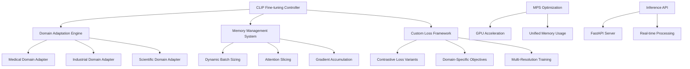

# multimodal-clip-finetuning

**Created:** 2025-10-14
**Status:** Migrated from .kiro
**Type:** Feature Request
**Source:** .kiro/specs/multimodal-clip-finetuning/

---

## Feature Description

# Requirements Document

## Introduction

The Multi-Modal CLIP Fine-Tuning system focuses on fine-tuning CLIP models for domain-specific image-text understanding using PyTorch MPS backend for GPU acceleration. The system provides specialized training for various domains, memory-efficient training strategies, and real-time inference capabilities optimized for Apple Silicon.

## Requirements & User Stories

# Requirements Document

## Introduction

The Multi-Modal CLIP Fine-Tuning system focuses on fine-tuning CLIP models for domain-specific image-text understanding using PyTorch MPS backend for GPU acceleration. The system provides specialized training for various domains, memory-efficient training strategies, and real-time inference capabilities optimized for Apple Silicon.

## Requirements

### Requirement 1

**User Story:** As a computer vision researcher, I want to fine-tune CLIP models for specific domains, so that I can achieve better performance on specialized image-text tasks.

#### Acceptance Criteria

1. WHEN MPS acceleration is used THEN the system SHALL leverage PyTorch MPS backend for GPU acceleration
2. WHEN memory is managed THEN the system SHALL use attention slicing for memory efficiency
3. WHEN training is performed THEN the system SHALL support domain-specific fine-tuning for medical, industrial, or scientific domains
4. WHEN Apple Silicon is detected THEN the system SHALL automatically optimize for M1/M2 hardware capabilities

### Requirement 2

**User Story:** As a machine learning engineer, I want custom loss functions, so that I can implement specialized contrastive learning objectives for my specific use case.

#### Acceptance Criteria

1. WHEN loss functions are implemented THEN the system SHALL support specialized contrastive learning objectives
2. WHEN training objectives are customized THEN the system SHALL allow modification of similarity metrics and loss calculations
3. WHEN domain adaptation is performed THEN the system SHALL provide domain-specific loss function templates
4. WHEN performance is optimized THEN the system SHALL automatically tune loss function parameters

### Requirement 3

**User Story:** As a developer, I want efficient memory management, so that I can train larger models or use larger batch sizes within hardware constraints.

#### Acceptance Criteria

1. WHEN batch sizes are managed THEN the system SHALL provide dynamic batch sizing based on available memory
2. WHEN gradient accumulation is used THEN the system SHALL support larger effective batch sizes through accumulation
3. WHEN precision is optimized THEN the system SHALL use mixed precision training with automatic scaling
4. WHEN sequences are long THEN the system SHALL implement dynamic attention chunking

### Requirement 4

**User Story:** As a researcher, I want multi-resolution training, so that I can improve model robustness across different image sizes and resolutions.

#### Acceptance Criteria

1. WHEN training is performed THEN the system SHALL support training on different image sizes progressively
2. WHEN resolution is varied THEN the system SHALL automatically adjust model parameters for different input sizes
3. WHEN robustness is improved THEN the system SHALL provide multi-scale training strategies
4. WHEN evaluation is done THEN the system SHALL test model performance across multiple resolutions

### Requirement 5

**User Story:** As a deployment engineer, I want real-time inference capabilities, so that I can serve CLIP models efficiently in production environments.

#### Acceptance Criteria

1. WHEN APIs are created THEN the system SHALL provide FastAPI endpoints with MPS-optimized serving
2. WHEN inference is performed THEN the system SHALL optimize for real-time image-text similarity computation
3. WHEN scaling is needed THEN the system SHALL support batch inference for multiple image-text pairs
4. WHEN monitoring is required THEN the system SHALL provide performance metrics and health checks

### Requirement 6

**User Story:** As a researcher, I want integrated experiment tracking for CLIP fine-tuning, so that I can track multi-modal experiments and compare domain adaptation results across different approaches.

#### Acceptance Criteria

1. WHEN CLIP fine-tuning experiments are run THEN the system SHALL automatically log experiments to the shared MLFlow infrastructure
2. WHEN models are fine-tuned THEN the system SHALL track domain-specific parameters, contrastive loss metrics, and multi-modal performance
3. WHEN models are trained THEN they SHALL be automatically registered in the shared model registry with multi-modal metadata
4. WHEN comparing domains THEN the system SHALL provide cross-experiment comparison using shared analytics utilities

### Requirement 7

**User Story:** As a computer vision engineer, I want automated dataset management and model deployment, so that I can efficiently manage multi-modal datasets and deploy CLIP models while maintaining quality monitoring.

#### Acceptance Criteria

1. WHEN multi-modal datasets are used THEN they SHALL be automatically tracked and versioned using the shared DVC system
2. WHEN CLIP models are ready THEN they SHALL be automatically deployed to the shared serving infrastructure with MPS optimization
3. WHEN model performance degrades THEN the shared monitoring system SHALL alert and suggest domain re-adaptation
4. WHEN complex multi-modal workflows are needed THEN they SHALL be orchestrated using the shared Airflow infrastructure

## Architecture & Design

# Design Document

## Overview

The Multi-Modal CLIP Fine-Tuning system is designed to fine-tune CLIP models for domain-specific image-text understanding using PyTorch MPS backend for GPU acceleration. The system provides specialized training for various domains, memory-efficient training strategies, and real-time inference capabilities optimized for Apple Silicon.

## Architecture

### High-Level Architecture



### Core Components

#### 1. Domain-Specific Fine-tuning Engine

**Purpose**: Adapt CLIP models for specialized domains

**Supported Domains**:

- Medical imaging and clinical text
- Industrial inspection and technical documentation
- Scientific research and academic papers
- Custom domain adaptation framework

#### 2. Memory-Efficient Training System

**Purpose**: Optimize training for Apple Silicon memory constraints

**Features**:

- Dynamic batch sizing based on available memory
- Attention slicing for large sequence processing
- Gradient accumulation for effective large batch training
- Mixed precision training with automatic scaling

#### 3. Custom Contrastive Learning Framework

**Purpose**: Implement specialized loss functions for domain adaptation

**Components**:

- Modified contrastive loss for domain-specific similarity
- Hard negative mining for improved learning
- Multi-scale contrastive learning
- Temperature scaling optimization

## Components and Interfaces

### CLIP Fine-tuning Controller Interface

```python
from pathlib import Path
from typing import Dict, List, Optional, Union, Any, Tuple
from dataclasses import dataclass
import torch
import torch.nn as nn
from transformers import CLIPModel, CLIPProcessor
from PIL import Image

@dataclass
class CLIPFinetuningConfig:
    model_name: str = "openai/clip-vit-base-patch32"
    domain: str = "general"
    learning_rate: float = 5e-5
    batch_size: Optional[int] = None  # Auto-determined
    num_epochs: int = 10
    max_sequence_length: int = 77
    image_resolution: int = 224
    use_mps: bool = True
    mixed_precision: bool = True
    gradient_accumulation_steps: int = 1

class CLIPFinetuningController:
    """Main controller for CLIP domain-specific fine-tuning."""

    def __init__(self, config: CLIPFinetuningConfig):
        self.config = config
        self.device = self._setup_device()
        self.model = self._load_model()
        self.processor = self._load_processor()
        self.memory_manager = MemoryManager(self.device)
        self.loss_framework = CustomContrastiveLoss()

    def _setup_device(self) -> torch.device:
        """Setup device with MPS optimization."""
        if self.config.use_mps and torch.backends.mps.is_available():
            return torch.device("mps")
        else:
            return torch.device("cpu")

    def _load_model(self) -> CLIPModel:
        """Load CLIP model with MPS optimization."""
        model = CLIPModel.from_pretrained(self.config.model_name)
        model = model.to(self.device)

        # Enable attention slicing for memory efficiency
        if hasattr(model.text_model, 'enable_attention_slicing'):
            model.text_model.enable_attention_slicing()
        if hasattr(model.vision_model, 'enable_attention_slicing'):
            model.vision_model.enable_attention_slicing()

        return model

    def fine_tune(
        self,
        train_dataset: torch.utils.data.Dataset,
        val_dataset: Optional[torch.utils.data.Dataset] = None,
        output_path: Path = Path("./clip_finetuned")
    ) -> Dict[str, Any]:
        """Execute domain-specific fine-tuning."""
        pass

    def evaluate_on_domain(
        self,
        test_dataset: torch.utils.data.Dataset,
        domain_metrics: List[str] = None
    ) -> Dict[str, float]:
        """Evaluate model on domain-specific tasks."""
        pass
```

### Memory Management System Interface

```python
import psutil
import torch
from typing import Dict, Any, Optional

class MemoryManager:
    """Memory management for Apple Silicon optimization."""

    def __init__(self, device: torch.device):
        self.device = device
        self.memory_info = self._get_memory_info()
        self.optimal_batch_size = self._calculate_optimal_batch_size()

    def _get_memory_info(self) -> Dict[str, float]:
        """Get system memory information."""
        memory = psutil.virtual_memory()

        memory_info = {
            "total_gb": memory.total / (1024**3),
            "available_gb": memory.available / (1024**3),
            "used_gb": memory.used / (1024**3),
            "percent_used": memory.percent
        }

        # Add MPS-specific memory info if available
        if self.device.type == "mps":
            try:
                # MPS memory tracking (if available in future PyTorch versions)
                memory_info["mps_allocated"] = torch.mps.current_allocated_memory() / (1024**3)
                memory_info["mps_cached"] = torch.mps.driver_allocated_memory() / (1024**3)
            except AttributeError:
                # Fallback for current PyTorch versions
                memory_info["mps_allocated"] = 0.0
                memory_info["mps_cached"] = 0.0

        return memory_info

    def _calculate_optimal_batch_size(self) -> int:
        """Calculate optimal batch size based on available memory."""
        available_memory_gb = self.memory_info["available_gb"]

        # Conservative estimates for CLIP model memory usage
        if available_memory_gb > 16:
            return 32
        elif available_memory_gb > 8:
            return 16
        elif available_memory_gb > 4:
            return 8
        else:
            return 4

    def dynamic_batch_sizing(
        self,
        current_batch_size: int,
        memory_usage: float,
        target_memory_usage: float = 0.8
    ) -> int:
        """Dynamically adjust batch size based on memory usage."""
        if memory_usage > target_memory_usage:
            # Reduce batch size
            new_batch_size = max(1, int(current_batch_size * 0.8))
        elif memory_usage < target_memory_usage * 0.6:
            # Increase batch size
            new_batch_size = min(64, int(current_batch_size * 1.2))
        else:
            new_batch_size = current_batch_size

        return new_batch_size

    def enable_gradient_checkpointing(self, model: nn.Module):
        """Enable gradient checkpointing for memory efficiency."""
        if hasattr(model, 'gradient_checkpointing_enable'):
            model.gradient_checkpointing_enable()
        elif hasattr(model, 'enable_gradient_checkpointing'):
            model.enable_gradient_checkpointing()

    def setup_mixed_precision(self) -> torch.cuda.amp.GradScaler:
        """Setup mixed precision training."""
        # Note: MPS doesn't support GradScaler yet, so we use a dummy scaler
        if self.device.type == "mps":
            return DummyGradScaler()
        else:
            return torch.cuda.amp.GradScaler()
```

### Custom Contrastive Loss Framework Interface

```python
import torch
import torch.nn as nn
import torch.nn.functional as F
from typing import Dict, Any, Optional, Tuple

class CustomContrastiveLoss(nn.Module):
    """Custom contrastive loss for domain-specific CLIP fine-tuning."""

    def __init__(
        self,
        temperature: float = 0.07,
        use_hard_negatives: bool = True,
        domain_weight: float = 1.0
    ):
        super().__init__()
        self.temperature = temperature
        self.use_hard_negatives = use_hard_negatives
        self.domain_weight = domain_weight
        self.cross_entropy = nn.CrossEntropyLoss()

    def forward(
        self,
        image_features: torch.Tensor,
        text_features: torch.Tensor,
        domain_labels: Optional[torch.Tensor] = None
    ) -> Dict[str, torch.Tensor]:
        """Compute custom contrastive loss."""
        # Normalize features
        image_features = F.normalize(image_features, dim=-1)
        text_features = F.normalize(text_features, dim=-1)

        # Compute similarity matrix
        logits_per_image = torch.matmul(image_features, text_features.t()) / self.temperature
        logits_per_text = logits_per_image.t()

        # Create labels for contrastive learning
        batch_size = image_features.shape[0]
        labels = torch.arange(batch_size, device=image_features.device)

        # Standard contrastive loss
        loss_i2t = self.cross_entropy(logits_per_image, labels)
        loss_t2i = self.cross_entropy(logits_per_text, labels)
        contrastive_loss = (loss_i2t + loss_t2i) / 2

        losses = {"contrastive_loss": contrastive_loss}

        # Add hard negative mining if enabled
        if self.use_hard_negatives:
            hard_negative_loss = self._compute_hard_negative_loss(
                logits_per_image, logits_per_text, labels
            )
            losses["hard_negative_loss"] = hard_negative_loss

        # Add domain-specific loss if domain labels provided
        if domain_labels is not None:
            domain_loss = self._compute_domain_loss(
                image_features, text_features, domain_labels
            )
            losses["domain_loss"] = domain_loss * self.domain_weight

        # Compute total loss
        total_loss = sum(losses.values())
        losses["total_loss"] = total_loss

        return losses

    def _compute_hard_negative_loss(
        self,
        logits_per_image: torch.Tensor,
        logits_per_text: torch.Tensor,
        labels: torch.Tensor
    ) -> torch.Tensor:
        """Compute hard negative mining loss."""
        # Find hard negatives (highest similarity with wrong pairs)
        batch_size = logits_per_image.shape[0]

        # Mask out positive pairs
        mask = torch.eye(batch_size, device=logits_per_image.device).bool()

        # Get hard negatives for image-to-text
        masked_logits_i2t = logits_per_image.masked_fill(mask, float('-inf'))
        hard_negatives_i2t = torch.max(masked_logits_i2t, dim=1)[0]

        # Get hard negatives for text-to-image
        masked_logits_t2i = logits_per_text.masked_fill(mask, float('-inf'))
        hard_negatives_t2i = torch.max(masked_logits_t2i, dim=1)[0]

        # Compute hard negative loss
        positive_logits_i2t = logits_per_image[torch.arange(batch_size), labels]
        positive_logits_t2i = logits_per_text[torch.arange(batch_size), labels]

        hard_loss_i2t = F.relu(hard_negatives_i2t - positive_logits_i2t + 0.1)
        hard_loss_t2i = F.relu(hard_negatives_t2i - positive_logits_t2i + 0.1)

        return (hard_loss_i2t.mean() + hard_loss_t2i.mean()) / 2

    def _compute_domain_loss(
        self,
        image_features: torch.Tensor,
        text_features: torch.Tensor,
        domain_labels: torch.Tensor
    ) -> torch.Tensor:
        """Compute domain-specific contrastive loss."""
        # Group by domain and compute intra-domain similarity
        unique_domains = torch.unique(domain_labels)
        domain_loss = 0.0

        for domain in unique_domains:
            domain_mask = domain_labels == domain
            if domain_mask.sum() > 1:  # Need at least 2 samples
                domain_image_features = image_features[domain_mask]
                domain_text_features = text_features[domain_mask]

                # Compute intra-domain similarity
                domain_similarity = torch.matmul(
                    domain_image_features, domain_text_features.t()
                ) / self.temperature

                # Encourage higher similarity within domain
                domain_labels_local = torch.arange(
                    domain_similarity.shape[0],
                    device=domain_similarity.device
                )
                domain_loss += self.cross_entropy(domain_similarity, domain_labels_local)

        return domain_loss / len(unique_domains) if len(unique_domains) > 0 else torch.tensor(0.0)
```

## Data Models

### Training Configuration Models

```python
from dataclasses import dataclass
from pathlib import Path
from typing import Dict, List, Optional, Any

@dataclass
class DomainConfig:
    name: str
    description: str
    image_preprocessing: Dict[str, Any]
    text_preprocessing: Dict[str, Any]
    evaluation_metrics: List[str]

@dataclass
class TrainingMetrics:
    epoch: int
    train_loss: float
    val_loss: Optional[float]
    contrastive_accuracy: float
    domain_accuracy: Optional[float]
    memory_usage: float
    training_time: float

@dataclass
class MultiResolutionConfig:
    resolutions: List[int] = None  # [224, 336, 448]
    progressive_training: bool = True
    resolution_schedule: Optional[Dict[int, int]] = None  # epoch -> resolution
```

## Error Handling

### CLIP Fine-tuning Errors

```python
class CLIPFinetuningError(Exception):
    """Base exception for CLIP fine-tuning errors."""
    pass

class MPSCompatibilityError(CLIPFinetuningError):
    """Raised when MPS optimization fails."""
    pass

class MemoryConstraintError(CLIPFinetuningError):
    """Raised when memory constraints are exceeded."""
    pass

def handle_finetuning_errors(func):
    """Decorator for CLIP fine-tuning error handling."""
    def wrapper(*args, **kwargs):
        try:
            return func(*args, **kwargs)
        except MPSCompatibilityError as e:
            logger.warning(f"MPS optimization failed: {e}")
            # Fallback to CPU training
            return cpu_fallback_training(*args, **kwargs)
        except MemoryConstraintError as e:
            logger.warning(f"Memory constraint exceeded: {e}")
            # Reduce batch size and retry
            return reduce_batch_size_and_retry(*args, **kwargs)
    return wrapper
```

## Testing Strategy

### Unit Testing Framework

```python
import pytest
from unittest.mock import Mock, patch, MagicMock
import torch
from PIL import Image
import numpy as np

class TestCLIPFinetuning:
    @pytest.fixture
    def sample_config(self):
        """Sample configuration for testing."""
        return CLIPFinetuningConfig(
            model_name="openai/clip-vit-base-patch32",
            domain="medical",
            batch_size=4,
            num_epochs=2
        )

    @pytest.fixture
    def mock_dataset(self):
        """Mock dataset for testing."""
        images = [Image.fromarray(np.random.randint(0, 255, (224, 224, 3), dtype=np.uint8)) for _ in range(10)]
        texts = [f"Sample text {i}" for i in range(10)]
        return list(zip(images, texts))

    def test_memory_manager_initialization(self):
        """Test memory manager setup."""
        device = torch.device("cpu")
        memory_manager = MemoryManager(device)

        assert memory_manager.device == device
        assert "total_gb" in memory_manager.memory_info
        assert memory_manager.optimal_batch_size > 0

    @patch('torch.backends.mps.is_available', return_value=True)
    def test_mps_optimization_setup(self, mock_mps, sample_config):
        """Test MPS optimization setup."""
        controller = CLIPFinetuningController(sample_config)

        assert controller.device.type == "mps"
        assert controller.config.use_mps == True
```

### Integration Testing

```python
class TestCLIPIntegration:
    def test_end_to_end_finetuning(self, sample_config, mock_dataset):
        """Test complete fine-tuning pipeline."""
        controller = CLIPFinetuningController(sample_config)

        # Create simple dataset
        dataset = torch.utils.data.Dataset()  # Simplified for testing

        results = controller.fine_tune(
            train_dataset=dataset,
            output_path=Path("test_output")
        )

        assert "train_loss" in results
        assert "training_time" in results
        assert results["train_loss"] > 0

    def test_domain_specific_evaluation(self, sample_config, mock_dataset):
        """Test domain-specific evaluation."""
        controller = CLIPFinetuningController(sample_config)

        # Mock evaluation dataset
        eval_dataset = torch.utils.data.Dataset()  # Simplified

        metrics = controller.evaluate_on_domain(
            test_dataset=eval_dataset,
            domain_metrics=["accuracy", "f1_score"]
        )

        assert "accuracy" in metrics
        assert "f1_score" in metrics
```

### Performance Testing

```python
class TestCLIPPerformance:
    @pytest.mark.benchmark
    def test_training_speed_benchmark(self, benchmark, sample_config):
        """Benchmark training speed on Apple Silicon."""
        controller = CLIPFinetuningController(sample_config)

        def train_single_batch():
            # Mock single batch training
            return controller._train_single_batch(mock_batch)

        result = benchmark(train_single_batch)

        # Assert reasonable training speed
        assert result.stats.mean < 5.0  # Under 5 seconds per batch

    @pytest.mark.memory
    def test_memory_efficiency(self, sample_config):
        """Test memory efficiency during training."""
        controller = CLIPFinetuningController(sample_config)

        with MemoryProfiler() as profiler:
            # Simulate training steps
            for _ in range(10):
                controller._simulate_training_step()

        profile = profiler.get_profile()
        assert profile.peak_memory < 12 * 1024**3  # Under 12GB
```

## Implementation Tasks & Acceptance Criteria

# Implementation Plan

- [ ] 1. Set up CLIP fine-tuning environment with MPS optimization
  - Create project structure with uv-based dependency management
  - Install CLIP and PyTorch with MPS support using uv
  - Set up pathlib-based file management for models and datasets
  - _Requirements: 1.1, 1.4_

- [ ] 2. Implement MPS-optimized CLIP model loading and setup
  - [ ] 2.1 Create MPS device detection and configuration
    - Write Apple Silicon hardware detection for MPS availability
    - Implement automatic MPS device setup with fallback to CPU
    - Add MPS-specific memory management and optimization
    - Write unit tests for MPS device setup
    - _Requirements: 1.1, 1.4_

  - [ ] 2.2 Implement CLIP model loading with MPS optimization
    - Write CLIP model loading with automatic MPS device placement
    - Implement attention slicing for memory efficiency on both text and vision encoders
    - Add model optimization for Apple Silicon unified memory architecture
    - Write integration tests for model loading
    - _Requirements: 1.1, 1.4_

  - [ ] 2.3 Create memory-efficient model configuration
    - Write memory profiling and optimization for CLIP models
    - Implement gradient checkpointing for memory efficiency
    - Add mixed precision training setup (with MPS compatibility considerations)
    - Write unit tests for memory optimization
    - _Requirements: 3.1, 3.4_

- [ ] 3. Implement domain-specific fine-tuning framework
  - [ ] 3.1 Create domain adaptation configuration system
    - Write domain-specific configuration management using pathlib
    - Implement medical, industrial, and scientific domain presets
    - Add custom domain configuration support
    - Write unit tests for domain configuration
    - _Requirements: 1.1_

  - [ ] 3.2 Implement domain-specific data preprocessing
    - Write domain-specific image preprocessing pipelines
    - Implement specialized text preprocessing for different domains
    - Add domain-specific data augmentation strategies
    - Write integration tests for data preprocessing
    - _Requirements: 1.1_

  - [ ] 3.3 Create domain evaluation metrics framework
    - Write domain-specific evaluation metrics (medical accuracy, industrial precision, etc.)
    - Implement cross-domain evaluation and comparison tools
    - Add domain-specific validation and testing frameworks
    - Write unit tests for evaluation metrics
    - _Requirements: 1.1_

- [ ] 4. Implement custom contrastive learning framework
  - [ ] 4.1 Create specialized contrastive loss functions
    - Write custom contrastive loss with temperature scaling optimization
    - Implement domain-specific similarity metrics and loss modifications
    - Add hard negative mining for improved contrastive learning
    - Write unit tests for custom loss functions
    - _Requirements: 2.1, 2.4_

  - [ ] 4.2 Implement multi-scale contrastive learning
    - Write multi-resolution training pipeline for improved robustness
    - Implement progressive resolution training strategies
    - Add scale-aware contrastive loss computation
    - Write integration tests for multi-scale training
    - _Requirements: 2.1, 2.4_

  - [ ] 4.3 Create loss function parameter optimization
    - Write automatic temperature parameter optimization for contrastive loss
    - Implement loss weight balancing for multi-objective training
    - Add loss function hyperparameter tuning framework
    - Write end-to-end tests for loss optimization
    - _Requirements: 2.2, 2.4_

- [ ] 5. Implement memory management system
  - [ ] 5.1 Create dynamic batch sizing system
    - Write dynamic batch size calculation based on available memory
    - Implement real-time memory monitoring and batch size adjustment
    - Add memory usage prediction and optimization
    - Write unit tests for dynamic batch sizing
    - _Requirements: 3.1, 3.4_

  - [ ] 5.2 Implement gradient accumulation framework
    - Write gradient accumulation for effective large batch training
    - Implement memory-efficient gradient accumulation with MPS optimization
    - Add gradient accumulation scheduling and optimization
    - Write integration tests for gradient accumulation
    - _Requirements: 3.1, 3.4_

  - [ ] 5.3 Create attention slicing and chunking system
    - Write dynamic attention chunking for long sequences
    - Implement memory-efficient attention computation
    - Add attention slicing optimization for different sequence lengths
    - Write performance tests for attention optimization
    - _Requirements: 3.2, 3.4_

- [ ] 6. Implement multi-resolution training system
  - [ ] 6.1 Create progressive resolution training pipeline
    - Write progressive training that starts with lower resolutions and increases
    - Implement resolution scheduling based on training progress
    - Add resolution-specific model adaptation and optimization
    - Write unit tests for progressive training
    - _Requirements: 4.1, 4.4_

  - [ ] 6.2 Implement multi-resolution validation framework
    - Write validation across multiple image resolutions
    - Implement resolution-specific performance metrics
    - Add cross-resolution robustness testing
    - Write integration tests for multi-resolution validation
    - _Requirements: 4.1, 4.4_

  - [ ] 6.3 Create resolution-aware optimization
    - Write resolution-specific optimization strategies
    - Implement memory and compute optimization for different resolutions
    - Add automatic resolution selection based on hardware constraints
    - Write end-to-end tests for resolution optimization
    - _Requirements: 4.1, 4.4_

- [ ] 7. Implement real-time inference API system
  - [ ] 7.1 Create FastAPI server with MPS optimization
    - Write FastAPI server optimized for Apple Silicon MPS acceleration
    - Implement real-time image-text similarity computation endpoints
    - Add batch inference support for multiple image-text pairs
    - Write unit tests for API endpoints
    - _Requirements: 5.1, 5.3_

  - [ ] 7.2 Implement inference optimization and caching
    - Write model inference optimization with MPS acceleration
    - Implement result caching for frequently queried image-text pairs
    - Add inference batching and queue management
    - Write integration tests for inference optimization
    - _Requirements: 5.1, 5.2_

  - [ ] 7.3 Create performance monitoring and health checks
    - Write API performance monitoring with metrics collection
    - Implement health check endpoints for model and hardware status
    - Add real-time performance dashboards and alerting
    - Write end-to-end tests for monitoring system
    - _Requirements: 5.4_

- [ ] 8. Implement training monitoring and logging system
  - [ ] 8.1 Create comprehensive training metrics collection
    - Write training progress monitoring with loss tracking and visualization
    - Implement memory usage monitoring during training
    - Add training speed and efficiency metrics collection
    - Write unit tests for metrics collection
    - _Requirements: 3.1, 3.2, 3.3_

  - [ ] 8.2 Implement real-time training visualization
    - Write real-time training progress visualization with plots and charts
    - Implement loss curves, accuracy trends, and memory usage graphs
    - Add training milestone tracking and notification system
    - Write integration tests for visualization system
    - _Requirements: 3.3_

  - [ ] 8.3 Create training checkpoint and recovery system
    - Write automatic checkpoint saving with pathlib-based file management
    - Implement training recovery from checkpoints with state restoration
    - Add checkpoint validation and integrity checking
    - Write end-to-end tests for checkpoint system
    - _Requirements: 3.1, 3.4_

- [ ] 9. Implement domain-specific evaluation framework
  - [ ] 9.1 Create medical domain evaluation system
    - Write medical image-text evaluation with clinical accuracy metrics
    - Implement medical terminology understanding and similarity assessment
    - Add medical case study evaluation and validation
    - Write unit tests for medical domain evaluation
    - _Requirements: 1.1, 2.1_

  - [ ] 9.2 Implement industrial domain evaluation system
    - Write industrial inspection and technical documentation evaluation
    - Implement technical terminology and process understanding assessment
    - Add industrial use case validation and performance testing
    - Write integration tests for industrial domain evaluation
    - _Requirements: 1.1, 2.1_

  - [ ] 9.3 Create scientific domain evaluation system
    - Write scientific research and academic paper evaluation
    - Implement scientific concept understanding and similarity assessment
    - Add research domain validation and cross-disciplinary testing
    - Write end-to-end tests for scientific domain evaluation
    - _Requirements: 1.1, 2.1_

- [ ] 10. Implement comprehensive testing and deployment
  - [ ] 10.1 Create unit and integration test suite
    - Write comprehensive test coverage for all CLIP fine-tuning components
    - Implement mock testing for MPS hardware when not available
    - Add cross-platform compatibility testing
    - Create continuous integration test configuration
    - _Requirements: 1.1, 1.4_

  - [ ] 10.2 Implement performance benchmark validation
    - Write automated performance benchmarking for training and inference
    - Implement memory usage validation and optimization testing
    - Add MPS vs CPU performance comparison testing
    - Write comprehensive performance test suite
    - _Requirements: 3.1, 3.2, 3.3, 3.4_

  - [ ] 10.3 Create deployment and API validation testing
    - Write end-to-end API deployment testing
    - Implement load testing for inference endpoints
    - Add real-time performance validation under different loads
    - Create deployment pipeline testing and validation
    - _Requirements: 5.1, 5.2, 5.3, 5.4_

---

**Migration Notes:**
- Consolidated from .kiro/specs/multimodal-clip-finetuning/
- Original files: requirements.md, design.md, tasks.md
- Ready for sage workflow processing
