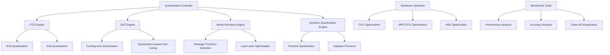

# quantized-model-benchmarks

**Created:** 2025-10-14
**Status:** Migrated from .kiro
**Type:** Feature Request
**Source:** .kiro/specs/quantized-model-benchmarks/

---

## Feature Description

# Requirements Document

## Introduction

The Quantized Model Optimization Benchmarking Suite is a comprehensive system that applies different quantization techniques and benchmarks performance vs. accuracy trade-offs across various models. The system focuses on providing automated model selection, hardware-specific optimization, and comprehensive analysis of quantization techniques for Apple Silicon deployment.

## Requirements & User Stories

# Requirements Document

## Introduction

The Quantized Model Optimization Benchmarking Suite is a comprehensive system that applies different quantization techniques and benchmarks performance vs. accuracy trade-offs across various models. The system focuses on providing automated model selection, hardware-specific optimization, and comprehensive analysis of quantization techniques for Apple Silicon deployment.

## Requirements

### Requirement 1

**User Story:** As a model optimization engineer, I want to apply multiple quantization techniques, so that I can find the optimal balance between model size, speed, and accuracy.

#### Acceptance Criteria

1. WHEN quantization is applied THEN the system SHALL support post-training quantization (PTQ) with 8-bit and 4-bit integer quantization
2. WHEN training-time optimization is used THEN the system SHALL provide quantization aware training (QAT) capabilities
3. WHEN precision is mixed THEN the system SHALL support strategic 16-bit/8-bit combinations
4. WHEN runtime optimization is needed THEN the system SHALL provide dynamic quantization with runtime decisions

### Requirement 2

**User Story:** As a researcher, I want automated model selection, so that I can test quantization across different model architectures efficiently.

#### Acceptance Criteria

1. WHEN models are tested THEN the system SHALL automatically test quantization across different model architectures
2. WHEN architectures are compared THEN the system SHALL provide standardized benchmarking across model types
3. WHEN selection is made THEN the system SHALL recommend optimal quantization techniques per architecture
4. WHEN results are analyzed THEN the system SHALL provide architecture-specific optimization insights

### Requirement 3

**User Story:** As a hardware optimization specialist, I want hardware-specific optimization, so that I can maximize performance on Apple Silicon components.

#### Acceptance Criteria

1. WHEN hardware is optimized THEN the system SHALL optimize separately for CPU, MPS GPU, and ANE
2. WHEN performance is measured THEN the system SHALL benchmark each hardware component independently
3. WHEN optimization is applied THEN the system SHALL automatically select optimal hardware targets
4. WHEN unified memory is used THEN the system SHALL optimize for Apple Silicon's memory architecture

### Requirement 4

**User Story:** As a deployment engineer, I want comprehensive trade-off analysis, so that I can make informed decisions about quantization for production deployment.

#### Acceptance Criteria

1. WHEN analysis is performed THEN the system SHALL provide accuracy-speed trade-off analysis with comprehensive dashboards
2. WHEN metrics are collected THEN the system SHALL measure inference speed, memory usage, and model accuracy
3. WHEN comparisons are made THEN the system SHALL compare quantized vs. full-precision model performance
4. WHEN recommendations are provided THEN the system SHALL suggest optimal configurations for specific use cases

### Requirement 5

**User Story:** As a developer, I want multi-format deployment, so that I can export quantized models to different deployment targets.

#### Acceptance Criteria

1. WHEN models are exported THEN the system SHALL support ONNX, Core ML, and TensorFlow Lite formats
2. WHEN deployment is prepared THEN the system SHALL optimize models for specific deployment environments
3. WHEN formats are converted THEN the system SHALL validate model accuracy across different formats
4. WHEN integration is needed THEN the system SHALL provide deployment templates for each target format

### Requirement 6

**User Story:** As a researcher, I want integrated experiment tracking for quantization, so that I can track quantization experiments and compare optimization results across different techniques and models.

#### Acceptance Criteria

1. WHEN quantization experiments are run THEN the system SHALL automatically log experiments to the shared MLFlow infrastructure
2. WHEN models are quantized THEN the system SHALL track quantization parameters, accuracy metrics, and performance improvements
3. WHEN models are optimized THEN they SHALL be automatically registered in the shared model registry with quantization metadata
4. WHEN comparing techniques THEN the system SHALL provide cross-experiment comparison using shared analytics utilities

### Requirement 7

**User Story:** As a deployment engineer, I want automated model management and deployment, so that I can efficiently deploy optimized models while maintaining quality monitoring.

#### Acceptance Criteria

1. WHEN model datasets are used THEN they SHALL be automatically tracked and versioned using the shared DVC system
2. WHEN quantized models are ready THEN they SHALL be automatically deployed to the shared serving infrastructure
3. WHEN model performance degrades THEN the shared monitoring system SHALL alert and suggest re-optimization
4. WHEN complex optimization workflows are needed THEN they SHALL be orchestrated using the shared Airflow infrastructure

## Architecture & Design

# Design Document

## Overview

The Quantized Model Optimization Benchmarking Suite is designed as a comprehensive system for applying different quantization techniques and benchmarking performance vs. accuracy trade-offs across various models. The system provides automated model selection, hardware-specific optimization for Apple Silicon, and comprehensive analysis tools for quantization deployment decisions.

## Architecture

### High-Level Architecture



### Core Components

#### 1. Multi-Framework Quantization Engine

**Purpose**: Support multiple quantization frameworks and techniques

**Supported Frameworks**:

- Hugging Face BitsAndBytes for transformer quantization
- ONNX quantization for cross-platform deployment
- Core ML quantization for Apple Silicon optimization
- PyTorch native quantization

#### 2. Hardware-Specific Optimization System

**Purpose**: Optimize quantization for different Apple Silicon components

**Components**:

- CPU-specific quantization strategies
- MPS GPU optimization for mixed precision
- ANE (Apple Neural Engine) quantization
- Unified memory architecture optimization

#### 3. Automated Model Selection Framework

**Purpose**: Test quantization across different model architectures

**Features**:

- Architecture-specific quantization strategies
- Automated model downloading and preparation
- Cross-architecture performance comparison
- Quantization method recommendation system

## Components and Interfaces

### Quantization Controller Interface

```python
from pathlib import Path
from typing import Dict, List, Optional, Union, Any, Tuple
from dataclasses import dataclass
from enum import Enum
import torch
import torch.nn as nn

class QuantizationMethod(Enum):
    PTQ_8BIT = "ptq_8bit"
    PTQ_4BIT = "ptq_4bit"
    QAT = "qat"
    MIXED_PRECISION = "mixed_precision"
    DYNAMIC = "dynamic"

class HardwareTarget(Enum):
    CPU = "cpu"
    MPS_GPU = "mps"
    ANE = "ane"
    ALL = "all"

@dataclass
class QuantizationConfig:
    method: QuantizationMethod
    hardware_target: HardwareTarget
    calibration_dataset_size: int = 1000
    accuracy_threshold: float = 0.95
    benchmark_baseline: bool = True
    export_formats: List[str] = None

class QuantizationController:
    """Main controller for quantization benchmarking."""

    def __init__(self, config: QuantizationConfig):
        self.config = config
        self.quantization_engines = {
            QuantizationMethod.PTQ_8BIT: PTQEngine(bits=8),
            QuantizationMethod.PTQ_4BIT: PTQEngine(bits=4),
            QuantizationMethod.QAT: QATEngine(),
            QuantizationMethod.MIXED_PRECISION: MixedPrecisionEngine(),
            QuantizationMethod.DYNAMIC: DynamicQuantizationEngine()
        }
        self.hardware_optimizer = HardwareSpecificOptimizer()
        self.benchmarker = QuantizationBenchmarkSuite()

    def quantize_model(
        self,
        model: nn.Module,
        calibration_data: torch.utils.data.DataLoader,
        output_path: Path
    ) -> Dict[str, Any]:
        """Apply quantization with specified method and hardware target."""
        pass

    def benchmark_quantization_methods(
        self,
        model: nn.Module,
        test_data: torch.utils.data.DataLoader,
        methods: List[QuantizationMethod]
    ) -> Dict[str, Dict[str, float]]:
        """Benchmark multiple quantization methods."""
        pass

    def recommend_quantization_strategy(
        self,
        model: nn.Module,
        constraints: Dict[str, Any]
    ) -> Tuple[QuantizationMethod, HardwareTarget]:
        """Recommend optimal quantization strategy based on constraints."""
        pass
```

### Post-Training Quantization Engine Interface

```python
import torch
import torch.quantization as quant
from transformers import BitsAndBytesConfig
import onnxruntime as ort
from onnxruntime.quantization import quantize_dynamic, QuantType

class PTQEngine:
    """Post-Training Quantization implementation."""

    def __init__(self, bits: int = 8):
        self.bits = bits
        self.quantization_configs = {
            "huggingface": self._setup_bnb_config(),
            "onnx": self._setup_onnx_config(),
            "pytorch": self._setup_pytorch_config()
        }

    def _setup_bnb_config(self) -> BitsAndBytesConfig:
        """Setup BitsAndBytes configuration."""
        if self.bits == 8:
            return BitsAndBytesConfig(load_in_8bit=True)
        elif self.bits == 4:
            return BitsAndBytesConfig(
                load_in_4bit=True,
                bnb_4bit_compute_dtype=torch.float16,
                bnb_4bit_use_double_quant=True,
                bnb_4bit_quant_type="nf4"
            )
        else:
            raise ValueError(f"Unsupported bit width: {self.bits}")

    def quantize_model(
        self,
        model: nn.Module,
        calibration_data: torch.utils.data.DataLoader,
        framework: str = "pytorch"
    ) -> Tuple[nn.Module, Dict[str, float]]:
        """Apply post-training quantization."""
        if framework == "pytorch":
            return self._pytorch_quantization(model, calibration_data)
        elif framework == "onnx":
            return self._onnx_quantization(model, calibration_data)
        elif framework == "huggingface":
            return self._huggingface_quantization(model, calibration_data)
        else:
            raise ValueError(f"Unsupported framework: {framework}")

    def _pytorch_quantization(
        self,
        model: nn.Module,
        calibration_data: torch.utils.data.DataLoader
    ) -> Tuple[nn.Module, Dict[str, float]]:
        """PyTorch native quantization."""
        # Prepare model for quantization
        model.eval()
        model.qconfig = quant.get_default_qconfig('fbgemm')
        model_prepared = quant.prepare(model)

        # Calibration
        with torch.no_grad():
            for batch_idx, (data, _) in enumerate(calibration_data):
                if batch_idx >= 100:  # Limit calibration samples
                    break
                model_prepared(data)

        # Convert to quantized model
        quantized_model = quant.convert(model_prepared)

        # Calculate quantization statistics
        original_size = sum(p.numel() * p.element_size() for p in model.parameters())
        quantized_size = sum(p.numel() * p.element_size() for p in quantized_model.parameters())

        stats = {
            "compression_ratio": quantized_size / original_size,
            "size_reduction": 1 - (quantized_size / original_size),
            "quantization_method": f"pytorch_{self.bits}bit"
        }

        return quantized_model, stats

    def _onnx_quantization(
        self,
        model: nn.Module,
        calibration_data: torch.utils.data.DataLoader
    ) -> Tuple[Any, Dict[str, float]]:
        """ONNX quantization for cross-platform deployment."""
        pass

    def _huggingface_quantization(
        self,
        model: nn.Module,
        calibration_data: torch.utils.data.DataLoader
    ) -> Tuple[nn.Module, Dict[str, float]]:
        """Hugging Face BitsAndBytes quantization."""
        pass
```

### Hardware-Specific Optimizer Interface

```python
import platform
import torch
from typing import Dict, Any, Optional

class HardwareSpecificOptimizer:
    """Apple Silicon hardware-specific quantization optimization."""

    def __init__(self):
        self.hardware_info = self._detect_hardware()
        self.optimization_strategies = {
            HardwareTarget.CPU: self._cpu_optimization,
            HardwareTarget.MPS_GPU: self._mps_optimization,
            HardwareTarget.ANE: self._ane_optimization,
            HardwareTarget.ALL: self._unified_optimization
        }

    def _detect_hardware(self) -> Dict[str, Any]:
        """Detect Apple Silicon hardware capabilities."""
        hardware_info = {
            "platform": platform.machine(),
            "is_apple_silicon": platform.machine() == "arm64" and platform.system() == "Darwin",
            "mps_available": torch.backends.mps.is_available(),
            "memory_gb": self._get_memory_info()
        }

        # Detect ANE availability (approximation)
        if hardware_info["is_apple_silicon"]:
            hardware_info["ane_available"] = True  # Most Apple Silicon has ANE
        else:
            hardware_info["ane_available"] = False

        return hardware_info

    def optimize_for_hardware(
        self,
        quantized_model: nn.Module,
        target: HardwareTarget
    ) -> Tuple[nn.Module, Dict[str, float]]:
        """Apply hardware-specific optimizations."""
        if target not in self.optimization_strategies:
            raise ValueError(f"Unsupported hardware target: {target}")

        return self.optimization_strategies[target](quantized_model)

    def _cpu_optimization(self, model: nn.Module) -> Tuple[nn.Module, Dict[str, float]]:
        """CPU-specific quantization optimizations."""
        # Enable CPU-specific optimizations
        if hasattr(torch.backends, 'mkldnn') and torch.backends.mkldnn.is_available():
            model = torch.jit.optimize_for_inference(torch.jit.script(model))

        optimization_stats = {
            "cpu_optimized": True,
            "mkldnn_enabled": torch.backends.mkldnn.is_available(),
            "vectorization": "enabled"
        }

        return model, optimization_stats

    def _mps_optimization(self, model: nn.Module) -> Tuple[nn.Module, Dict[str, float]]:
        """MPS GPU-specific optimizations."""
        if self.hardware_info["mps_available"]:
            model = model.to("mps")

        optimization_stats = {
            "mps_optimized": True,
            "unified_memory": True,
            "gpu_acceleration": self.hardware_info["mps_available"]
        }

        return model, optimization_stats

    def _ane_optimization(self, model: nn.Module) -> Tuple[nn.Module, Dict[str, float]]:
        """Apple Neural Engine optimizations."""
        # ANE optimization typically requires Core ML conversion
        optimization_stats = {
            "ane_compatible": self.hardware_info["ane_available"],
            "coreml_conversion_required": True,
            "neural_engine_optimized": False  # Would be True after Core ML conversion
        }

        return model, optimization_stats

    def _unified_optimization(self, model: nn.Module) -> Tuple[nn.Module, Dict[str, float]]:
        """Unified optimization across all Apple Silicon components."""
        # Apply optimizations for all available hardware
        optimized_model = model
        combined_stats = {}

        # Apply CPU optimizations
        optimized_model, cpu_stats = self._cpu_optimization(optimized_model)
        combined_stats.update({"cpu_" + k: v for k, v in cpu_stats.items()})

        # Apply MPS optimizations if available
        if self.hardware_info["mps_available"]:
            optimized_model, mps_stats = self._mps_optimization(optimized_model)
            combined_stats.update({"mps_" + k: v for k, v in mps_stats.items()})

        return optimized_model, combined_stats
```

## Data Models

### Quantization Configuration Models

```python
from dataclasses import dataclass
from pathlib import Path
from typing import Dict, List, Optional, Any
from enum import Enum

@dataclass
class QuantizationMetrics:
    accuracy: float
    inference_time: float
    memory_usage: float
    model_size: float
    compression_ratio: float
    hardware_utilization: Dict[str, float]

@dataclass
class BenchmarkResults:
    method: str
    hardware_target: str
    original_metrics: QuantizationMetrics
    quantized_metrics: QuantizationMetrics
    accuracy_retention: float
    speedup_factor: float
    memory_reduction: float

@dataclass
class ModelArchitectureInfo:
    name: str
    parameters: int
    architecture_type: str  # "transformer", "cnn", "rnn", etc.
    quantization_compatibility: Dict[str, bool]
    recommended_methods: List[str]
```

## Error Handling

### Quantization Pipeline Errors

```python
class QuantizationError(Exception):
    """Base exception for quantization errors."""
    pass

class CalibrationError(QuantizationError):
    """Raised when calibration data processing fails."""
    pass

class HardwareCompatibilityError(QuantizationError):
    """Raised when hardware-specific optimization fails."""
    pass

def handle_quantization_errors(func):
    """Decorator for quantization error handling."""
    def wrapper(*args, **kwargs):
        try:
            return func(*args, **kwargs)
        except CalibrationError as e:
            logger.error(f"Calibration failed: {e}")
            # Try with reduced calibration dataset
            return fallback_calibration(*args, **kwargs)
        except HardwareCompatibilityError as e:
            logger.warning(f"Hardware optimization failed: {e}")
            # Fallback to generic quantization
            return generic_quantization(*args, **kwargs)
    return wrapper
```

## Testing Strategy

### Unit Testing Framework

```python
import pytest
from unittest.mock import Mock, patch, MagicMock
import torch
import torch.nn as nn
from pathlib import Path

class TestQuantizationEngine:
    @pytest.fixture
    def sample_model(self):
        """Create sample model for testing."""
        return nn.Sequential(
            nn.Linear(100, 50),
            nn.ReLU(),
            nn.Linear(50, 10),
            nn.Softmax(dim=1)
        )

    @pytest.fixture
    def calibration_data(self):
        """Create sample calibration data."""
        dataset = torch.utils.data.TensorDataset(
            torch.randn(1000, 100),
            torch.randint(0, 10, (1000,))
        )
        return torch.utils.data.DataLoader(dataset, batch_size=32)

    def test_ptq_8bit_quantization(self, sample_model, calibration_data):
        """Test 8-bit post-training quantization."""
        ptq_engine = PTQEngine(bits=8)
        quantized_model, stats = ptq_engine.quantize_model(
            sample_model,
            calibration_data,
            framework="pytorch"
        )

        assert "compression_ratio" in stats
        assert stats["compression_ratio"] < 1.0  # Should be compressed
        assert isinstance(quantized_model, nn.Module)

    def test_hardware_optimization(self, sample_model):
        """Test hardware-specific optimization."""
        optimizer = HardwareSpecificOptimizer()

        # Test CPU optimization
        cpu_model, cpu_stats = optimizer.optimize_for_hardware(
            sample_model,
            HardwareTarget.CPU
        )

        assert "cpu_optimized" in cpu_stats
        assert cpu_stats["cpu_optimized"] == True
```

### Performance Testing

```python
class TestQuantizationBenchmarks:
    @pytest.mark.benchmark
    def test_quantization_speed_benchmark(self, benchmark, sample_model, calibration_data):
        """Benchmark quantization process speed."""
        ptq_engine = PTQEngine(bits=8)

        def quantize_model():
            return ptq_engine.quantize_model(sample_model, calibration_data)

        result = benchmark(quantize_model)

        # Assert reasonable quantization time
        assert result.stats.mean < 60.0  # Under 1 minute

    @pytest.mark.accuracy
    def test_accuracy_retention(self, sample_model, test_dataset):
        """Test accuracy retention after quantization."""
        # Get baseline accuracy
        baseline_accuracy = evaluate_model(sample_model, test_dataset)

        # Quantize model
        ptq_engine = PTQEngine(bits=8)
        quantized_model, _ = ptq_engine.quantize_model(sample_model, test_dataset)

        # Get quantized accuracy
        quantized_accuracy = evaluate_model(quantized_model, test_dataset)

        # Assert acceptable accuracy retention
        accuracy_retention = quantized_accuracy / baseline_accuracy
        assert accuracy_retention > 0.95  # At least 95% accuracy retention
```

## Implementation Tasks & Acceptance Criteria

# Implementation Plan

- [ ] 1. Set up quantization benchmarking environment
  - Create project structure with uv-based dependency management
  - Install quantization libraries (BitsAndBytes, ONNX Runtime, Core ML Tools) using uv
  - Set up pathlib-based file management for models and benchmark results
  - _Requirements: 1.1, 1.2_

- [ ] 2. Implement post-training quantization (PTQ) engine
  - [ ] 2.1 Create 8-bit integer quantization implementation
    - Write PyTorch native 8-bit quantization with calibration
    - Implement BitsAndBytes 8-bit quantization for transformers
    - Add calibration dataset processing and validation
    - Write unit tests for 8-bit quantization
    - _Requirements: 1.1, 1.3_

  - [ ] 2.2 Implement 4-bit integer quantization
    - Write 4-bit quantization using BitsAndBytes NF4 format
    - Implement double quantization for improved accuracy
    - Add 4-bit quantization validation and quality checks
    - Write integration tests for 4-bit quantization
    - _Requirements: 1.1, 1.3_

  - [ ] 2.3 Create ONNX quantization pipeline
    - Write ONNX model conversion and quantization
    - Implement dynamic and static quantization for ONNX
    - Add ONNX Runtime optimization and validation
    - Write unit tests for ONNX quantization
    - _Requirements: 5.1, 5.4_

- [ ] 3. Implement quantization-aware training (QAT) system
  - [ ] 3.1 Create QAT training pipeline
    - Write quantization-aware training implementation
    - Implement fake quantization during training
    - Add QAT-specific loss functions and optimization
    - Write unit tests for QAT training
    - _Requirements: 1.2_

  - [ ] 3.2 Implement quantization-aware fine-tuning
    - Write fine-tuning pipeline with quantization simulation
    - Implement gradual quantization during fine-tuning
    - Add quantization noise injection for robustness
    - Write integration tests for QAT fine-tuning
    - _Requirements: 1.2_

  - [ ] 3.3 Create QAT validation and quality assessment
    - Write validation framework for QAT models
    - Implement quality metrics specific to quantization-aware training
    - Add comparison tools between QAT and PTQ methods
    - Write end-to-end tests for QAT validation
    - _Requirements: 1.2, 4.4_

- [ ] 4. Implement mixed precision quantization
  - [ ] 4.1 Create strategic precision selection system
    - Write layer-wise precision analysis and selection
    - Implement sensitivity analysis for different layers
    - Add automatic precision assignment based on importance
    - Write unit tests for precision selection
    - _Requirements: 1.3_

  - [ ] 4.2 Implement 16-bit/8-bit combination strategies
    - Write mixed precision implementation with 16-bit and 8-bit layers
    - Implement precision transition handling between layers
    - Add memory and performance optimization for mixed precision
    - Write integration tests for mixed precision
    - _Requirements: 1.3, 3.3_

  - [ ] 4.3 Create precision optimization framework
    - Write automatic precision optimization based on constraints
    - Implement precision search algorithms for optimal configurations
    - Add precision validation and performance measurement
    - Write performance tests for precision optimization
    - _Requirements: 1.3, 4.4_

- [ ] 5. Implement dynamic quantization system
  - [ ] 5.1 Create runtime quantization decisions
    - Write dynamic quantization that adapts based on input characteristics
    - Implement runtime precision switching based on model confidence
    - Add adaptive quantization for varying workloads
    - Write unit tests for dynamic quantization
    - _Requirements: 1.4_

  - [ ] 5.2 Implement adaptive precision management
    - Write precision adaptation based on accuracy requirements
    - Implement feedback loop for precision adjustment
    - Add performance monitoring for dynamic precision changes
    - Write integration tests for adaptive precision
    - _Requirements: 1.4, 4.4_

  - [ ] 5.3 Create runtime optimization system
    - Write runtime optimization that balances speed and accuracy
    - Implement dynamic batch size and precision adjustment
    - Add real-time performance monitoring and adjustment
    - Write end-to-end tests for runtime optimization
    - _Requirements: 1.4, 3.3_

- [ ] 6. Implement hardware-specific optimization
  - [ ] 6.1 Create CPU-specific quantization optimization
    - Write CPU-optimized quantization with vectorization support
    - Implement Intel MKL-DNN integration for CPU acceleration
    - Add CPU-specific precision selection and optimization
    - Write unit tests for CPU optimization
    - _Requirements: 3.1, 3.4_

  - [ ] 6.2 Implement MPS GPU optimization
    - Write MPS-optimized quantization for Apple Silicon GPU
    - Implement unified memory optimization for MPS
    - Add MPS-specific mixed precision strategies
    - Write integration tests for MPS optimization
    - _Requirements: 3.1, 3.4_

  - [ ] 6.3 Create Apple Neural Engine (ANE) optimization
    - Write ANE-compatible quantization strategies
    - Implement Core ML conversion with ANE optimization
    - Add ANE-specific model validation and testing
    - Write performance tests for ANE optimization
    - _Requirements: 3.1, 3.4_

- [ ] 7. Implement automated model selection and testing
  - [ ] 7.1 Create model architecture analysis system
    - Write automatic model architecture detection and analysis
    - Implement architecture-specific quantization recommendations
    - Add compatibility checking for different quantization methods
    - Write unit tests for architecture analysis
    - _Requirements: 2.1, 2.3_

  - [ ] 7.2 Implement cross-architecture benchmarking
    - Write benchmarking framework for different model architectures
    - Implement standardized testing across transformer, CNN, and RNN models
    - Add architecture-specific performance analysis
    - Write integration tests for cross-architecture benchmarking
    - _Requirements: 2.1, 2.2_

  - [ ] 7.3 Create quantization method recommendation system
    - Write recommendation engine based on model characteristics and constraints
    - Implement automatic method selection based on accuracy and performance requirements
    - Add cost-benefit analysis for different quantization approaches
    - Write end-to-end tests for recommendation system
    - _Requirements: 2.3, 2.4_

- [ ] 8. Implement comprehensive benchmarking framework
  - [ ] 8.1 Create accuracy-speed trade-off analysis
    - Write comprehensive trade-off analysis tools
    - Implement Pareto frontier analysis for quantization methods
    - Add interactive visualization for trade-off exploration
    - Write unit tests for trade-off analysis
    - _Requirements: 4.1, 4.2_

  - [ ] 8.2 Implement performance comparison dashboard
    - Write dashboard for comparing quantization methods across metrics
    - Implement real-time performance monitoring and comparison
    - Add historical performance tracking and trend analysis
    - Write integration tests for dashboard functionality
    - _Requirements: 4.1, 4.3_

  - [ ] 8.3 Create deployment scenario simulation
    - Write simulation framework for different deployment environments
    - Implement edge device constraint simulation
    - Add realistic deployment scenario testing with resource limits
    - Write performance tests for deployment simulation
    - _Requirements: 4.4, 5.4_

- [ ] 9. Implement multi-format model export
  - [ ] 9.1 Create ONNX export pipeline
    - Write ONNX model export with quantization preservation
    - Implement ONNX Runtime optimization for different hardware targets
    - Add ONNX model validation and compatibility testing
    - Write unit tests for ONNX export
    - _Requirements: 5.1, 5.3_

  - [ ] 9.2 Implement Core ML export system
    - Write Core ML model export with Apple Silicon optimization
    - Implement Core ML quantization and compression
    - Add iOS deployment validation and testing
    - Write integration tests for Core ML export
    - _Requirements: 5.1, 5.3_

  - [ ] 9.3 Create TensorFlow Lite export pipeline
    - Write TensorFlow Lite conversion with quantization
    - Implement mobile-optimized quantization for TensorFlow Lite
    - Add cross-platform deployment validation
    - Write end-to-end tests for TensorFlow Lite export
    - _Requirements: 5.1, 5.3_

- [ ] 10. Implement comprehensive testing and validation
  - [ ] 10.1 Create quantization accuracy validation framework
    - Write comprehensive accuracy testing across all quantization methods
    - Implement statistical significance testing for accuracy changes
    - Add accuracy regression detection and alerting
    - Create automated accuracy validation test suite
    - _Requirements: 1.1, 1.2, 1.3, 1.4_

  - [ ] 10.2 Implement performance benchmark validation
    - Write automated performance benchmark validation
    - Implement cross-platform performance testing
    - Add performance regression testing and monitoring
    - Create continuous integration performance test configuration
    - _Requirements: 3.1, 3.2, 3.3, 3.4_

  - [ ] 10.3 Create deployment validation testing
    - Write end-to-end deployment workflow testing
    - Implement multi-format export validation
    - Add hardware-specific deployment testing
    - Create comprehensive deployment pipeline testing
    - _Requirements: 5.1, 5.2, 5.3, 5.4_

---

**Migration Notes:**
- Consolidated from .kiro/specs/quantized-model-benchmarks/
- Original files: requirements.md, design.md, tasks.md
- Ready for sage workflow processing
