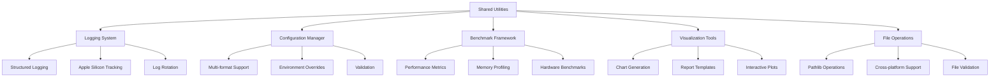

# shared-utilities

**Created:** 2025-10-14
**Status:** Migrated from .kiro
**Type:** Feature Request
**Source:** .kiro/specs/shared-utilities/

---

## Feature Description

# Requirements Document

## Introduction

The Shared Utilities component provides common functionality across all projects in the EfficientAI-MLX-Toolkit. This includes centralized logging, configuration management, benchmarking frameworks, and visualization utilities. The shared utilities ensure consistency, reduce code duplication, and provide standardized interfaces for common operations across all individual projects.

## Requirements & User Stories

# Requirements Document

## Introduction

The Shared Utilities component provides common functionality across all projects in the EfficientAI-MLX-Toolkit. This includes centralized logging, configuration management, benchmarking frameworks, and visualization utilities. The shared utilities ensure consistency, reduce code duplication, and provide standardized interfaces for common operations across all individual projects.

## Requirements

### Requirement 1

**User Story:** As a developer, I want centralized logging utilities, so that I can have consistent logging across all projects with pathlib-based file management.

#### Acceptance Criteria

1. WHEN logging is configured THEN the system SHALL use pathlib for all log file operations
2. WHEN logs are structured THEN the system SHALL provide structured logging for Apple Silicon optimization tracking
3. WHEN log levels are managed THEN the system SHALL support configurable log levels across all projects
4. WHEN log rotation is needed THEN the system SHALL implement automatic log rotation using pathlib

### Requirement 2

**User Story:** As a configuration manager, I want unified configuration management, so that I can handle settings consistently across all projects.

#### Acceptance Criteria

1. WHEN configurations are loaded THEN the system SHALL use pathlib for configuration file handling
2. WHEN formats are supported THEN the system SHALL support YAML, JSON, and TOML configuration formats
3. WHEN validation is performed THEN the system SHALL provide configuration validation and error handling
4. WHEN environments are managed THEN the system SHALL support environment-specific configuration overrides

### Requirement 3

**User Story:** As a performance analyst, I want standardized benchmarking, so that I can compare performance across different projects and optimization techniques.

#### Acceptance Criteria

1. WHEN benchmarks are run THEN the system SHALL provide standardized benchmarking frameworks for all projects
2. WHEN metrics are collected THEN the system SHALL measure performance, memory usage, and accuracy consistently
3. WHEN Apple Silicon is detected THEN the system SHALL provide hardware-specific benchmarking capabilities
4. WHEN results are stored THEN the system SHALL use pathlib for benchmark result storage and management

### Requirement 4

**User Story:** As a data scientist, I want common visualization utilities, so that I can create consistent charts and plots across all projects.

#### Acceptance Criteria

1. WHEN plots are created THEN the system SHALL provide common plotting functions for benchmarking results
2. WHEN visualizations are generated THEN the system SHALL create standardized visualization templates
3. WHEN exports are needed THEN the system SHALL support exporting plots in multiple formats using pathlib
4. WHEN themes are applied THEN the system SHALL provide consistent styling across all project visualizations

### Requirement 5

**User Story:** As a system integrator, I want pathlib-based file operations, so that I can ensure consistent and cross-platform file handling across all projects.

#### Acceptance Criteria

1. WHEN file operations are performed THEN the system SHALL use pathlib for all file and directory operations
2. WHEN paths are managed THEN the system SHALL provide path utilities for common file operations
3. WHEN cross-platform compatibility is needed THEN the system SHALL ensure consistent behavior across operating systems
4. WHEN file validation is required THEN the system SHALL provide file existence and permission checking utilities

### Requirement 6

**User Story:** As a project developer, I want MLOps client utilities, so that I can easily connect my individual project to the shared MLOps infrastructure.

#### Acceptance Criteria

1. WHEN connecting to shared MLOps THEN the system SHALL provide client utilities for DVC, MLFlow, Airflow, and monitoring services
2. WHEN registering a project THEN the system SHALL automatically configure MLOps connections with project-specific namespaces
3. WHEN logging experiments THEN the system SHALL provide simplified APIs that abstract shared infrastructure complexity
4. WHEN accessing shared services THEN the system SHALL handle authentication, configuration, and error handling transparently

### Requirement 7

**User Story:** As a configuration manager, I want shared MLOps configuration management, so that I can maintain consistent MLOps settings across all projects while allowing project-specific customizations.

#### Acceptance Criteria

1. WHEN MLOps services are configured THEN the system SHALL provide centralized configuration with project-specific overrides
2. WHEN projects are initialized THEN the system SHALL automatically inherit shared MLOps configurations
3. WHEN configurations change THEN the system SHALL propagate updates to all connected projects
4. WHEN conflicts arise THEN the system SHALL provide clear resolution mechanisms and validation

### Requirement 8

**User Story:** As a data analyst, I want cross-project analytics utilities, so that I can compare performance and experiments across all toolkit projects.

#### Acceptance Criteria

1. WHEN analyzing experiments THEN the system SHALL provide utilities to aggregate data from all projects
2. WHEN comparing performance THEN the system SHALL enable cross-project benchmarking and visualization
3. WHEN generating reports THEN the system SHALL create toolkit-wide analytics and insights
4. WHEN tracking trends THEN the system SHALL provide historical analysis across all projects and optimization techniques

## Architecture & Design

# Design Document

## Overview

The Shared Utilities component provides common functionality across all projects in the EfficientAI-MLX-Toolkit. This includes centralized logging, configuration management, benchmarking frameworks, and visualization utilities. The shared utilities ensure consistency, reduce code duplication, and provide standardized interfaces for common operations across all individual projects.

## Architecture

### High-Level Architecture



## Components and Interfaces

### Logging Utilities Interface

```python
from pathlib import Path
from typing import Dict, Any, Optional
import logging
import json
from datetime import datetime

class StructuredLogger:
    """Centralized logging with Apple Silicon optimization tracking."""

    def __init__(self, name: str, log_dir: Path = Path("logs")):
        self.name = name
        self.log_dir = log_dir
        self.log_dir.mkdir(parents=True, exist_ok=True)
        self.logger = self._setup_logger()

    def _setup_logger(self) -> logging.Logger:
        """Setup structured logger with pathlib-based file handling."""
        logger = logging.getLogger(self.name)
        logger.setLevel(logging.INFO)

        # File handler with pathlib
        log_file = self.log_dir / f"{self.name}_{datetime.now().strftime('%Y%m%d')}.log"
        file_handler = logging.FileHandler(log_file)

        # Structured formatter
        formatter = StructuredFormatter()
        file_handler.setFormatter(formatter)

        logger.addHandler(file_handler)
        return logger

    def log_apple_silicon_optimization(
        self,
        operation: str,
        metrics: Dict[str, Any],
        level: str = "info"
    ):
        """Log Apple Silicon-specific optimization metrics."""
        structured_data = {
            "timestamp": datetime.now().isoformat(),
            "operation": operation,
            "apple_silicon_metrics": metrics,
            "hardware_type": self._detect_hardware_type()
        }

        getattr(self.logger, level)(json.dumps(structured_data))

    def _detect_hardware_type(self) -> str:
        """Detect Apple Silicon hardware type."""
        import platform
        if platform.machine() == "arm64" and platform.system() == "Darwin":
            return "apple_silicon"
        else:
            return "other"
```

### Configuration Manager Interface

```python
from pathlib import Path
from typing import Dict, Any, Optional, Union
import yaml
import json
import toml
from dataclasses import dataclass

@dataclass
class ConfigValidationError(Exception):
    """Configuration validation error."""
    message: str
    config_path: Path

class ConfigManager:
    """Unified configuration management with pathlib support."""

    def __init__(self, config_path: Path):
        self.config_path = config_path
        self.config_data = self._load_config()
        self.validators = {}

    def _load_config(self) -> Dict[str, Any]:
        """Load configuration from file using pathlib."""
        if not self.config_path.exists():
            raise FileNotFoundError(f"Configuration file not found: {self.config_path}")

        suffix = self.config_path.suffix.lower()

        with self.config_path.open('r', encoding='utf-8') as f:
            if suffix == '.yaml' or suffix == '.yml':
                return yaml.safe_load(f)
            elif suffix == '.json':
                return json.load(f)
            elif suffix == '.toml':
                return toml.load(f)
            else:
                raise ValueError(f"Unsupported configuration format: {suffix}")

    def get(self, key: str, default: Any = None) -> Any:
        """Get configuration value with dot notation support."""
        keys = key.split('.')
        value = self.config_data

        for k in keys:
            if isinstance(value, dict) and k in value:
                value = value[k]
            else:
                return default

        return value

    def set(self, key: str, value: Any):
        """Set configuration value with dot notation support."""
        keys = key.split('.')
        config = self.config_data

        for k in keys[:-1]:
            if k not in config:
                config[k] = {}
            config = config[k]

        config[keys[-1]] = value

    def save(self, output_path: Optional[Path] = None):
        """Save configuration to file using pathlib."""
        save_path = output_path or self.config_path
        suffix = save_path.suffix.lower()

        with save_path.open('w', encoding='utf-8') as f:
            if suffix == '.yaml' or suffix == '.yml':
                yaml.dump(self.config_data, f, default_flow_style=False)
            elif suffix == '.json':
                json.dump(self.config_data, f, indent=2)
            elif suffix == '.toml':
                toml.dump(self.config_data, f)

    def validate(self) -> bool:
        """Validate configuration against registered validators."""
        for key, validator in self.validators.items():
            value = self.get(key)
            if not validator(value):
                raise ConfigValidationError(
                    f"Validation failed for key '{key}' with value '{value}'",
                    self.config_path
                )
        return True
```

### Benchmark Framework Interface

```python
from pathlib import Path
from typing import Dict, List, Any, Optional, Callable
import time
import psutil
import torch
from dataclasses import dataclass
from contextlib import contextmanager

@dataclass
class BenchmarkResult:
    name: str
    execution_time: float
    memory_usage: float
    apple_silicon_metrics: Dict[str, Any]
    custom_metrics: Dict[str, Any]
    timestamp: str

class BenchmarkRunner:
    """Standardized benchmarking framework for all projects."""

    def __init__(self, output_dir: Path = Path("benchmarks")):
        self.output_dir = output_dir
        self.output_dir.mkdir(parents=True, exist_ok=True)
        self.results: List[BenchmarkResult] = []

    @contextmanager
    def benchmark(self, name: str, custom_metrics: Optional[Dict[str, Any]] = None):
        """Context manager for benchmarking operations."""
        # Pre-benchmark setup
        start_time = time.time()
        start_memory = psutil.Process().memory_info().rss / 1024**3  # GB

        # Apple Silicon specific metrics
        apple_silicon_metrics = self._collect_apple_silicon_metrics()

        try:
            yield
        finally:
            # Post-benchmark collection
            end_time = time.time()
            end_memory = psutil.Process().memory_info().rss / 1024**3  # GB

            result = BenchmarkResult(
                name=name,
                execution_time=end_time - start_time,
                memory_usage=end_memory - start_memory,
                apple_silicon_metrics=apple_silicon_metrics,
                custom_metrics=custom_metrics or {},
                timestamp=time.strftime("%Y-%m-%d %H:%M:%S")
            )

            self.results.append(result)

    def _collect_apple_silicon_metrics(self) -> Dict[str, Any]:
        """Collect Apple Silicon-specific performance metrics."""
        metrics = {}

        # Check if MLX is available and collect metrics
        try:
            import mlx.core as mx
            if mx.metal.is_available():
                metrics["mlx_metal_available"] = True
                metrics["mlx_memory_limit"] = mx.metal.get_memory_limit()
            else:
                metrics["mlx_metal_available"] = False
        except ImportError:
            metrics["mlx_available"] = False

        # Check MPS availability
        if torch.backends.mps.is_available():
            metrics["mps_available"] = True
        else:
            metrics["mps_available"] = False

        return metrics

    def save_results(self, filename: Optional[str] = None):
        """Save benchmark results using pathlib."""
        if not filename:
            filename = f"benchmark_results_{time.strftime('%Y%m%d_%H%M%S')}.json"

        output_file = self.output_dir / filename

        results_data = [
            {
                "name": result.name,
                "execution_time": result.execution_time,
                "memory_usage": result.memory_usage,
                "apple_silicon_metrics": result.apple_silicon_metrics,
                "custom_metrics": result.custom_metrics,
                "timestamp": result.timestamp
            }
            for result in self.results
        ]

        with output_file.open('w') as f:
            json.dump(results_data, f, indent=2)
```

### Visualization Tools Interface

```python
from pathlib import Path
from typing import Dict, List, Any, Optional
import matplotlib.pyplot as plt
import seaborn as sns
import pandas as pd
from dataclasses import dataclass

@dataclass
class PlotConfig:
    title: str
    xlabel: str
    ylabel: str
    style: str = "whitegrid"
    figsize: tuple = (10, 6)
    save_format: str = "png"

class GlobalPlotting:
    """Common visualization utilities for all projects."""

    def __init__(self, output_dir: Path = Path("plots")):
        self.output_dir = output_dir
        self.output_dir.mkdir(parents=True, exist_ok=True)
        self._setup_style()

    def _setup_style(self):
        """Setup consistent plotting style."""
        plt.style.use('seaborn-v0_8')
        sns.set_palette("husl")

    def plot_benchmark_results(
        self,
        results: List[BenchmarkResult],
        config: PlotConfig,
        save_path: Optional[Path] = None
    ) -> Path:
        """Plot benchmark results with consistent styling."""
        fig, (ax1, ax2) = plt.subplots(1, 2, figsize=config.figsize)

        # Execution time plot
        names = [r.name for r in results]
        times = [r.execution_time for r in results]
        memory = [r.memory_usage for r in results]

        ax1.bar(names, times)
        ax1.set_title("Execution Time")
        ax1.set_ylabel("Time (seconds)")
        ax1.tick_params(axis='x', rotation=45)

        # Memory usage plot
        ax2.bar(names, memory)
        ax2.set_title("Memory Usage")
        ax2.set_ylabel("Memory (GB)")
        ax2.tick_params(axis='x', rotation=45)

        plt.suptitle(config.title)
        plt.tight_layout()

        # Save plot using pathlib
        if not save_path:
            save_path = self.output_dir / f"{config.title.lower().replace(' ', '_')}.{config.save_format}"

        plt.savefig(save_path, dpi=300, bbox_inches='tight')
        plt.close()

        return save_path

    def plot_training_metrics(
        self,
        metrics_data: Dict[str, List[float]],
        config: PlotConfig,
        save_path: Optional[Path] = None
    ) -> Path:
        """Plot training metrics with consistent styling."""
        fig, axes = plt.subplots(len(metrics_data), 1, figsize=(config.figsize[0], config.figsize[1] * len(metrics_data)))

        if len(metrics_data) == 1:
            axes = [axes]

        for idx, (metric_name, values) in enumerate(metrics_data.items()):
            axes[idx].plot(values)
            axes[idx].set_title(f"{metric_name.replace('_', ' ').title()}")
            axes[idx].set_xlabel("Epoch")
            axes[idx].set_ylabel(metric_name)
            axes[idx].grid(True)

        plt.suptitle(config.title)
        plt.tight_layout()

        if not save_path:
            save_path = self.output_dir / f"training_metrics.{config.save_format}"

        plt.savefig(save_path, dpi=300, bbox_inches='tight')
        plt.close()

        return save_path
```

## Data Models

```python
from dataclasses import dataclass
from pathlib import Path
from typing import Dict, List, Optional, Any

@dataclass
class ProjectMetadata:
    name: str
    version: str
    description: str
    dependencies: List[str]
    apple_silicon_optimized: bool

@dataclass
class SystemInfo:
    platform: str
    architecture: str
    python_version: str
    apple_silicon_available: bool
    mlx_available: bool
    mps_available: bool
    memory_gb: float
```

## Testing Strategy

```python
import pytest
from pathlib import Path
import tempfile
import json

class TestSharedUtilities:
    @pytest.fixture
    def temp_dir(self):
        """Create temporary directory for testing."""
        with tempfile.TemporaryDirectory() as temp_dir:
            yield Path(temp_dir)

    def test_config_manager_yaml(self, temp_dir):
        """Test YAML configuration loading."""
        config_file = temp_dir / "test_config.yaml"
        config_data = {"test": {"value": 42}}

        with config_file.open('w') as f:
            yaml.dump(config_data, f)

        config_manager = ConfigManager(config_file)
        assert config_manager.get("test.value") == 42

    def test_benchmark_runner(self, temp_dir):
        """Test benchmark runner functionality."""
        runner = BenchmarkRunner(temp_dir)

        with runner.benchmark("test_operation"):
            time.sleep(0.1)  # Simulate work

        assert len(runner.results) == 1
        assert runner.results[0].name == "test_operation"
        assert runner.results[0].execution_time >= 0.1

    def test_structured_logger(self, temp_dir):
        """Test structured logging functionality."""
        logger = StructuredLogger("test_logger", temp_dir)

        logger.log_apple_silicon_optimization(
            "test_operation",
            {"memory_usage": 1.5, "execution_time": 0.5}
        )

        log_files = list(temp_dir.glob("*.log"))
        assert len(log_files) == 1
```

## Implementation Tasks & Acceptance Criteria

# Implementation Plan

- [ ] 1. Set up shared utilities infrastructure
  - Create shared utilities project structure with uv-based dependency management
  - Install common dependencies (logging, configuration, visualization) using uv
  - Set up pathlib-based file management for all utility operations
  - _Requirements: 1.2, 5.1_

- [ ] 2. Implement centralized logging system
  - [ ] 2.1 Create structured logging framework
    - Write structured logging system with JSON format support
    - Implement pathlib-based log file management and rotation
    - Add configurable log levels and filtering capabilities
    - Write unit tests for logging functionality
    - _Requirements: 1.1, 1.2_

  - [ ] 2.2 Implement Apple Silicon optimization tracking
    - Write specialized logging for Apple Silicon performance metrics
    - Implement hardware detection and optimization status logging
    - Add MLX and MPS performance tracking integration
    - Write integration tests for Apple Silicon logging
    - _Requirements: 1.1, 1.2_

  - [ ] 2.3 Create log rotation and management system
    - Write automatic log rotation based on size and time
    - Implement log archiving and cleanup using pathlib
    - Add log analysis and search capabilities
    - Write unit tests for log management
    - _Requirements: 1.4_

- [ ] 3. Implement configuration management system
  - [ ] 3.1 Create multi-format configuration support
    - Write configuration loader supporting YAML, JSON, and TOML formats
    - Implement pathlib-based configuration file handling
    - Add configuration validation and error handling
    - Write unit tests for configuration loading
    - _Requirements: 2.1, 2.2_

  - [ ] 3.2 Implement environment-specific configuration overrides
    - Write environment variable integration for configuration overrides
    - Implement configuration inheritance and merging
    - Add development, testing, and production configuration profiles
    - Write integration tests for configuration overrides
    - _Requirements: 2.2, 2.4_

  - [ ] 3.3 Create configuration validation framework
    - Write schema-based configuration validation
    - Implement type checking and constraint validation
    - Add configuration documentation generation
    - Write end-to-end tests for configuration validation
    - _Requirements: 2.1, 2.3_

- [ ] 4. Implement standardized benchmarking framework
  - [ ] 4.1 Create performance measurement utilities
    - Write standardized performance benchmarking with timing and memory measurement
    - Implement Apple Silicon-specific performance metrics collection
    - Add benchmark result storage and management using pathlib
    - Write unit tests for performance measurement
    - _Requirements: 3.1, 3.2, 3.4_

  - [ ] 4.2 Implement memory usage profiling
    - Write memory profiling tools for training and inference
    - Implement memory usage tracking and analysis
    - Add memory optimization recommendations and alerts
    - Write integration tests for memory profiling
    - _Requirements: 3.2, 3.4_

  - [ ] 4.3 Create hardware-specific benchmarking
    - Write Apple Silicon hardware detection and benchmarking
    - Implement CPU, MPS GPU, and ANE performance measurement
    - Add cross-platform performance comparison tools
    - Write performance tests for hardware benchmarking
    - _Requirements: 3.1, 3.4_

- [ ] 5. Implement visualization and reporting tools
  - [ ] 5.1 Create common plotting utilities
    - Write standardized plotting functions for performance metrics
    - Implement consistent styling and theming across all visualizations
    - Add interactive plotting capabilities with pathlib-based saving
    - Write unit tests for plotting utilities
    - _Requirements: 4.1, 4.3_

  - [ ] 5.2 Implement report generation templates
    - Write automated report generation for benchmarks and experiments
    - Implement customizable report templates with charts and tables
    - Add PDF and HTML report export using pathlib
    - Write integration tests for report generation
    - _Requirements: 4.3_

  - [ ] 5.3 Create visualization export system
    - Write multi-format plot export (PNG, SVG, PDF) using pathlib
    - Implement batch visualization generation and processing
    - Add visualization optimization for different output formats
    - Write end-to-end tests for visualization export
    - _Requirements: 4.3_

- [ ] 6. Implement pathlib-based file operations
  - [ ] 6.1 Create standardized file operation utilities
    - Write pathlib-based file and directory operation wrappers
    - Implement cross-platform path handling and validation
    - Add file existence, permission, and integrity checking
    - Write unit tests for file operations
    - _Requirements: 5.1, 5.2, 5.4_

  - [ ] 6.2 Implement file validation and safety checks
    - Write file format validation and type checking
    - Implement safe file operations with backup and recovery
    - Add file locking and concurrent access handling
    - Write integration tests for file safety
    - _Requirements: 5.2, 5.4_

  - [ ] 6.3 Create cross-platform compatibility layer
    - Write platform-specific path handling and normalization
    - Implement consistent file operation behavior across operating systems
    - Add platform-specific optimization and error handling
    - Write cross-platform compatibility tests
    - _Requirements: 5.3, 5.4_

- [ ] 7. Implement utility integration and packaging
  - [ ] 7.1 Create shared utility package structure
    - Write proper Python package structure for shared utilities
    - Implement importable modules for all utility categories
    - Add package versioning and dependency management
    - Write unit tests for package structure
    - _Requirements: 2.1, 2.2_

  - [ ] 7.2 Implement cross-project integration
    - Write integration layer for easy adoption across all projects
    - Implement consistent API and interface design
    - Add documentation and usage examples for all utilities
    - Write integration tests for cross-project usage
    - _Requirements: 2.1, 2.2, 2.3_

  - [ ] 7.3 Create utility configuration and customization
    - Write configuration system for utility behavior customization
    - Implement project-specific utility configuration overrides
    - Add utility performance tuning and optimization options
    - Write end-to-end tests for utility customization
    - _Requirements: 2.2, 2.4_

- [ ] 8. Implement comprehensive testing and documentation
  - [ ] 8.1 Create comprehensive test suite
    - Write unit tests for all utility functions and classes
    - Implement integration tests for cross-utility interactions
    - Add performance tests for utility efficiency
    - Create continuous integration test configuration
    - _Requirements: 1.1, 1.2, 1.4_

  - [ ] 8.2 Implement utility documentation and examples
    - Write comprehensive API documentation for all utilities
    - Implement usage examples and tutorials for each utility category
    - Add best practices guide for utility usage across projects
    - Write documentation validation and testing
    - _Requirements: 2.3, 4.1, 4.3_

  - [ ] 8.3 Create utility performance validation
    - Write performance benchmarks for all utility functions
    - Implement efficiency validation and optimization testing
    - Add utility overhead measurement and analysis
    - Write comprehensive performance test suite
    - _Requirements: 3.1, 3.2, 3.4_

---

**Migration Notes:**
- Consolidated from .kiro/specs/shared-utilities/
- Original files: requirements.md, design.md, tasks.md
- Ready for sage workflow processing
