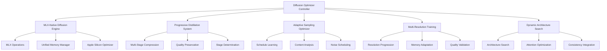

# Adaptive-Diffusion-Optimizer Specification

**Created:** 2025-10-14
**Source:** docs/features/adaptive-diffusion-optimizer.md
**Original:** requirements.md
**Status:** Migrated from standalone requirements
**Implementation Status:** Future
**Priority:** P2

---

## 1. Overview

### Purpose

The Adaptive Diffusion Model Optimizer with MLX Integration is an intelligent system that optimizes diffusion models during training using MLX for Apple Silicon. The system incorporates progressive distillation, efficient sampling, and hardware-aware optimization to address optimization challenges in latent diffusion models while maximizing Apple Silicon performance.

### Success Metrics

- Feature implementation complete
- All acceptance criteria met
- Tests passing with adequate coverage
- Performance targets achieved
- 3-5x performance improvement on Apple Silicon

### Target Users

- generative AI researcher
- model optimization engineer
- performance engineer
- computer vision researcher
- AI architect
- generative AI engineer

## 2. Functional Requirements

### FR-1: MLX-native diffusion optimization

**User Story:** As a generative AI researcher, I want MLX-native diffusion optimization, so that I can leverage Apple Silicon's full potential for diffusion model training and inference.

**Requirements:**

- System SHALL implement native MLX operations for diffusion model components
- System SHALL automatically optimize for M1/M2 unified memory architecture
- System SHALL leverage MLX's Apple Silicon optimizations for 3-5x performance improvement
- System SHALL efficiently use unified memory for large diffusion models

### FR-2: progressive distillation

**User Story:** As a model optimization engineer, I want progressive distillation, so that I can compress diffusion models while maintaining generation quality.

**Requirements:**

- System SHALL implement multi-stage model compression
- System SHALL preserve generation quality throughout distillation process
- System SHALL automatically determine optimal distillation stages
- System SHALL provide quality vs. compression trade-off analysis

### FR-3: adaptive sampling optimization

**User Story:** As a performance engineer, I want adaptive sampling optimization, so that I can achieve optimal generation speed without sacrificing quality.

**Requirements:**

- System SHALL learn optimal denoising schedules dynamically
- System SHALL automatically adjust sampling steps based on content complexity
- System SHALL optimize noise scheduling for Apple Silicon hardware
- System SHALL reduce sampling steps while maintaining generation quality

### FR-4: multi-resolution training

**User Story:** As a computer vision researcher, I want multi-resolution training, so that I can efficiently train diffusion models across different image resolutions.

**Requirements:**

- System SHALL support efficient training across different image resolutions
- System SHALL implement progressive resolution training strategies
- System SHALL adapt memory usage based on resolution requirements
- System SHALL ensure consistent quality across different resolutions

### FR-5: dynamic architecture search

**User Story:** As an AI architect, I want dynamic architecture search, so that I can find optimal U-Net variants specifically designed for Apple Silicon.

**Requirements:**

- System SHALL find optimal U-Net variants for Apple Silicon
- System SHALL optimize architecture choices for M1/M2 specific capabilities
- System SHALL implement memory-efficient attention mechanisms
- System SHALL integrate consistency model capabilities for faster generation

### FR-6: integrated experiment tracking for diffusion optimization

**User Story:** As a researcher, I want integrated experiment tracking for diffusion optimization, so that I can track diffusion experiments and compare optimization techniques across different architectures and sampling methods.

**Requirements:**

- System SHALL automatically log experiments to the shared MLFlow infrastructure
- System SHALL track distillation parameters, sampling efficiency, and generation quality metrics
- Trained models SHALL be automatically registered in the shared model registry with diffusion optimization metadata
- System SHALL provide cross-experiment comparison using shared analytics utilities

### FR-7: automated model management and deployment

**User Story:** As a generative AI engineer, I want automated model management and deployment, so that I can efficiently deploy optimized diffusion models while maintaining quality monitoring.

**Requirements:**

- Diffusion datasets SHALL be automatically tracked and versioned using the shared DVC system
- Optimized diffusion models SHALL be automatically deployed to the shared serving infrastructure with MLX optimization
- The shared monitoring system SHALL alert and suggest re-optimization when generation quality degrades
- Complex diffusion workflows SHALL be orchestrated using the shared Airflow infrastructure

## 3. Non-Functional Requirements

### 3.1 Performance

**User Story:** As a generative AI researcher, I want MLX-native diffusion optimization, so that I can leverage Apple Silicon's full potential for diffusion model training and inference.
- WHEN training is performed THEN the system SHALL leverage MLX's Apple Silicon optimizations for 3-5x performance improvement

**User Story:** As a performance engineer, I want adaptive sampling optimization, so that I can achieve optimal generation speed without sacrificing quality.
- WHEN sampling is optimized THEN the system SHALL learn optimal denoising schedules dynamically
- WHEN speed is improved THEN the system SHALL reduce sampling steps while maintaining generation quality

### 3.2 Security & Privacy

- No specific security requirements identified

### 3.3 Scalability & Reliability

**User Story:** As a computer vision researcher, I want multi-resolution training, so that I can efficiently train diffusion models across different image resolutions.
- WHEN memory is optimized THEN the system SHALL adapt memory usage based on resolution requirements

## 4. Architecture & Design

# Design Document

## Overview

The Adaptive Diffusion Model Optimizer with MLX Integration is designed as an intelligent system for optimizing diffusion models during training. The system combines MLX-native operations, progressive distillation, adaptive sampling, multi-resolution training, and dynamic architecture search to maximize performance on Apple Silicon hardware.

## Architecture

### High-Level Architecture



## Components and Interfaces

### MLX-Native Diffusion Engine

```python
from pathlib import Path
from typing import Dict, Any, Optional
import mlx.core as mx
import mlx.nn as nn

class MLXDiffusionEngine:
    """MLX-optimized diffusion model engine for Apple Silicon."""
    
    def __init__(self, model_config: Dict[str, Any]):
        self.model_config = model_config
        self.device = self._detect_apple_silicon()
        self.model = self._initialize_model()
    
    def _detect_apple_silicon(self) -> str:
        """Detect Apple Silicon and optimize accordingly."""
        import platform
        if platform.machine() == "arm64" and platform.system() == "Darwin":
            return "apple_silicon"
        return "cpu"
    
    def forward_diffusion(self, x: mx.array, t: mx.array) -> mx.array:
        """Apply forward diffusion process using MLX operations."""
        pass
    
    def reverse_diffusion(self, x: mx.array, t: mx.array) -> mx.array:
        """Apply reverse diffusion process using MLX operations."""
        pass
```

### Progressive Distillation System

```python
class ProgressiveDistillation:
    """Multi-stage diffusion model compression with quality preservation."""
    
    def __init__(self, teacher_model: nn.Module, compression_stages: int = 4):
        self.teacher_model = teacher_model
        self.compression_stages = compression_stages
        self.student_models = []
    
    def distill_stage(self, stage: int) -> nn.Module:
        """Execute one distillation stage."""
        pass
    
    def analyze_quality_tradeoff(self) -> Dict[str, float]:
        """Analyze quality vs compression trade-offs."""
        pass
```

### Adaptive Sampling Optimizer

```python
class AdaptiveSamplingOptimizer:
    """Dynamic sampling schedule optimization for Apple Silicon."""
    
    def __init__(self, base_steps: int = 50):
        self.base_steps = base_steps
        self.learned_schedules = {}
    
    def learn_schedule(self, content_features: mx.array) -> mx.array:
        """Learn optimal denoising schedule based on content."""
        pass
    
    def optimize_noise_schedule(self, hardware_type: str) -> mx.array:
        """Optimize noise scheduling for specific hardware."""
        pass
```

### Key Components

- Architecture details available in source feature document
- See: docs/features/adaptive-diffusion-optimizer.md for complete architecture specification

## 5. Acceptance Criteria

- 1. Set up MLX diffusion infrastructure
- 2. Implement progressive distillation
- 3. Implement adaptive sampling optimization
- 4. Implement multi-resolution training
- 5. Implement dynamic architecture search
- 6. Integrate MLOps infrastructure
- 7. Comprehensive testing and validation

### Definition of Done

- All functional requirements implemented
- Non-functional requirements validated
- Comprehensive test coverage
- Documentation complete
- Code review approved
- 3-5x performance improvement achieved on Apple Silicon

## 6. Dependencies

### Technical Dependencies

- MLX framework (Apple Silicon optimization)
- PyTorch with MPS backend
- Python 3.11+
- uv package manager
- Stable Diffusion models

### Component Dependencies

- shared-utilities (logging, config, benchmarking)
- efficientai-mlx-toolkit (CLI integration)

### External Integrations

- Hugging Face Diffusers library
- MLFlow for experiment tracking
- DVC for dataset versioning

---

## Traceability

- **Feature Request:** docs/features/adaptive-diffusion-optimizer.md
- **Original Spec:** requirements.md
- **Implementation Status:** Future
- **Epic Ticket:** .sage/tickets/ADAP-001.md

## Notes

- Migrated from standalone requirements.md on 2025-10-14
- Ready for /sage.plan (implementation planning)
- Source contains detailed requirements and task breakdown
