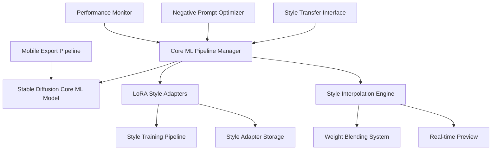

# Core-Ml-Diffusion Specification

**Created:** 2025-10-14
**Source:** docs/features/core-ml-diffusion.md
**Original:** .kiro/specs/core-ml-diffusion/
**Status:** Migrated from .kiro
**Implementation Status:** Implemented
**Priority:** P0

---

## 1. Overview

### Purpose

The Core ML Stable Diffusion Style Transfer System is a comprehensive framework for creating artistic style transfer and domain-specific image generation using Apple's Core ML Stable Diffusion implementation. The system focuses on custom LoRA training for artistic styles, efficient inference on Apple Silicon, and mobile-ready deployment capabilities.

### Success Metrics

- Feature implementation complete
- All acceptance criteria met
- Tests passing with adequate coverage
- Performance targets achieved

### Target Users

- developer
- mobile developer
- researcher
- user

## 2. Functional Requirements

### FR-1: to create custom style transfer models

**User Story:** As an artist, I want to create custom style transfer models, so that I can generate images in specific artistic styles efficiently on Apple hardware.

**Requirements:**

- System SHALL leverage Apple's pre-optimized implementations
- System SHALL complete generation in under 30 seconds on Apple Silicon
- System SHALL support both split_einsum (ANE optimized) and original attention variants
- System SHALL efficiently use unified memory architecture

### FR-2: to train custom LoRA adapters for different styles

**User Story:** As a developer, I want to train custom LoRA adapters for different styles, so that I can create specialized models for specific artistic domains.

**Requirements:**

- System SHALL support multiple artistic styles simultaneously
- System SHALL allow independent training and storage of style adapters
- System SHALL automatically preprocess and validate artistic datasets
- System SHALL provide quality metrics and sample generations

### FR-3: to blend multiple artistic styles

**User Story:** As a user, I want to blend multiple artistic styles, so that I can create unique combinations and control the artistic output.

**Requirements:**

- System SHALL support style interpolation with controllable weights
- System SHALL provide real-time preview of style combinations
- System SHALL update generated images dynamically
- System SHALL store custom style blend configurations

### FR-4: optimized negative prompting

**User Story:** As a developer, I want optimized negative prompting, so that I can improve generation quality automatically.

**Requirements:**

- System SHALL automatically optimize for quality improvement
- System SHALL analyze input prompts and suggest negative prompts
- System SHALL use automated quality assessment metrics
- System SHALL provide before/after quality comparisons

### FR-5: to deploy models to iOS devices

**User Story:** As a mobile developer, I want to deploy models to iOS devices, so that I can create native mobile applications with style transfer capabilities.

**Requirements:**

- System SHALL create iOS-compatible Core ML models
- System SHALL compress models for mobile deployment
- System SHALL provide Swift UI application templates
- System SHALL benchmark mobile vs desktop performance

### FR-6: integrated experiment tracking for style transfer

**User Story:** As a researcher, I want integrated experiment tracking for style transfer, so that I can track style training experiments and compare artistic quality across different approaches.

**Requirements:**

- System SHALL automatically log experiments to the shared MLFlow infrastructure
- System SHALL track generation parameters and artistic quality metrics
- they SHALL be automatically registered in the shared model registry with style metadata
- System SHALL provide cross-experiment comparison using shared analytics utilities

### FR-7: automated dataset management and model deployment

**User Story:** As an artist, I want automated dataset management and model deployment, so that I can focus on creativity while the system handles technical operations.

**Requirements:**

- they SHALL be automatically tracked and versioned using the shared DVC system
- they SHALL be automatically deployed to the shared serving infrastructure
- the shared monitoring system SHALL alert and suggest retraining

## 3. Non-Functional Requirements

### 3.1 Performance

4. WHEN performance is tested THEN the system SHALL benchmark mobile vs desktop performance

### 3.2 Security & Privacy

### 3.3 Scalability & Reliability

## 4. Architecture & Design

# Design Document

## Overview

The Core ML Stable Diffusion Style Transfer System is designed to leverage Apple's optimized Core ML Stable Diffusion implementation for artistic style transfer and domain-specific image generation. The system focuses on custom LoRA training for artistic styles, efficient inference on Apple Silicon, and mobile-ready deployment capabilities.

## Architecture

### High-Level Architecture



### Core Components

#### 1. Core ML Pipeline Manager

**Purpose**: Orchestrate Core ML Stable Diffusion operations with Apple Silicon optimizations

**Key Features**:

- Apple's pre-optimized Core ML model integration
- Compute unit optimization (CPU + GPU + ANE)
- Memory-efficient pipeline management
- Attention implementation selection (split_einsum vs original)

#### 2. LoRA Style Training System

**Purpose**: Train custom LoRA adapters for specific artistic styles

**Components**:

- Multi-style training pipeline
- Style dataset preprocessing
- Training progress monitoring
- Quality assessment metrics

#### 3. Style Interpolation Engine

**Purpose**: Blend multiple artistic styles with controllable weights

**Features**:

- Real-time style blending
- Weight interpolation algorithms
- Preview generation system
- Style combination persistence

## Components and Interfaces

### Core ML Pipeline Interface

```python
from pathlib import Path
import coremltools as ct
from python_coreml_stable_diffusion import pipeline
import numpy as np

class CoreMLStableDiffusionPipeline:
    """Apple Silicon optimized Stable Diffusion pipeline."""

    def __init__(
        self,
        model_path: Path,
        compute_unit: str = "ALL",
        attention_implementation: str = "SPLIT_EINSUM"
    ):
        self.model_path = model_path
        self.compute_unit = compute_unit
        self.attention_implementation = attention_implementation
        self.pipeline = self._initialize_pipeline()
        self.lora_adapters: dict[str, Path] = {}

    def _initialize_pipeline(self) -> pipeline.StableDiffusionPipeline:
        """Initialize Core ML pipeline with Apple Silicon optimizations."""
        return pipeline.StableDiffusionPipeline(
            str(self.model_path),
            compute_unit=self.compute_unit,
            attention_implementation=self.attention_implementation
        )

    def generate_image(
        self,
        prompt: str,

### Key Components

- Architecture details available in source feature document
- See: docs/features/core-ml-diffusion.md for complete architecture specification

## 5. Acceptance Criteria

- 1. Set up Core ML Stable Diffusion environment
- 2. Implement Core ML pipeline integration
- 3. Implement LoRA style adapter training system
- 4. Implement style interpolation and blending system
- 5. Implement negative prompt optimization
- 6. Implement mobile deployment pipeline
- 7. Implement web interface and API
- 8. Implement performance monitoring and optimization
- 9. Implement comprehensive testing and validation

### Definition of Done

- All functional requirements implemented
- Non-functional requirements validated
- Comprehensive test coverage
- Documentation complete
- Code review approved

## 6. Dependencies

### Technical Dependencies

- MLX framework (Apple Silicon optimization)
- PyTorch with MPS backend
- Python 3.11+
- uv package manager

### Component Dependencies

- shared-utilities (logging, config, benchmarking)
- efficientai-mlx-toolkit (CLI integration)

### External Integrations

- To be identified during implementation planning

---

## Traceability

- **Feature Request:** docs/features/core-ml-diffusion.md
- **Original Spec:** .kiro/specs/core-ml-diffusion/
- **Implementation Status:** Implemented
- **Epic Ticket:** .sage/tickets/[COMPONENT]-001.md

## Notes

- Migrated from .kiro system on 2025-10-14
- Ready for /sage.plan (implementation planning)
- Source contains detailed design, interfaces, and task breakdown
