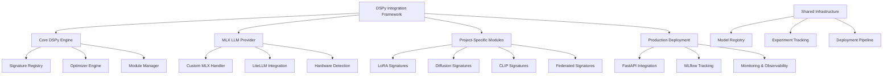

# Dspy-Toolkit-Framework Specification

**Created:** 2025-10-14
**Source:** docs/features/dspy-toolkit-framework.md
**Original:** .kiro/specs/dspy-toolkit-framework/
**Status:** Migrated from .kiro
**Implementation Status:** Implemented
**Priority:** P0

---

## 1. Overview

### Purpose

The DSPy Integration Framework provides a unified intelligent prompt optimization and workflow automation system for all EfficientAI-MLX-Toolkit projects. This framework integrates DSPy's signature-based programming model with Apple Silicon optimizations, enabling automated prompt engineering, workflow optimization, and production deployment across all toolkit components.

### Success Metrics

- Feature implementation complete
- All acceptance criteria met
- Tests passing with adequate coverage
- Performance targets achieved

### Target Users

- deployment engineer
- developer
- machine learning engineer
- researcher
- system architect
- toolkit developer
- toolkit maintainer

## 2. Functional Requirements

### FR-1: a unified DSPy integration framework

**User Story:** As a toolkit developer, I want a unified DSPy integration framework, so that all projects can leverage intelligent prompt optimization and automated workflow management.

**Requirements:**

- System SHALL provide a unified configuration system for all toolkit projects
- System SHALL integrate DSPy with custom MLX LLM providers through LiteLLM
- System SHALL provide standardized signature templates for common ML workflows
- System SHALL support modular DSPy components that can be shared across projects

### FR-2: automated prompt optimization

**User Story:** As a machine learning engineer, I want automated prompt optimization, so that I can achieve optimal performance without manual prompt engineering.

**Requirements:**

- System SHALL support MIPROv2, BootstrapFewShot, and GEPA optimizers
- System SHALL automatically tune prompts based on task-specific metrics
- System SHALL use few-shot learning for improved performance
- System SHALL persist optimized programs for reproducibility

### FR-3: project-specific DSPy patterns

**User Story:** As a researcher, I want project-specific DSPy patterns, so that I can leverage domain-specific optimizations for different ML tasks.

**Requirements:**

- System SHALL provide specialized signatures for hyperparameter optimization
- System SHALL support adaptive sampling and architecture search signatures
- System SHALL provide multi-modal optimization signatures
- System SHALL support distributed optimization signatures

### FR-4: production-ready DSPy integration

**User Story:** As a deployment engineer, I want production-ready DSPy integration, so that I can deploy optimized workflows with monitoring and observability.

**Requirements:**

- System SHALL provide FastAPI integration with async DSPy modules
- System SHALL integrate with MLflow for experiment tracking and tracing
- System SHALL provide comprehensive debugging utilities and observability
- System SHALL support streaming endpoints and ensemble methods

### FR-5: Apple Silicon optimization

**User Story:** As a system architect, I want Apple Silicon optimization, so that DSPy workflows can leverage the full potential of M1/M2 hardware.

**Requirements:**

- System SHALL automatically configure MLX-optimized LLM providers
- System SHALL optimize for unified memory architecture
- System SHALL provide Apple Silicon-specific benchmarking
- System SHALL gracefully degrade to MPS or CPU backends

### FR-6: comprehensive testing and validation

**User Story:** As a developer, I want comprehensive testing and validation, so that DSPy integrations are reliable and maintainable across all projects.

**Requirements:**

- System SHALL provide automated signature validation
- System SHALL support unit testing for DSPy components
- System SHALL validate optimizer performance across different tasks
- System SHALL provide end-to-end testing for all project integrations

### FR-7: centralized DSPy management

**User Story:** As a toolkit maintainer, I want centralized DSPy management, so that I can maintain consistency and share optimizations across all projects.

**Requirements:**

- System SHALL provide centralized DSPy configuration management
- System SHALL enable sharing of optimized programs across projects
- System SHALL support versioning and migration of DSPy components

## 3. Non-Functional Requirements

### 3.1 Performance

**User Story:** As a machine learning engineer, I want automated prompt optimization, so that I can achieve optimal performance without manual prompt engineering.
3. WHEN examples are selected THEN the system SHALL use few-shot learning for improved performance
3. WHEN performance is measured THEN the system SHALL provide Apple Silicon-specific benchmarking
3. WHEN optimization is tested THEN the system SHALL validate optimizer performance across different tasks

### 3.2 Security & Privacy

### 3.3 Scalability & Reliability

4. WHEN federated learning is used THEN the system SHALL support distributed optimization signatures

## 4. Architecture & Design

# Design Document

## Overview

The DSPy Integration Framework serves as the intelligent orchestration layer for the EfficientAI-MLX-Toolkit, providing automated prompt optimization, workflow management, and production deployment capabilities. The framework integrates DSPy's signature-based programming model with Apple Silicon optimizations, creating a unified system that enhances all toolkit projects with intelligent automation.

## Architecture

### High-Level Architecture



### Core Components

#### 1. DSPy Core Engine

**Purpose**: Central orchestration and management of DSPy components

**Key Features**:

- Unified signature registry for all project types
- Automated optimizer selection and configuration
- Module lifecycle management
- Cross-project optimization sharing

#### 2. MLX LLM Provider

**Purpose**: Apple Silicon-optimized LLM integration for DSPy

**Key Features**:

- Custom MLX model integration through LiteLLM
- Automatic hardware detection and optimization
- Unified memory management
- Fallback to MPS/CPU when needed

#### 3. Project-Specific Module Library

**Purpose**: Domain-specific DSPy signatures and modules

**Key Features**:

- Specialized signatures for each toolkit project
- Reusable optimization patterns
- Cross-project module sharing
- Template-based module generation

## Components and Interfaces

### Core DSPy Engine Interface

```python
from pathlib import Path
from typing import Dict, List, Optional, Union, Any
import dspy
from dataclasses import dataclass
from abc import ABC, abstractmethod

@dataclass
class DSPyConfig:
    """Configuration for DSPy integration."""
    model_provider: str = "mlx"
    model_name: str = "mlx/mlx-7b"
    optimization_level: int = 2
    cache_dir: Path = Path(".dspy_cache")
    enable_tracing: bool = True
    max_retries: int = 3

class DSPyFramework:
    """Central DSPy framework manager."""

    def __init__(self, config: DSPyConfig):

### Key Components

- Architecture details available in source feature document
- See: docs/features/dspy-toolkit-framework.md for complete architecture specification

## 5. Acceptance Criteria


### Definition of Done

- All functional requirements implemented
- Non-functional requirements validated
- Comprehensive test coverage
- Documentation complete
- Code review approved

## 6. Dependencies

### Technical Dependencies

- MLX framework (Apple Silicon optimization)
- PyTorch with MPS backend
- Python 3.11+
- uv package manager

### Component Dependencies

- shared-utilities (logging, config, benchmarking)
- efficientai-mlx-toolkit (CLI integration)

### External Integrations

- To be identified during implementation planning

---

## Traceability

- **Feature Request:** docs/features/dspy-toolkit-framework.md
- **Original Spec:** .kiro/specs/dspy-toolkit-framework/
- **Implementation Status:** Implemented
- **Epic Ticket:** .sage/tickets/[COMPONENT]-001.md

## Notes

- Migrated from .kiro system on 2025-10-14
- Ready for /sage.plan (implementation planning)
- Source contains detailed design, interfaces, and task breakdown
