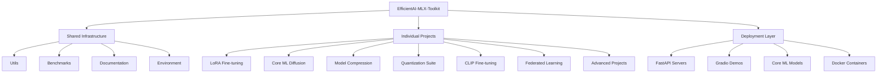

# Efficientai-Mlx-Toolkit Specification

**Created:** 2025-10-14
**Source:** docs/features/efficientai-mlx-toolkit.md
**Original:** .kiro/specs/efficientai-mlx-toolkit/
**Status:** Migrated from .kiro
**Implementation Status:** Implemented
**Priority:** P0

---

## 1. Overview

### Purpose

The EfficientAI-MLX-Toolkit is a comprehensive AI/ML optimization framework designed specifically for Apple Silicon (M1/M2) hardware. The project aims to provide a collection of optimized machine learning tools, frameworks, and utilities that leverage Apple's MLX framework, Core ML, and other Apple Silicon-specific optimizations. The toolkit includes multiple individual projects ranging from LoRA fine-tuning to advanced diffusion model optimization, all designed to maximize performance on Apple hardware while maintaining ease of use and deployment readiness.

### Success Metrics

- Feature implementation complete
- All acceptance criteria met
- Tests passing with adequate coverage
- Performance targets achieved

### Target Users

- data scientist
- developer
- machine learning developer
- machine learning engineer
- researcher
- team lead

## 2. Functional Requirements

### FR-1: a unified toolkit that leverages Apple Silicon optimizations

**User Story:** As a machine learning developer, I want a unified toolkit that leverages Apple Silicon optimizations, so that I can efficiently develop and deploy ML models on M1/M2 hardware.

**Requirements:**

- System SHALL use `uv` as the primary package manager instead of pip or conda
- System SHALL use `pathlib` for all file management operations
- System SHALL automatically detect and configure Apple Silicon optimizations
- System SHALL maintain compatibility across all individual projects

### FR-2: modular project organization

**User Story:** As a developer, I want modular project organization, so that I can work on individual components without affecting the entire toolkit.

**Requirements:**

- each project SHALL have its own isolated environment and dependencies
- System SHALL provide common utilities in a centralized location
- each project SHALL have comprehensive documentation and examples
- System SHALL provide standardized benchmarking across all projects

### FR-3: comprehensive benchmarking capabilities

**User Story:** As a researcher, I want comprehensive benchmarking capabilities, so that I can compare performance across different optimization techniques and hardware configurations.

**Requirements:**

- System SHALL measure performance, memory usage, and accuracy metrics
- System SHALL provide standardized comparison frameworks
- System SHALL export results in multiple formats (JSON, CSV, visualizations)
- System SHALL provide Apple Silicon-specific performance insights

### FR-4: easy deployment options

**User Story:** As a developer, I want easy deployment options, so that I can quickly deploy optimized models to production environments.

**Requirements:**

- System SHALL support multiple deployment formats (Core ML, ONNX, FastAPI)
- System SHALL provide pre-configured API templates
- System SHALL provide Docker configurations optimized for Apple Silicon
- System SHALL include interactive demo applications

### FR-5: automated optimization pipelines

**User Story:** As a machine learning engineer, I want automated optimization pipelines, so that I can efficiently optimize models without manual intervention.

**Requirements:**

- System SHALL automatically select appropriate optimization techniques
- System SHALL use automated hyperparameter optimization
- System SHALL apply multiple compression techniques and compare results
- System SHALL monitor and log all relevant metrics

### FR-6: comprehensive development tooling

**User Story:** As a developer, I want comprehensive development tooling, so that I can efficiently develop, test, and maintain the toolkit.

**Requirements:**

- System SHALL provide steering rules for consistent development practices
- System SHALL include hooks for common development workflows
- System SHALL provide automated testing frameworks
- System SHALL maintain synchronized documentation across all projects

### FR-7: shared MLOps infrastructure

**User Story:** As a team lead, I want shared MLOps infrastructure, so that I can manage experiments, deployments, and monitoring across all toolkit projects from a unified platform.

**Requirements:**

- System SHALL provide shared MLOps infrastructure serving all individual projects
- they SHALL automatically connect to centralized experiment tracking, data versioning, and model serving
- System SHALL aggregate results in a unified dashboard for cross-project comparison
- they SHALL use shared serving infrastructure with unified monitoring and alerting

### FR-8: cross-project analytics and insights

**User Story:** As a data scientist, I want cross-project analytics and insights, so that I can learn from optimization techniques across different project types and identify the most effective approaches.

**Requirements:**

- System SHALL provide cross-project comparison of optimization techniques and results
- System SHALL show toolkit-wide trends and improvements over time
- System SHALL recommend optimal techniques based on historical performance across projects

## 3. Non-Functional Requirements

### 3.1 Performance

The EfficientAI-MLX-Toolkit is a comprehensive AI/ML optimization framework designed specifically for Apple Silicon (M1/M2) hardware. The project aims to provide a collection of optimized machine learning tools, frameworks, and utilities that leverage Apple's MLX framework, Core ML, and other Apple Silicon-specific optimizations. The toolkit includes multiple individual projects ranging from LoRA fine-tuning to advanced diffusion model optimization, all designed to maximize performance on Apple hardware while maintaining ease of use and deployment readiness.
**User Story:** As a researcher, I want comprehensive benchmarking capabilities, so that I can compare performance across different optimization techniques and hardware configurations.

1. WHEN benchmarks are executed THEN the system SHALL measure performance, memory usage, and accuracy metrics
4. WHEN hardware is evaluated THEN the system SHALL provide Apple Silicon-specific performance insights
1. WHEN analyzing performance THEN the system SHALL provide cross-project comparison of optimization techniques and results

### 3.2 Security & Privacy

### 3.3 Scalability & Reliability

## 4. Architecture & Design

# Design Document

## Overview

The EfficientAI-MLX-Toolkit is designed as a modular, Apple Silicon-optimized machine learning framework that provides a comprehensive suite of tools for model optimization, training, and deployment. The architecture emphasizes modularity, performance optimization, and ease of use while leveraging Apple's hardware-specific optimizations.

## Architecture

### High-Level Architecture



### Package Management Strategy

The toolkit will use `uv` as the primary package manager, replacing all `pip` and `conda` references in the original documentation. This provides:

- Faster dependency resolution
- Better virtual environment management
- Improved reproducibility
- Native Python packaging support

### File Management Strategy

All file operations will use `pathlib` for:

- Cross-platform compatibility
- Object-oriented file handling
- Better path manipulation
- Type safety and IDE support

## Components and Interfaces

### Core Infrastructure Components

#### 1. Shared Utilities (`utils/`)

**Purpose**: Provide common functionality across all projects

**Key Modules**:

- `logging_utils.py`: Centralized logging configuration
- `config_manager.py`: Configuration management using pathlib
- `benchmark_runner.py`: Standardized benchmarking framework
- `global_plotting.py`: Common visualization utilities

**Interface**:

```python
from pathlib import Path
from utils.config_manager import ConfigManager
from utils.benchmark_runner import BenchmarkRunner

config = ConfigManager(Path("config.yaml"))
benchmark = BenchmarkRunner(config)
```

#### 2. Environment Management (`environment/`)

**Purpose**: Manage dependencies and environment setup

**Key Files**:

- `pyproject.toml`: Main project configuration using uv
- `requirements.txt`: Core dependencies
- `setup_scripts.sh`: Automated setup for Apple Silicon

#### 3. Benchmarking Framework (`benchmarks/`)

**Purpose**: Standardized performance evaluation

**Components**:

- Performance measurement utilities
- Memory usage tracking
- Hardware-specific benchmarks
- Comparative analysis tools

### Key Components

- Architecture details available in source feature document
- See: docs/features/efficientai-mlx-toolkit.md for complete architecture specification

## 5. Acceptance Criteria

- 2. Implement shared utilities and configuration management
- 3. Implement benchmarking framework
- 4. Set up environment and dependency management
- 5. Create individual project templates and structure
- 6. Implement deployment infrastructure
- 7. Implement automated optimization pipelines
- 8. Implement development tooling and automation
- 9. Create comprehensive documentation and examples
- 10. Integration testing and validation

### Definition of Done

- All functional requirements implemented
- Non-functional requirements validated
- Comprehensive test coverage
- Documentation complete
- Code review approved

## 6. Dependencies

### Technical Dependencies

- MLX framework (Apple Silicon optimization)
- PyTorch with MPS backend
- Python 3.11+
- uv package manager

### Component Dependencies

- shared-utilities (logging, config, benchmarking)
- efficientai-mlx-toolkit (CLI integration)

### External Integrations

- To be identified during implementation planning

---

## Traceability

- **Feature Request:** docs/features/efficientai-mlx-toolkit.md
- **Original Spec:** .kiro/specs/efficientai-mlx-toolkit/
- **Implementation Status:** Implemented
- **Epic Ticket:** .sage/tickets/[COMPONENT]-001.md

## Notes

- Migrated from .kiro system on 2025-10-14
- Ready for /sage.plan (implementation planning)
- Source contains detailed design, interfaces, and task breakdown
