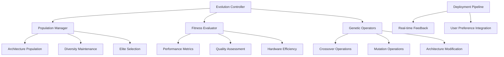

# Evolutionary-Diffusion-Search Specification

**Created:** 2025-10-14
**Source:** docs/features/evolutionary-diffusion-search.md
**Original:** .kiro/specs/evolutionary-diffusion-search/
**Status:** Migrated from .kiro
**Implementation Status:** Future
**Priority:** P2

---

## 1. Overview

### Purpose

The Self-Improving Diffusion Architecture with Evolutionary Search is a system that uses evolutionary algorithms and neural architecture search to continuously improve diffusion model architectures. The system focuses on automated architecture evolution, hardware-aware optimization, and real-time adaptation based on deployment performance metrics.

### Success Metrics

- Feature implementation complete
- All acceptance criteria met
- Tests passing with adequate coverage
- Performance targets achieved

### Target Users

- deployment engineer
- model architect
- performance engineer
- researcher

## 2. Functional Requirements

### FR-1: evolutionary architecture search

**User Story:** As an AI architecture researcher, I want evolutionary architecture search, so that I can automatically discover improved diffusion model architectures.

**Requirements:**

- System SHALL use evolutionary algorithms to evolve diffusion model architectures
- System SHALL maintain diverse populations of architecture candidates
- System SHALL assess architectures based on generation quality and efficiency
- System SHALL apply selection, crossover, and mutation operators

### FR-2: hardware-aware evolution

**User Story:** As a performance engineer, I want hardware-aware evolution, so that I can optimize architectures specifically for Apple Silicon constraints and capabilities.

**Requirements:**

- System SHALL incorporate M1/M2-specific constraints in architecture search
- System SHALL consider unified memory architecture in fitness evaluation
- System SHALL optimize for Apple Silicon's specific compute capabilities
- System SHALL benchmark performance on actual Apple Silicon hardware

### FR-3: architecture mutation operators

**User Story:** As a model architect, I want architecture mutation operators, so that I can systematically explore different architectural variations.

**Requirements:**

- System SHALL modify layer types, connections, and attention mechanisms
- System SHALL gradually increase model complexity during evolution
- System SHALL apply intelligent mutation strategies based on architecture analysis
- System SHALL ensure population diversity through varied mutation operators

### FR-4: automated deployment pipeline

**User Story:** As a deployment engineer, I want automated deployment pipeline, so that I can continuously deploy and test evolved architectures in production.

**Requirements:**

- System SHALL automatically deploy promising candidates for testing
- System SHALL track real-world deployment performance metrics
- System SHALL incorporate user feedback into fitness evaluation
- System SHALL handle rollback and version management automatically

### FR-5: real-time adaptation

**User Story:** As a researcher, I want real-time adaptation, so that I can continuously improve architectures based on actual usage patterns and performance data.

**Requirements:**

- System SHALL continuously evolve based on deployment performance metrics
- System SHALL incorporate human preferences into fitness evaluation
- System SHALL apply architectural improvements across different domains
- System SHALL maintain long-term evolutionary progress tracking

### FR-6: integrated experiment tracking for evolutionary architecture search

**User Story:** As a researcher, I want integrated experiment tracking for evolutionary architecture search, so that I can track evolutionary experiments and compare architecture search strategies across different generations and fitness criteria.

**Requirements:**

- System SHALL automatically log experiments to the shared MLFlow infrastructure
- System SHALL track evolutionary parameters, fitness scores, and architectural innovations
- they SHALL be automatically registered in the shared model registry with evolutionary metadata
- System SHALL provide cross-experiment comparison using shared analytics utilities

### FR-7: automated evolutionary workflow management and deployment

**User Story:** As an AI architect, I want automated evolutionary workflow management and deployment, so that I can efficiently orchestrate evolutionary processes while maintaining architecture performance monitoring.

**Requirements:**

- they SHALL be automatically tracked and versioned using the shared DVC system
- they SHALL be automatically deployed to the shared serving infrastructure with performance monitoring
- the shared monitoring system SHALL alert and trigger evolutionary re-optimization

## 3. Non-Functional Requirements

### 3.1 Performance

The Self-Improving Diffusion Architecture with Evolutionary Search is a system that uses evolutionary algorithms and neural architecture search to continuously improve diffusion model architectures. The system focuses on automated architecture evolution, hardware-aware optimization, and real-time adaptation based on deployment performance metrics.
3. WHEN fitness is evaluated THEN the system SHALL assess architectures based on generation quality and efficiency
**User Story:** As a performance engineer, I want hardware-aware evolution, so that I can optimize architectures specifically for Apple Silicon constraints and capabilities.
3. WHEN efficiency is measured THEN the system SHALL optimize for Apple Silicon's specific compute capabilities
4. WHEN architectures are evaluated THEN the system SHALL benchmark performance on actual Apple Silicon hardware

### 3.2 Security & Privacy

### 3.3 Scalability & Reliability

## 4. Architecture & Design

# Design Document

## Overview

The Self-Improving Diffusion Architecture with Evolutionary Search uses evolutionary algorithms and neural architecture search to continuously improve diffusion model architectures. The system focuses on automated architecture evolution, hardware-aware optimization, and real-time adaptation based on deployment performance metrics.

## Architecture

### High-Level Architecture



## Components and Interfaces

### Evolutionary Search Controller Interface

```python
from pathlib import Path
from typing import Dict, List, Optional, Any, Tuple
from dataclasses import dataclass
import torch
import torch.nn as nn
from enum import Enum

class ArchitectureComponent(Enum):
    ATTENTION_BLOCK = "attention"
    CONV_BLOCK = "conv"
    RESIDUAL_BLOCK = "residual"
    NORMALIZATION = "norm"
    ACTIVATION = "activation"

@dataclass
class ArchitectureGenome:
    layers: List[Dict[str, Any]]
    connections: List[Tuple[int, int]]
    parameters: Dict[str, Any]
    fitness_score: float = 0.0
    generation: int = 0

class EvolutionaryDiffusionSearch:
    """Evolutionary search for diffusion architectures."""

    def __init__(self, population_size: int = 50):
        self.population_size = population_size
        self.population = self._initialize_population()
        self.fitness_evaluator = PerformanceEvaluator()
        self.genetic_operators = GeneticOperators()
        self.deployment_manager = DeploymentManager()

    def evolve_generation(self) -> List[ArchitectureGenome]:
        """Evolve one generation of architectures."""
        pass

    def evaluate_fitness(
        self,
        genome: ArchitectureGenome
    ) -> Dict[str, float]:
        """Evaluate architecture fitness."""
        pass
```

### Genetic Operators Interface

```python
import random
from typing import List, Tuple

class GeneticOperators:
    """Genetic operators for architecture evolution."""

    def __init__(self, mutation_rate: float = 0.1, crossover_rate: float = 0.8):
        self.mutation_rate = mutation_rate
        self.crossover_rate = crossover_rate

    def crossover(
        self,
        parent1: ArchitectureGenome,
        parent2: ArchitectureGenome
    ) -> Tuple[ArchitectureGenome, ArchitectureGenome]:

### Key Components

- Architecture details available in source feature document
- See: docs/features/evolutionary-diffusion-search.md for complete architecture specification

## 5. Acceptance Criteria

- 1. Set up evolutionary search environment
- 2. Implement evolutionary algorithm framework
- 3. Implement architecture representation and modification
- 4. Implement fitness evaluation system
- 5. Implement automated deployment and feedback system
- 6. Implement continuous evolution and adaptation
- 7. Implement comprehensive testing and validation

### Definition of Done

- All functional requirements implemented
- Non-functional requirements validated
- Comprehensive test coverage
- Documentation complete
- Code review approved

## 6. Dependencies

### Technical Dependencies

- MLX framework (Apple Silicon optimization)
- PyTorch with MPS backend
- Python 3.11+
- uv package manager

### Component Dependencies

- shared-utilities (logging, config, benchmarking)
- efficientai-mlx-toolkit (CLI integration)

### External Integrations

- To be identified during implementation planning

---

## Traceability

- **Feature Request:** docs/features/evolutionary-diffusion-search.md
- **Original Spec:** .kiro/specs/evolutionary-diffusion-search/
- **Implementation Status:** Future
- **Epic Ticket:** .sage/tickets/[COMPONENT]-001.md

## Notes

- Migrated from .kiro system on 2025-10-14
- Ready for /sage.plan (implementation planning)
- Source contains detailed design, interfaces, and task breakdown
