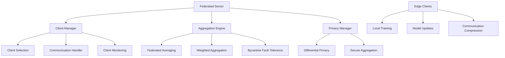

# Federated-Learning-System Specification

**Created:** 2025-10-14
**Source:** docs/features/federated-learning-system.md
**Original:** .kiro/specs/federated-learning-system/
**Status:** Migrated from .kiro
**Implementation Status:** Planned
**Priority:** P1

---

## 1. Overview

### Purpose

The Federated Learning System for Lightweight Models is designed to coordinate multiple edge clients, focusing on efficient communication and model synchronization. The system emphasizes privacy-preserving learning, efficient communication protocols, and robust aggregation methods suitable for edge deployment scenarios.

### Success Metrics

- Feature implementation complete
- All acceptance criteria met
- Tests passing with adequate coverage
- Performance targets achieved

### Target Users

- distributed systems engineer
- machine learning researcher
- network engineer
- privacy engineer
- researcher
- system administrator

## 2. Functional Requirements

### FR-1: a federated learning coordinator

**User Story:** As a distributed systems engineer, I want a federated learning coordinator, so that I can train models across multiple edge clients while preserving data privacy.

**Requirements:**

- System SHALL implement federated averaging for model aggregation
- System SHALL use weighted averaging based on client data sizes
- System SHALL minimize communication overhead between clients and server
- System SHALL handle asynchronous client updates efficiently

### FR-2: differential privacy protection

**User Story:** As a privacy engineer, I want differential privacy protection, so that I can ensure client data privacy during model aggregation.

**Requirements:**

- System SHALL add calibrated noise for privacy protection during aggregation
- System SHALL track and limit privacy budget consumption
- System SHALL balance privacy protection with model utility
- System SHALL offer configurable privacy levels

### FR-3: efficient communication protocols

**User Story:** As a network engineer, I want efficient communication protocols, so that I can minimize bandwidth usage in federated learning scenarios.

**Requirements:**

- System SHALL quantize gradients for efficient transmission
- System SHALL use gradient compression techniques to reduce communication costs
- System SHALL support sparse gradient updates
- System SHALL adapt communication frequency based on network conditions

### FR-4: robust client management

**User Story:** As a system administrator, I want robust client management, so that I can handle unreliable clients and varying participation patterns.

**Requirements:**

- System SHALL implement adaptive client selection based on data quality and availability
- System SHALL handle clients with different training speeds and availability
- System SHALL provide Byzantine fault tolerance for robust aggregation
- System SHALL adapt to changing client participation patterns

### FR-5: lightweight model optimization

**User Story:** As a machine learning researcher, I want lightweight model optimization, so that I can deploy federated learning on resource-constrained edge devices.

**Requirements:**

- System SHALL focus on lightweight models suitable for edge deployment
- System SHALL optimize for minimal computational and memory requirements
- System SHALL support efficient local training on edge devices
- System SHALL provide convergence tracking with minimal overhead

### FR-6: integrated experiment tracking for federated learning

**User Story:** As a researcher, I want integrated experiment tracking for federated learning, so that I can track distributed experiments and compare aggregation methods across different federated scenarios.

**Requirements:**

- System SHALL automatically log experiments to the shared MLFlow infrastructure
- System SHALL track federated parameters, convergence metrics, and privacy-preserving statistics
- they SHALL be automatically registered in the shared model registry with federated learning metadata
- System SHALL provide cross-experiment comparison using shared analytics utilities

### FR-7: automated federated workflow management and deployment

**User Story:** As a distributed systems engineer, I want automated federated workflow management and deployment, so that I can efficiently orchestrate federated learning while maintaining privacy and performance monitoring.

**Requirements:**

- they SHALL be automatically tracked and versioned using the shared DVC system with privacy preservation
- they SHALL be automatically deployed to the shared serving infrastructure with edge optimization
- the shared monitoring system SHALL alert and suggest federated re-training

## 3. Non-Functional Requirements

### 3.1 Performance

2. WHEN clients are unreliable THEN the system SHALL handle clients with different training speeds and availability
**User Story:** As a distributed systems engineer, I want automated federated workflow management and deployment, so that I can efficiently orchestrate federated learning while maintaining privacy and performance monitoring.
3. WHEN model performance degrades THEN the shared monitoring system SHALL alert and suggest federated re-training

### 3.2 Security & Privacy

The Federated Learning System for Lightweight Models is designed to coordinate multiple edge clients, focusing on efficient communication and model synchronization. The system emphasizes privacy-preserving learning, efficient communication protocols, and robust aggregation methods suitable for edge deployment scenarios.
**User Story:** As a distributed systems engineer, I want a federated learning coordinator, so that I can train models across multiple edge clients while preserving data privacy.
**User Story:** As a privacy engineer, I want differential privacy protection, so that I can ensure client data privacy during model aggregation.

1. WHEN privacy is protected THEN the system SHALL add calibrated noise for privacy protection during aggregation
2. WHEN privacy budgets are managed THEN the system SHALL track and limit privacy budget consumption

### 3.3 Scalability & Reliability

The Federated Learning System for Lightweight Models is designed to coordinate multiple edge clients, focusing on efficient communication and model synchronization. The system emphasizes privacy-preserving learning, efficient communication protocols, and robust aggregation methods suitable for edge deployment scenarios.
**User Story:** As a distributed systems engineer, I want a federated learning coordinator, so that I can train models across multiple edge clients while preserving data privacy.
**User Story:** As a machine learning researcher, I want lightweight model optimization, so that I can deploy federated learning on resource-constrained edge devices.

1. WHEN models are optimized THEN the system SHALL focus on lightweight models suitable for edge deployment
3. WHEN training is performed THEN the system SHALL support efficient local training on edge devices

## 4. Architecture & Design

# Design Document

## Overview

The Federated Learning System for Lightweight Models coordinates multiple edge clients with efficient communication and model synchronization. The system emphasizes privacy-preserving learning, efficient communication protocols, and robust aggregation methods suitable for edge deployment scenarios.

## Architecture

### High-Level Architecture



## Components and Interfaces

### Federated Server Interface

```python
from pathlib import Path
from typing import Dict, List, Optional, Any
from dataclasses import dataclass
import torch
import torch.nn as nn

@dataclass
class FederatedConfig:
    num_clients: int = 10
    clients_per_round: int = 5
    num_rounds: int = 100
    local_epochs: int = 5
    learning_rate: float = 0.01
    privacy_budget: float = 1.0
    compression_ratio: float = 0.1

class FederatedServer:
    """Main federated learning server."""

    def __init__(self, config: FederatedConfig, model_factory: callable):
        self.config = config
        self.global_model = model_factory()
        self.client_manager = ClientManager(config)
        self.aggregator = FederatedAggregator()
        self.privacy_manager = PrivacyManager(config.privacy_budget)

    def train_federated(self) -> Dict[str, Any]:
        """Execute federated training rounds."""
        pass

    def aggregate_updates(self, client_updates: List[Dict]) -> Dict[str, torch.Tensor]:
        """Aggregate client model updates."""
        pass
```

### Privacy Manager Interface

```python
import torch
import numpy as np
from typing import Dict, List, Tuple

class PrivacyManager:
    """Differential privacy and secure aggregation."""

    def __init__(self, privacy_budget: float = 1.0):
        self.privacy_budget = privacy_budget
        self.noise_multiplier = self._calculate_noise_multiplier()

    def add_noise_to_gradients(
        self,
        gradients: Dict[str, torch.Tensor],
        sensitivity: float = 1.0
    ) -> Dict[str, torch.Tensor]:
        """Add calibrated noise for differential privacy."""
        noisy_gradients = {}
        for name, grad in gradients.items():
            noise = torch.normal(
                mean=0.0,
                std=self.noise_multiplier * sensitivity,
                size=grad.shape,
                device=grad.device

### Key Components

- Architecture details available in source feature document
- See: docs/features/federated-learning-system.md for complete architecture specification

## 5. Acceptance Criteria

- 1. Set up federated learning infrastructure
- 2. Implement federated server architecture
- 3. Implement privacy-preserving mechanisms
- 4. Implement communication optimization
- 5. Implement lightweight model optimization
- 6. Implement robustness and fault tolerance
- 7. Implement comprehensive testing and validation

### Definition of Done

- All functional requirements implemented
- Non-functional requirements validated
- Comprehensive test coverage
- Documentation complete
- Code review approved

## 6. Dependencies

### Technical Dependencies

- MLX framework (Apple Silicon optimization)
- PyTorch with MPS backend
- Python 3.11+
- uv package manager

### Component Dependencies

- shared-utilities (logging, config, benchmarking)
- efficientai-mlx-toolkit (CLI integration)

### External Integrations

- To be identified during implementation planning

---

## Traceability

- **Feature Request:** docs/features/federated-learning-system.md
- **Original Spec:** .kiro/specs/federated-learning-system/
- **Implementation Status:** Planned
- **Epic Ticket:** .sage/tickets/[COMPONENT]-001.md

## Notes

- Migrated from .kiro system on 2025-10-14
- Ready for /sage.plan (implementation planning)
- Source contains detailed design, interfaces, and task breakdown
