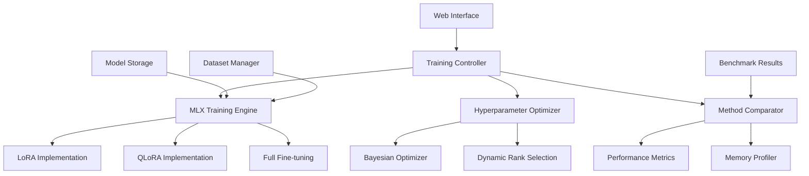

# Lora-Finetuning-Mlx Specification

**Created:** 2025-10-14
**Source:** docs/features/lora-finetuning-mlx.md
**Original:** .kiro/specs/lora-finetuning-mlx/
**Status:** Migrated from .kiro
**Implementation Status:** Implemented
**Priority:** P0

---

## 1. Overview

### Purpose

The MLX-Native LoRA Fine-Tuning Framework is a comprehensive system for Parameter-Efficient Fine-Tuning (PEFT) using Apple's MLX framework. This project focuses on building an optimized LoRA fine-tuning system that leverages Apple Silicon's unified memory architecture and provides automated hyperparameter optimization, model comparison capabilities, and an interactive web interface for easy use.

### Success Metrics

- Feature implementation complete
- All acceptance criteria met
- Tests passing with adequate coverage
- Performance targets achieved

### Target Users

- data scientist
- developer
- machine learning researcher
- researcher
- user

## 2. Functional Requirements


### FR-1: to fine-tune large language models efficiently on Apple Silicon

**User Story:** As a machine learning researcher, I want to fine-tune large language models efficiently on Apple Silicon, so that I can achieve good performance with limited computational resources.

**Requirements:**

- System SHALL use MLX framework for 3-5x better performance than PyTorch
- System SHALL use only 10-14GB RAM through memory optimization
- System SHALL complete training in 15-20 minutes
- System SHALL automatically detect and optimize for M1/M2 hardware


### FR-2: automated hyperparameter optimization

**User Story:** As a developer, I want automated hyperparameter optimization, so that I can achieve optimal results without manual tuning.

**Requirements:**

- System SHALL automatically optimize rank based on dataset complexity
- System SHALL use Bayesian optimization for efficient search
- System SHALL automatically adjust batch size based on available memory
- System SHALL provide detailed performance comparisons


### FR-3: to compare different PEFT methods

**User Story:** As a researcher, I want to compare different PEFT methods, so that I can choose the best approach for my specific use case.

**Requirements:**

- System SHALL support LoRA, QLoRA, and full fine-tuning comparison
- System SHALL measure training time, memory usage, and model quality
- System SHALL provide comprehensive performance metrics and visualizations
- System SHALL recommend the optimal approach based on constraints


### FR-4: an interactive web interface

**User Story:** As a user, I want an interactive web interface, so that I can easily upload datasets and monitor training progress.

**Requirements:**

- System SHALL provide a Gradio-based web frontend
- System SHALL validate and preprocess data automatically
- System SHALL provide real-time progress monitoring
- System SHALL allow model download and inference testing


### FR-5: efficient memory management

**User Story:** As a developer, I want efficient memory management, so that I can train larger models on limited hardware.

**Requirements:**

- System SHALL use gradient checkpointing for memory efficiency
- System SHALL support mixed precision training
- System SHALL automatically adjust batch sizes and sequence lengths
- System SHALL optimize for Apple Silicon's memory architecture


### FR-6: integrated experiment tracking and model management

**User Story:** As a researcher, I want integrated experiment tracking and model management, so that I can track my fine-tuning experiments and compare results across different configurations.

**Requirements:**

- System SHALL automatically log experiments to the shared MLFlow infrastructure
- System SHALL track all optimization attempts and results
- they SHALL be automatically registered in the shared model registry with Apple Silicon metadata
- System SHALL provide cross-experiment comparison using shared analytics utilities


### FR-7: automated data versioning and model deployment

**User Story:** As a data scientist, I want automated data versioning and model deployment, so that I can reproduce experiments and deploy models efficiently.

**Requirements:**

- they SHALL be automatically tracked and versioned using the shared DVC system
- they SHALL be automatically deployed to the shared serving infrastructure
- the shared monitoring system SHALL alert and trigger retraining


## 3. Non-Functional Requirements

### 3.1 Performance

**User Story:** As a machine learning researcher, I want to fine-tune large language models efficiently on Apple Silicon, so that I can achieve good performance with limited computational resources.

1. WHEN a model is loaded THEN the system SHALL use MLX framework for 3-5x better performance than PyTorch
4. WHEN optimization completes THEN the system SHALL provide detailed performance comparisons
3. WHEN results are generated THEN the system SHALL provide comprehensive performance metrics and visualizations
1. WHEN training is performed THEN the system SHALL use gradient checkpointing for memory efficiency

### 3.2 Security & Privacy


### 3.3 Scalability & Reliability


## 4. Architecture & Design


# Design Document

## Overview

The MLX-Native LoRA Fine-Tuning Framework is designed as a comprehensive Parameter-Efficient Fine-Tuning (PEFT) system that leverages Apple's MLX framework for optimal performance on Apple Silicon. The system provides automated hyperparameter optimization, multi-method comparison capabilities, and an interactive web interface, all optimized for Apple Silicon's unified memory architecture.

## Architecture

### High-Level Architecture



### Core Components

#### 1. MLX Training Engine

**Purpose**: Core training functionality optimized for Apple Silicon

**Key Features**:

- Native MLX operations for 3-5x performance improvement
- Unified memory optimization
- Dynamic batch sizing based on available memory
- Mixed precision training support

#### 2. PEFT Method Implementations

**Purpose**: Multiple PEFT method implementations for comparison

**Supported Methods**:

- LoRA (Low-Rank Adaptation)
- QLoRA (Quantized LoRA)
- Full fine-tuning baseline

#### 3. Hyperparameter Optimization System

**Purpose**: Automated optimization of training parameters

**Components**:

- Bayesian optimization for efficient search
- Dynamic LoRA rank selection
- Memory-aware batch size optimization
- Learning rate scheduling

## Components and Interfaces

### Training Controller Interface

```python
from pathlib import Path
from typing import Dict, List, Optional, Union
import mlx.core as mx
from dataclasses import dataclass

@dataclass
class TrainingConfig:
    model_name: str
    dataset_path: Path
    output_path: Path
    method: str  # "lora", "qlora", "full"
    max_iters: int = 1000
    batch_size: Optional[int] = None  # Auto-determined if None
    learning_rate: float = 1e-4
    lora_rank: Optional[int] = None  # Auto-optimized if None
    lora_alpha: float = 16.0
    optimization_level: int = 2

class MLXTrainingController:
    """Main controller for MLX-optimized fine-tuning."""

    def __init__(self, config: TrainingConfig):
        self.config = config
        self.device_info = self._detect_hardware()
        self.memory_manager = MemoryManager(self.device_info)

    def train(self) -> Dict[str, float]:
        """Execute training with Apple Silicon optimizations."""

### Key Components

- Architecture details available in source feature document
- See: docs/features/lora-finetuning-mlx.md for complete architecture specification

## 5. Acceptance Criteria

- 1. Set up project structure and MLX environment
- 2. Implement core MLX training infrastructure
- 3. Implement PEFT method variations
- 4. Implement automated hyperparameter optimization
- 5. Implement interactive web interface
- 6. Implement memory management and optimization
- 7. Implement model inference and deployment
- 8. Implement comprehensive testing and benchmarking

### Definition of Done

- All functional requirements implemented
- Non-functional requirements validated
- Comprehensive test coverage
- Documentation complete
- Code review approved

## 6. Dependencies

### Technical Dependencies

- MLX framework (Apple Silicon optimization)
- PyTorch with MPS backend
- Python 3.11+
- uv package manager

### Component Dependencies

- shared-utilities (logging, config, benchmarking)
- efficientai-mlx-toolkit (CLI integration)

### External Integrations

- To be identified during implementation planning

---

## Traceability

- **Feature Request:** docs/features/lora-finetuning-mlx.md
- **Original Spec:** .kiro/specs/lora-finetuning-mlx/
- **Implementation Status:** Implemented
- **Epic Ticket:** .sage/tickets/[COMPONENT]-001.md

## Notes

- Migrated from .kiro system on 2025-10-14
- Ready for /sage.plan (implementation planning)
- Source contains detailed design, interfaces, and task breakdown
