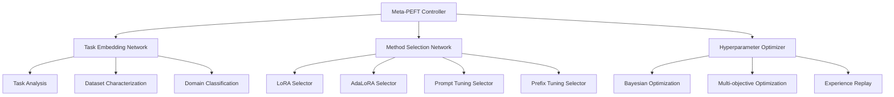

# Meta-Learning-Peft-System Specification

**Created:** 2025-10-14
**Source:** docs/features/meta-learning-peft-system.md
**Original:** .kiro/specs/meta-learning-peft-system/
**Status:** Migrated from .kiro
**Implementation Status:** Future
**Priority:** P2

---

## 1. Overview

### Purpose

The Meta-Learning PEFT System with MLX is a framework that automatically selects and configures the best Parameter-Efficient Fine-Tuning method for any given task. The system uses meta-learning to learn from previous fine-tuning experiences and provides intelligent method selection, automated hyperparameter optimization, and cross-task knowledge transfer.

### Success Metrics

- Feature implementation complete
- All acceptance criteria met
- Tests passing with adequate coverage
- Performance targets achieved

### Target Users

- continual learning researcher
- developer
- machine learning engineer
- machine learning researcher
- researcher

## 2. Functional Requirements

### FR-1: automatic PEFT method selection

**User Story:** As a machine learning researcher, I want automatic PEFT method selection, so that I can choose the optimal fine-tuning approach without manual experimentation.

**Requirements:**

- System SHALL automatically select from LoRA, AdaLoRA, prompt tuning, prefix tuning, and P-tuning methods
- System SHALL use task embeddings to predict optimal PEFT methods
- System SHALL provide confidence scores for method selection
- System SHALL rank methods by expected performance

### FR-2: task embedding capabilities

**User Story:** As a developer, I want task embedding capabilities, so that I can convert tasks to vector representations for intelligent method selection.

**Requirements:**

- System SHALL convert task characteristics to vector representations
- System SHALL capture dataset size, complexity, and domain information
- System SHALL identify similar tasks for knowledge transfer
- System SHALL continuously improve task representations

### FR-3: few-shot learning capabilities

**User Story:** As a researcher, I want few-shot learning capabilities, so that I can quickly adapt to new tasks with minimal training data.

**Requirements:**

- System SHALL adapt quickly to new tasks with minimal data
- System SHALL leverage meta-learning for rapid task adaptation
- System SHALL use previous task experience for new task learning
- System SHALL achieve good performance with limited examples

### FR-4: automated hyperparameter optimization

**User Story:** As an optimization engineer, I want automated hyperparameter optimization, so that I can achieve optimal PEFT configuration without manual tuning.

**Requirements:**

- System SHALL use Bayesian optimization for efficient search
- System SHALL automatically tune learning rates, ranks, and other PEFT parameters
- System SHALL balance accuracy, training time, and memory usage
- System SHALL offer multiple Pareto-optimal configurations

### FR-5: dynamic method switching

**User Story:** As a continual learning researcher, I want dynamic method switching, so that I can change PEFT methods during training based on performance feedback.

**Requirements:**

- System SHALL track training progress and method effectiveness
- System SHALL change PEFT methods during training based on performance
- System SHALL avoid catastrophic forgetting when switching methods
- System SHALL provide confidence estimates for method performance

### FR-6: integrated experiment tracking for meta-learning PEFT

**User Story:** As a researcher, I want integrated experiment tracking for meta-learning PEFT, so that I can track meta-learning experiments and compare method selection strategies across different tasks and domains.

**Requirements:**

- System SHALL automatically log experiments to the shared MLFlow infrastructure
- System SHALL track method selection decisions, task embeddings, and performance outcomes
- they SHALL be automatically registered in the shared model registry with meta-learning metadata
- System SHALL provide cross-experiment comparison using shared analytics utilities

### FR-7: automated meta-learning workflow management and deployment

**User Story:** As a machine learning engineer, I want automated meta-learning workflow management and deployment, so that I can efficiently orchestrate meta-learning processes while maintaining knowledge transfer monitoring.

**Requirements:**

- they SHALL be automatically tracked and versioned using the shared DVC system
- they SHALL be automatically deployed to the shared serving infrastructure with method selection capabilities
- the shared monitoring system SHALL alert and suggest meta-model retraining

## 3. Non-Functional Requirements

### 3.1 Performance

4. WHEN multiple methods are suitable THEN the system SHALL rank methods by expected performance
4. WHEN performance is measured THEN the system SHALL achieve good performance with limited examples
**User Story:** As a continual learning researcher, I want dynamic method switching, so that I can change PEFT methods during training based on performance feedback.
1. WHEN performance is monitored THEN the system SHALL track training progress and method effectiveness
2. WHEN switching is needed THEN the system SHALL change PEFT methods during training based on performance

### 3.2 Security & Privacy

### 3.3 Scalability & Reliability

The Meta-Learning PEFT System with MLX is a framework that automatically selects and configures the best Parameter-Efficient Fine-Tuning method for any given task. The system uses meta-learning to learn from previous fine-tuning experiences and provides intelligent method selection, automated hyperparameter optimization, and cross-task knowledge transfer.
3. WHEN similarity is measured THEN the system SHALL identify similar tasks for knowledge transfer
3. WHEN knowledge is transferred THEN the system SHALL use previous task experience for new task learning
3. WHEN knowledge is preserved THEN the system SHALL avoid catastrophic forgetting when switching methods
**User Story:** As a machine learning engineer, I want automated meta-learning workflow management and deployment, so that I can efficiently orchestrate meta-learning processes while maintaining knowledge transfer monitoring.

## 4. Architecture & Design

# Design Document

## Overview

The Meta-Learning PEFT System with MLX is a framework that automatically selects and configures the best Parameter-Efficient Fine-Tuning method for any given task. The system uses meta-learning to learn from previous fine-tuning experiences and provides intelligent method selection, automated hyperparameter optimization, and cross-task knowledge transfer.

## Architecture

### High-Level Architecture



## Components and Interfaces

### Meta-Learning Controller Interface

```python
from pathlib import Path
from typing import Dict, List, Optional, Any, Tuple
from dataclasses import dataclass
from enum import Enum
import torch
import torch.nn as nn

class PEFTMethod(Enum):
    LORA = "lora"
    ADALORA = "adalora"
    PROMPT_TUNING = "prompt_tuning"
    PREFIX_TUNING = "prefix_tuning"
    P_TUNING = "p_tuning"

@dataclass
class TaskCharacteristics:
    dataset_size: int
    sequence_length: int
    vocabulary_size: int
    domain: str
    task_type: str
    complexity_score: float

class MetaPEFTSystem:
    """Meta-learning system for PEFT method selection."""

    def __init__(self):
        self.task_embedder = TaskEmbeddingNetwork()
        self.method_selector = MethodSelectionNetwork()
        self.hyperparameter_optimizer = MetaHyperparameterOptimizer()
        self.experience_buffer = ExperienceBuffer()

    def predict_optimal_method(
        self,
        task_characteristics: TaskCharacteristics
    ) -> Tuple[PEFTMethod, Dict[str, Any]]:
        """Predict optimal PEFT method and hyperparameters."""
        pass

    def learn_from_experience(
        self,
        task_characteristics: TaskCharacteristics,
        method_used: PEFTMethod,
        hyperparameters: Dict[str, Any],
        performance_metrics: Dict[str, float]
    ):
        """Learn from fine-tuning experience."""
        pass
```

### Task Embedding Network Interface

```python
import torch
import torch.nn as nn
from typing import Dict, Any

class TaskEmbeddingNetwork(nn.Module):
    """Neural network for task embedding."""

    def __init__(self, embedding_dim: int = 128):
        super().__init__()
        self.embedding_dim = embedding_dim
        self.feature_encoder = self._build_encoder()

### Key Components

- Architecture details available in source feature document
- See: docs/features/meta-learning-peft-system.md for complete architecture specification

## 5. Acceptance Criteria

- 1. Set up meta-learning PEFT environment
- 2. Implement task embedding system
- 3. Implement PEFT method selection system
- 4. Implement meta-learning framework
- 5. Implement automated hyperparameter optimization
- 6. Implement uncertainty quantification and validation
- 7. Implement comprehensive testing and validation

### Definition of Done

- All functional requirements implemented
- Non-functional requirements validated
- Comprehensive test coverage
- Documentation complete
- Code review approved

## 6. Dependencies

### Technical Dependencies

- MLX framework (Apple Silicon optimization)
- PyTorch with MPS backend
- Python 3.11+
- uv package manager

### Component Dependencies

- shared-utilities (logging, config, benchmarking)
- efficientai-mlx-toolkit (CLI integration)

### External Integrations

- To be identified during implementation planning

---

## Traceability

- **Feature Request:** docs/features/meta-learning-peft-system.md
- **Original Spec:** .kiro/specs/meta-learning-peft-system/
- **Implementation Status:** Future
- **Epic Ticket:** .sage/tickets/[COMPONENT]-001.md

## Notes

- Migrated from .kiro system on 2025-10-14
- Ready for /sage.plan (implementation planning)
- Source contains detailed design, interfaces, and task breakdown
