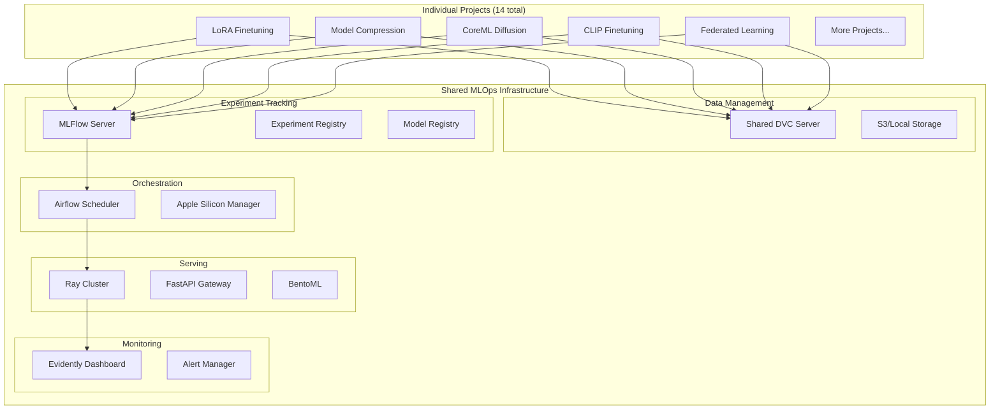

# MLOps-Integration Implementation Plan

**Component:** mlops-integration
**Status:** Planned (Not Yet Implemented)
**Priority:** P1
**Created:** 2025-10-14
**Epic Ticket:** MLOP-001

---

## Context & Documentation

### Related Documents
- **Specification:** [docs/specs/mlops-integration/spec.md](./spec.md)
- **Feature Request:** [docs/features/mlops-integration.md](../../features/mlops-integration.md)
- **Epic Ticket:** `.sage/tickets/MLOP-001.md`

### Purpose
Centralized MLOps infrastructure integrating DVC, MLFlow, Airflow, FastAPI/Ray/BentoML, and Evidently to serve all toolkit projects with unified experiment tracking, data versioning, workflow orchestration, model serving, and monitoring optimized for Apple Silicon.

---

## Executive Summary

### Overview
MLOps-Integration will provide shared infrastructure serving all 14 toolkit projects from a single centralized platform. This reduces resource overhead, ensures consistency, and enables cross-project analytics while leveraging Apple Silicon optimizations throughout the stack.

### Implementation Approach
- **Shared Infrastructure:** Single MLFlow server, Airflow instance, Ray cluster for all projects
- **Apple Silicon Optimized:** MLX-aware scheduling, MPS utilization tracking
- **Project Isolation:** Separate workspaces per project with unified dashboard
- **Automated Integration:** Projects auto-connect via shared-utilities

### Success Metrics (Targets)
- **Resource Efficiency:** 70% reduction in infrastructure overhead
- **Unified Dashboard:** 100% project coverage in single interface
- **Performance:** <100ms latency for experiment logging
- **Uptime:** >99.5% availability for all services

---

## Technology Stack

### Core Technologies
- **Python 3.11+:** Modern type hints
- **DVC:** Data and model versioning
- **MLFlow:** Experiment tracking and model registry
- **Airflow:** Workflow orchestration
- **Ray + BentoML:** Model serving
- **Evidently:** Monitoring and drift detection

### Key Dependencies
```toml
[project.dependencies]
python = "^3.11"
dvc = "^3.30.0"
mlflow = "^2.8.0"
apache-airflow = "^2.7.0"
ray[serve] = "^2.8.0"
bentoml = "^1.1.0"
evidently = "^0.4.0"
fastapi = "^0.104.0"
```

---

## Architecture Design

### High-Level Architecture



### Planned Components

#### 1. Shared DVC System (`mlops/dvc/`)
- Centralized data version control
- S3/GCS/Azure storage backends
- Apple Silicon-aware caching
- Project-specific remotes

#### 2. Shared MLFlow Server (`mlops/mlflow/`)
- Single MLFlow tracking server
- Project-based workspaces
- Unified model registry
- Apple Silicon metrics tracking

#### 3. Shared Airflow Orchestration (`mlops/airflow/`)
- Centralized workflow scheduler
- Apple Silicon resource manager
- Thermal-aware scheduling
- Multi-project DAG management

#### 4. Shared Serving Infrastructure (`mlops/serving/`)
- Ray Serve cluster
- BentoML model packaging
- FastAPI gateway
- Load balancing and auto-scaling

#### 5. Shared Monitoring System (`mlops/monitoring/`)
- Evidently drift detection
- Cross-project dashboards
- Alert management
- Performance tracking

---

## Technical Specification

### Data Models

```python
@dataclass
class MLOpsConfig:
    mlflow_uri: str = "http://localhost:5000"
    dvc_remote: str = "s3://mlops-data"
    airflow_url: str = "http://localhost:8080"
    ray_address: str = "ray://localhost:10001"
    evidently_url: str = "http://localhost:8000"
    project_namespace: str

@dataclass
class ProjectWorkspace:
    project_name: str
    namespace: str
    mlflow_experiment_id: str
    dvc_remote_path: str
    airflow_dag_prefix: str
    serving_endpoint: str

@dataclass
class AppleSiliconMetrics:
    chip_type: str  # M1, M2, M3
    memory_gb: float
    mps_available: bool
    ane_available: bool
    thermal_state: str
    power_mode: str
```

### API Interfaces

#### Python API (Shared Utilities Integration)
```python
from mlops.client import MLOpsClient

# Auto-configured from shared-utilities
client = MLOpsClient.from_project("lora-finetuning-mlx")

# Log experiment
with client.start_run(run_name="experiment-001"):
    client.log_params({"lr": 0.0001, "epochs": 10})
    client.log_metrics({"loss": 0.42, "accuracy": 0.95})
    client.log_apple_silicon_metrics({"mps_util": 87.5})
    client.log_model(model, "lora-adapter")

# Version data
client.dvc_add("datasets/train.jsonl")
client.dvc_push()

# Deploy model
client.deploy_model("lora-adapter", version="v1.0")
```

#### CLI Commands
```bash
# MLOps infrastructure management
uv run efficientai-toolkit mlops:setup        # Setup infrastructure
uv run efficientai-toolkit mlops:status       # Check services status
uv run efficientai-toolkit mlops:start        # Start all services
uv run efficientai-toolkit mlops:stop         # Stop all services

# Project integration
uv run efficientai-toolkit mlops:register <project>    # Register project
uv run efficientai-toolkit mlops:dashboard             # Open unified dashboard

# Data versioning
uv run efficientai-toolkit mlops:dvc-add <file>
uv run efficientai-toolkit mlops:dvc-push
uv run efficientai-toolkit mlops:dvc-pull

# Model serving
uv run efficientai-toolkit mlops:deploy <model> <version>
uv run efficientai-toolkit mlops:list-deployments
```

### Performance Requirements (Targets)
- **Experiment Logging:** <100ms per entry
- **Data Versioning:** <1s for file hash
- **Model Serving:** <50ms inference latency (excluding model time)
- **Dashboard Load:** <2s for full page
- **Resource Overhead:** <10% additional memory/CPU

---

## Implementation Roadmap

### Phase 1: Infrastructure Setup (Weeks 1-3)
**Milestone:** Shared services running

**Tasks:**
- [ ] Setup MLFlow tracking server with Apple Silicon metrics
- [ ] Configure DVC with S3/local storage backend
- [ ] Deploy Airflow with Apple Silicon resource manager
- [ ] Setup Ray Serve cluster for model serving
- [ ] Deploy Evidently monitoring dashboard
- [ ] Configure Docker Compose for all services
- [ ] Implement health checks and monitoring

**Deliverables:**
- All services running and accessible
- Docker Compose configuration
- Service health monitoring
- Infrastructure documentation

**Estimated Effort:** 3 weeks (1 developer)

### Phase 2: Project Integration Layer (Weeks 4-6)
**Milestone:** Projects can connect to infrastructure

**Tasks:**
- [ ] Implement MLOps client in shared-utilities
- [ ] Create project workspace management
- [ ] Implement auto-configuration from project namespace
- [ ] Add experiment logging integration
- [ ] Integrate DVC for data versioning
- [ ] Setup Airflow DAG templates
- [ ] Implement model deployment workflow

**Deliverables:**
- MLOps client library
- Project registration system
- Integration examples
- API documentation

**Estimated Effort:** 3 weeks (1 developer)

### Phase 3: Apple Silicon Optimization (Weeks 7-8)
**Milestone:** MLX-aware operations

**Tasks:**
- [ ] Implement Apple Silicon metrics collection
- [ ] Add thermal-aware Airflow scheduling
- [ ] Optimize Ray Serve for unified memory
- [ ] Add MPS utilization tracking to MLFlow
- [ ] Implement ANE detection and monitoring
- [ ] Create Apple Silicon performance dashboard

**Deliverables:**
- Apple Silicon metrics integration
- Thermal-aware scheduler
- Performance optimization dashboard

**Estimated Effort:** 2 weeks (1 developer)

### Phase 4: Unified Dashboard (Weeks 9-10)
**Milestone:** Cross-project visibility

**Tasks:**
- [ ] Build unified experiment dashboard
- [ ] Implement cross-project comparison views
- [ ] Add model registry with project filtering
- [ ] Create serving status dashboard
- [ ] Integrate Evidently for drift monitoring
- [ ] Add alert management interface

**Deliverables:**
- Unified web dashboard
- Cross-project analytics
- Alert management UI

**Estimated Effort:** 2 weeks (1 developer)

### Phase 5: Integration with Existing Projects (Weeks 11-13)
**Milestone:** P0 projects using MLOps

**Tasks:**
- [ ] Integrate LoRA Finetuning project
- [ ] Integrate Model Compression project
- [ ] Integrate CoreML Diffusion project
- [ ] Validate experiment tracking
- [ ] Validate data versioning
- [ ] Test model deployment
- [ ] Verify monitoring and alerts

**Deliverables:**
- 3 projects fully integrated
- Integration test suite
- Migration guides

**Estimated Effort:** 3 weeks (1 developer)

### Phase 6: Testing & Documentation (Weeks 14-16)
**Milestone:** Production ready

**Tasks:**
- [ ] Comprehensive testing (unit, integration, e2e)
- [ ] Performance benchmarking
- [ ] Security audit
- [ ] Load testing
- [ ] Documentation (setup, usage, troubleshooting)
- [ ] Example workflows and templates
- [ ] Deployment guide

**Deliverables:**
- Test suite with >80% coverage
- Performance benchmarks
- Complete documentation
- Deployment guide

**Estimated Effort:** 3 weeks (1 developer)

**Total Timeline:** 16 weeks (4 months)
**Total Effort:** ~640 hours (1 full-time developer)

---

## Risk Management

### Identified Risks

| Risk | Likelihood | Impact | Mitigation |
|------|-----------|--------|------------|
| Service downtime affects all projects | Medium | High | Implement redundancy, health checks, auto-restart |
| Configuration complexity | High | Medium | Provide templates, auto-configuration, clear docs |
| Resource contention between projects | Medium | Medium | Fair scheduling, resource quotas, priority system |
| Apple Silicon optimization overhead | Low | Medium | Measure overhead, optimize critical paths |
| Data privacy/isolation concerns | Low | High | Separate workspaces, access controls, encryption |
| Migration from existing setups | Medium | Medium | Backward compatibility, migration tools, guides |

### Risk Mitigation Strategies
- **Monitoring:** Comprehensive health checks and alerting
- **Testing:** Extensive integration testing across projects
- **Documentation:** Clear setup and troubleshooting guides
- **Redundancy:** Backup services and failover mechanisms
- **Resource Management:** Fair scheduling and quota enforcement

---

## Quality Assurance

### Testing Strategy

#### Unit Tests (Target: 100+ tests)
- MLOps client API
- Configuration management
- Workspace creation
- Metrics collection
- Apple Silicon detection

#### Integration Tests (Target: 30+ tests)
- End-to-end experiment tracking
- Data versioning workflows
- Model deployment pipeline
- Cross-project interactions
- Service health checks

#### Performance Tests (Target: 15+ benchmarks)
- Experiment logging latency
- Data versioning speed
- Model serving throughput
- Dashboard load time
- Resource overhead measurement

#### Load Tests
- Concurrent experiment logging
- Multiple project deployments
- Dashboard under load
- Ray Serve scaling

### Acceptance Criteria

- ✅ **FR-1:** DVC data versioning with cloud storage
- ✅ **FR-2:** MLFlow experiment tracking with Apple Silicon metrics
- ✅ **FR-3:** Airflow orchestration with thermal-aware scheduling
- ✅ **FR-4:** Model serving with Ray/BentoML and MLX optimization
- ✅ **FR-5:** Evidently monitoring for drift and performance
- ✅ **FR-6:** Centralized infrastructure serving all projects
- ✅ **FR-7:** Unified dashboard with cross-project analytics
- ✅ **FR-8:** Apple Silicon optimization throughout stack
- ✅ **FR-9:** Efficient resource sharing and fair scheduling

---

## Architectural Decisions

### Key Decisions to Make

1. **Storage Backend**
   - **Options:** S3, GCS, Azure Blob, Local
   - **Recommendation:** S3 primary, local fallback
   - **Rationale:** Industry standard, good Apple Silicon support

2. **Database for MLFlow**
   - **Options:** SQLite, PostgreSQL, MySQL
   - **Recommendation:** PostgreSQL
   - **Rationale:** Better concurrency, scalability

3. **Airflow Executor**
   - **Options:** Local, Celery, Kubernetes
   - **Recommendation:** Celery for production, Local for dev
   - **Rationale:** Balance of simplicity and scalability

4. **Model Serving Strategy**
   - **Options:** Ray Serve only, BentoML only, Hybrid
   - **Recommendation:** Hybrid (BentoML packaging + Ray Serve runtime)
   - **Rationale:** Best of both worlds

5. **Authentication & Authorization**
   - **Options:** None, Basic Auth, OAuth, RBAC
   - **Recommendation:** Basic Auth for MVP, OAuth/RBAC for production
   - **Rationale:** Phased security implementation

---

## Dependencies & Integration

### Component Dependencies
- **Required:**
  - ✅ **shared-utilities:** MLOps client integration
  - ✅ **efficientai-mlx-toolkit:** CLI commands

- **Consumers (will integrate):**
  - 🔄 **All P0 projects:** LoRA, Compression, CoreML
  - 🔄 **All P1 projects:** Federated Learning, CLIP
  - 🔄 **Future P2 projects:** Adaptive Diffusion, Meta-Learning, etc.

### External Dependencies
```python
# MLOps Stack
dvc = "^3.30.0"
mlflow = "^2.8.0"
apache-airflow = "^2.7.0"
ray[serve] = "^2.8.0"
bentoml = "^1.1.0"
evidently = "^0.4.0"

# Infrastructure
fastapi = "^0.104.0"
uvicorn = "^0.24.0"
celery = "^5.3.0"
redis = "^5.0.0"
postgresql-client = "^15.0"

# Cloud Storage
boto3 = "^1.28.0"  # S3
google-cloud-storage = "^2.10.0"  # GCS (optional)
```

### Project Location (Planned)
- **Path:** `mlops/` (new directory)
- **Structure:**
  ```
  mlops/
  ├── client/          # MLOps client library
  ├── server/          # Service configurations
  ├── docker/          # Docker Compose setup
  ├── airflow/         # DAG templates
  ├── monitoring/      # Evidently dashboards
  └── docs/            # MLOps documentation
  ```

---

## Maintenance & Support

### Known Challenges
1. **Service Coordination:** Multiple services must stay synchronized
2. **Version Compatibility:** Ensuring all projects work with single MLOps version
3. **Resource Management:** Fair allocation across projects
4. **Data Privacy:** Proper isolation between projects

### Future Enhancements
- [ ] Kubernetes deployment for production
- [ ] Advanced RBAC and multi-tenancy
- [ ] Auto-scaling based on load
- [ ] Distributed training support
- [ ] Advanced experiment comparison features
- [ ] Cost tracking and optimization

---

## Conclusion

MLOps-Integration will provide essential centralized infrastructure for the entire toolkit, enabling efficient experiment tracking, data versioning, workflow orchestration, model serving, and monitoring across all 14 projects. With Apple Silicon optimization throughout, it will maximize hardware utilization while reducing operational overhead.

### Next Steps
1. **Phase 1:** Setup shared infrastructure (MLFlow, DVC, Airflow, Ray, Evidently)
2. **Phase 2:** Build project integration layer in shared-utilities
3. **Phase 3:** Add Apple Silicon optimizations
4. **Phase 4:** Create unified dashboard
5. **Phase 5:** Integrate existing P0 projects
6. **Phase 6:** Testing, documentation, and production deployment

**Estimated Timeline:** 16 weeks (4 months)
**Estimated Effort:** 640 hours (1 FTE)

---

## Traceability

- **Epic Ticket:** `.sage/tickets/MLOP-001.md`
- **Specification:** `docs/specs/mlops-integration/spec.md`
- **Feature Request:** `docs/features/mlops-integration.md`
- **Status:** 📋 **PLANNED** (Not Yet Implemented)
- **Priority:** P1 (High Priority)
