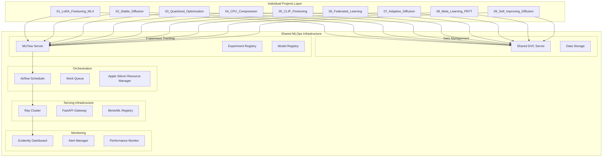

# Mlops-Integration Specification

**Created:** 2025-10-14
**Source:** docs/features/mlops-integration.md
**Original:** .kiro/specs/mlops-integration/
**Status:** Migrated from .kiro
**Implementation Status:** Planned
**Priority:** P1

---

## 1. Overview

### Purpose

# MLOps Integration Requirements Document

This feature integrates modern MLOps tools (DVC, MLFlow, Airflow, FastAPI/Ray/BentoML, and Evidently) into the EfficientAI-MLX-Toolkit as shared infrastructure components. The integration creates a centralized, production-ready MLOps platform that serves all individual projects in the toolkit while maintaining Apple Silicon optimization throughout. This shared approach ensures consistency, reduces resource overhead, and provides unified management across all 9 individual projects.

### Success Metrics

- Feature implementation complete
- All acceptance criteria met
- Tests passing with adequate coverage
- Performance targets achieved

### Target Users

- developer
- DevOps engineer
- performance engineer
- product manager
- researcher
- system administrator
- team lead

## 2. Functional Requirements

### FR-1: to version control my datasets and model artifacts so that I can reproduce experiments and collaborate effectively with my team

**User Story:** As an ML engineer, I want to version control my datasets and model artifacts so that I can reproduce experiments and collaborate effectively with my team.

**Requirements:**

- System SHALL automatically configure DVC for data versioning
- DVC SHALL track the data files and create version hashes
- System SHALL automatically version them with DVC

4. IF remote storage is configured THEN DVC SHALL sync data to cloud storage (S3, GCS, Azure)

- System SHALL update local files accordingly

### FR-2: to track and compare different training experiments so that I can identify the best performing models and optimization techniques

**User Story:** As a researcher, I want to track and compare different training experiments so that I can identify the best performing models and optimization techniques.

**Requirements:**

- MLFlow SHALL automatically log system information including Apple Silicon hardware details
- System SHALL log MLX-specific metrics (memory usage, MPS utilization, training speed)
- MLFlow SHALL display Apple Silicon performance comparisons alongside standard metrics

4. IF multiple optimization techniques are tested THEN the system SHALL track which techniques provide the best Apple Silicon performance

- MLFlow SHALL store model metadata including Apple Silicon compatibility information

### FR-3: to orchestrate complex ML workflows so that I can automate training

**User Story:** As a DevOps engineer, I want to orchestrate complex ML workflows so that I can automate training, evaluation, and deployment processes.

**Requirements:**

- Airflow SHALL support Apple Silicon-specific task scheduling
- System SHALL monitor thermal conditions and adjust scheduling accordingly
- Airflow SHALL coordinate multiple Apple Silicon nodes

4. IF a workflow fails THEN the system SHALL provide Apple Silicon-specific debugging information

- System SHALL trigger downstream tasks like model serving updates

### FR-4: to deploy trained models as scalable APIs so that applications can consume ML predictions in real-time

**User Story:** As a product manager, I want to deploy trained models as scalable APIs so that applications can consume ML predictions in real-time.

**Requirements:**

- System SHALL package it using BentoML with Apple Silicon optimizations
- FastAPI SHALL route them to MLX-optimized inference endpoints
- Ray SHALL scale serving instances while respecting Apple Silicon memory constraints

4. IF MPS acceleration is available THEN the serving system SHALL automatically utilize it for inference

- the serving system SHALL perform zero-downtime deployments

### FR-5: to monitor model performance and data drift so that I can maintain model quality in production

**User Story:** As an ML engineer, I want to monitor model performance and data drift so that I can maintain model quality in production.

**Requirements:**

- Evidently SHALL collect prediction data for drift analysis
- System SHALL alert stakeholders and suggest retraining
- the monitoring system SHALL identify potential causes

4. IF model accuracy drops below thresholds THEN the system SHALL trigger automated retraining workflows

- they SHALL include Apple Silicon-specific performance metrics

### FR-6: a centralized MLOps infrastructure that automatically serves all individual projects so that I can focus on model development without managing separate MLOps instances

**User Story:** As a developer, I want a centralized MLOps infrastructure that automatically serves all individual projects so that I can focus on model development without managing separate MLOps instances.

**Requirements:**

- all MLOps tools SHALL be configured once and serve all individual projects
- it SHALL automatically connect to the shared MLOps infrastructure
- UV SHALL manage all MLOps packages in the shared layer efficiently

4. IF individual projects have conflicting requirements THEN the shared infrastructure SHALL handle them gracefully

- all projects SHALL use the same centralized instances (MLFlow server, Airflow scheduler, etc.)

### FR-7: a unified MLOps dashboard that aggregates data from all toolkit projects so that I can manage the entire toolkit from a single interface

**User Story:** As a team lead, I want a unified MLOps dashboard that aggregates data from all toolkit projects so that I can manage the entire toolkit from a single interface.

**Requirements:**

- it SHALL display experiments from all 9 individual projects in organized workspaces
- models from all projects SHALL be accessible in a unified registry with project tags
- the dashboard SHALL show performance metrics across all deployed project models

4. IF projects use different model types THEN the shared infrastructure SHALL handle heterogeneous models appropriately

- they SHALL provide both project-specific and toolkit-wide analytics

### FR-8: the shared MLOps infrastructure to leverage Apple Silicon capabilities across all projects so that the entire toolkit runs efficiently

**User Story:** As a performance engineer, I want the shared MLOps infrastructure to leverage Apple Silicon capabilities across all projects so that the entire toolkit runs efficiently.

**Requirements:**

- it SHALL detect and utilize Apple Silicon hardware features for all connected projects
- the shared DVC system SHALL optimize for unified memory architecture
- the shared serving infrastructure SHALL prefer MLX over PyTorch when available

4. IF thermal throttling occurs THEN the shared Airflow scheduler SHALL adjust task scheduling across all projects

- the shared monitoring system SHALL track Apple Silicon-specific metrics for all projects

### FR-9: efficient resource sharing across all projects so that hardware utilization is optimized and costs are minimized

**User Story:** As a system administrator, I want efficient resource sharing across all projects so that hardware utilization is optimized and costs are minimized.

**Requirements:**

- the shared infrastructure SHALL manage Apple Silicon resources efficiently
- System SHALL implement fair scheduling and priority management
- the shared Ray cluster SHALL optimize memory usage across all project models

4. IF resource limits are reached THEN the system SHALL provide clear feedback and queuing mechanisms

## 3. Non-Functional Requirements

### 3.1 Performance

2. WHEN training progresses THEN the system SHALL log MLX-specific metrics (memory usage, MPS utilization, training speed)
3. WHEN comparing experiments THEN MLFlow SHALL display Apple Silicon performance comparisons alongside standard metrics
4. IF multiple optimization techniques are tested THEN the system SHALL track which techniques provide the best Apple Silicon performance
**User Story:** As an ML engineer, I want to monitor model performance and data drift so that I can maintain model quality in production.
3. WHEN Apple Silicon performance degrades THEN the monitoring system SHALL identify potential causes

### 3.2 Security & Privacy

### 3.3 Scalability & Reliability

**User Story:** As a product manager, I want to deploy trained models as scalable APIs so that applications can consume ML predictions in real-time.

## 4. Architecture & Design

# MLOps Integration Design Document

## Overview

This design outlines the integration of modern MLOps tools (DVC, MLFlow, Airflow, FastAPI/Ray/BentoML, and Evidently) as shared infrastructure components within the EfficientAI-MLX-Toolkit. The integration creates a centralized, production-ready MLOps platform that serves all 9 individual projects while leveraging Apple Silicon optimizations throughout.

The design follows a shared infrastructure approach where MLOps tools are deployed once and serve all individual projects, ensuring consistency, reducing resource overhead, and providing unified management. Each individual project connects to and utilizes the shared MLOps services while maintaining project-specific configurations and data isolation.

## Architecture

### High-Level Architecture

### Component Integration Flow

1. **Shared Data Pipeline**: Individual projects → Shared DVC → Centralized data storage → MLX processing
2. **Unified Experiment Tracking**: All projects → Shared MLFlow server → Centralized experiment registry
3. **Centralized Orchestration**: Shared Airflow → Multi-project workflows → Apple Silicon resource management
4. **Unified Serving**: All project models → Shared Ray cluster → Centralized API gateway → Load balancing
5. **Consolidated Monitoring**: All deployments → Shared Evidently → Unified dashboard → Cross-project alerts

### Shared Infrastructure Benefits

- **Resource Efficiency**: Single MLFlow server, Airflow instance, and Ray cluster serve all projects
- **Unified Management**: One dashboard to monitor all 9 projects
- **Consistent Configuration**: Standardized MLOps setup across all projects
- **Cross-Project Analytics**: Compare performance and experiments across different project types
- **Simplified Maintenance**: Update MLOps tools once for all projects

## Components and Interfaces

### Key Components

- Architecture details available in source feature document
- See: docs/features/mlops-integration.md for complete architecture specification

## 5. Acceptance Criteria

- 1. Set up shared MLOps infrastructure and project structure
- 2. Implement shared Apple Silicon hardware detection and optimization utilities
- 3. Implement shared DVC integration for centralized data versioning
- 4. Implement shared MLFlow experiment tracking infrastructure
- 5. Implement shared Airflow workflow orchestration infrastructure
- 6. Implement shared model serving infrastructure
- 7. Implement shared monitoring and alerting infrastructure
- 8. Create shared configuration and project management system
- 9. Create shared integration examples and documentation
- 10. Create comprehensive testing suite for shared infrastructure

### Definition of Done

- All functional requirements implemented
- Non-functional requirements validated
- Comprehensive test coverage
- Documentation complete
- Code review approved

## 6. Dependencies

### Technical Dependencies

- MLX framework (Apple Silicon optimization)
- PyTorch with MPS backend
- Python 3.11+
- uv package manager

### Component Dependencies

- shared-utilities (logging, config, benchmarking)
- efficientai-mlx-toolkit (CLI integration)

### External Integrations

- To be identified during implementation planning

---

## Traceability

- **Feature Request:** docs/features/mlops-integration.md
- **Original Spec:** .kiro/specs/mlops-integration/
- **Implementation Status:** Planned
- **Epic Ticket:** .sage/tickets/[COMPONENT]-001.md

## Notes

- Migrated from .kiro system on 2025-10-14
- Ready for /sage.plan (implementation planning)
- Source contains detailed design, interfaces, and task breakdown
