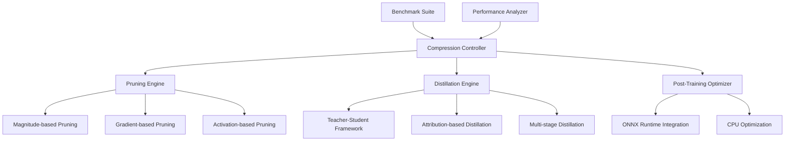

# Model-Compression-Pipeline Specification

**Created:** 2025-10-14
**Source:** docs/features/model-compression-pipeline.md
**Original:** .kiro/specs/model-compression-pipeline/
**Status:** Migrated from .kiro
**Implementation Status:** Implemented
**Priority:** P0

---

## 1. Overview

### Purpose

The CPU-Optimized Model Compression Pipeline is an intelligent system that specializes in CPU-efficient model optimization techniques. This project focuses on structured pruning, knowledge distillation, and architecture optimization specifically designed for CPU deployment, providing a competitive advantage in edge deployment scenarios where GPU resources are not available.

### Success Metrics

- Feature implementation complete
- All acceptance criteria met
- Tests passing with adequate coverage
- Performance targets achieved

### Target Users

- deployment engineer
- developer
- machine learning engineer
- performance engineer
- researcher

## 2. Functional Requirements

### FR-1: CPU-optimized model compression

**User Story:** As a deployment engineer, I want CPU-optimized model compression, so that I can deploy efficient models in edge environments without GPU dependencies.

**Requirements:**

- System SHALL specialize in CPU-efficient optimization techniques
- System SHALL use structured pruning for better CPU performance
- System SHALL focus on edge deployment scenarios
- System SHALL compare against GPU-optimized baselines

### FR-2: automated pruning strategies

**User Story:** As a researcher, I want automated pruning strategies, so that I can apply multiple pruning techniques and find the optimal compression approach.

**Requirements:**

- System SHALL combine magnitude, gradient, and activation-based pruning
- System SHALL automatically choose optimal pruning methods
- System SHALL use structured pruning to remove entire neurons or channels
- System SHALL validate model performance and accuracy retention

### FR-3: knowledge distillation capabilities

**User Story:** As a machine learning engineer, I want knowledge distillation capabilities, so that I can create smaller student models that retain the performance of larger teacher models.

**Requirements:**

- System SHALL support teacher-student architecture with 3B to 500M parameter reduction
- System SHALL use attribution-based distillation for efficient transfer
- System SHALL support multi-stage distillation through intermediate models
- System SHALL apply reverse KLD optimization

### FR-4: post-training optimization

**User Story:** As a developer, I want post-training optimization, so that I can apply compression techniques to already-trained models without retraining.

**Requirements:**

- System SHALL work with pre-trained models without requiring retraining
- System SHALL apply multiple post-training optimization methods
- System SHALL provide CPU-optimized inference deployment
- System SHALL benchmark inference speed and accuracy trade-offs

### FR-5: comprehensive benchmarking

**User Story:** As a performance engineer, I want comprehensive benchmarking, so that I can compare CPU-optimized models against GPU-optimized alternatives.

**Requirements:**

- System SHALL provide detailed CPU performance metrics
- System SHALL compare against GPU-optimized model baselines
- System SHALL simulate real-world edge deployment conditions
- System SHALL highlight CPU efficiency advantages and use cases

### FR-6: integrated experiment tracking for model compression

**User Story:** As a researcher, I want integrated experiment tracking for model compression, so that I can track compression experiments and compare optimization results across different techniques and architectures.

**Requirements:**

- System SHALL automatically log experiments to the shared MLFlow infrastructure
- System SHALL track compression parameters, accuracy retention, and performance improvements
- they SHALL be automatically registered in the shared model registry with compression metadata
- System SHALL provide cross-experiment comparison using shared analytics utilities

### FR-7: automated model management and edge deployment

**User Story:** As a deployment engineer, I want automated model management and edge deployment, so that I can efficiently deploy compressed models while maintaining quality monitoring.

**Requirements:**

- they SHALL be automatically tracked and versioned using the shared DVC system
- they SHALL be automatically deployed to the shared serving infrastructure with CPU optimization
- the shared monitoring system SHALL alert and suggest re-compression

## 3. Non-Functional Requirements

### 3.1 Performance

2. WHEN pruning is applied THEN the system SHALL use structured pruning for better CPU performance
4. WHEN pruning completes THEN the system SHALL validate model performance and accuracy retention
**User Story:** As a machine learning engineer, I want knowledge distillation capabilities, so that I can create smaller student models that retain the performance of larger teacher models.
4. WHEN performance is measured THEN the system SHALL benchmark inference speed and accuracy trade-offs
**User Story:** As a performance engineer, I want comprehensive benchmarking, so that I can compare CPU-optimized models against GPU-optimized alternatives.

### 3.2 Security & Privacy

### 3.3 Scalability & Reliability

The CPU-Optimized Model Compression Pipeline is an intelligent system that specializes in CPU-efficient model optimization techniques. This project focuses on structured pruning, knowledge distillation, and architecture optimization specifically designed for CPU deployment, providing a competitive advantage in edge deployment scenarios where GPU resources are not available.
**User Story:** As a deployment engineer, I want CPU-optimized model compression, so that I can deploy efficient models in edge environments without GPU dependencies.
3. WHEN optimization is performed THEN the system SHALL focus on edge deployment scenarios
**User Story:** As a machine learning engineer, I want knowledge distillation capabilities, so that I can create smaller student models that retain the performance of larger teacher models.
2. WHEN knowledge is transferred THEN the system SHALL use attribution-based distillation for efficient transfer

## 4. Architecture & Design

# Design Document

## Overview

The CPU-Optimized Model Compression Pipeline is designed as an intelligent system specializing in CPU-efficient model optimization techniques. The system focuses on structured pruning, knowledge distillation, and architecture optimization specifically for CPU deployment, providing competitive advantages in edge deployment scenarios where GPU resources are unavailable.

## Architecture

### High-Level Architecture



### Core Components

#### 1. Structured Pruning Engine

**Purpose**: Remove entire neurons or channels for better CPU performance

**Key Features**:

- Magnitude-based structured pruning
- Gradient-based importance scoring
- Activation-based pruning strategies
- CPU-optimized sparse operations

#### 2. Knowledge Distillation Framework

**Purpose**: Transfer knowledge from large teacher models to smaller student models

**Components**:

- Teacher-student architecture setup
- Attribution-based knowledge transfer
- Multi-stage progressive distillation
- Reverse KLD optimization for generative models

#### 3. Post-Training Optimization System

**Purpose**: Apply compression techniques to pre-trained models

**Features**:

- Model analysis and optimization recommendations
- ONNX Runtime integration for CPU deployment
- Performance benchmarking and validation
- Automated optimization pipeline

## Components and Interfaces

### Compression Controller Interface

```python
from pathlib import Path
from typing import Dict, List, Optional, Union, Any
from dataclasses import dataclass
import torch
import torch.nn as nn
from enum import Enum

class CompressionMethod(Enum):
    MAGNITUDE_PRUNING = "magnitude"
    GRADIENT_PRUNING = "gradient"
    ACTIVATION_PRUNING = "activation"
    KNOWLEDGE_DISTILLATION = "distillation"
    COMBINED = "combined"

@dataclass
class CompressionConfig:
    method: CompressionMethod
    target_sparsity: float = 0.5
    target_compression_ratio: float = 0.3
    preserve_accuracy_threshold: float = 0.95
    cpu_optimization: bool = True
    benchmark_baseline: bool = True

class ModelCompressionController:
    """Main controller for CPU-optimized model compression."""

    def __init__(self, config: CompressionConfig):
        self.config = config

### Key Components

- Architecture details available in source feature document
- See: docs/features/model-compression-pipeline.md for complete architecture specification

## 5. Acceptance Criteria

- 1. Set up CPU optimization environment and infrastructure
- 2. Implement structured pruning engine
- 3. Implement knowledge distillation framework
- 4. Implement post-training optimization system
- 5. Implement comprehensive benchmarking framework
- 6. Implement compression method comparison and selection
- 7. Implement model validation and quality assurance
- 8. Implement user interface and automation tools
- 9. Implement comprehensive testing and documentation

### Definition of Done

- All functional requirements implemented
- Non-functional requirements validated
- Comprehensive test coverage
- Documentation complete
- Code review approved

## 6. Dependencies

### Technical Dependencies

- MLX framework (Apple Silicon optimization)
- PyTorch with MPS backend
- Python 3.11+
- uv package manager

### Component Dependencies

- shared-utilities (logging, config, benchmarking)
- efficientai-mlx-toolkit (CLI integration)

### External Integrations

- To be identified during implementation planning

---

## Traceability

- **Feature Request:** docs/features/model-compression-pipeline.md
- **Original Spec:** .kiro/specs/model-compression-pipeline/
- **Implementation Status:** Implemented
- **Epic Ticket:** .sage/tickets/[COMPONENT]-001.md

## Notes

- Migrated from .kiro system on 2025-10-14
- Ready for /sage.plan (implementation planning)
- Source contains detailed design, interfaces, and task breakdown
