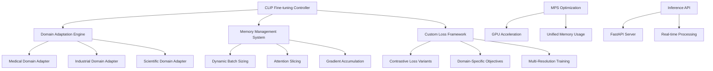

# Multimodal-Clip-Finetuning Specification

**Created:** 2025-10-14
**Source:** docs/features/multimodal-clip-finetuning.md
**Original:** .kiro/specs/multimodal-clip-finetuning/
**Status:** Migrated from .kiro
**Implementation Status:** Planned
**Priority:** P1

---

## 1. Overview

### Purpose

The Multi-Modal CLIP Fine-Tuning system focuses on fine-tuning CLIP models for domain-specific image-text understanding using PyTorch MPS backend for GPU acceleration. The system provides specialized training for various domains, memory-efficient training strategies, and real-time inference capabilities optimized for Apple Silicon.

### Success Metrics

- Feature implementation complete
- All acceptance criteria met
- Tests passing with adequate coverage
- Performance targets achieved

### Target Users

- computer vision engineer
- computer vision researcher
- deployment engineer
- developer
- machine learning engineer
- researcher

## 2. Functional Requirements

### FR-1: to fine-tune CLIP models for specific domains

**User Story:** As a computer vision researcher, I want to fine-tune CLIP models for specific domains, so that I can achieve better performance on specialized image-text tasks.

**Requirements:**

- System SHALL leverage PyTorch MPS backend for GPU acceleration
- System SHALL use attention slicing for memory efficiency
- System SHALL support domain-specific fine-tuning for medical, industrial, or scientific domains
- System SHALL automatically optimize for M1/M2 hardware capabilities

### FR-2: custom loss functions

**User Story:** As a machine learning engineer, I want custom loss functions, so that I can implement specialized contrastive learning objectives for my specific use case.

**Requirements:**

- System SHALL support specialized contrastive learning objectives
- System SHALL allow modification of similarity metrics and loss calculations
- System SHALL provide domain-specific loss function templates
- System SHALL automatically tune loss function parameters

### FR-3: efficient memory management

**User Story:** As a developer, I want efficient memory management, so that I can train larger models or use larger batch sizes within hardware constraints.

**Requirements:**

- System SHALL provide dynamic batch sizing based on available memory
- System SHALL support larger effective batch sizes through accumulation
- System SHALL use mixed precision training with automatic scaling
- System SHALL implement dynamic attention chunking

### FR-4: multi-resolution training

**User Story:** As a researcher, I want multi-resolution training, so that I can improve model robustness across different image sizes and resolutions.

**Requirements:**

- System SHALL support training on different image sizes progressively
- System SHALL automatically adjust model parameters for different input sizes
- System SHALL provide multi-scale training strategies
- System SHALL test model performance across multiple resolutions

### FR-5: real-time inference capabilities

**User Story:** As a deployment engineer, I want real-time inference capabilities, so that I can serve CLIP models efficiently in production environments.

**Requirements:**

- System SHALL provide FastAPI endpoints with MPS-optimized serving
- System SHALL optimize for real-time image-text similarity computation
- System SHALL support batch inference for multiple image-text pairs
- System SHALL provide performance metrics and health checks

### FR-6: integrated experiment tracking for CLIP fine-tuning

**User Story:** As a researcher, I want integrated experiment tracking for CLIP fine-tuning, so that I can track multi-modal experiments and compare domain adaptation results across different approaches.

**Requirements:**

- System SHALL automatically log experiments to the shared MLFlow infrastructure
- System SHALL track domain-specific parameters, contrastive loss metrics, and multi-modal performance
- they SHALL be automatically registered in the shared model registry with multi-modal metadata
- System SHALL provide cross-experiment comparison using shared analytics utilities

### FR-7: automated dataset management and model deployment

**User Story:** As a computer vision engineer, I want automated dataset management and model deployment, so that I can efficiently manage multi-modal datasets and deploy CLIP models while maintaining quality monitoring.

**Requirements:**

- they SHALL be automatically tracked and versioned using the shared DVC system
- they SHALL be automatically deployed to the shared serving infrastructure with MPS optimization
- the shared monitoring system SHALL alert and suggest domain re-adaptation

## 3. Non-Functional Requirements

### 3.1 Performance

**User Story:** As a computer vision researcher, I want to fine-tune CLIP models for specific domains, so that I can achieve better performance on specialized image-text tasks.
2. WHEN memory is managed THEN the system SHALL use attention slicing for memory efficiency
4. WHEN performance is optimized THEN the system SHALL automatically tune loss function parameters
4. WHEN evaluation is done THEN the system SHALL test model performance across multiple resolutions
4. WHEN monitoring is required THEN the system SHALL provide performance metrics and health checks

### 3.2 Security & Privacy

### 3.3 Scalability & Reliability

## 4. Architecture & Design

# Design Document

## Overview

The Multi-Modal CLIP Fine-Tuning system is designed to fine-tune CLIP models for domain-specific image-text understanding using PyTorch MPS backend for GPU acceleration. The system provides specialized training for various domains, memory-efficient training strategies, and real-time inference capabilities optimized for Apple Silicon.

## Architecture

### High-Level Architecture



### Core Components

#### 1. Domain-Specific Fine-tuning Engine

**Purpose**: Adapt CLIP models for specialized domains

**Supported Domains**:

- Medical imaging and clinical text
- Industrial inspection and technical documentation
- Scientific research and academic papers
- Custom domain adaptation framework

#### 2. Memory-Efficient Training System

**Purpose**: Optimize training for Apple Silicon memory constraints

**Features**:

- Dynamic batch sizing based on available memory
- Attention slicing for large sequence processing
- Gradient accumulation for effective large batch training
- Mixed precision training with automatic scaling

#### 3. Custom Contrastive Learning Framework

**Purpose**: Implement specialized loss functions for domain adaptation

**Components**:

- Modified contrastive loss for domain-specific similarity
- Hard negative mining for improved learning
- Multi-scale contrastive learning
- Temperature scaling optimization

## Components and Interfaces

### CLIP Fine-tuning Controller Interface

```python
from pathlib import Path
from typing import Dict, List, Optional, Union, Any, Tuple
from dataclasses import dataclass
import torch
import torch.nn as nn
from transformers import CLIPModel, CLIPProcessor
from PIL import Image

@dataclass
class CLIPFinetuningConfig:
    model_name: str = "openai/clip-vit-base-patch32"
    domain: str = "general"
    learning_rate: float = 5e-5
    batch_size: Optional[int] = None  # Auto-determined
    num_epochs: int = 10
    max_sequence_length: int = 77
    image_resolution: int = 224
    use_mps: bool = True
    mixed_precision: bool = True
    gradient_accumulation_steps: int = 1

class CLIPFinetuningController:
    """Main controller for CLIP domain-specific fine-tuning."""

### Key Components

- Architecture details available in source feature document
- See: docs/features/multimodal-clip-finetuning.md for complete architecture specification

## 5. Acceptance Criteria

- 1. Set up CLIP fine-tuning environment with MPS optimization
- 2. Implement MPS-optimized CLIP model loading and setup
- 3. Implement domain-specific fine-tuning framework
- 4. Implement custom contrastive learning framework
- 5. Implement memory management system
- 6. Implement multi-resolution training system
- 7. Implement real-time inference API system
- 8. Implement training monitoring and logging system
- 9. Implement domain-specific evaluation framework
- 10. Implement comprehensive testing and deployment

### Definition of Done

- All functional requirements implemented
- Non-functional requirements validated
- Comprehensive test coverage
- Documentation complete
- Code review approved

## 6. Dependencies

### Technical Dependencies

- MLX framework (Apple Silicon optimization)
- PyTorch with MPS backend
- Python 3.11+
- uv package manager

### Component Dependencies

- shared-utilities (logging, config, benchmarking)
- efficientai-mlx-toolkit (CLI integration)

### External Integrations

- To be identified during implementation planning

---

## Traceability

- **Feature Request:** docs/features/multimodal-clip-finetuning.md
- **Original Spec:** .kiro/specs/multimodal-clip-finetuning/
- **Implementation Status:** Planned
- **Epic Ticket:** .sage/tickets/[COMPONENT]-001.md

## Notes

- Migrated from .kiro system on 2025-10-14
- Ready for /sage.plan (implementation planning)
- Source contains detailed design, interfaces, and task breakdown
