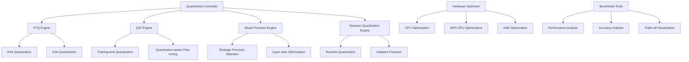

# Quantized-Model-Benchmarks Specification

**Created:** 2025-10-14
**Source:** docs/features/quantized-model-benchmarks.md
**Original:** .kiro/specs/quantized-model-benchmarks/
**Status:** Migrated from .kiro
**Implementation Status:** Future
**Priority:** P2

---

## 1. Overview

### Purpose

The Quantized Model Optimization Benchmarking Suite is a comprehensive system that applies different quantization techniques and benchmarks performance vs. accuracy trade-offs across various models. The system focuses on providing automated model selection, hardware-specific optimization, and comprehensive analysis of quantization techniques for Apple Silicon deployment.

### Success Metrics

- Feature implementation complete
- All acceptance criteria met
- Tests passing with adequate coverage
- Performance targets achieved

### Target Users

- deployment engineer
- developer
- hardware optimization specialist
- model optimization engineer
- researcher

## 2. Functional Requirements

### FR-1: to apply multiple quantization techniques

**User Story:** As a model optimization engineer, I want to apply multiple quantization techniques, so that I can find the optimal balance between model size, speed, and accuracy.

**Requirements:**

- System SHALL support post-training quantization (PTQ) with 8-bit and 4-bit integer quantization
- System SHALL provide quantization aware training (QAT) capabilities
- System SHALL support strategic 16-bit/8-bit combinations
- System SHALL provide dynamic quantization with runtime decisions

### FR-2: automated model selection

**User Story:** As a researcher, I want automated model selection, so that I can test quantization across different model architectures efficiently.

**Requirements:**

- System SHALL automatically test quantization across different model architectures
- System SHALL provide standardized benchmarking across model types
- System SHALL recommend optimal quantization techniques per architecture
- System SHALL provide architecture-specific optimization insights

### FR-3: hardware-specific optimization

**User Story:** As a hardware optimization specialist, I want hardware-specific optimization, so that I can maximize performance on Apple Silicon components.

**Requirements:**

- System SHALL optimize separately for CPU, MPS GPU, and ANE
- System SHALL benchmark each hardware component independently
- System SHALL automatically select optimal hardware targets
- System SHALL optimize for Apple Silicon's memory architecture

### FR-4: comprehensive trade-off analysis

**User Story:** As a deployment engineer, I want comprehensive trade-off analysis, so that I can make informed decisions about quantization for production deployment.

**Requirements:**

- System SHALL provide accuracy-speed trade-off analysis with comprehensive dashboards
- System SHALL measure inference speed, memory usage, and model accuracy
- System SHALL compare quantized vs. full-precision model performance
- System SHALL suggest optimal configurations for specific use cases

### FR-5: multi-format deployment

**User Story:** As a developer, I want multi-format deployment, so that I can export quantized models to different deployment targets.

**Requirements:**

- System SHALL support ONNX, Core ML, and TensorFlow Lite formats
- System SHALL optimize models for specific deployment environments
- System SHALL validate model accuracy across different formats
- System SHALL provide deployment templates for each target format

### FR-6: integrated experiment tracking for quantization

**User Story:** As a researcher, I want integrated experiment tracking for quantization, so that I can track quantization experiments and compare optimization results across different techniques and models.

**Requirements:**

- System SHALL automatically log experiments to the shared MLFlow infrastructure
- System SHALL track quantization parameters, accuracy metrics, and performance improvements
- they SHALL be automatically registered in the shared model registry with quantization metadata
- System SHALL provide cross-experiment comparison using shared analytics utilities

### FR-7: automated model management and deployment

**User Story:** As a deployment engineer, I want automated model management and deployment, so that I can efficiently deploy optimized models while maintaining quality monitoring.

**Requirements:**

- they SHALL be automatically tracked and versioned using the shared DVC system
- they SHALL be automatically deployed to the shared serving infrastructure
- the shared monitoring system SHALL alert and suggest re-optimization

## 3. Non-Functional Requirements

### 3.1 Performance

The Quantized Model Optimization Benchmarking Suite is a comprehensive system that applies different quantization techniques and benchmarks performance vs. accuracy trade-offs across various models. The system focuses on providing automated model selection, hardware-specific optimization, and comprehensive analysis of quantization techniques for Apple Silicon deployment.
**User Story:** As a model optimization engineer, I want to apply multiple quantization techniques, so that I can find the optimal balance between model size, speed, and accuracy.
**User Story:** As a hardware optimization specialist, I want hardware-specific optimization, so that I can maximize performance on Apple Silicon components.
2. WHEN performance is measured THEN the system SHALL benchmark each hardware component independently

1. WHEN analysis is performed THEN the system SHALL provide accuracy-speed trade-off analysis with comprehensive dashboards

### 3.2 Security & Privacy

### 3.3 Scalability & Reliability

## 4. Architecture & Design

# Design Document

## Overview

The Quantized Model Optimization Benchmarking Suite is designed as a comprehensive system for applying different quantization techniques and benchmarking performance vs. accuracy trade-offs across various models. The system provides automated model selection, hardware-specific optimization for Apple Silicon, and comprehensive analysis tools for quantization deployment decisions.

## Architecture

### High-Level Architecture



### Core Components

#### 1. Multi-Framework Quantization Engine

**Purpose**: Support multiple quantization frameworks and techniques

**Supported Frameworks**:

- Hugging Face BitsAndBytes for transformer quantization
- ONNX quantization for cross-platform deployment
- Core ML quantization for Apple Silicon optimization
- PyTorch native quantization

#### 2. Hardware-Specific Optimization System

**Purpose**: Optimize quantization for different Apple Silicon components

**Components**:

- CPU-specific quantization strategies
- MPS GPU optimization for mixed precision
- ANE (Apple Neural Engine) quantization
- Unified memory architecture optimization

#### 3. Automated Model Selection Framework

**Purpose**: Test quantization across different model architectures

**Features**:

- Architecture-specific quantization strategies
- Automated model downloading and preparation
- Cross-architecture performance comparison
- Quantization method recommendation system

## Components and Interfaces

### Quantization Controller Interface

```python
from pathlib import Path
from typing import Dict, List, Optional, Union, Any, Tuple
from dataclasses import dataclass
from enum import Enum
import torch
import torch.nn as nn

class QuantizationMethod(Enum):
    PTQ_8BIT = "ptq_8bit"
    PTQ_4BIT = "ptq_4bit"
    QAT = "qat"
    MIXED_PRECISION = "mixed_precision"
    DYNAMIC = "dynamic"

class HardwareTarget(Enum):
    CPU = "cpu"
    MPS_GPU = "mps"
    ANE = "ane"
    ALL = "all"

@dataclass

### Key Components

- Architecture details available in source feature document
- See: docs/features/quantized-model-benchmarks.md for complete architecture specification

## 5. Acceptance Criteria

- 1. Set up quantization benchmarking environment
- 2. Implement post-training quantization (PTQ) engine
- 3. Implement quantization-aware training (QAT) system
- 4. Implement mixed precision quantization
- 5. Implement dynamic quantization system
- 6. Implement hardware-specific optimization
- 7. Implement automated model selection and testing
- 8. Implement comprehensive benchmarking framework
- 9. Implement multi-format model export
- 10. Implement comprehensive testing and validation

### Definition of Done

- All functional requirements implemented
- Non-functional requirements validated
- Comprehensive test coverage
- Documentation complete
- Code review approved

## 6. Dependencies

### Technical Dependencies

- MLX framework (Apple Silicon optimization)
- PyTorch with MPS backend
- Python 3.11+
- uv package manager

### Component Dependencies

- shared-utilities (logging, config, benchmarking)
- efficientai-mlx-toolkit (CLI integration)

### External Integrations

- To be identified during implementation planning

---

## Traceability

- **Feature Request:** docs/features/quantized-model-benchmarks.md
- **Original Spec:** .kiro/specs/quantized-model-benchmarks/
- **Implementation Status:** Future
- **Epic Ticket:** .sage/tickets/[COMPONENT]-001.md

## Notes

- Migrated from .kiro system on 2025-10-14
- Ready for /sage.plan (implementation planning)
- Source contains detailed design, interfaces, and task breakdown
