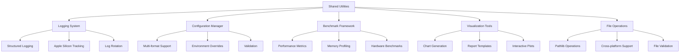

# Shared-Utilities Specification

**Created:** 2025-10-14
**Source:** docs/features/shared-utilities.md
**Original:** .kiro/specs/shared-utilities/
**Status:** Migrated from .kiro
**Implementation Status:** Implemented
**Priority:** P0

---

## 1. Overview

### Purpose

The Shared Utilities component provides common functionality across all projects in the EfficientAI-MLX-Toolkit. This includes centralized logging, configuration management, benchmarking frameworks, and visualization utilities. The shared utilities ensure consistency, reduce code duplication, and provide standardized interfaces for common operations across all individual projects.

### Success Metrics

- Feature implementation complete
- All acceptance criteria met
- Tests passing with adequate coverage
- Performance targets achieved

### Target Users

- configuration manager
- data analyst
- data scientist
- developer
- performance analyst
- project developer
- system integrator

## 2. Functional Requirements

### FR-1: centralized logging utilities

**User Story:** As a developer, I want centralized logging utilities, so that I can have consistent logging across all projects with pathlib-based file management.

**Requirements:**

- System SHALL use pathlib for all log file operations
- System SHALL provide structured logging for Apple Silicon optimization tracking
- System SHALL support configurable log levels across all projects
- System SHALL implement automatic log rotation using pathlib

### FR-2: unified configuration management

**User Story:** As a configuration manager, I want unified configuration management, so that I can handle settings consistently across all projects.

**Requirements:**

- System SHALL use pathlib for configuration file handling
- System SHALL support YAML, JSON, and TOML configuration formats
- System SHALL provide configuration validation and error handling
- System SHALL support environment-specific configuration overrides

### FR-3: standardized benchmarking

**User Story:** As a performance analyst, I want standardized benchmarking, so that I can compare performance across different projects and optimization techniques.

**Requirements:**

- System SHALL provide standardized benchmarking frameworks for all projects
- System SHALL measure performance, memory usage, and accuracy consistently
- System SHALL provide hardware-specific benchmarking capabilities
- System SHALL use pathlib for benchmark result storage and management

### FR-4: common visualization utilities

**User Story:** As a data scientist, I want common visualization utilities, so that I can create consistent charts and plots across all projects.

**Requirements:**

- System SHALL provide common plotting functions for benchmarking results
- System SHALL create standardized visualization templates
- System SHALL support exporting plots in multiple formats using pathlib
- System SHALL provide consistent styling across all project visualizations

### FR-5: pathlib-based file operations

**User Story:** As a system integrator, I want pathlib-based file operations, so that I can ensure consistent and cross-platform file handling across all projects.

**Requirements:**

- System SHALL use pathlib for all file and directory operations
- System SHALL provide path utilities for common file operations
- System SHALL ensure consistent behavior across operating systems
- System SHALL provide file existence and permission checking utilities

### FR-6: MLOps client utilities

**User Story:** As a project developer, I want MLOps client utilities, so that I can easily connect my individual project to the shared MLOps infrastructure.

**Requirements:**

- System SHALL provide client utilities for DVC, MLFlow, Airflow, and monitoring services
- System SHALL automatically configure MLOps connections with project-specific namespaces
- System SHALL provide simplified APIs that abstract shared infrastructure complexity
- System SHALL handle authentication, configuration, and error handling transparently

### FR-7: shared MLOps configuration management

**User Story:** As a configuration manager, I want shared MLOps configuration management, so that I can maintain consistent MLOps settings across all projects while allowing project-specific customizations.

**Requirements:**

- System SHALL provide centralized configuration with project-specific overrides
- System SHALL automatically inherit shared MLOps configurations
- System SHALL propagate updates to all connected projects
- System SHALL provide clear resolution mechanisms and validation

### FR-8: cross-project analytics utilities

**User Story:** As a data analyst, I want cross-project analytics utilities, so that I can compare performance and experiments across all toolkit projects.

**Requirements:**

- System SHALL provide utilities to aggregate data from all projects
- System SHALL enable cross-project benchmarking and visualization
- System SHALL create toolkit-wide analytics and insights

## 3. Non-Functional Requirements

### 3.1 Performance

**User Story:** As a performance analyst, I want standardized benchmarking, so that I can compare performance across different projects and optimization techniques.
2. WHEN metrics are collected THEN the system SHALL measure performance, memory usage, and accuracy consistently
**User Story:** As a data analyst, I want cross-project analytics utilities, so that I can compare performance and experiments across all toolkit projects.
2. WHEN comparing performance THEN the system SHALL enable cross-project benchmarking and visualization

### 3.2 Security & Privacy

### 3.3 Scalability & Reliability

## 4. Architecture & Design

# Design Document

## Overview

The Shared Utilities component provides common functionality across all projects in the EfficientAI-MLX-Toolkit. This includes centralized logging, configuration management, benchmarking frameworks, and visualization utilities. The shared utilities ensure consistency, reduce code duplication, and provide standardized interfaces for common operations across all individual projects.

## Architecture

### High-Level Architecture



## Components and Interfaces

### Logging Utilities Interface

```python
from pathlib import Path
from typing import Dict, Any, Optional
import logging
import json
from datetime import datetime

class StructuredLogger:
    """Centralized logging with Apple Silicon optimization tracking."""

    def __init__(self, name: str, log_dir: Path = Path("logs")):
        self.name = name
        self.log_dir = log_dir
        self.log_dir.mkdir(parents=True, exist_ok=True)
        self.logger = self._setup_logger()

    def _setup_logger(self) -> logging.Logger:
        """Setup structured logger with pathlib-based file handling."""
        logger = logging.getLogger(self.name)
        logger.setLevel(logging.INFO)

        # File handler with pathlib
        log_file = self.log_dir / f"{self.name}_{datetime.now().strftime('%Y%m%d')}.log"
        file_handler = logging.FileHandler(log_file)

        # Structured formatter
        formatter = StructuredFormatter()
        file_handler.setFormatter(formatter)

        logger.addHandler(file_handler)
        return logger

    def log_apple_silicon_optimization(
        self,
        operation: str,
        metrics: Dict[str, Any],
        level: str = "info"
    ):
        """Log Apple Silicon-specific optimization metrics."""
        structured_data = {
            "timestamp": datetime.now().isoformat(),
            "operation": operation,
            "apple_silicon_metrics": metrics,
            "hardware_type": self._detect_hardware_type()
        }

        getattr(self.logger, level)(json.dumps(structured_data))

    def _detect_hardware_type(self) -> str:
        """Detect Apple Silicon hardware type."""
        import platform
        if platform.machine() == "arm64" and platform.system() == "Darwin":
            return "apple_silicon"
        else:
            return "other"
```

### Key Components

- Architecture details available in source feature document
- See: docs/features/shared-utilities.md for complete architecture specification

## 5. Acceptance Criteria

- 1. Set up shared utilities infrastructure
- 2. Implement centralized logging system
- 3. Implement configuration management system
- 4. Implement standardized benchmarking framework
- 5. Implement visualization and reporting tools
- 6. Implement pathlib-based file operations
- 7. Implement utility integration and packaging
- 8. Implement comprehensive testing and documentation

### Definition of Done

- All functional requirements implemented
- Non-functional requirements validated
- Comprehensive test coverage
- Documentation complete
- Code review approved

## 6. Dependencies

### Technical Dependencies

- MLX framework (Apple Silicon optimization)
- PyTorch with MPS backend
- Python 3.11+
- uv package manager

### Component Dependencies

- shared-utilities (logging, config, benchmarking)
- efficientai-mlx-toolkit (CLI integration)

### External Integrations

- To be identified during implementation planning

---

## Traceability

- **Feature Request:** docs/features/shared-utilities.md
- **Original Spec:** .kiro/specs/shared-utilities/
- **Implementation Status:** Implemented
- **Epic Ticket:** .sage/tickets/[COMPONENT]-001.md

## Notes

- Migrated from .kiro system on 2025-10-14
- Ready for /sage.plan (implementation planning)
- Source contains detailed design, interfaces, and task breakdown
