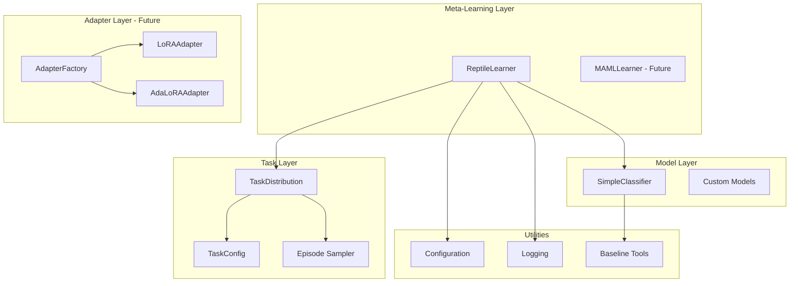

# Meta-Learning PEFT Architecture

**Version:** 0.1.0 (Research Phase)
**Status:** META-002 Active Development
**Last Updated:** 2025-10-21

---

## Table of Contents

1. [Overview](#overview)
2. [System Architecture](#system-architecture)
3. [Component Details](#component-details)
4. [Data Flow](#data-flow)
5. [Algorithm Design](#algorithm-design)
6. [MLX Integration](#mlx-integration)
7. [Design Decisions](#design-decisions)
8. [Future Architecture](#future-architecture)

---

## Overview

### Purpose

The Meta-Learning PEFT system is a research framework for rapid task adaptation using meta-learning algorithms combined with parameter-efficient fine-tuning methods. The architecture is designed for:

- **Modularity**: Independent components for meta-learning, task distribution, and PEFT
- **Extensibility**: Easy addition of new algorithms and task types
- **Performance**: Optimized for Apple Silicon using MLX framework
- **Research**: Clear separation of experimental and production code

### Design Principles

1. **Separation of Concerns**: Meta-learning, task management, and PEFT are independent
2. **Fail-Fast**: Explicit error handling with no silent failures
3. **Type Safety**: Full type annotations using modern Python (PEP 585)
4. **Minimal Dependencies**: Only essential libraries, no bloat
5. **Apple Silicon First**: MLX-native implementation, not PyTorch port

---

## System Architecture

### High-Level Architecture



### Module Structure

```
src/
├── meta_learning/          # Core meta-learning algorithms
│   ├── reptile.py          # Reptile implementation
│   ├── maml.py             # MAML (future)
│   └── models.py           # Neural network models
│
├── task_embedding/         # Task distribution and embeddings
│   └── task_distribution.py
│
├── adapter_generation/     # PEFT adapter creation (future)
│   ├── adapter_factory.py
│   └── peft_integration.py
│
├── utils/                  # Shared utilities
│   ├── config.py           # Configuration management
│   ├── logging.py          # Logging utilities
│   └── baseline.py         # Baseline evaluation
│
└── cli.py                  # Command-line interface
```

---

## Component Details

### Meta-Learning Layer

#### `ReptileLearner`

**Purpose**: Implements first-order meta-learning algorithm for fast task adaptation.

**Design:**
```python
class ReptileLearner:
    """
    Reptile meta-learning algorithm.

    Architecture:
        1. Clone model for each task
        2. Adapt clone with K gradient steps
        3. Update meta-parameters toward adapted parameters
        4. Repeat across task distribution
    """
    def __init__(self, model, inner_lr, outer_lr, num_inner_steps):
        self.model = model           # Meta-parameters
        self.inner_lr = inner_lr     # Task adaptation LR
        self.outer_lr = outer_lr     # Meta-learning LR
        self.num_inner_steps = num_inner_steps

    def meta_train_step(self, episodes, loss_fn):
        """
        Meta-training step:
        1. For each task in batch:
            a. Clone current parameters
            b. Adapt for K steps on support set
            c. Compute loss on query set
        2. Average adapted parameters
        3. Update meta-parameters
        """
```

**Key Design Choices:**
- **MLX-native**: Uses `mlx.nn.Module` and `mlx.core.array`
- **Stateless**: Each step is independent (no hidden state)
- **Memory efficient**: Only stores one copy of model
- **Gradient computation**: Uses MLX `value_and_grad()` for automatic differentiation

**Data Flow:**
```
Episodes → [Task 1, Task 2, ..., Task N]
           ↓
For each task:
    θ_clone ← clone(θ_meta)
    For k steps:
        θ_clone ← θ_clone - α∇L_support(θ_clone)
    L_query ← loss(θ_clone, query_set)
           ↓
θ_meta ← θ_meta + β * mean(θ_clone - θ_meta)
```

#### `SimpleClassifier`

**Purpose**: Feedforward neural network for classification tasks.

**Architecture:**
```
Input (input_dim)
    ↓
Linear(input_dim → hidden_dim)
    ↓
ReLU
    ↓
Linear(hidden_dim → hidden_dim)
    ↓
ReLU
    ↓
Linear(hidden_dim → num_classes)
    ↓
Output (logits)
```

**Design Rationale:**
- Simple enough for rapid experimentation
- Deep enough to demonstrate meta-learning benefits
- MLX-optimized operations (fused kernels)

---

### Task Distribution Layer

#### `TaskDistribution`

**Purpose**: Manages collection of tasks and episode sampling for meta-learning.

**Design:**
```python
class TaskDistribution:
    """
    Task distribution for meta-learning.

    Responsibilities:
        - Store task configurations
        - Sample episodes (support + query sets)
        - Extract task embeddings
        - Split train/validation tasks
    """
    def __init__(self, task_configs, seed):
        self.task_configs = task_configs
        self.rng = np.random.RandomState(seed)

    def sample_episode(self, task_id=None):
        """
        Sample K-shot episode:
        1. Select task (random or specific)
        2. Generate support set (K examples)
        3. Generate query set (evaluation)
        4. Return (config, support_x, support_y, query_x, query_y)
        """
```

**Task Configuration:**
```python
@dataclass
class TaskConfig:
    """
    Task specification.

    Fields:
        task_id: Unique identifier
        task_family: Category (linear_classification, etc.)
        num_classes: Number of classes
        input_dim: Feature dimension
        support_size: K-shot (examples for adaptation)
        query_size: Evaluation examples
        task_params: Custom parameters (rotation, etc.)
    """
```

**Episode Structure:**
```
Episode = {
    support_x: (K, input_dim),      # K examples for training
    support_y: (K,),                # Labels
    query_x: (Q, input_dim),        # Q examples for evaluation
    query_y: (Q,)                   # Labels
}
```

---

### Adapter Generation Layer (Future)

#### `AdapterFactory`

**Purpose**: Create PEFT adapters based on task characteristics.

**Design (Planned for META-004):**
```python
class AdapterFactory:
    """
    Factory pattern for PEFT adapters.

    Supported adapters:
        - LoRA: Low-rank decomposition
        - AdaLoRA: Adaptive rank allocation
        - Prefix Tuning: Learnable prefixes
        - Prompt Tuning: Soft prompts
    """
    @staticmethod
    def create_adapter(adapter_type, model, config):
        if adapter_type == "lora":
            return LoRAAdapter(model, **config)
        elif adapter_type == "adalora":
            return AdaLoRAAdapter(model, **config)
        # ...
```

#### `LoRAAdapter`

**Architecture:**
```
Original Weight: W ∈ ℝ^(d_out × d_in)
LoRA Update: ΔW = BA where:
    B ∈ ℝ^(d_out × r)
    A ∈ ℝ^(r × d_in)
    r << min(d_out, d_in)

Forward pass:
    y = Wx + (s/r) * BAx
    where s = scaling factor (alpha)
```

---

### Utilities Layer

#### `MetaLearningConfig`

**Purpose**: Centralized configuration management.

**Design:**
```python
@dataclass
class MetaLearningConfig:
    """
    Configuration dataclass.

    Benefits:
        - Type safety
        - Default values
        - Easy serialization (YAML ↔ Python)
        - Validation
    """
    algorithm: str = "reptile"
    meta_batch_size: int = 4
    num_meta_iterations: int = 1000
    inner_lr: float = 0.01
    outer_lr: float = 0.001
    num_inner_steps: int = 5

    @classmethod
    def from_yaml(cls, path):
        """Load from YAML with validation."""
```

#### `BaselineComparison`

**Purpose**: Compare meta-learning vs standard fine-tuning.

**Comparison Metrics:**
- **Few-shot accuracy**: Performance with limited examples
- **Adaptation speed**: Steps to reach target accuracy
- **Sample efficiency**: Examples needed for convergence
- **Transfer quality**: Generalization to new tasks

---

## Data Flow

### Meta-Training Pipeline

```
┌─────────────────────────────────────────────────────────────────┐
│ 1. INITIALIZATION                                               │
│    - Load config                                                │
│    - Create task distribution                                   │
│    - Initialize model and learner                               │
└─────────────────────────────────────────────────────────────────┘
                           ↓
┌─────────────────────────────────────────────────────────────────┐
│ 2. META-TRAINING LOOP                                           │
│    For iteration in range(num_meta_iterations):                 │
│        ┌───────────────────────────────────────────────────┐   │
│        │ a. Sample batch of tasks                          │   │
│        │    episodes = [sample_episode() for _ in batch]   │   │
│        └───────────────────────────────────────────────────┘   │
│                           ↓                                     │
│        ┌───────────────────────────────────────────────────┐   │
│        │ b. Meta-train step                                │   │
│        │    For each task:                                 │   │
│        │        - Clone parameters                         │   │
│        │        - Adapt on support set (K steps)           │   │
│        │        - Evaluate on query set                    │   │
│        │    Update meta-parameters                         │   │
│        └───────────────────────────────────────────────────┘   │
│                           ↓                                     │
│        ┌───────────────────────────────────────────────────┐   │
│        │ c. Logging and checkpointing                      │   │
│        │    if iteration % eval_interval == 0:             │   │
│        │        - Evaluate on validation tasks             │   │
│        │        - Log metrics                              │   │
│        │    if iteration % save_interval == 0:             │   │
│        │        - Save checkpoint                          │   │
│        └───────────────────────────────────────────────────┘   │
└─────────────────────────────────────────────────────────────────┘
                           ↓
┌─────────────────────────────────────────────────────────────────┐
│ 3. FINAL EVALUATION                                             │
│    - Load best checkpoint                                       │
│    - Evaluate on test tasks                                     │
│    - Compare with baseline                                      │
└─────────────────────────────────────────────────────────────────┘
```

### Task Adaptation Flow

```
New Task Arrives
      ↓
┌──────────────────────┐
│ Load Meta-Learned    │
│ Initialization θ_meta│
└──────────────────────┘
      ↓
┌──────────────────────┐
│ Sample K Examples    │
│ (support set)        │
└──────────────────────┘
      ↓
┌──────────────────────┐
│ Adapt for K Steps    │
│ θ_task ← θ_meta - α∇L│
└──────────────────────┘
      ↓
┌──────────────────────┐
│ Evaluate on Query    │
│ (test set)           │
└──────────────────────┘
```

---

## Algorithm Design

### Reptile Update Rule

**Mathematical Formulation:**

```
Input: Task distribution p(T), meta-learning rate β
Output: Meta-parameters θ

Initialize θ randomly

For iteration = 1 to N:
    Sample batch of tasks T_1, ..., T_B ~ p(T)

    For each task T_i:
        θ_i ← θ                           # Clone parameters
        For k = 1 to K:                   # Inner loop
            θ_i ← θ_i - α∇L_T_i(θ_i)      # SGD on support set

    θ ← θ + β * (1/B) Σ(θ_i - θ)         # Meta-update (outer loop)

Return θ
```

**Pseudocode:**

```python
def reptile_meta_train(model, task_dist, config):
    """Reptile meta-training algorithm."""
    theta = model.parameters()  # Meta-parameters

    for iteration in range(config.num_meta_iterations):
        # Sample batch of tasks
        episodes = [task_dist.sample_episode() for _ in range(config.meta_batch_size)]

        # Collect adapted parameters
        adapted_params = []
        for support_x, support_y, query_x, query_y in episodes:
            # Clone current parameters
            theta_clone = copy.deepcopy(theta)

            # Inner loop: adapt to task
            for step in range(config.num_inner_steps):
                loss = compute_loss(theta_clone, support_x, support_y)
                grad = compute_gradient(loss, theta_clone)
                theta_clone = theta_clone - config.inner_lr * grad

            adapted_params.append(theta_clone)

        # Outer loop: meta-update
        mean_adapted = mean(adapted_params)
        theta = theta + config.outer_lr * (mean_adapted - theta)

    return theta
```

### Loss Functions

**Cross-Entropy Loss:**

```python
def cross_entropy_loss(logits, targets):
    """
    Cross-entropy loss for classification.

    Formula:
        L = -Σ y_i * log(softmax(logits_i))

    MLX Implementation:
        Uses fused softmax + cross-entropy for efficiency
    """
    return mx.mean(nn.losses.cross_entropy(logits, targets))
```

**Accuracy Metric:**

```python
def accuracy(logits, targets):
    """
    Classification accuracy.

    Formula:
        acc = (1/N) Σ I[argmax(logits_i) == targets_i]
    """
    predictions = mx.argmax(logits, axis=-1)
    return mx.mean(predictions == targets)
```

---

## MLX Integration

### Why MLX?

1. **Apple Silicon Optimization**: Native Metal acceleration
2. **Unified Memory**: CPU/GPU share memory (no transfers)
3. **Lazy Evaluation**: Efficient computation graphs
4. **NumPy-like API**: Familiar interface
5. **Automatic Differentiation**: Built-in `value_and_grad()`

### MLX Design Patterns

#### Pattern 1: Module Definition

```python
import mlx.nn as nn

class SimpleClassifier(nn.Module):
    def __init__(self, input_dim, hidden_dim, num_classes):
        super().__init__()
        self.layers = [
            nn.Linear(input_dim, hidden_dim),
            nn.Linear(hidden_dim, hidden_dim),
            nn.Linear(hidden_dim, num_classes)
        ]

    def __call__(self, x):
        for i, layer in enumerate(self.layers):
            x = layer(x)
            if i < len(self.layers) - 1:  # No activation on final layer
                x = nn.relu(x)
        return x
```

#### Pattern 2: Gradient Computation

```python
import mlx.core as mx
from mlx.utils import tree_map

def compute_loss_and_grad(model, x, y):
    """Compute loss and gradients using MLX."""

    def loss_fn(params):
        # Set model parameters
        model.update(params)
        # Forward pass
        logits = model(x)
        # Compute loss
        return cross_entropy_loss(logits, y)

    # Compute value and gradient
    loss, grad = mx.value_and_grad(loss_fn)(model.parameters())

    return loss, grad
```

#### Pattern 3: Parameter Updates

```python
def sgd_update(params, grads, lr):
    """SGD update using MLX tree operations."""
    return tree_map(lambda p, g: p - lr * g, params, grads)
```

### MLX vs PyTorch Comparison

| Feature | MLX | PyTorch |
|---------|-----|---------|
| **Backend** | Metal (Apple Silicon) | CUDA/MPS |
| **Memory** | Unified (CPU/GPU shared) | Separate (requires transfers) |
| **API Style** | NumPy-like | NumPy-like + custom |
| **Lazy Eval** | Yes (default) | No (eager) |
| **Grad Mode** | Functional (`value_and_grad`) | Object-oriented (`.backward()`) |
| **Performance** | Excellent on Apple Silicon | Good on NVIDIA GPUs |

---

## Design Decisions

### 1. First-Order Meta-Learning (Reptile)

**Decision**: Implement Reptile before MAML.

**Rationale**:
- Simpler algorithm (no second-order derivatives)
- Lower memory requirements
- Comparable performance to MAML on many tasks
- Faster iteration during research phase

**Trade-offs**:
- Slightly slower convergence than MAML
- May require more meta-iterations

### 2. MLX-Native Implementation

**Decision**: Use MLX directly, not PyTorch wrapper.

**Rationale**:
- Better performance on Apple Silicon
- Smaller memory footprint
- Idiomatic MLX code (not PyTorch port)
- Future-proof for MLX ecosystem

**Trade-offs**:
- Limited to Apple Silicon hardware
- Smaller community than PyTorch
- Fewer pre-built components

### 3. Dataclass Configuration

**Decision**: Use `@dataclass` for configuration, not dictionaries.

**Rationale**:
- Type safety at runtime
- IDE autocomplete support
- Easy validation
- Clear structure

**Trade-offs**:
- More verbose than dictionaries
- Requires Python 3.7+

### 4. Fail-Fast Error Handling

**Decision**: Raise exceptions immediately, no silent failures.

**Rationale**:
- Easier debugging during research
- Prevents cascading errors
- Explicit error messages
- Follows "no bullshit code" principle

**Trade-offs**:
- Less forgiving for user errors
- Requires proper exception handling in production

### 5. Modular Task Distribution

**Decision**: Separate task generation from meta-learning logic.

**Rationale**:
- Easy to add new task types
- Reusable across algorithms (Reptile, MAML)
- Testable in isolation
- Clear responsibility separation

**Trade-offs**:
- More classes/files
- Indirection for simple cases

---

## Future Architecture

### META-003: Full Meta-Learning Framework

**Additions:**
```
src/meta_learning/
├── reptile.py           # (existing)
├── maml.py              # Second-order meta-learning
├── meta_sgd.py          # Learnable learning rates
└── task_embeddings.py   # Neural task embeddings
```

**Changes:**
- Add `MAMLLearner` with second-order gradient support
- Implement learned task embedding network
- Task similarity metrics for transfer learning

### META-004: PEFT Integration

**Additions:**
```
src/adapter_generation/
├── adapter_factory.py   # (existing, expanded)
├── lora_adapter.py      # LoRA implementation
├── adalora_adapter.py   # Adaptive LoRA
├── prefix_tuning.py     # Prefix tuning
└── prompt_tuning.py     # Soft prompts
```

**Changes:**
- Integrate PEFT adapters with meta-learning
- Hyperparameter optimization for adapters
- Adapter architecture search

### META-005: Production Pipeline

**Additions:**
```
src/
├── serving/
│   ├── inference.py     # Batch inference
│   └── api.py           # REST API
├── mlops/
│   ├── tracking.py      # Experiment tracking
│   └── deployment.py    # Model deployment
└── monitoring/
    └── metrics.py       # Performance monitoring
```

**Changes:**
- MLOps integration (MLflow, DVC)
- Model serving infrastructure
- Production monitoring

---

## Performance Considerations

### Memory Optimization

**Current:**
- Single model copy in memory
- Parameter cloning only during adaptation
- Gradient computation uses functional API (no retain_graph)

**Future:**
- Gradient checkpointing for large models
- Mixed precision training (float16/bfloat16)
- Batch parallelization across tasks

### Compute Optimization

**MLX Optimizations:**
- Fused kernels for common operations
- Lazy evaluation for graph optimization
- Metal Performance Shaders acceleration

**Algorithm Optimizations:**
- Early stopping on support set convergence
- Adaptive inner learning rates
- Task batching for parallel execution

---

## Testing Architecture

### Test Structure

```
tests/
├── test_task_distribution.py    # Task generation and sampling
├── test_reptile.py               # Meta-learning algorithm
├── test_baseline.py              # Baseline comparison
├── test_integration.py           # End-to-end workflows
└── test_peft_integration.py      # Adapter creation (future)
```

### Test Strategy

1. **Unit Tests**: Individual functions and classes
2. **Integration Tests**: Full meta-training loop
3. **Regression Tests**: Performance benchmarks
4. **Property Tests**: Invariants (e.g., meta-parameters improve over time)

---

## Appendix

### Terminology

- **Meta-Learning**: Learning to learn from task distribution
- **Inner Loop**: Task-specific adaptation (K gradient steps)
- **Outer Loop**: Meta-parameter update
- **Episode**: Single task instance (support + query sets)
- **K-Shot**: Number of support examples
- **Task Distribution**: Collection of related tasks

### References

**Algorithms:**
1. Finn et al. (2017) - MAML
2. Nichol et al. (2018) - Reptile

**PEFT Methods:**
3. Hu et al. (2021) - LoRA
4. Zhang et al. (2023) - AdaLoRA

**Implementation:**
5. MLX Documentation - https://ml-explore.github.io/mlx/
6. Apple MLX Examples - https://github.com/ml-explore/mlx-examples

---

**End of Architecture Documentation**
